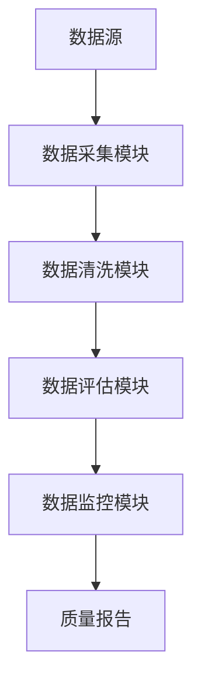

                 


# AI Agent在企业数据质量管理与治理中的应用

> 关键词：AI Agent，数据质量管理，数据治理，智能化，企业数据管理，机器学习

> 摘要：本文深入探讨AI Agent在企业数据质量管理与治理中的应用，从背景介绍到项目实战，系统地分析了AI Agent在数据治理中的核心原理、算法实现、系统架构及实际案例，为企业数据质量管理的智能化转型提供了理论支持和实践指导。

---

# 第一部分: AI Agent与企业数据质量管理概述

## 第1章: AI Agent与数据质量管理的背景与概念

### 1.1 数据质量管理的背景与挑战

#### 1.1.1 数据质量管理的定义与重要性
数据质量管理（Data Quality Management，DQM）是指通过一系列方法和技术，确保企业数据的准确性、完整性、一致性、及时性和合规性。随着企业数字化转型的推进，数据成为核心资产，数据质量问题直接影响企业决策和业务价值。

#### 1.1.2 企业数据质量管理的核心问题
企业在数据质量管理中面临的主要问题包括：
1. 数据孤岛：不同系统中的数据格式和标准不统一。
2. 数据冗余：重复数据导致存储浪费和数据不一致。
3. 数据不完整：部分数据缺失或未记录。
4. 数据污染：错误或不准确的数据影响决策。
5. 数据安全：数据泄露或被篡改的风险。

#### 1.1.3 数据质量管理的边界与外延
数据质量管理不仅关注数据本身，还涉及数据的采集、存储、处理和应用的全过程。其外延包括数据治理、数据清洗、数据集成和数据安全等领域。

### 1.2 AI Agent的基本概念与特点

#### 1.2.1 AI Agent的定义与分类
AI Agent（人工智能代理）是指能够感知环境、自主决策并执行任务的智能体。AI Agent可以分为以下几类：
1. **反应式Agent**：基于当前感知做出反应。
2. **认知式Agent**：具备推理和规划能力。
3. **协作式Agent**：能够与其他Agent或人类协作完成任务。

#### 1.2.2 AI Agent的核心属性与特征
- **自主性**：能够独立决策和执行任务。
- **反应性**：能够实时感知环境并做出反应。
- **学习能力**：通过经验或数据不断优化自身行为。
- **协作能力**：能够与其他Agent或系统协同工作。

#### 1.2.3 AI Agent与传统数据治理工具的区别
传统数据治理工具通常基于规则和脚本，而AI Agent具备以下优势：
- 自主学习和优化能力。
- 实时感知和响应。
- 多任务处理能力。

### 1.3 AI Agent在数据质量管理中的应用前景

#### 1.3.1 数据质量管理的智能化需求
随着企业数据量的爆炸式增长，传统的人工数据治理方式效率低下，智能化需求日益迫切。

#### 1.3.2 AI Agent在数据治理中的潜在价值
- 提高数据治理效率。
- 实现数据的自动化清洗和修复。
- 降低数据治理成本。

#### 1.3.3 企业采用AI Agent的挑战与机遇
- **挑战**：技术复杂性、数据隐私和安全问题。
- **机遇**：提高数据治理能力，增强企业竞争力。

---

## 第2章: 数据质量管理的核心概念与框架

### 2.1 数据质量管理的理论框架

#### 2.1.1 数据质量的维度模型
数据质量可以从多个维度进行评估，包括：
1. **准确性**：数据是否真实反映现实情况。
2. **完整性**：数据是否完整无缺。
3. **一致性**：数据是否符合统一标准。
4. **及时性**：数据是否及时更新。
5. **可追溯性**：数据来源是否可追溯。

#### 2.1.2 数据质量治理体系
数据质量治理体系包括数据标准、数据生命周期管理和数据监控等方面。

#### 2.1.3 数据质量管理的实现步骤
1. **数据需求分析**：明确数据需求和目标。
2. **数据清洗**：去除无效或错误数据。
3. **数据整合**：统一不同数据源的数据。
4. **数据监控**：实时监控数据质量。
5. **数据优化**：持续改进数据质量。

---

## 第3章: AI Agent在数据治理中的核心原理

### 3.1 AI Agent的感知与决策机制

#### 3.1.1 数据感知
AI Agent通过数据采集模块感知企业数据的状态，包括数据的准确性、完整性等。

#### 3.1.2 数据分析
AI Agent利用机器学习算法对数据进行分析，识别数据中的异常和问题。

#### 3.1.3 决策制定
基于分析结果，AI Agent制定数据治理策略，例如数据清洗、数据修复等。

### 3.2 数据质量管理的智能化流程

#### 3.2.1 数据采集
通过API或数据抽取工具采集企业数据。

#### 3.2.2 数据分析
使用自然语言处理（NLP）和机器学习算法分析数据质量。

#### 3.2.3 数据清洗
根据分析结果自动清洗数据，修复错误或缺失数据。

#### 3.2.4 数据监控
实时监控数据质量，发现异常及时告警。

---

## 第4章: AI Agent的数据治理算法实现

### 4.1 数据清洗算法

#### 4.1.1 算法原理
数据清洗算法通过识别和修复数据中的异常值、重复值和缺失值，确保数据的准确性。

#### 4.1.2 算法实现
以下是数据清洗算法的Python代码示例：

```python
import pandas as pd

# 读取数据
data = pd.read_csv('data.csv')

# 处理缺失值
data.dropna(inplace=True)

# 删除重复数据
data.drop_duplicates(inplace=True)

# 修复异常值
for col in data.columns:
    # 使用中位数修复异常值
    median = data[col].median()
    data[col] = data[col].replace(outliers, median)
```

### 4.2 数据质量评估模型

#### 4.2.1 模型原理
数据质量评估模型通过多维度评估数据质量，输出数据质量报告。

#### 4.2.2 模型实现
以下是数据质量评估模型的Python代码示例：

```python
import pandas as pd
from sklearn.metrics import accuracy_score

# 读取数据
data = pd.read_csv('data.csv')

# 数据预处理
data = preprocess_data(data)

# 评估数据质量
def assess_data_quality(data):
    accuracy = accuracy_score(data['label'], data['predicted_label'])
    return {'accuracy': accuracy}

# 输出质量报告
quality_report = assess_data_quality(data)
print(quality_report)
```

---

## 第5章: 系统架构与实现

### 5.1 系统架构设计

#### 5.1.1 系统功能模块
- 数据采集模块
- 数据清洗模块
- 数据评估模块
- 数据监控模块

#### 5.1.2 系统架构图


### 5.2 接口设计

#### 5.2.1 数据采集接口
- 输入：API请求
- 输出：数据采集结果

#### 5.2.2 数据清洗接口
- 输入：待清洗数据
- 输出：清洗后的数据

---

## 第6章: 项目实战

### 6.1 项目背景与目标

#### 6.1.1 项目背景
某企业希望利用AI Agent技术提升其数据质量管理能力。

#### 6.1.2 项目目标
实现数据的自动清洗、评估和监控。

### 6.2 核心代码实现

#### 6.2.1 数据清洗代码
```python
import pandas as pd

def clean_data(data):
    # 处理缺失值
    data = data.dropna()
    # 删除重复数据
    data = data.drop_duplicates()
    # 修复异常值
    for col in data.columns:
        median = data[col].median()
        data[col] = data[col].replace(outliers, median)
    return data

# 调用数据清洗函数
data_cleaned = clean_data(data)
```

#### 6.2.2 数据评估代码
```python
import pandas as pd
from sklearn.metrics import accuracy_score

def assess_data_quality(data):
    # 数据预处理
    data = preprocess_data(data)
    # 评估准确性
    accuracy = accuracy_score(data['label'], data['predicted_label'])
    return accuracy

# 调用数据评估函数
quality = assess_data_quality(data_cleaned)
print(f"数据质量评估结果：{quality}")
```

### 6.3 项目总结与优化

#### 6.3.1 项目总结
通过AI Agent技术，企业实现了数据质量管理的自动化和智能化，显著提高了数据治理效率。

#### 6.3.2 项目优化
- 增强异常检测算法的准确性。
- 提高系统架构的可扩展性。

---

## 第7章: 总结与展望

### 7.1 全文总结

#### 7.1.1 AI Agent在数据治理中的优势
- 自主学习和优化能力。
- 实时感知和响应。
- 多任务处理能力。

#### 7.1.2 数据质量管理的未来发展方向
- 与区块链技术结合，提升数据安全性。
- 结合边缘计算，实现分布式数据治理。

### 7.2 展望

#### 7.2.1 技术融合
AI Agent与大数据、区块链等技术的深度融合将推动数据治理的进一步发展。

#### 7.2.2 应用场景拓展
AI Agent在数据治理中的应用将扩展到更多领域，如金融、医疗和制造。

---

作者：AI天才研究院/AI Genius Institute & 禅与计算机程序设计艺术 /Zen And The Art of Computer Programming

