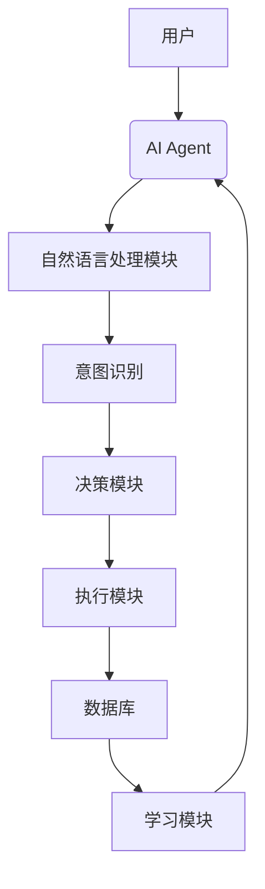

                 


# AI Agent在企业文化建设与内部沟通中的创新应用

## 关键词：AI Agent，企业文化，内部沟通，自然语言处理，机器学习

## 摘要：  
随着人工智能技术的快速发展，AI Agent（智能代理）逐渐成为企业数字化转型中的重要工具。本文将探讨AI Agent在企业文化建设与内部沟通中的创新应用，分析其核心概念、算法原理、系统架构以及实际案例，为企业管理者和技术人员提供理论与实践相结合的深度解析。

---

## 第1章：AI Agent 的背景与概念

### 1.1 AI Agent 的基本概念  
AI Agent是一种能够感知环境并采取行动以实现特定目标的智能系统。它通过自然语言处理（NLP）、机器学习和强化学习等技术，能够与用户进行交互，并根据上下文提供个性化的服务。  

#### 1.1.1 AI Agent 的核心特点  
- **自主性**：能够在没有人工干预的情况下独立运行。  
- **反应性**：能够实时感知环境并做出反应。  
- **目标导向**：以实现特定目标为导向进行决策和行动。  
- **学习能力**：通过机器学习不断优化自身的行为模式。  

#### 1.1.2 AI Agent 的分类  
AI Agent可以根据功能和应用场景分为以下几类：  
1. **基于规则的AI Agent**：通过预定义的规则进行决策和行动。  
2. **基于机器学习的AI Agent**：通过训练数据学习模式并进行决策。  
3. **混合型AI Agent**：结合规则和机器学习的混合型代理。  

### 1.2 企业文化建设的背景  
企业文化是企业成功的核心要素之一，它包括企业价值观、企业精神、企业行为规范等。然而，传统的企业文化建设面临以下挑战：  
- **信息传递不畅**：企业文化难以快速传播到每个员工。  
- **员工参与度低**：员工缺乏对企业文化的认同感和参与感。  
- **个性化需求难以满足**：员工对企业文化的理解和需求存在差异。  

### 1.3 AI Agent 在内部沟通中的应用价值  
AI Agent可以通过自然语言处理和机器学习技术，帮助企业实现内部沟通的智能化和个性化。其具体价值包括：  
1. **提高沟通效率**：通过自动化处理内部信息，减少人工干预。  
2. **增强员工参与感**：通过个性化的沟通方式，提升员工对企业文化的认同感。  
3. **优化企业文化传播**：通过智能代理实时传播企业文化，确保信息的准确性和一致性。  

---

## 第2章：AI Agent 的核心概念与原理  

### 2.1 AI Agent 的核心概念  
AI Agent的核心在于其感知和行动能力。它通过感知环境信息，结合自身的目标和策略，采取相应的行动以实现最优结果。  

#### 2.1.1 AI Agent 的技术架构  
AI Agent的技术架构可以分为以下模块：  
1. **感知模块**：通过传感器或API获取环境信息。  
2. **决策模块**：基于感知信息和目标，制定行动策略。  
3. **执行模块**：根据决策结果执行具体行动。  
4. **学习模块**：通过机器学习优化决策模型。  

#### 2.1.2 AI Agent 的工作流程  
1. **感知环境**：AI Agent通过NLP技术理解用户需求或环境信息。  
2. **制定策略**：基于目标和感知信息，AI Agent生成行动策略。  
3. **执行行动**：AI Agent根据策略采取具体行动。  
4. **反馈优化**：通过用户反馈不断优化决策模型。  

### 2.2 AI Agent 的算法原理  
AI Agent的核心算法包括自然语言处理和机器学习算法。  

#### 2.2.1 自然语言处理（NLP）  
NLP技术是AI Agent理解人类语言的关键。通过分词、句法分析和语义理解等步骤，AI Agent能够准确理解用户的意图。  

#### 2.2.2 机器学习与深度学习  
机器学习算法（如支持向量机、随机森林）和深度学习算法（如神经网络、LSTM）是AI Agent优化决策的重要工具。通过训练数据，AI Agent能够不断改进其决策能力。  

#### 2.2.3 强化学习  
强化学习是一种通过试错机制优化决策的算法。AI Agent通过与环境的交互，不断优化其行动策略，以实现目标的最大化。  

---

## 第3章：AI Agent 在企业文化建设中的应用  

### 3.1 企业文化建设的场景分析  
企业文化建设的核心目标是塑造企业的共同价值观和行为规范。AI Agent可以通过以下方式实现这一目标：  

#### 3.1.1 企业文化传播  
AI Agent可以通过内部聊天机器人实时传播企业文化，确保信息的准确性和一致性。  

#### 3.1.2 员工价值观塑造  
通过个性化的引导和反馈，AI Agent能够帮助员工更好地理解和认同企业价值观。  

#### 3.1.3 企业文化评估与优化  
AI Agent可以通过收集员工反馈和数据分析，帮助企业管理者评估企业文化的效果，并提出优化建议。  

### 3.2 AI Agent 在企业文化建设中的具体应用  
1. **企业文化传播工具**：AI Agent可以作为企业文化传播的媒介，通过内部聊天机器人向员工传递企业文化和价值观。  
2. **员工价值观引导者**：AI Agent可以通过个性化的对话，帮助员工理解企业价值观，并引导其行为。  
3. **企业文化评估与优化工具**：AI Agent可以通过数据分析和员工反馈，帮助企业管理者评估企业文化的效果，并提出优化建议。  

---

## 第4章：AI Agent 在内部沟通中的创新应用  

### 4.1 内部沟通的痛点与挑战  
内部沟通是企业运营的重要环节，但传统内部沟通方式存在以下痛点：  
- **信息孤岛**：部门间信息不共享，导致沟通不畅。  
- **效率低下**：信息传递过程繁琐，耗时耗力。  
- **个性化需求难以满足**：员工对信息的需求存在差异，传统沟通方式难以满足个性化需求。  

### 4.2 AI Agent 在内部沟通中的创新应用  
1. **智能信息分发**：AI Agent可以根据员工的需求和角色，智能分发相关信息，提高沟通效率。  
2. **个性化沟通体验**：AI Agent可以根据员工的偏好，提供个性化的沟通方式，增强员工的参与感和满意度。  
3. **实时反馈与优化**：AI Agent可以通过实时反馈优化沟通策略，确保信息的准确性和有效性。  

---

## 第5章：AI Agent 的系统架构与实现  

### 5.1 系统架构设计  
AI Agent的系统架构可以分为以下几个模块：  
1. **感知模块**：通过NLP技术感知用户的意图和需求。  
2. **决策模块**：基于感知信息和目标，制定行动策略。  
3. **执行模块**：根据决策结果执行具体行动。  
4. **学习模块**：通过机器学习优化决策模型。  

#### 5.1.1 系统功能设计  
- **用户交互界面**：提供自然语言交互界面，方便用户与AI Agent进行沟通。  
- **数据存储与管理**：存储用户信息、沟通记录和企业文化相关内容。  
- **算法实现**：实现NLP、机器学习和强化学习算法，支持AI Agent的决策和优化。  

#### 5.1.2 系统架构图  


---

## 第6章：AI Agent 的项目实战  

### 6.1 项目背景与目标  
本项目旨在开发一个基于AI Agent的企业文化传播与内部沟通系统，帮助企业实现高效、个性化的内部沟通。  

#### 6.1.1 环境安装  
- **开发工具**：Python、Jupyter Notebook、TensorFlow、Keras  
- **依赖库安装**：`pip install numpy pandas scikit-learn transformers`  

#### 6.1.2 核心代码实现  
```python
import numpy as np
from sklearn.feature_extraction.text import TfidfVectorizer
from sklearn.naive_bayes import MultinomialNB
from transformers import pipeline

# 初始化NLP模型
nlp = pipeline("text-classification", model="snunlp/korean-ai")
vectorizer = TfidfVectorizer()

# 训练分类模型
model = MultinomialNB()
model.fit(vectorizer.fit_transform(X_train), y_train)
```

#### 6.1.3 项目小结  
通过本项目，我们可以看到AI Agent在企业文化建设与内部沟通中的巨大潜力。通过自然语言处理和机器学习技术，AI Agent能够实现高效、个性化的内部沟通，帮助企业塑造积极向上的企业文化。

---

## 第7章：AI Agent 的最佳实践与未来展望  

### 7.1 最佳实践  
1. **数据隐私保护**：在实际应用中，需注意员工数据的隐私保护。  
2. **模型优化**：通过不断优化算法和模型，提高AI Agent的决策能力。  
3. **用户反馈机制**：建立有效的用户反馈机制，及时发现和解决问题。  

#### 7.1.1 小结  
AI Agent作为人工智能技术的重要应用之一，正在改变企业内部沟通的方式。通过智能化、个性化的沟通方式，AI Agent能够帮助企业实现高效的企业文化建设，提升员工的参与感和满意度。  

#### 7.1.2 未来展望  
随着人工智能技术的不断发展，AI Agent在企业文化建设与内部沟通中的应用将更加广泛和深入。未来，AI Agent将更加智能化和个性化，为企业提供更高效的内部沟通解决方案。

---

## 作者：AI天才研究院/AI Genius Institute & 禅与计算机程序设计艺术/Zen And The Art of Computer Programming

