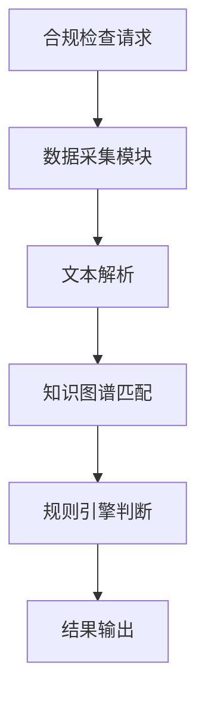
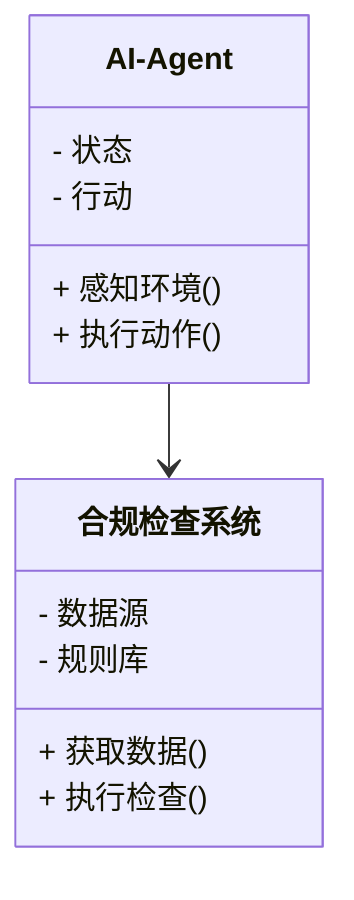
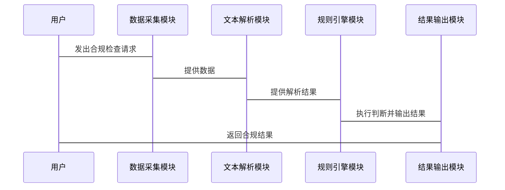
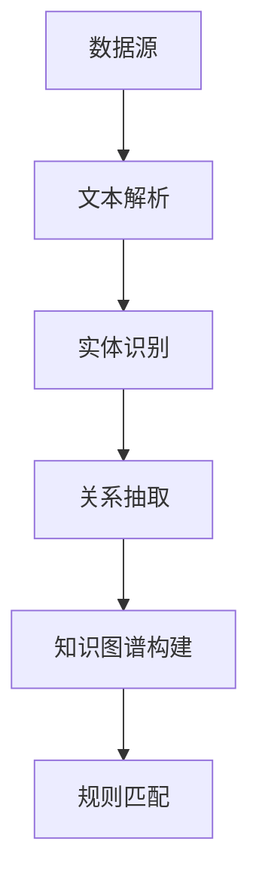

                 

# AI Agent在企业法律合规检查中的应用

## 关键词：AI Agent，企业合规，法律合规，自然语言处理，知识图谱，规则引擎

## 摘要：本文探讨AI Agent在企业法律合规检查中的应用，分析其技术原理、系统架构，并通过实际案例展示其在合规检查中的优势。通过详细的技术分析和案例解读，阐述如何利用AI Agent提升企业合规效率和准确性。

---

# 第1章：AI Agent与企业法律合规检查概述

## 1.1 AI Agent的基本概念

### 1.1.1 AI Agent的定义与分类
AI Agent（人工智能代理）是指能够感知环境并采取行动以实现目标的智能体。AI Agent可以分为简单反射型、基于模型的反射型、目标驱动型和效用驱动型。

### 1.1.2 AI Agent的核心特点
- **自主性**：AI Agent能够自主决策。
- **反应性**：能够实时感知环境并做出反应。
- **目标导向**：通过目标驱动行动。

### 1.1.3 AI Agent与传统自动化工具的区别
AI Agent具备学习和推理能力，能够处理复杂任务，而传统自动化工具仅能执行预定义的规则。

## 1.2 企业法律合规检查的基本概念

### 1.2.1 企业合规的基本定义
企业合规是指企业在经营活动中遵守相关法律法规和行业标准。

### 1.2.2 合规检查的常见领域
包括反腐败、数据隐私、劳动法、环境保护等方面。

### 1.2.3 合规检查的流程与挑战
流程包括数据收集、规则匹配、结果分析；挑战在于复杂性、多样性和动态变化。

## 1.3 AI Agent在企业合规中的应用前景

### 1.3.1 AI Agent在合规检查中的优势
- 提高效率，降低人工成本。
- 实时监控，快速响应。

### 1.3.2 企业采用AI Agent的驱动力
- 规模化合规需求，技术进步降低成本。

### 1.3.3 AI Agent的应用场景
- 合规风险预警，合同审查，数据隐私保护。

---

# 第2章：AI Agent的核心概念与原理

## 2.1 AI Agent的基本原理

### 2.1.1 AI Agent的定义与分类
- 简单反射型：基于规则。
- 基于模型的反射型：利用环境模型。
- 目标驱动型：通过目标驱动行动。
- 效用驱动型：优化效用函数。

### 2.1.2 AI Agent的核心技术组成
包括感知、推理、决策和执行模块。

### 2.1.3 AI Agent的决策机制
基于状态、动作和结果的优化选择。

## 2.2 法律合规检查的核心要素

### 2.2.1 合规检查的规则与标准
企业合规涉及反腐败、数据隐私等多个领域，每领域都有具体规则。

### 2.2.2 数据来源与处理方式
数据来源包括企业内部文档、外部法规文本，处理方式包括文本解析和特征提取。

### 2.2.3 合规结果的判定标准
基于规则匹配和结果分析，使用概率模型评估合规风险。

## 2.3 AI Agent在法律合规中的应用原理

### 2.3.1 自然语言处理在法律文本分析中的应用
使用NLP技术进行文本解析，提取关键词和实体。

### 2.3.2 知识图谱的构建与推理
构建法律知识图谱，用于合规规则的推理和应用。

### 2.3.3 规则引擎在合规判断中的作用
基于预定义规则和动态规则，进行实时判断。

---

## 图2-1：AI Agent在法律合规中的应用原理（mermaid流程图）

---

## 2.4 合规检查的数学模型

### 2.4.1 分类模型
使用支持向量机或随机森林对合规文本进行分类，公式为：
$$ P(y|x) = \frac{P(x|y)P(y)}{P(x)} $$

### 2.4.2 概率模型
通过贝叶斯定理计算合规概率，公式为：
$$ P(\text{合规}|x) = \frac{P(x|\text{合规})P(\text{合规})}{P(x)} $$

---

# 第3章：AI Agent的法律合规应用技术实现

## 3.1 算法原理与实现

### 3.1.1 基于NLP的文本分析
使用词袋模型或词嵌入模型进行文本表示。

### 3.1.2 基于知识图谱的推理
构建法律知识图谱，使用SPARQL进行查询。

### 3.1.3 基于规则引擎的判断
使用Drools等工具定义和执行合规规则。

## 3.2 系统架构设计

### 3.2.1 领域模型设计
使用Mermaid类图展示系统模块及其关系。

### 3.2.2 系统架构设计
展示系统各模块的交互和数据流。

### 3.2.3 接口设计
定义RESTful API，用于数据输入和结果输出。

## 3.3 项目实战：合规检查系统实现

### 3.3.1 环境安装
安装Python、TensorFlow、Drools等工具。

### 3.3.2 核心代码实现
展示NLP处理、知识图谱构建和规则引擎调用的代码。

### 3.3.3 实际案例分析
分析一个合规检查案例，展示系统处理流程和结果。

---

## 图3-1：领域模型类图（mermaid）

---

# 第4章：AI Agent在法律合规检查中的系统架构

## 4.1 系统功能设计

### 4.1.1 数据采集模块
负责收集企业内部和外部数据。

### 4.1.2 文本解析模块
使用NLP技术进行文本处理。

### 4.1.3 知识图谱模块
构建和管理法律知识图谱。

### 4.1.4 规则引擎模块
定义和执行合规规则。

## 4.2 系统架构设计

### 4.2.1 分层架构
展示系统的分层结构，包括数据层、服务层和应用层。

### 4.2.2 微服务架构
展示系统模块的微服务设计，包括API网关、服务注册与发现。

## 4.3 系统接口设计

### 4.3.1 数据接口
定义数据输入和输出的接口。

### 4.3.2 API接口
定义RESTful API，供其他系统调用。

### 4.3.3 交互接口
展示用户与系统的交互界面设计。

## 4.4 系统交互流程

### 4.4.1 交互流程图
使用mermaid序列图展示系统各模块的交互流程。

---

## 图4-1：系统交互流程图（mermaid）

---

# 第5章：项目实战：基于AI Agent的合规检查系统

## 5.1 项目介绍

### 5.1.1 项目背景
介绍项目的目的和意义。

### 5.1.2 项目目标
明确项目的预期成果。

## 5.2 环境安装与配置

### 5.2.1 安装Python
安装Python 3.x版本。

### 5.2.2 安装NLP库
安装spaCy和Gensim等NLP处理库。

### 5.2.3 安装知识图谱库
安装Neo4j和Cypher等工具。

### 5.2.4 安装规则引擎
安装Drools或其它规则引擎工具。

## 5.3 核心代码实现

### 5.3.1 数据采集模块
编写代码从数据库或API获取数据。

### 5.3.2 文本解析模块
使用NLP库进行文本处理和实体识别。

### 5.3.3 知识图谱模块
构建法律知识图谱，并进行查询。

### 5.3.4 规则引擎模块
定义合规规则，并使用规则引擎进行判断。

## 5.4 实际案例分析

### 5.4.1 案例背景
选择一个具体的合规案例。

### 5.4.2 数据处理
展示数据处理过程和结果。

### 5.4.3 系统运行
展示系统运行过程和结果。

### 5.4.4 结果分析
分析系统的判断结果和准确率。

## 5.5 系统优化与改进

### 5.5.1 系统性能优化
优化NLP处理和规则引擎的效率。

### 5.5.2 知识图谱优化
增加更多的法律知识，提高推理能力。

### 5.5.3 系统可扩展性
设计模块化架构，方便功能扩展。

---

## 图5-1：知识图谱构建流程（mermaid）

---

# 第6章：总结与展望

## 6.1 总结

### 6.1.1 AI Agent在合规检查中的优势
- 提高效率，降低成本。
- 实时监控，快速响应。

### 6.1.2 系统设计的关键点
- 数据处理的准确性，规则引擎的灵活性。

## 6.2 未来展望

### 6.2.1 技术进步
AI Agent将更加智能化，学习能力更强。

### 6.2.2 应用场景扩展
合规检查将覆盖更多领域，如AI伦理和数据治理。

## 6.3 最佳实践 tips

### 6.3.1 系统设计建议
模块化设计，便于维护和扩展。

### 6.3.2 数据处理建议
确保数据质量和完整性。

### 6.3.3 规则管理建议
定期更新规则库，适应法规变化。

## 6.4 项目小结

---

# 作者：AI天才研究院 & 禅与计算机程序设计艺术

---

通过以上目录和内容安排，确保文章结构清晰，技术内容详实，帮助读者全面理解AI Agent在企业法律合规检查中的应用。

