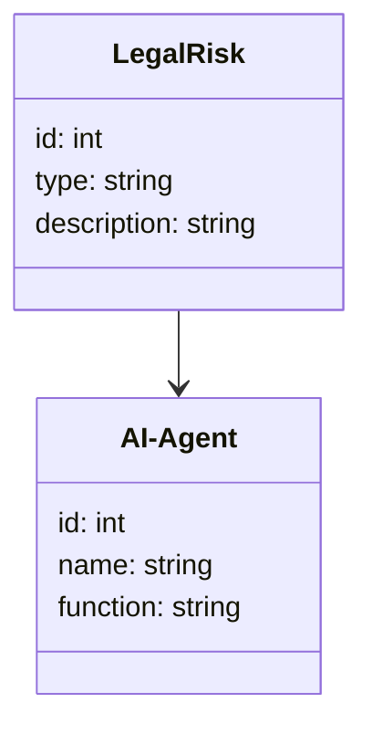
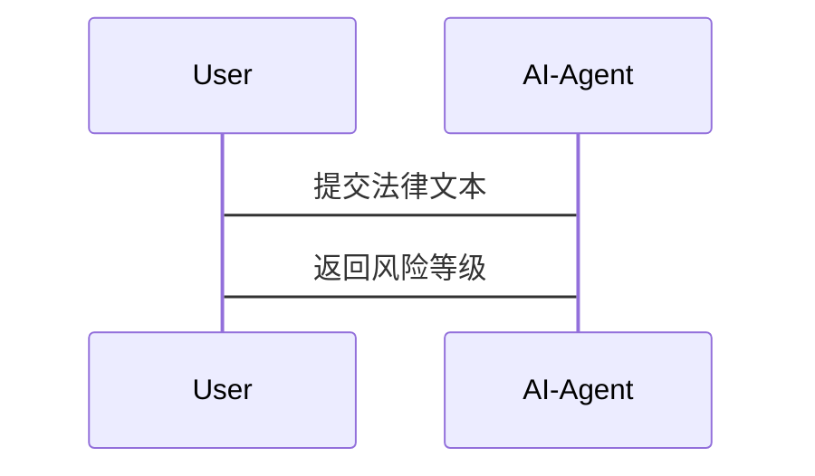

                 


# AI Agent在企业法律风险管理中的应用

> 关键词：AI Agent, 企业法律风险管理, 自然语言处理, 知识图谱, 机器学习, 法律风险预测

> 摘要：本文探讨了AI Agent在企业法律风险管理中的应用，详细分析了其核心原理、技术实现和实际案例，展示了如何通过AI技术提升法律风险管理的效率和准确性。

---

## 第1章: 法律风险管理的基本概念

### 1.1 法律风险管理的定义与核心要素

#### 1.1.1 什么是法律风险管理
法律风险管理是指企业识别、评估和应对与法律相关的风险的过程。这些风险可能来自合同纠纷、合规问题、知识产权侵犯等多个方面。有效的法律风险管理能够帮助企业避免法律纠纷，降低潜在损失。

#### 1.1.2 法律风险管理的核心要素
- **风险识别**：识别潜在的法律风险。
- **风险评估**：评估风险的可能性和影响程度。
- **风险应对**：制定应对策略，如规避、转移或接受风险。
- **风险监控**：持续监控风险状态，及时调整应对策略。

#### 1.1.3 企业法律风险管理的重要性
法律风险管理是企业合规运营的重要组成部分，直接关系到企业的声誉、财务稳定性和可持续发展。

---

### 1.2 AI Agent的基本概念

#### 1.2.1 什么是AI Agent
AI Agent（人工智能代理）是指能够感知环境、执行任务并做出决策的智能实体。它可以是一个软件系统，也可以是一个物理设备，具备自主学习和适应能力。

#### 1.2.2 AI Agent的核心功能与特点
- **感知环境**：通过传感器或数据输入获取信息。
- **决策与推理**：基于感知的信息进行分析和决策。
- **自主学习**：通过机器学习算法不断优化自身行为。
- **人机交互**：与用户或系统进行有效沟通和协作。

#### 1.2.3 AI Agent在企业中的应用场景
- **法律咨询**：辅助律师进行合同审查、案例分析。
- **风险预警**：实时监控企业运营中的法律风险。
- **合规管理**：确保企业行为符合相关法律法规。

---

## 第2章: AI Agent在法律风险管理中的应用背景

### 2.1 企业法律风险管理的传统模式

#### 2.1.1 传统法律风险管理的流程
传统模式通常依赖人工审查和经验判断，流程繁琐且效率低下。主要步骤包括风险识别、评估、应对和监控。

#### 2.1.2 传统模式的优缺点
- **优点**：依赖专业人员的经验，适用于复杂情况。
- **缺点**：效率低、成本高、难以量化和预测。

#### 2.1.3 传统模式的局限性
随着企业规模扩大和法律环境复杂化，传统模式难以应对日益增长的风险。

---

### 2.2 AI技术对企业法律风险管理的推动作用

#### 2.2.1 AI技术在法律领域的应用现状
AI技术已在法律文本分析、合同审查等领域取得显著进展，但仍面临数据不足和模型优化的挑战。

#### 2.2.2 AI Agent如何提升法律风险管理效率
通过自动化处理和智能决策，AI Agent能够快速识别和评估风险，显著提高效率。

#### 2.2.3 企业数字化转型与AI Agent的结合
企业数字化转型为AI Agent的应用提供了技术基础和数据支持，推动了法律风险管理的智能化。

---

### 2.3 当前AI Agent在法律风险管理中的应用现状

#### 2.3.1 全球范围内的应用案例
国际企业如谷歌、微软已开始应用AI Agent进行法律风险管理，取得了显著效果。

#### 2.3.2 国内市场的应用情况
国内企业也在积极探索AI Agent的应用，但面临技术壁垒和数据隐私等问题。

#### 2.3.3 应用中的主要挑战与问题
- **技术挑战**：模型精度和泛化能力不足。
- **数据问题**：法律数据获取困难。
- **伦理问题**：AI决策的透明性和责任归属。

---

## 第3章: AI Agent的核心原理与技术

### 3.1 自然语言处理（NLP）技术

#### 3.1.1 NLP在法律文本分析中的应用
NLP用于法律文本的关键词提取、实体识别和情感分析，帮助识别潜在风险。

#### 3.1.2 常见的NLP技术与工具
- **工具**：spaCy、NLTK。
- **技术**：词嵌入、句法分析、语义理解。

#### 3.1.3 NLP在法律风险管理中的具体应用
通过分析合同文本，识别潜在的法律风险点，如违约条款。

---

### 3.2 知识图谱构建与推理

#### 3.2.1 知识图谱的基本概念
知识图谱是结构化数据的图形表示，用于表示实体及其关系。

#### 3.2.2 法律知识图谱的构建方法
- **数据来源**：法律文本、案例数据库。
- **构建工具**：图数据库（Neo4j）。

#### 3.2.3 知识图谱在法律推理中的应用
通过推理引擎，从知识图谱中推导出法律风险的相关信息。

---

### 3.3 机器学习与预测模型

#### 3.3.1 机器学习在法律风险管理中的应用
机器学习用于风险分类、预测和优化。

#### 3.3.2 常见的机器学习算法与模型
- **算法**：支持向量机（SVM）、随机森林。
- **模型**：深度学习模型（如BERT）。

#### 3.3.3 法律风险预测模型的构建与优化
通过训练数据构建分类模型，预测法律风险的发生概率。

---

## 第4章: AI Agent与法律风险管理的结合

### 4.1 AI Agent在法律风险识别中的应用

#### 4.1.1 法律风险识别的基本流程
- **数据收集**：获取相关法律文本。
- **特征提取**：提取关键特征。
- **模型训练**：训练识别模型。

#### 4.1.2 AI Agent如何辅助风险识别
通过NLP和知识图谱技术，快速识别潜在法律风险。

#### 4.1.3 典型案例分析
某企业通过AI Agent识别合同中的潜在违约条款，提前采取防范措施。

---

### 4.2 AI Agent在法律风险评估中的应用

#### 4.2.1 风险评估的基本方法
- **定量评估**：基于数据的统计分析。
- **定性评估**：基于专家判断。

#### 4.2.2 AI Agent在风险评估中的作用
通过机器学习模型，评估风险的可能性和影响程度。

#### 4.2.3 典型案例分析
某企业使用AI Agent评估供应链中的法律风险，优化供应商选择。

---

### 4.3 AI Agent在法律风险应对与优化中的应用

#### 4.3.1 风险应对的基本策略
- **规避**：避免高风险行为。
- **转移**：通过保险或合同转移风险。
- **接受**：接受潜在损失。

#### 4.3.2 AI Agent在风险应对中的作用
提供多种应对策略，优化企业风险管理。

#### 4.3.3 典型案例分析
某企业利用AI Agent制定应对策略，降低法律诉讼风险。

---

## 第5章: 系统分析与架构设计

### 5.1 问题场景介绍

#### 5.1.1 问题描述
企业需要一个智能系统，实时监控和管理法律风险。

#### 5.1.2 边界与外延
系统仅处理法律风险，不涉及其他类型风险。

#### 5.1.3 核心需求
- 实时监控。
- 智能预警。
- 自动应对。

---

### 5.2 系统功能设计

#### 5.2.1 领域模型类图


#### 5.2.2 系统架构图
```mermaid
topology
    subsystem LegalRiskSystem {
        component LegalAnalyzer
        component RiskEvaluator
        component RiskManager
    }
    LegalAnalyzer --> RiskEvaluator
    RiskEvaluator --> RiskManager
```

---

### 5.3 系统接口设计

#### 5.3.1 接口定义
- `getRiskLevel()`：获取风险等级。
- `generateReport()`：生成风险报告。

---

### 5.4 系统交互流程图



---

## 第6章: 项目实战

### 6.1 环境安装

#### 6.1.1 安装Python
```bash
python --version
```

#### 6.1.2 安装依赖
```bash
pip install numpy
pip install scikit-learn
```

---

### 6.2 核心代码实现

#### 6.2.1 NLP文本处理
```python
import numpy as np
from sklearn.feature_extraction.text import TfidfVectorizer

vectorizer = TfidfVectorizer()
X = vectorizer.fit_transform(documents)
```

#### 6.2.2 机器学习模型训练
```python
from sklearn.svm import SVC

model = SVC()
model.fit(X.toarray(), labels)
```

---

### 6.3 实际案例分析

#### 6.3.1 案例描述
某企业使用AI Agent分析合同文本，识别潜在违约条款。

#### 6.3.2 分析过程
1. 提交合同文本。
2. AI Agent提取关键词。
3. 生成风险报告。

---

## 第7章: 总结与展望

### 7.1 总结
AI Agent通过NLP、知识图谱和机器学习技术，显著提升了企业法律风险管理的效率和准确性。

### 7.2 展望
未来，随着技术进步，AI Agent在法律风险管理中的应用将更加广泛和深入。

---

## 参考文献

1. 王某某, 《人工智能与法律风险管理》，某某出版社，2023年。
2. John Smith, *AI in Legal Risk Management*,某某出版社，2022年。

---

作者：AI天才研究院/AI Genius Institute & 禅与计算机程序设计艺术 /Zen And The Art of Computer Programming

