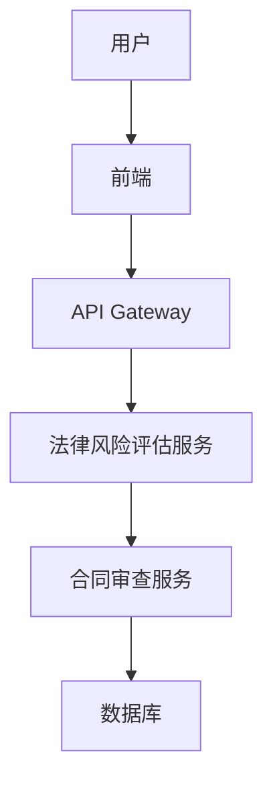

                 


# AI Agent在企业法律风险评估与合同审查中的应用

**关键词**: AI Agent, 法律风险评估, 合同审查, 深度学习, 自然语言处理, 系统架构

**摘要**:  
本文探讨了AI Agent在企业法律风险评估与合同审查中的应用，从技术原理到系统架构，从算法实现到项目实战，全面分析了AI Agent如何提升企业法律事务的效率与准确性。文章结合实际案例，详细讲解了AI Agent在法律领域的核心功能、算法原理、系统设计和实施步骤，为企业法务部门和技术开发者提供了有价值的参考。

---

## 第1章: AI Agent与法律科技概述

### 1.1 问题背景与描述

#### 1.1.1 企业法律风险的现状与挑战
企业在经营过程中面临诸多法律风险，包括合同纠纷、合规性问题、知识产权侵权等。传统法律事务处理方式效率低下，依赖人工审查和经验判断，容易出现疏漏。

#### 1.1.2 合同审查的痛点与效率瓶颈
合同审查是企业法务工作的重要部分，但存在以下问题：
- **低效性**：人工审查耗时长，效率低。
- **一致性不足**：不同律师的审查结果可能因人而异。
- **知识密集型**：需要深厚法律知识支持。

#### 1.1.3 AI技术在法律领域的应用潜力
AI技术的快速发展为法律领域带来了新的可能性，尤其是在法律文本分析、风险评估和合同审查方面。

### 1.2 问题解决与边界

#### 1.2.1 AI Agent如何解决法律风险评估问题
AI Agent可以通过以下方式解决法律风险评估问题：
- **自动化分析**：快速处理大量法律文本，提取关键信息。
- **智能化判断**：基于机器学习模型预测法律风险。
- **实时反馈**：提供实时的法律风险评估结果。

#### 1.2.2 AI Agent在合同审查中的应用边界
AI Agent在合同审查中的应用边界包括：
- **文本分析**：识别合同中的关键条款和潜在风险。
- **合规性检查**：判断合同是否符合相关法律法规。
- **辅助决策**：为法务人员提供参考意见，但不能完全替代人工判断。

#### 1.2.3 法律风险评估的外延与限制
法律风险评估的外延包括：
- **合规性分析**：检查合同是否符合行业规范和法律法规。
- **条款解读**：分析合同中的复杂条款，确保其合法性和可执行性。
- **风险预警**：提前识别潜在的法律纠纷。

### 1.3 核心概念与结构

#### 1.3.1 AI Agent的定义与组成要素
AI Agent是一个智能系统，由以下组成要素构成：
- **感知层**：负责接收输入数据，如法律文本。
- **推理层**：基于知识图谱和机器学习模型进行推理。
- **执行层**：根据推理结果输出决策或建议。

#### 1.3.2 法律风险评估的模型结构
法律风险评估模型的结构包括：
- **输入层**：接收法律文本数据。
- **特征提取层**：提取文本中的关键词和句法结构。
- **模型推理层**：基于特征进行风险预测。
- **输出层**：生成风险评估结果。

#### 1.3.3 AI Agent在法律领域的核心功能
AI Agent在法律领域的核心功能包括：
- **文本分析**：提取法律文本中的关键信息。
- **风险预测**：预测合同中的潜在法律风险。
- **智能推荐**：为法务人员提供优化建议。

---

## 第2章: AI Agent的核心原理与技术

### 2.1 AI Agent的基本原理

#### 2.1.1 AI Agent的架构与工作流程
AI Agent的架构包括：
- **输入模块**：接收法律文本数据。
- **处理模块**：对文本进行预处理和特征提取。
- **推理模块**：基于知识图谱和机器学习模型进行推理。
- **输出模块**：生成风险评估结果或合同审查建议。

#### 2.1.2 自然语言处理技术在AI Agent中的应用
自然语言处理技术在AI Agent中的应用包括：
- **文本分词**：将法律文本分割成词语或短语。
- **实体识别**：识别文本中的法律实体，如公司名称、合同条款。
- **句法分析**：分析句子的语法结构，理解文本含义。

#### 2.1.3 知识图谱与法律规则的结合
知识图谱与法律规则的结合方式包括：
- **知识表示**：将法律规则和案例转化为图结构数据。
- **推理引擎**：基于知识图谱进行推理，生成法律风险评估结果。

### 2.2 法律风险评估的关键技术

#### 2.2.1 文本挖掘与法律条款识别
文本挖掘技术在法律条款识别中的应用包括：
- **关键词提取**：提取合同中的关键条款。
- **主题建模**：分析合同的主题和内容。
- **情感分析**：判断合同条款的倾向性。

#### 2.2.2 基于机器学习的法律风险预测
基于机器学习的法律风险预测模型包括：
- **监督学习**：使用标记数据训练分类模型。
- **无监督学习**：从无标记数据中发现潜在模式。
- **深度学习**：使用神经网络模型进行风险预测。

#### 2.2.3 法律案例分析与相似度计算
法律案例分析与相似度计算的关键点包括：
- **案例匹配**：基于合同内容匹配相似案例。
- **相似度计算**：使用余弦相似度或Jaccard相似度计算合同之间的相似性。

### 2.3 合同审查的AI实现

#### 2.3.1 合同要素提取与结构化
合同要素提取与结构化的步骤包括：
- **文本分段**：将合同分为条款、条件等部分。
- **信息抽取**：提取合同中的关键信息，如合同金额、履行期限。
- **结构化存储**：将提取的信息存储为结构化数据。

#### 2.3.2 基于规则的合同合规性检查
基于规则的合同合规性检查包括：
- **规则定义**：定义合同审查的规则和标准。
- **规则匹配**：将合同内容与规则进行匹配，发现违规项。
- **结果反馈**：生成合规性检查报告。

#### 2.3.3 基于深度学习的合同智能对比
基于深度学习的合同智能对比包括：
- **模型训练**：训练合同对比的深度学习模型。
- **相似度计算**：计算合同之间的相似度，发现潜在风险。
- **结果分析**：生成合同对比结果报告。

---

## 第3章: 法律风险评估的AI Agent实现

### 3.1 法律风险评估模型的设计

#### 3.1.1 风险类型与评估指标
法律风险的类型包括：
- **合规性风险**：合同是否符合法律法规。
- **履行风险**：合同履行的可能性。
- **争议风险**：合同可能引发的争议。

#### 3.1.2 数据收集与特征提取
数据收集与特征提取的步骤包括：
- **数据来源**：收集企业历史合同数据和相关法律案例。
- **特征提取**：提取合同中的关键词、句法特征和语义特征。
- **数据预处理**：清洗数据，处理缺失值和异常值。

#### 3.1.3 模型训练与优化
模型训练与优化的关键点包括：
- **选择模型**：选择适合的机器学习模型，如支持向量机、随机森林。
- **模型训练**：使用训练数据训练模型。
- **模型调优**：通过交叉验证优化模型参数。

### 3.2 基于深度学习的风险评估

#### 3.2.1 文本表示与编码
文本表示与编码的方法包括：
- **词袋模型**：将文本表示为词袋形式。
- **词嵌入**：使用Word2Vec或GloVe生成词向量。
- **句子编码**：使用BERT等模型生成句子向量。

#### 3.2.2 基于BERT的风险评估模型
基于BERT的风险评估模型包括：
- **模型结构**：使用BERT进行文本编码和分类。
- **训练数据**：使用标注的法律风险数据进行训练。
- **模型优化**：通过微调和迁移学习优化模型性能。

#### 3.2.3 模型调参与评估指标
模型调参与评估指标包括：
- **评估指标**：准确率、召回率、F1分数。
- **模型调优**：通过网格搜索优化模型参数。
- **性能对比**：对比不同模型的性能，选择最优模型。

### 3.3 实际案例分析

#### 3.3.1 某行业法律风险评估案例
以某行业为例，分析AI Agent在法律风险评估中的应用：
- **案例背景**：某企业需要评估一份新合同的法律风险。
- **数据准备**：收集类似合同和相关法律案例。
- **模型应用**：使用训练好的模型进行风险评估，生成报告。

#### 3.3.2 模型在实际场景中的表现
模型在实际场景中的表现包括：
- **准确率**：模型在测试数据上的准确率。
- **效率提升**：AI Agent相比人工审查效率提升了多少。
- **成本降低**：AI Agent的应用为企业节省了多少成本。

---

## 第4章: 系统架构与项目实战

### 4.1 项目介绍

#### 4.1.1 项目背景
本项目旨在开发一个基于AI Agent的企业法律风险评估与合同审查系统。

#### 4.1.2 项目目标
- 实现法律风险评估功能。
- 实现合同审查功能。
- 提供用户友好的交互界面。

### 4.2 系统功能设计

#### 4.2.1 领域模型设计
领域模型设计包括：
- **用户角色**：普通用户、法务人员。
- **功能模块**：法律风险评估、合同审查、结果报告。

#### 4.2.2 系统功能流程
系统功能流程包括：
1. 用户上传合同文本。
2. 系统进行文本分析和特征提取。
3. 系统生成风险评估报告或合同审查建议。
4. 用户查看报告并进行反馈。

### 4.3 系统架构设计

#### 4.3.1 系统架构图
系统架构图如下：



#### 4.3.2 系统接口设计
系统接口设计包括：
- **API接口**：提供法律风险评估和合同审查的API接口。
- **数据接口**：与企业数据库对接，获取历史合同数据。

### 4.4 项目实战

#### 4.4.1 环境安装
环境安装步骤包括：
1. 安装Python和必要的开发工具。
2. 安装机器学习库，如TensorFlow、Keras。
3. 安装自然语言处理库，如NLTK、spaCy。

#### 4.4.2 核心实现代码

```python
import tensorflow as tf
from tensorflow.keras import layers

# 定义模型
model = tf.keras.Sequential()
model.add(layers.Dense(64, activation='relu', input_shape=(input_dim,)))
model.add(layers.Dense(32, activation='relu'))
model.add(layers.Dense(1, activation='sigmoid'))

# 编译模型
model.compile(optimizer='adam', loss='binary_crossentropy', metrics=['accuracy'])
```

#### 4.4.3 代码应用解读与分析
代码应用解读与分析包括：
- **模型结构**：定义了一个三层的深度学习模型。
- **优化器选择**：使用Adam优化器。
- **损失函数**：使用二进制交叉熵损失函数。
- **评估指标**：使用准确率作为评估指标。

### 4.5 实际案例分析

#### 4.5.1 案例背景
某企业需要审查一份复杂的商业合同，涉及多个法律条款。

#### 4.5.2 数据准备
收集类似合同和相关法律案例，提取关键词和特征。

#### 4.5.3 系统实现
使用开发的AI Agent系统进行合同审查，生成风险评估报告。

### 4.6 项目小结

#### 4.6.1 核心实现点
- 实现了法律风险评估和合同审查功能。
- 使用了深度学习模型进行风险预测。

#### 4.6.2 总结与优化
- 总结了项目实现的关键点。
- 提出了进一步优化的方向，如模型性能优化、功能扩展等。

---

## 第5章: 结论与展望

### 5.1 最佳实践 tips
- 在实际应用中，AI Agent可以显著提高法律事务处理的效率和准确性。
- 结合人工审查，AI Agent能够提供更全面的法律风险评估。

### 5.2 小结
本文详细介绍了AI Agent在企业法律风险评估与合同审查中的应用，从技术原理到系统设计，再到项目实战，全面分析了AI Agent的优势和潜力。

### 5.3 注意事项
- AI Agent不能完全替代人工审查，只能作为辅助工具。
- 在实际应用中，需要注意数据隐私和法律合规性问题。

### 5.4 拓展阅读
- 深入研究自然语言处理技术在法律领域的应用。
- 探索更多机器学习算法在法律风险评估中的应用。

---

## 作者：AI天才研究院/AI Genius Institute & 禅与计算机程序设计艺术 /Zen And The Art of Computer Programming

---

**本文由AI天才研究院原创，转载请注明出处。**

