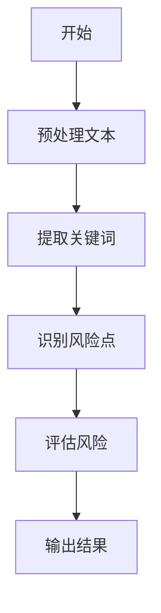
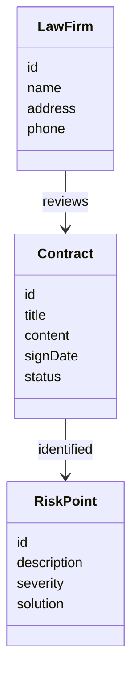
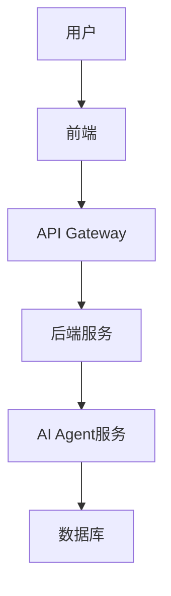

                 


# AI Agent在企业法律风险评估与合同自动化审查中的应用

## 关键词：
AI Agent, 法律风险评估, 合同自动化审查, 机器学习, 自然语言处理

## 摘要：
随着企业在全球化和数字化转型中的快速发展，法律风险评估和合同审查的重要性日益凸显。传统方法效率低下且容易出错，而AI Agent的引入为这一领域带来了革命性的变化。本文详细探讨了AI Agent在企业法律风险评估和合同自动化审查中的应用，分析了其核心原理、算法模型、系统架构，并通过实际案例展示了其在提高效率和准确性方面的优势。文章最后总结了AI Agent的应用前景及未来发展方向。

---

## 第1章: 背景介绍

### 1.1 问题背景

#### 1.1.1 企业法律风险的现状与挑战
企业在运营过程中面临诸多法律风险，如合同纠纷、合规问题和知识产权侵权等。传统法律风险评估依赖人工审查，耗时长、成本高且容易遗漏关键风险点。

#### 1.1.2 合同审查的痛点与效率问题
合同审查是企业法务工作的重要部分，但传统方法效率低下，审查人员需要逐条分析合同条款，容易出错且效率低。

#### 1.1.3 AI技术在法律领域的应用前景
AI技术，特别是自然语言处理（NLP）和机器学习，正在改变法律服务的方式，能够快速处理大量法律文件，提高审查效率和准确性。

### 1.2 问题描述

#### 1.2.1 法律风险评估的核心要素
法律风险评估包括识别潜在风险、评估风险严重性、制定应对策略等环节。

#### 1.2.2 合同审查的关键环节与难点
合同审查需要识别关键条款、识别潜在风险点、确保合规性等，难点在于处理大量复杂条款和快速响应需求。

#### 1.2.3 传统方法的局限性与改进需求
传统方法效率低、成本高，容易出错，亟需引入AI技术提高效率和准确性。

### 1.3 问题解决

#### 1.3.1 AI Agent在法律风险评估中的作用
AI Agent能够快速分析大量法律文件，识别风险点，提供评估建议，帮助企业在复杂环境中做出决策。

#### 1.3.2 合同自动化审查的实现路径
通过AI技术实现合同条款识别、风险评估和合规性检查，显著提高审查效率。

#### 1.3.3 技术与法律结合的创新模式
AI技术与法律知识的结合，开创了法律服务的新模式，提升了法律服务的智能化水平。

### 1.4 概念结构与核心要素

#### 1.4.1 AI Agent的定义与核心要素
AI Agent是一种智能代理，能够在法律领域中执行特定任务，如合同审查和风险评估。其核心要素包括自然语言处理、机器学习模型和知识库。

#### 1.4.2 法律风险评估的框架与模型
法律风险评估框架包括数据采集、风险识别、风险评估和结果输出等步骤，模型基于机器学习算法进行风险预测。

#### 1.4.3 合同审查的流程与关键点
合同审查流程包括预处理、条款识别、风险评估和结果输出，关键点在于准确识别条款和评估风险。

---

## 第2章: 核心概念与联系

### 2.1 AI Agent的核心原理

#### 2.1.1 AI Agent的基本工作原理
AI Agent通过自然语言处理技术分析合同文本，利用机器学习模型识别风险点，提供评估结果。

#### 2.1.2 机器学习在法律分析中的应用
机器学习模型能够从大量合同数据中学习，识别常见风险模式，帮助评估法律风险。

#### 2.1.3 自然语言处理（NLP）在合同审查中的作用
NLP技术用于合同文本的理解和分析，帮助识别关键条款和潜在风险点。

### 2.2 核心概念对比

#### 2.2.1 AI Agent与传统法律分析工具的对比
| 特性             | AI Agent                     | 传统法律工具             |
|------------------|------------------------------|--------------------------|
| 效率             | 高                           | 低                       |
| 准确性           | 高                           | 一般                     |
| 处理能力         | 处理大量数据                 | 处理能力有限             |
| 适应性           | 可自适应新数据               | 需人工调整                |

#### 2.2.2 不同AI模型在法律领域的表现分析
AI模型在合同审查中的表现取决于数据质量和训练算法，深度学习模型在复杂任务中表现更优。

#### 2.2.3 合同审查中的规则引擎与机器学习模型对比
| 特性             | 规则引擎                     | 机器学习模型             |
|------------------|------------------------------|--------------------------|
| 灵活性           | 低                           | 高                       |
| 需求             | 明确规则                     | 数据驱动                 |
| 处理复杂性       | 简单                         | 复杂                     |

### 2.3 ER实体关系图

```mermaid
er
    LawFirm {
        id
        name
        address
        phone
    }
    Contract {
        id
        title
        content
        signDate
        status
    }
    RiskPoint {
        id
        description
        severity
        solution
    }
    LawFirm -- Contract: reviews
    Contract --> RiskPoint: identified
```

---

## 第3章: 算法原理

### 3.1 算法选择与实现

#### 3.1.1 算法选择
基于规则的系统和机器学习模型相结合，规则引擎处理明确条款，机器学习识别潜在风险。

#### 3.1.2 算法实现



#### 3.1.3 算法流程图


### 3.2 数学模型与公式

#### 3.2.1 条款匹配的条件概率
$$ P(\text{风险} | \text{条款}) = \frac{\text{风险条款出现次数}}{\text{总条款数}} $$

#### 3.2.2 风险评估的贝叶斯定理
$$ P(A|B) = \frac{P(B|A)P(A)}{P(B)} $$

---

## 第4章: 系统分析与架构设计

### 4.1 系统应用场景

#### 4.1.1 企业合同审查
AI Agent用于企业合同的自动化审查，识别潜在风险，提高审查效率。

#### 4.1.2 法律风险评估
AI Agent帮助企业评估法律风险，制定应对策略。

### 4.2 系统功能设计

#### 4.2.1 领域模型类图


#### 4.2.2 系统架构图


---

## 第5章: 项目实战

### 5.1 环境安装

#### 5.1.1 安装Python
```bash
python --version
pip install --upgrade pip
```

#### 5.1.2 安装依赖
```bash
pip install jieba
pip install spacy
pip install transformers
```

### 5.2 核心实现

#### 5.2.1 预处理代码
```python
import jieba
import spacy

def preprocess(text):
    return ' '.join(jieba.lcut(text))
```

#### 5.2.2 风险识别代码
```python
import spacy

nlp = spacy.load("zh_core_web_sm")

def identify_risk(text):
    doc = nlp(text)
    risks = []
    for token in doc:
        if token.pos_ == 'VERB' and token.dep_ == 'ROOT':
            risks.append(token.text)
    return risks
```

### 5.3 代码解读与分析

#### 5.3.1 预处理函数
预处理函数使用jieba对中文文本进行分词，处理后的文本用于后续分析。

#### 5.3.2 风险识别函数
使用spaCy进行中文分词和词性标注，识别风险相关动词，作为风险点。

### 5.4 案例分析

#### 5.4.1 案例背景
某企业需要审查一份长期合作协议，可能存在违约风险。

#### 5.4.2 系统输出
系统识别出多个风险点，如违约责任和知识产权条款，提供具体解决方案。

#### 5.4.3 分析总结
通过AI Agent的辅助，企业快速识别合同中的潜在风险，节省了时间和成本。

---

## 第6章: 最佳实践与小结

### 6.1 最佳实践

#### 6.1.1 数据质量
确保训练数据的多样性和代表性，提高模型的泛化能力。

#### 6.1.2 模型调优
定期更新模型，根据新数据优化算法，保持模型的准确性。

#### 6.1.3 人机结合
AI Agent辅助人工审查，人机结合提高效率和准确性。

### 6.2 小结

本文详细探讨了AI Agent在企业法律风险评估和合同自动化审查中的应用，展示了其在提高效率和准确性方面的优势。通过实际案例分析，验证了AI技术在法律领域的可行性。

### 6.3 注意事项

- 数据隐私保护
- 模型的可解释性
- 系统的稳定性

### 6.4 拓展阅读

- 《机器学习在法律领域的应用》
- 《自然语言处理在合同审查中的实践》

---

## 作者：AI天才研究院/AI Genius Institute & 禅与计算机程序设计艺术/Zen And The Art of Computer Programming

---

感谢您的阅读！如需进一步了解，请联系AI天才研究院。

