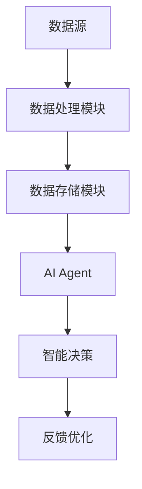
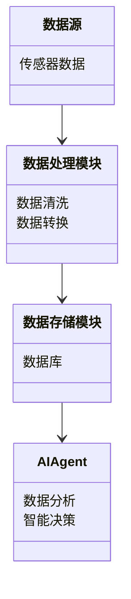

                 


# AI Agent在企业物联网数据分析中的应用前景

---

## 关键词：
AI Agent, 物联网, 数据分析, 机器学习, 实时处理, 智能决策

---

## 摘要：
本文深入探讨AI Agent在企业物联网数据分析中的应用前景。通过分析AI Agent的核心原理、物联网数据分析的关键技术，以及两者结合的优势，本文揭示了AI Agent如何通过智能决策、实时数据处理和复杂场景优化，为企业物联网系统带来显著的商业价值。文章还结合实际案例，展示了AI Agent在物联网数据分析中的具体实现和应用，为读者提供了全面的理论支持和实践指导。

---

## 第1章: AI Agent与物联网数据分析概述

### 1.1 AI Agent的基本概念
#### 1.1.1 AI Agent的定义与特点
AI Agent（智能代理）是指能够感知环境、自主决策并执行任务的智能实体。其特点包括：
- **自主性**：无需外部干预，自主完成任务。
- **反应性**：能够实时感知环境变化并做出响应。
- **目标导向**：基于目标驱动行为。
- **学习能力**：通过数据学习优化决策。

#### 1.1.2 物联网数据分析的核心概念
物联网（IoT）系统通过传感器和设备采集海量数据，需要进行实时处理和分析。其核心概念包括：
- **数据采集**：从传感器获取原始数据。
- **数据预处理**：清洗、转换和标准化数据。
- **数据分析**：通过机器学习、统计分析等方法提取价值。

#### 1.1.3 AI Agent在物联网数据分析中的作用
AI Agent通过智能处理物联网数据，帮助企业实现：
- **实时监控与预警**
- **智能决策支持**
- **自动化优化**

---

### 1.2 AI Agent与物联网的结合背景
#### 1.2.1 物联网数据的特点与挑战
物联网数据具有以下特点：
- **海量性**：数据量大，实时性强。
- **多样性**：数据来源和格式多样。
- **动态性**：数据实时变化，需快速处理。

挑战包括：
- **数据冗余**：无效数据干扰分析。
- **计算资源有限**：需要高效算法支持。
- **隐私与安全**：数据保护问题突出。

#### 1.2.2 AI Agent在物联网数据处理中的优势
AI Agent的优势包括：
- **智能化**：通过机器学习提升数据处理能力。
- **实时性**：快速响应数据变化。
- **分布式协作**：多AI Agent协同工作，提高系统效率。

#### 1.2.3 企业物联网数据分析的现状与痛点
当前企业物联网数据分析面临：
- **数据孤岛**：系统间数据无法有效整合。
- **计算效率低下**：传统方法难以处理海量数据。
- **决策延迟**：缺乏实时决策支持。

---

### 1.3 AI Agent在企业物联网中的应用前景
#### 1.3.1 应用场景概述
AI Agent在企业物联网中的应用场景包括：
- **智能工厂**：优化生产流程，实时监控设备状态。
- **智慧城市**：管理交通、环境数据，提升城市运行效率。
- **智能家居**：提供个性化服务，提升用户体验。

#### 1.3.2 技术发展趋势
- **边缘计算**：AI Agent在边缘设备上运行，减少数据传输延迟。
- **5G技术**：支持实时数据传输和快速响应。
- **深度学习**：提升AI Agent的数据分析能力。

#### 1.3.3 市场需求与商业价值
- **市场需求**：企业对实时数据分析的需求日益增长。
- **商业价值**：通过AI Agent优化资源配置，降低运营成本，提高效率。

---

## 第2章: AI Agent与物联网数据分析的核心原理

### 2.1 AI Agent的基本原理
#### 2.1.1 AI Agent的决策机制
AI Agent通过以下步骤进行决策：
1. **感知环境**：采集数据并分析环境状态。
2. **推理与规划**：基于数据进行推理，制定行动计划。
3. **执行与反馈**：执行决策并收集反馈，优化后续行为。

#### 2.1.2 基于数据的智能推理
AI Agent通过机器学习算法对物联网数据进行分析，例如：
- **监督学习**：用于分类和回归任务。
- **无监督学习**：用于聚类和异常检测。

#### 2.1.3 多智能体协作与优化
多个AI Agent协同工作，通过通信与协调实现系统优化，例如：
- **分布式计算**：任务分解与协同处理。
- **动态调整**：根据实时数据动态优化策略。

---

### 2.2 物联网数据分析的关键技术
#### 2.2.1 数据采集与预处理
数据采集包括传感器数据的获取，预处理包括数据清洗和标准化。

#### 2.2.2 数据存储与管理
使用数据库或大数据平台存储物联网数据，例如：
- **关系型数据库**：适用于结构化数据。
- **NoSQL数据库**：适用于非结构化数据。

#### 2.2.3 数据分析与挖掘
通过机器学习、统计分析等方法挖掘数据价值。

---

### 2.3 AI Agent与物联网数据分析的结合
#### 2.3.1 数据驱动的智能决策
AI Agent通过实时数据分析，提供智能决策支持。

#### 2.3.2 实时数据分析与反馈
AI Agent能够快速处理物联网数据，并实时反馈优化建议。

#### 2.3.3 复杂场景下的优化策略
AI Agent通过多智能体协作，优化复杂场景下的资源配置。

---

### 2.4 核心概念对比分析
#### 2.4.1 AI Agent与传统数据处理的区别
| 特性         | AI Agent       | 传统数据处理   |
|--------------|----------------|----------------|
| 自主性       | 高             | 低             |
| 实时性       | 高             | 低             |
| 学习能力     | 高             | 低             |

#### 2.4.2 物联网数据分析与传统数据分析的对比
| 特性         | 物联网数据分析 | 传统数据分析   |
|--------------|----------------|----------------|
| 数据来源     | 多样化         | 单一化         |
| 数据规模     | 海量          | 中小规模      |
| 实时性       | 高             | 低             |

#### 2.4.3 核心概念的属性特征对比表格
| 特性         | AI Agent       | 物联网数据     |
|--------------|----------------|----------------|
| 数据类型     | 结构化与非结构化 | 结构化为主     |
| 数据处理     | 智能化         | 简单化         |
| 处理速度     | 实时           | 批处理为主     |

---

### 2.5 ER实体关系图与Mermaid流程图
#### 2.5.1 数据流的ER图架构
```mermaid
er
  entity: 数据源
  entity: 数据处理模块
  entity: 数据存储模块
  entity: AI Agent
  relation: 数据流从数据源到数据处理模块
  relation: 处理后的数据存储到数据存储模块
  relation: AI Agent从数据存储模块获取数据
```

#### 2.5.2 系统交互的Mermaid流程图


---

## 第3章: AI Agent在物联网数据分析中的算法原理

### 3.1 监督学习算法
#### 3.1.1 线性回归与分类算法
线性回归用于预测，例如：
$$ y = \beta_0 + \beta_1x + \epsilon $$
分类算法如支持向量机（SVM）用于分类任务。

#### 3.1.2 决策树与随机森林
决策树通过树状结构进行分类和回归，随机森林通过集成学习提升模型性能。

### 3.2 无监督学习算法
#### 3.2.1 聚类算法（K-means）
K-means算法通过最小化聚类中心的距离进行聚类：
$$ J = \sum_{i=1}^{k} \sum_{j=1}^{n_i} \|x_j - c_i\|^2 $$

#### 3.2.2 异常检测
基于孤立林（Isolation Forest）算法进行异常检测：
$$ IForest.fit(X) $$

---

## 第4章: 系统分析与架构设计方案

### 4.1 问题场景介绍
企业物联网系统需要实时监控设备状态，优化生产流程。

### 4.2 系统功能设计
#### 4.2.1 领域模型设计


#### 4.2.2 系统架构设计


---

## 第5章: 项目实战

### 5.1 环境安装
安装Python和相关库：
```bash
pip install numpy pandas scikit-learn
```

### 5.2 核心代码实现
```python
from sklearn.linear_model import LinearRegression
from sklearn.ensemble import RandomForestClassifier

# 数据预处理
data = ...  # 加载数据
X = data.drop(columns=['label'])
y = data['label']

# 训练模型
model = LinearRegression()
model.fit(X, y)

# 预测
y_pred = model.predict(X)
```

### 5.3 案例分析
以智能工厂为例，通过AI Agent实时监控设备状态，预测故障并优化维护计划。

---

## 第6章: 最佳实践与总结

### 6.1 最佳实践Tips
- **数据质量**：确保数据清洗和预处理。
- **算法选择**：根据场景选择合适的算法。
- **系统优化**：通过分布式架构提升性能。

### 6.2 小结
AI Agent在企业物联网数据分析中具有巨大潜力，通过智能决策和实时处理，帮助企业优化运营。

### 6.3 注意事项
- 数据安全与隐私保护
- 系统可扩展性设计
- 算法的可解释性

### 6.4 拓展阅读
- 《机器学习实战》
- 《物联网技术与应用》
- 《AI Agent原理与应用》

---

## 作者信息
作者：AI天才研究院 & 禅与计算机程序设计艺术

