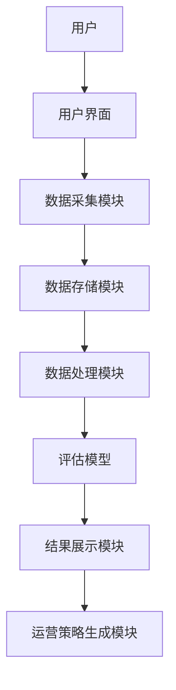
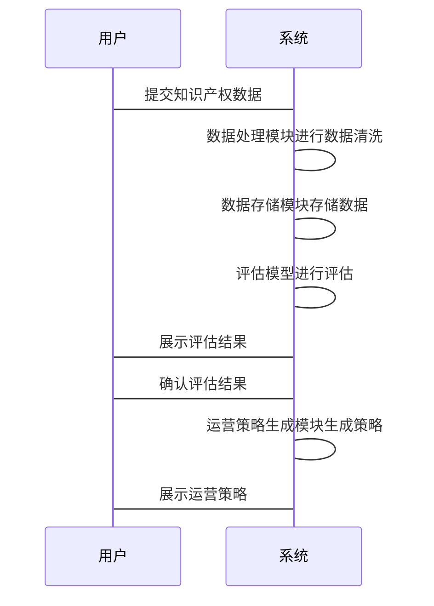

                 


# AI Agent在企业知识产权价值评估与运营中的应用

## 关键词：AI Agent, 知识产权, 价值评估, 企业运营, 机器学习

## 摘要：本文详细探讨了AI Agent在企业知识产权价值评估与运营中的应用，通过分析其核心技术原理、系统架构设计以及实际案例，展示了如何利用AI技术提升知识产权管理的效率和精准度。文章内容包括知识产权的基本概念、AI Agent的核心技术、系统实现、项目实战等部分，旨在为企业提供智能化的知识产权管理解决方案。

---

# 第1章: AI Agent与知识产权基础

## 1.1 AI Agent的基本概念

### 1.1.1 AI Agent的定义与特点

AI Agent（人工智能代理）是指能够感知环境、自主决策并执行任务的智能体。其特点包括：

- **自主性**：无需外部干预，自主完成任务。
- **反应性**：能够实时感知环境变化并做出反应。
- **协作性**：能够与其他Agent或系统协同工作。
- **学习能力**：通过数据和经验不断优化自身算法。

### 1.1.2 企业知识产权的基本概念

知识产权（Intellectual Property，IP）是指依法保护的智力成果，包括专利、商标、版权、商业秘密等。知识产权在企业中的价值体现在以下几个方面：

- **保护创新**：防止他人未经授权使用企业的创新成果。
- **提升竞争力**：通过知识产权保护，增强企业在市场中的竞争力。
- **资产增值**：知识产权是企业的一项重要资产，能够为企业带来经济价值。

### 1.1.3 企业知识产权的价值评估与运营

企业知识产权的价值评估是对其市场价值、法律价值、经济价值等多维度的综合评估。而知识产权的运营则包括知识产权的获取、维护、交易和应用等过程。

---

## 1.2 AI Agent在知识产权评估中的潜力

### 1.2.1 数据驱动的评估方法

AI Agent可以通过大数据分析和机器学习算法，对知识产权的价值进行量化评估。例如，通过分析专利的引用次数、技术领域分布等数据，AI Agent可以预测专利的市场价值。

### 1.2.2 自动化评估流程

传统的知识产权评估过程繁琐且依赖人工经验，而AI Agent可以通过自动化的方式完成数据采集、分析和评估，提高效率和准确性。

### 1.2.3 智能化决策支持

AI Agent可以为企业提供智能化的决策支持，例如在知识产权交易中，AI Agent可以帮助企业评估目标资产的价值，制定合理的交易策略。

---

# 第2章: AI Agent的核心技术原理

## 2.1 多智能体协作机制

### 2.1.1 多智能体系统的基本概念

多智能体系统（Multi-Agent System，MAS）是由多个智能体组成的协作系统。这些智能体可以独立决策，也可以通过协作完成复杂任务。

### 2.1.2 多智能体协作的算法原理

多智能体协作的核心算法包括：

- **分布式计算**：每个智能体负责部分任务，通过通信完成协作。
- **协商算法**：智能体之间通过协商确定任务分配和协作方式。
- **共识算法**：通过共识机制达成一致，例如通过拜占庭容错算法。

### 2.1.3 多智能体系统在知识产权评估中的应用

在知识产权评估中，多智能体系统可以用于分析多个专利的技术关联性，评估其整体价值。例如，通过分析专利之间的引用关系，智能体可以识别出一个技术领域的核心专利。

---

## 2.2 知识图谱与语义理解技术

### 2.2.1 知识图谱的构建与表示

知识图谱是一种结构化的数据表示方式，可以将知识产权相关的实体（如专利、技术领域、发明人等）及其关系表示出来。

### 2.2.2 语义理解技术的核心算法

语义理解技术（Natural Language Processing，NLP）通过分析文本内容，理解其语义含义。常用的算法包括：

- **词嵌入**：将词语转化为向量表示，例如Word2Vec。
- **文本分类**：对文本进行分类，例如分类专利的类型。
- **问答系统**：回答与知识产权相关的问题。

### 2.2.3 知识图谱在知识产权评估中的应用

知识图谱可以用于分析知识产权的关联性，例如分析某一技术领域的专利分布情况，帮助企业识别技术趋势和潜在风险。

---

## 2.3 基于大模型的生成与推理技术

### 2.3.1 大模型的生成机制

大模型（如GPT）通过生成文本的方式，可以用于知识产权相关的文本生成任务，例如生成专利描述、撰写技术报告等。

### 2.3.2 基于大模型的推理算法

大模型通过推理算法，可以分析知识产权的法律风险，例如分析专利的可诉性、侵权风险等。

### 2.3.3 生成与推理技术在知识产权评估中的应用

在知识产权评估中，大模型可以用于分析专利的法律风险，例如通过分析专利的描述和权利要求，判断其是否容易被侵权或被无效。

---

# 第3章: 知识产权价值评估的AI Agent系统架构设计

## 3.1 系统功能需求分析

### 3.1.1 知识产权数据采集与处理

系统需要采集知识产权相关的数据，例如专利申请数据、商标注册数据等，并进行清洗和预处理。

### 3.1.2 知识产权价值评估模型

系统需要构建一个评估模型，用于预测知识产权的价值。模型可以基于机器学习算法，例如支持向量机（SVM）、随机森林（Random Forest）等。

### 3.1.3 知识产权运营策略生成

系统可以根据评估结果，生成知识产权运营策略，例如专利布局、技术路线选择等。

## 3.2 系统架构设计

### 3.2.1 系统整体架构图

以下是系统整体架构图（使用Mermaid）：



### 3.2.2 系统功能模块划分

系统主要功能模块包括：

- **数据采集模块**：采集知识产权相关的数据。
- **数据存储模块**：存储和管理数据。
- **数据处理模块**：对数据进行清洗和预处理。
- **评估模型**：基于机器学习算法，评估知识产权的价值。
- **结果展示模块**：展示评估结果。
- **运营策略生成模块**：根据评估结果生成运营策略。

### 3.2.3 系统接口设计

系统需要定义清晰的接口，例如：

- **数据接口**：与其他系统的数据接口对接，获取知识产权数据。
- **模型接口**：与其他AI模型的接口对接，调用模型进行评估。
- **用户接口**：提供用户友好的界面，方便用户操作。

### 3.2.4 系统交互设计

以下是系统交互设计图（使用Mermaid）：



---

## 3.3 本章小结

通过系统架构设计，我们可以清晰地看到AI Agent在知识产权价值评估中的各个模块及其相互关系。这种设计能够提高系统的可扩展性和可维护性，为后续的实现奠定了基础。

---

# 第4章: 知识产权价值评估的AI Agent实现

## 4.1 知识产权数据的预处理与建模

### 4.1.1 数据采集与清洗

首先，我们需要采集知识产权相关的数据，例如专利申请数据、商标注册数据等。然后，对数据进行清洗，去除重复、错误或不完整的数据。

### 4.1.2 数据建模

在数据建模阶段，我们需要选择合适的机器学习算法。例如，可以使用支持向量机（SVM）进行分类，或者使用随机森林（Random Forest）进行回归分析。

### 4.1.3 模型训练与优化

通过训练数据，我们可以训练出一个评估模型，并通过交叉验证等方法对模型进行优化。

---

## 4.2 知识产权评估模型的实现

### 4.2.1 评估模型的数学模型

以下是一个简单的评估模型，基于线性回归：

$$
y = \beta_0 + \beta_1x_1 + \beta_2x_2 + \ldots + \beta_nx_n
$$

其中，$y$ 是知识产权的价值，$x_i$ 是影响价值的各个因素。

### 4.2.2 算法实现

以下是算法实现的Python代码：

```python
import numpy as np
from sklearn.linear_model import LinearRegression

# 数据准备
X = np.array([[x1, x2, ..., xn], ...])  # 自变量
y = np.array([y1, y2, ..., ym])        # 因变量

# 模型训练
model = LinearRegression()
model.fit(X, y)

# 预测
predictions = model.predict(X)
```

---

## 4.3 本章小结

通过实现评估模型，我们可以对企业知识产权的价值进行预测和评估。这种基于AI Agent的评估方法，不仅提高了评估的效率，还提高了评估的准确性。

---

# 第5章: 项目实战

## 5.1 项目背景

本项目旨在通过AI Agent技术，帮助企业进行知识产权的价值评估与运营。通过实际案例，我们可以看到AI Agent在知识产权管理中的巨大潜力。

## 5.2 项目环境安装

以下是项目环境安装的命令：

```bash
pip install numpy
pip install scikit-learn
pip install mermaid
```

---

## 5.3 项目核心实现

### 5.3.1 数据采集模块实现

以下是数据采集模块的Python代码：

```python
import requests

def fetch_data(url):
    response = requests.get(url)
    return response.json()
```

---

## 5.4 项目案例分析

通过分析一个实际案例，我们可以看到AI Agent在知识产权评估中的应用效果。例如，分析某公司的专利布局，评估其技术风险，并制定相应的运营策略。

---

## 5.5 项目小结

通过项目实战，我们可以看到AI Agent在知识产权评估中的实际应用价值。这种技术可以帮助企业更高效地管理知识产权，提升企业的竞争力。

---

# 第6章: 总结与展望

## 6.1 本章小结

通过本文的详细讲解，我们可以看到AI Agent在企业知识产权价值评估与运营中的巨大潜力。AI Agent可以通过大数据分析、机器学习等技术，提高知识产权管理的效率和精准度。

## 6.2 未来展望

未来，随着AI技术的不断发展，AI Agent在知识产权管理中的应用将更加广泛。例如，通过区块链技术，可以实现知识产权的智能合约管理；通过自然语言处理技术，可以实现知识产权的智能检索和分析。

---

作者：AI天才研究院/AI Genius Institute & 禅与计算机程序设计艺术 /Zen And The Art of Computer Programming

