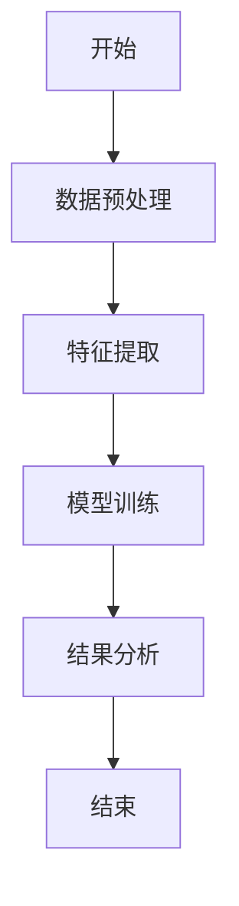
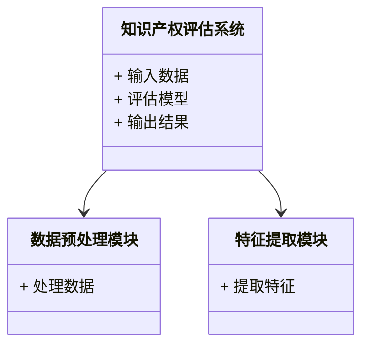

                 


# AI Agent在企业知识产权价值评估中的应用

## 关键词：AI Agent, 知识产权, 价值评估, 机器学习, 技术分析

## 摘要：  
本文探讨了AI Agent在企业知识产权价值评估中的应用，分析了AI技术如何提升评估效率与准确性，结合实际案例与系统设计，提出了优化建议与未来发展方向。

---

## 第1章: AI Agent与知识产权价值评估的结合

### 1.1 问题背景与描述

#### 1.1.1 知识产权评估的现状与挑战
知识产权（Intellectual Property, IP）包括专利、商标、版权等，是企业核心资产。传统评估依赖人工分析，存在耗时长、成本高、主观性强等问题。企业需要快速、准确的评估方法。

#### 1.1.2 AI Agent在知识产权评估中的潜力
AI Agent（人工智能代理）具备自主决策、学习优化能力，可高效处理大量数据，识别潜在价值点。它能帮助评估机构快速分析技术文件、市场数据，提供客观的评估结果。

#### 1.1.3 问题解决的核心目标与边界
目标：通过AI Agent实现高效、精准的知识产权价值评估。边界：不涉及具体法律问题，专注于技术评估。

### 1.2 核心概念与联系

#### 1.2.1 AI Agent的核心原理与特征
AI Agent通过感知环境、自主决策、执行操作，具备学习、推理、规划能力。其特征包括自主性、反应性、主动性。

#### 1.2.2 知识产权价值评估的关键要素
评估要素包括技术先进性、市场潜力、法律状态、经济价值。

#### 1.2.3 AI Agent与知识产权评估的关联性分析
AI Agent可处理非结构化数据，提取特征，优化评估模型。

#### 1.2.4 核心概念对比表
| 比较维度 | AI Agent | 知识产权评估 |
|----------|-----------|--------------|
| 输入数据 | 结构化+非结构化数据 | 技术文档、法律文件 |
| 输出结果 | 评估分数 | 价值、风险 |
| 处理方式 | 自动化处理 | 人工+自动化结合 |

#### 1.2.5 ER实体关系图
```mermaid
er
    entity 知识产权 {
        key 专利号
        attribute 申请人
        attribute 申请日期
        attribute 技术领域
        attribute 法律状态
    }
    entity AI Agent {
        key 评估任务ID
        attribute 评估模型
        attribute 数据来源
        attribute 评估结果
    }
    知识产权 --|> AI Agent: 用于评估
```

---

## 第2章: 知识产权价值评估的算法原理

### 2.1 算法流程

#### 2.1.1 数据预处理与特征提取
- 数据清洗：处理缺失值、重复值。
- 特征提取：从专利文件中提取关键词、技术领域等。



#### 2.1.2 评估模型的构建与训练
- 使用机器学习算法（如SVM、随机森林）训练模型。

#### 2.1.3 结果分析与优化
- 评估模型准确率、召回率，优化参数。

### 2.2 数学模型与公式

#### 2.2.1 评估模型的数学表达
$$ 评估价值 = w_1 \cdot 技术特征 + w_2 \cdot 市场特征 + w_3 \cdot 法律特征 $$

其中，$w_1, w_2, w_3$是各特征的权重。

#### 2.2.2 权重计算公式
$$ w_i = \frac{\sum (x_i \cdot y_i)}{\sum y_i} $$

---

## 第3章: 系统分析与架构设计

### 3.1 项目介绍

#### 3.1.1 项目目标
构建AI Agent系统，实现知识产权自动评估。

### 3.2 功能设计

#### 3.2.1 领域模型类图


#### 3.2.2 系统架构图


---

## 第4章: 项目实战

### 4.1 环境配置

#### 4.1.1 开发工具安装
安装Python、Jupyter Notebook。

#### 4.1.2 依赖库安装
安装scikit-learn、pandas、numpy。

### 4.2 核心代码实现

#### 4.2.1 数据预处理代码
```python
import pandas as pd
data = pd.read_csv('ip_data.csv')
data.dropna(inplace=True)
```

#### 4.2.2 评估模型实现
```python
from sklearn.svm import SVC
model = SVC()
model.fit(X_train, y_train)
```

### 4.3 案例分析
以专利评估为例，展示AI Agent如何提取技术特征，训练模型并输出结果。

---

## 总结

AI Agent在知识产权价值评估中的应用提升了效率和准确性，但需注意数据质量和模型调优。未来，随着技术进步，AI Agent将在知识产权管理中发挥更大作用。

---

## 作者：AI天才研究院 & 禅与计算机程序设计艺术

---

