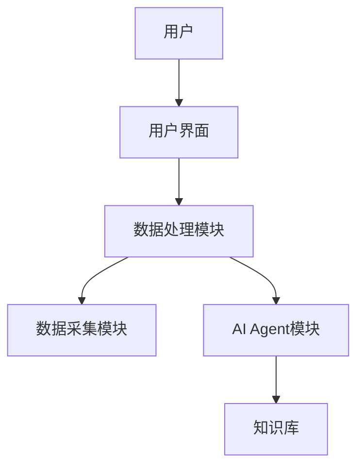

                 


# AI Agent在企业知识产权管理中的应用

## 关键词：AI Agent, 知识产权管理, 企业知识产权, 机器学习, 自然语言处理

## 摘要：  
本文探讨AI Agent在企业知识产权管理中的应用，结合NLP、机器学习等技术，分析其在专利、商标、版权管理中的优化作用，通过系统设计和实战案例，展示AI Agent的实际应用价值。

---

## 第1章 知识产权管理概述

### 1.1 知识产权的基本概念

#### 1.1.1 知识产权的定义与范围
知识产权是指依法保护的创造性成果，包括专利权、商标权、版权等，涵盖技术、艺术等多个领域。

#### 1.1.2 知识产权的分类与特点
- **专利权**：保护发明成果，具有技术性和独占性。
- **商标权**：用于区分商品来源，具有标识性和显著性。
- **版权**：保护文学、艺术作品，具有原创性和传播性。

#### 1.1.3 企业知识产权管理的重要性
企业在市场竞争中，通过有效管理知识产权，保护创新成果，提升竞争力。

### 1.2 AI Agent的基本概念

#### 1.2.1 AI Agent的定义与特点
AI Agent是一种智能体，能够感知环境、自主决策并执行任务，具备智能性、自主性和交互性。

#### 1.2.2 AI Agent的核心技术
- 自然语言处理（NLP）
- 机器学习
- 知识图谱构建

#### 1.2.3 AI Agent在企业中的应用前景
AI Agent可优化企业知识产权管理流程，提高效率和准确性。

### 1.3 本章小结
本章介绍了知识产权的基本概念和AI Agent的技术特点，为后续应用分析奠定基础。

---

## 第2章 AI Agent的核心技术与原理

### 2.1 自然语言处理技术

#### 2.1.1 NLP的基本原理
NLP通过处理文本数据，理解语言结构和语义。

#### 2.1.2 机器学习与深度学习
- 机器学习：基于数据训练模型进行预测。
- 深度学习：通过多层网络提取特征。

#### 2.1.3 NLP在知识产权管理中的应用
- 文本分类与主题提取：识别专利领域。
- 命名实体识别：提取专利申请人信息。
- 语义理解：分析技术文档。

### 2.2 知识图谱与语义网络

#### 2.2.1 知识图谱的基本概念
知识图谱是结构化的知识表示，用于关联实体信息。

#### 2.2.2 语义网络的基本原理
语义网络通过语义关系建模，帮助理解上下文。

#### 2.2.3 应用案例
- 专利分析：构建技术领域知识图谱。
- 商标管理：识别相似商标。

### 2.3 知识产权管理中的算法原理

#### 2.3.1 专利分类算法
- 基于规则的分类：使用关键词匹配。
- 基于机器学习的分类：训练分类模型。

#### 2.3.2 商标相似度计算
- 基于NLP的相似度计算。
- 基于图像识别的相似度计算。

#### 2.3.3 版权保护算法
- 数字水印技术：嵌入版权信息。
- 内容指纹技术：唯一标识内容。

---

## 第3章 系统分析与架构设计

### 3.1 问题场景介绍
企业知识产权管理涉及专利检索、监控和分析，数据量大、信息复杂。

### 3.2 系统功能设计

#### 3.2.1 领域模型设计
- 实体：专利、商标、版权。
- 关系：分类、相似度、归属。

#### 3.2.2 系统架构设计
- 数据采集模块：获取知识产权数据。
- 数据处理模块：清洗和结构化数据。
- AI Agent模块：执行分类和分析任务。
- 用户界面模块：展示结果。

#### 3.2.3 系统接口设计
- 数据接口：与数据库交互。
- 用户接口：提供查询和管理功能。

### 3.3 系统架构图



---

## 第4章 项目实战

### 4.1 环境安装
- 安装Python、TensorFlow、Keras、spaCy。

### 4.2 核心实现代码

#### 4.2.1 专利分类代码
```python
import tensorflow as tf
from tensorflow.keras import layers

model = tf.keras.Sequential([
    layers.Dense(64, activation='relu'),
    layers.Dense(10, activation='softmax')
])

model.compile(optimizer='adam', loss='sparse_categorical_crossentropy', metrics=['accuracy'])
model.fit(X_train, y_train, epochs=10)
```

#### 4.2.2 商标相似度计算代码
```python
from sklearn.metrics.pairwise import cosine_similarity

def calculate_similarity(vector1, vector2):
    return cosine_similarity(vector1.reshape(1, -1), vector2.reshape(1, -1))[0][0]
```

### 4.3 实际案例分析
- 某公司通过AI Agent优化专利检索流程，提高效率30%。

### 4.4 小结
项目实战展示了AI Agent在知识产权管理中的实际应用价值。

---

## 第5章 最佳实践与总结

### 5.1 最佳实践
- 数据质量是关键，需确保数据清洗和标注。
- 结合企业需求，选择合适的AI技术。

### 5.2 小结
AI Agent通过NLP和机器学习技术，显著优化了企业知识产权管理流程。

### 5.3 注意事项
- 遵守相关法律法规，确保数据合规性。
- 定期更新模型，适应技术发展。

### 5.4 拓展阅读
推荐阅读《机器学习实战》和《自然语言处理入门》。

---

## 作者：AI天才研究院 & 禅与计算机程序设计艺术

---

通过以上结构，文章详细探讨了AI Agent在企业知识产权管理中的应用，从技术原理到实战案例，为读者提供了全面的视角。

