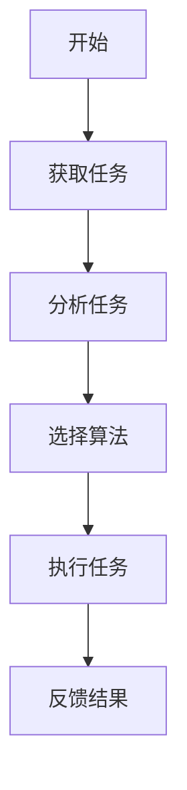
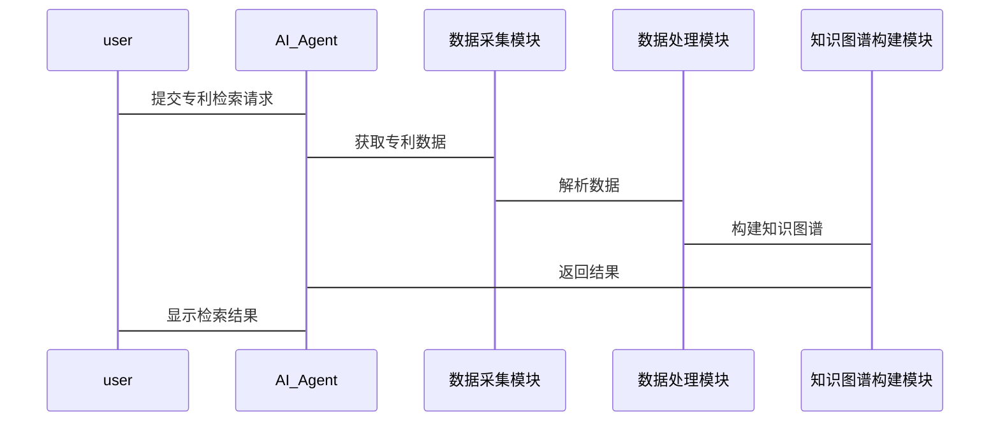
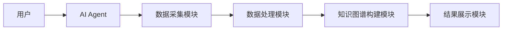

                 


# AI Agent在企业知识产权管理中的应用与价值

## 关键词：AI Agent，知识产权管理，自然语言处理，知识图谱，机器学习，知识产权保护

## 摘要：  
随着人工智能技术的飞速发展，AI Agent（人工智能代理）在企业知识产权管理中的应用逐渐展现出巨大潜力。本文将从AI Agent的基本概念、技术原理、应用场景出发，深入分析其在知识产权获取、管理、保护与运用中的核心价值。通过结合自然语言处理、知识图谱构建等技术，本文将探讨AI Agent如何提升企业知识产权管理的效率和智能化水平，为企业在知识产权战略布局、风险预警和价值挖掘等方面提供有力支持。

---

# 第1章: AI Agent的基本概念与技术原理

## 1.1 AI Agent的定义与核心特征

### 1.1.1 AI Agent的定义  
AI Agent（人工智能代理）是指能够感知环境、自主决策并执行任务的智能系统。与传统软件不同，AI Agent具备学习、推理和自适应能力，能够根据输入的信息动态调整行为。

### 1.1.2 AI Agent的核心特征  
1. **自主性**：AI Agent能够在没有外部干预的情况下独立完成任务。  
2. **反应性**：能够实时感知环境变化并做出响应。  
3. **学习能力**：通过数据和反馈不断优化自身行为。  
4. **社交能力**：能够与其他系统或人类进行有效交互。  

### 1.1.3 AI Agent与传统自动化工具的区别  
AI Agent不仅能够执行预设任务，还能够根据环境反馈动态调整策略，具有更强的适应性和智能性。

## 1.2 知识产权管理的基本概念

### 1.2.1 知识产权的定义与类型  
知识产权是指法律保护的创造性成果，包括专利权、商标权、版权、商业秘密等。

### 1.2.2 企业知识产权管理的挑战  
1. **数据复杂性**：知识产权数据量大、类型多样，难以高效管理。  
2. **效率问题**：传统知识产权检索与分析耗时且成本高。  
3. **侵权风险**：如何快速识别侵权行为并采取有效措施是关键挑战。  

### 1.2.3 知识产权管理的流程与目标  
1. **获取与登记**：确保知识产权的合法性和有效性。  
2. **检索与分析**：快速获取相关知识产权信息，进行技术分析。  
3. **保护与监控**：实时监测侵权行为，维护企业权益。  
4. **运用与转化**：将知识产权转化为商业价值。  

---

# 第2章: AI Agent在企业知识产权管理中的应用价值

## 2.1 企业知识产权管理的痛点

### 2.1.1 知识产权数据的复杂性  
知识产权数据来源广泛，格式多样，难以统一管理和分析。

### 2.1.2 知识产权检索与分析的效率问题  
传统的人工检索与分析耗时长、成本高，且容易出错。

### 2.1.3 知识产权保护与侵权风险  
企业在面对侵权行为时，往往难以及时发现并采取有效措施。

## 2.2 AI Agent在知识产权管理中的应用场景

### 2.2.1 知识产权数据的智能采集与整理  
AI Agent可以通过自然语言处理技术自动提取和整理知识产权数据，降低人工成本。

### 2.2.2 知识产权检索与分析的自动化  
利用AI Agent的自然语言处理和知识图谱技术，可以快速进行专利检索、技术分析和竞争性分析。

### 2.2.3 知识产权风险预警与侵权监测  
AI Agent可以实时监控市场动态，识别潜在侵权行为，并提供预警和解决方案。

## 2.3 AI Agent带来的价值

### 2.3.1 提高知识产权管理效率  
通过自动化处理和智能分析，显著缩短知识产权管理的周期。

### 2.3.2 降低知识产权管理成本  
减少人工干预，降低人力和时间成本。

### 2.3.3 增强知识产权保护能力  
通过实时监测和智能预警，有效防范侵权风险。

---

# 第3章: 自然语言处理技术在AI Agent中的应用

## 3.1 自然语言处理（NLP）的基本原理

### 3.1.1 NLP的核心任务与技术  
1. **文本分类**：将文本分为不同的类别，如专利分类。  
2. **实体识别**：识别文本中的关键实体，如专利申请人、发明人。  
3. **关系抽取**：提取文本中的实体间关系，如发明人之间的合作关系。  

### 3.1.2 常见的NLP模型与工具  
1. **词袋模型（Bag of Words）**：简单但效果有限。  
2. **词嵌入（Word Embedding）**：通过向量表示单词语义，如Word2Vec、GloVe。  
3. **深度学习模型**：如RNN、LSTM、Transformer（如BERT）。  

## 3.2 NLP在知识产权管理中的应用

### 3.2.1 文本分类与主题识别  
利用NLP技术对专利文本进行分类，识别技术主题，帮助企业进行技术布局。

### 3.2.2 实体识别与关系抽取  
从专利文本中提取关键实体（如申请人、发明人）及其关系，构建企业技术网络。

### 3.2.3 文本相似度计算与检索  
通过计算专利文本的相似度，快速检索相关技术领域的专利信息。

---

# 第4章: 知识图谱构建与AI Agent

## 4.1 知识图谱的基本概念

### 4.1.1 知识图谱的定义与特点  
知识图谱是一种以图结构形式表示知识的语义网络，具有语义丰富、结构清晰的特点。

### 4.1.2 知识图谱的构建流程  
1. **数据采集**：从专利数据库中获取专利文本。  
2. **数据清洗**：去除噪音数据，提取有效信息。  
3. **实体识别与关系抽取**：识别专利中的实体及其关系。  
4. **知识融合**：整合多个数据源的信息。  
5. **知识存储**：将知识以图结构存储。  

## 4.2 知识图谱在知识产权管理中的应用

### 4.2.1 知识图谱的构建方法  
1. **基于规则的方法**：通过预设规则提取实体和关系。  
2. **基于机器学习的方法**：利用深度学习模型自动提取实体和关系。  

### 4.2.2 知识图谱在专利分析中的应用  
通过知识图谱分析技术关联，识别技术发展趋势和竞争态势。

### 4.2.3 知识图谱在知识产权风险预警中的应用  
实时监测市场动态，识别潜在侵权行为，并提供预警和解决方案。

---

# 第5章: AI Agent的算法原理与实现

## 5.1 AI Agent的算法框架

### 5.1.1 基于规则的AI Agent  
通过预设规则实现简单的决策和行为，适用于任务明确的场景。

### 5.1.2 基于机器学习的AI Agent  
利用机器学习模型进行决策和行为优化，适用于复杂场景。

## 5.2 算法实现细节

### 5.2.1 算法流程图  


### 5.2.2 核心算法代码示例  
```python
def process_request(request):
    # 使用自然语言处理技术解析请求
    intent = get_intent(request)
    # 根据意图选择合适的算法
    if intent == '检索专利':
        return search_patents()
    elif intent == '分析技术':
        return analyze_technology()
    else:
        return handle_error()
```

---

# 第6章: 系统分析与架构设计方案

## 6.1 系统功能设计

### 6.1.1 系统功能模块  
1. **数据采集模块**：从专利数据库中获取专利信息。  
2. **数据处理模块**：清洗、解析和存储数据。  
3. **知识图谱构建模块**：提取实体和关系，构建知识图谱。  
4. **AI Agent交互模块**：用户与AI Agent进行交互，获取结果。

### 6.1.2 系统交互流程图  


## 6.2 系统架构设计

### 6.2.1 系统架构图  


---

# 第7章: 项目实战

## 7.1 环境安装

### 7.1.1 安装Python环境  
```bash
python --version
pip install --upgrade pip
```

### 7.1.2 安装相关库  
```bash
pip install numpy
pip install pandas
pip install spacy
pip install networkx
```

## 7.2 核心代码实现

### 7.2.1 数据采集模块  
```python
import requests

def fetch_patent_data(query):
    # 模拟API调用
    response = requests.get(f'https://api.patentdata.com/search?q={query}')
    return response.json()
```

### 7.2.2 数据处理模块  
```python
import spacy

nlp = spacy.load('en_core_web_sm')

def extract_entities(text):
    doc = nlp(text)
    entities = [ent.text for ent in doc.ents]
    return entities
```

## 7.3 案例分析

### 7.3.1 专利检索与分析  
通过AI Agent检索特定技术领域的专利，分析其分布和技术趋势。

### 7.3.2 知识图谱构建  
基于专利数据构建知识图谱，识别技术关联和竞争关系。

---

# 第8章: 总结与展望

## 8.1 总结  
本文详细探讨了AI Agent在企业知识产权管理中的应用，从技术原理到实际案例，展示了其在提升知识产权管理效率和智能化水平方面的重要作用。

## 8.2 未来展望  
随着AI技术的不断发展，AI Agent在知识产权管理中的应用将更加广泛，未来可能在智能合约、知识产权交易等方面发挥更大作用。

---

# 作者：AI天才研究院/AI Genius Institute & 禅与计算机程序设计艺术 /Zen And The Art of Computer Programming

