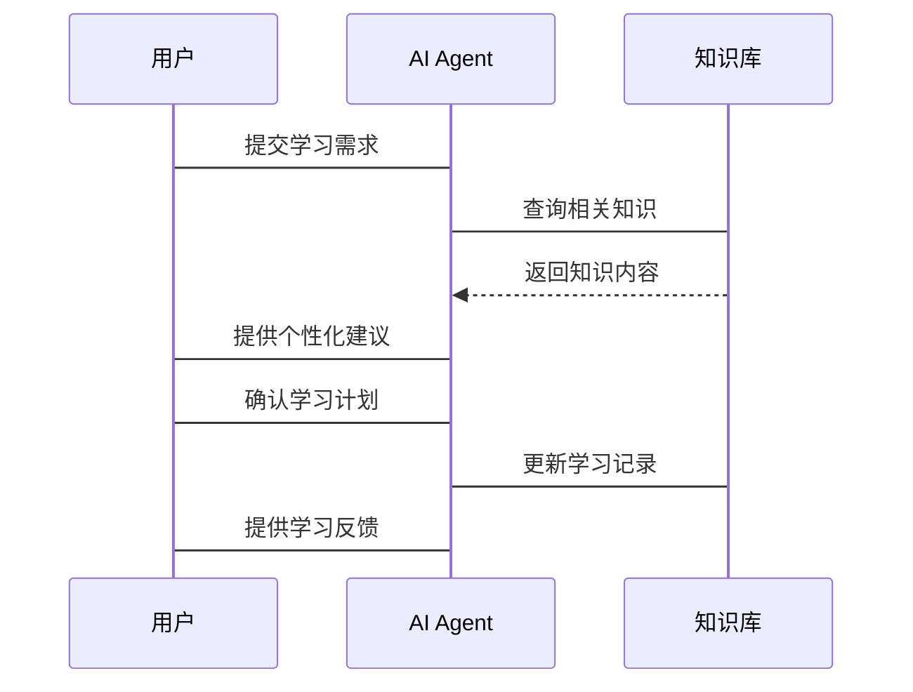

                 


# AI Agent在企业知识付费与在线教育中的应用

> 关键词：AI Agent, 知识付费, 在线教育, 个性化学习, 自然语言处理, 知识图谱, 自适应学习

> 摘要：本文探讨AI Agent在企业知识付费与在线教育中的应用，从技术原理到实际应用，详细分析其如何提升学习效率和个性化体验，推动教育模式的革新。

---

# 第1章: AI Agent的基本概念与背景介绍

## 1.1 什么是AI Agent
### 1.1.1 AI Agent的定义
AI Agent（人工智能代理）是一种能够感知环境、理解用户需求并采取行动以实现目标的智能实体。它通过自然语言处理、机器学习和知识图谱等技术，提供智能化的服务和解决方案。

### 1.1.2 AI Agent的核心特征
| 特征 | 描述 |
|------|------|
| 智能性 | 能够理解上下文并做出决策 |
| 适应性 | 根据反馈调整行为和策略 |
| 交互性 | 支持多种交互方式（文本、语音、图像） |
| 学习性 | 通过数据反馈不断优化性能 |

### 1.1.3 AI Agent的分类与应用场景
AI Agent可以分为 **规则驱动型**、**基于机器学习型** 和 **混合型** 三种类型。在知识付费和在线教育领域，混合型AI Agent最为适用，因为它结合了规则和机器学习的优势。

---

## 1.2 企业知识付费与在线教育的现状
### 1.2.1 知识付费的兴起与发展趋势
知识付费的兴起源于信息过载和碎片化学习需求。用户希望通过付费获取高质量的知识内容，而AI Agent可以帮助他们筛选和推荐个性化内容。

### 1.2.2 在线教育的市场规模与痛点分析
在线教育市场规模庞大，但存在以下痛点：
- 学习资源繁多，难以找到适合的学习路径。
- 缺乏个性化的学习体验。
- 教学效果难以量化和优化。

### 1.2.3 传统教育模式与AI Agent的结合潜力
AI Agent可以通过个性化推荐、自适应学习和实时反馈，优化传统教育模式，提高学习效率和用户满意度。

---

## 1.3 AI Agent在知识付费与在线教育中的应用价值
### 1.3.1 提升学习效率的潜力
AI Agent可以分析用户的学习行为和知识盲点，推荐最优的学习资源和路径。

### 1.3.2 个性化学习体验的可能性
通过自然语言处理和机器学习，AI Agent可以理解用户的学习风格和偏好，提供个性化的学习建议和内容。

### 1.3.3 优化知识付费模式的可能方向
AI Agent可以帮助企业精准匹配用户需求，降低获客成本，同时提高用户粘性和满意度。

---

## 1.4 本章小结
本章介绍了AI Agent的基本概念和分类，并分析了其在知识付费和在线教育中的应用背景和潜力。通过AI Agent，企业可以更高效地提供个性化知识服务，优化学习体验。

---

# 第2章: AI Agent的核心概念与技术原理

## 2.1 AI Agent的核心概念
### 2.1.1 AI Agent的定义与属性
AI Agent的核心属性包括：**智能性**、**适应性**、**交互性** 和 **学习性**。

### 2.1.2 AI Agent的决策机制与行为模式
AI Agent的决策机制通常包括以下步骤：
1. **感知环境**：通过传感器或API获取数据。
2. **理解需求**：使用NLP技术解析用户意图。
3. **制定策略**：基于知识库和算法生成行动计划。
4. **执行行动**：通过API或用户界面与系统交互。
5. **反馈优化**：根据用户反馈调整策略。

### 2.1.3 AI Agent与知识付费和在线教育的结合点
AI Agent可以通过以下方式与知识付费和在线教育结合：
- **个性化推荐**：根据用户需求推荐学习资源。
- **自适应学习**：动态调整学习路径。
- **实时反馈**：提供学习效果评估和改进建议。

---

## 2.2 AI Agent的关键技术
### 2.2.1 自然语言处理（NLP）技术
NLP技术是AI Agent实现智能交互的基础。通过NLP，AI Agent可以理解用户的文本输入并生成自然语言回复。

### 2.2.2 机器学习与深度学习算法
机器学习算法（如协同过滤、聚类）和深度学习模型（如BERT、GPT）被广泛应用于AI Agent的知识推荐和内容生成。

### 2.2.3 知识图谱与语义理解
知识图谱通过构建结构化的知识网络，帮助AI Agent理解上下文并进行推理。

---

## 2.3 AI Agent的工作原理
### 2.3.1 用户需求识别与解析
AI Agent通过NLP技术解析用户的输入，提取关键信息（如主题、关键词、情感倾向）。

### 2.3.2 知识匹配与推荐算法
基于用户的画像和知识图谱，AI Agent使用协同过滤或基于内容的推荐算法，向用户推荐个性化内容。

### 2.3.3 个性化学习路径规划
AI Agent根据用户的学习历史和知识盲点，动态调整学习计划，确保学习目标的达成。

---

## 2.4 本章小结
本章详细讲解了AI Agent的核心概念和关键技术，分析了其在知识付费和在线教育中的工作原理。通过这些技术，AI Agent能够实现智能化的知识服务。

---

# 第3章: AI Agent在知识付费与在线教育中的技术实现

## 3.1 知识付费场景下的AI Agent实现
### 3.1.1 知识内容的结构化处理
知识内容需要被结构化存储，以便AI Agent能够快速检索和推荐。

### 3.1.2 用户需求的语义分析
通过NLP技术，AI Agent可以深入理解用户的需求，并生成相应的反馈。

### 3.1.3 知识内容的个性化推荐算法
基于用户的画像和行为数据，AI Agent使用协同过滤算法推荐相关内容。

---

## 3.2 在线教育场景下的AI Agent实现
### 3.2.1 学习者画像与需求分析
通过收集学习者的行为数据和学习记录，AI Agent可以构建学习者画像，分析其学习需求。

### 3.2.2 个性化学习路径设计
AI Agent根据学习者的需求和知识盲点，动态调整学习路径，确保学习目标的实现。

### 3.2.3 自适应学习资源推荐
基于学习者的学习进度和知识掌握情况，AI Agent推荐适合的资源（如视频、文章、练习题）。

---

## 3.3 AI Agent的多模态交互设计
### 3.3.1 文本交互与语音交互
AI Agent支持多种交互方式，包括文本对话和语音指令，提升用户体验。

### 3.3.2 图像与视频内容的处理与反馈
AI Agent可以通过图像识别技术分析视频内容，并生成相应的反馈和建议。

### 3.3.3 多模态数据的融合与分析
通过融合文本、语音、图像等多种数据，AI Agent可以更全面地理解用户需求并提供精准的服务。

---

## 3.4 本章小结
本章详细讲解了AI Agent在知识付费和在线教育中的技术实现，包括知识内容的结构化处理、个性化推荐算法和多模态交互设计。

---

# 第4章: AI Agent在知识付费与在线教育中的系统设计

## 4.1 系统架构与功能设计
### 4.1.1 系统架构设计
AI Agent系统的典型架构包括 **前端交互层**、**后端业务逻辑层** 和 **数据存储层**。

### 4.1.2 系统功能模块
- 用户身份验证模块
- 知识内容管理模块
- 个性化推荐模块
- 学习效果评估模块

### 4.1.3 系统接口设计
系统接口包括：
- 用户信息接口（API）
- 内容推荐接口（API）
- 学习效果反馈接口（API）

---

## 4.2 系统交互设计
### 4.2.1 用户与AI Agent的交互流程
1. 用户输入需求（文本或语音）。
2. AI Agent解析需求并生成反馈。
3. 用户确认或调整需求。
4. AI Agent执行相应操作并返回结果。

### 4.2.2 系统交互的流程图


---

## 4.3 本章小结
本章详细讲解了AI Agent在知识付费和在线教育中的系统设计，包括架构、功能模块和交互流程。

---

# 第5章: 项目实战

## 5.1 环境配置
### 5.1.1 开发工具安装
- Python 3.8+
- TensorFlow 2.0+
- Numpy 1.20+
- Jupyter Notebook

### 5.1.2 知识库构建
使用爬虫技术从公开知识库中抓取数据，并进行清洗和结构化处理。

---

## 5.2 核心代码实现
### 5.2.1 自然语言处理代码
```python
import tensorflow as tf
from tensorflow.keras import layers

# 定义模型
model = tf.keras.Sequential([
    layers.Embedding(input_dim=10000, output_dim=16),
    layers.SimpleRNN(units=16),
    layers.Dense(1, activation='sigmoid')
])
model.compile(optimizer='adam', loss='binary_crossentropy', metrics=['accuracy'])
```

### 5.2.2 推荐算法实现
```python
def collaborative_filtering(user_matrix, item_matrix):
    # 计算相似性
    similarities = user_matrix.dot(item_matrix.T)
    # 返回推荐结果
    return similarities.max(axis=1)
```

---

## 5.3 案例分析与总结
### 5.3.1 案例分析
通过实际案例分析，展示AI Agent如何在知识付费和在线教育中提供个性化服务。

### 5.3.2 项目总结
总结项目实现的关键点和经验教训，提出改进建议。

---

# 第6章: 总结与展望

## 6.1 总结
AI Agent通过智能化的知识推荐和个性化学习路径设计，显著提升了知识付费和在线教育的用户体验和效果。

## 6.2 未来展望
随着NLP和机器学习技术的不断进步，AI Agent将在知识付费和在线教育中发挥更大的作用，推动教育模式的全面革新。

---

# 作者：AI天才研究院/AI Genius Institute & 禅与计算机程序设计艺术 /Zen And The Art of Computer Programming

