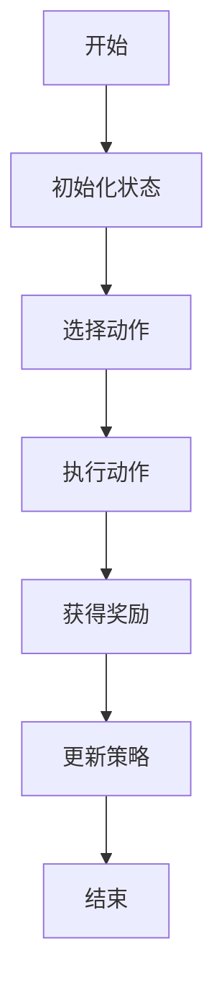
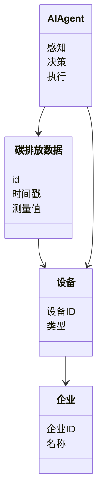
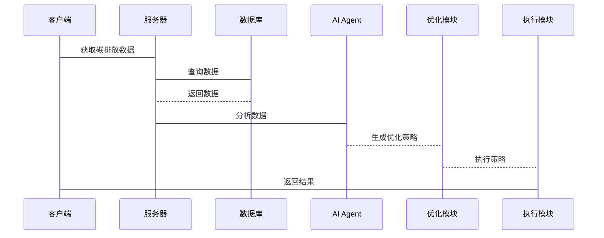

                 


# AI Agent在企业碳排放管理与环保合规中的应用

## 关键词：AI Agent，碳排放管理，环保合规，企业应用，人工智能，可持续发展

## 摘要：  
随着全球对环境保护和碳减排的关注不断增加，企业面临着越来越严格的碳排放管理和环保合规要求。AI Agent（人工智能代理）作为一种智能化的解决方案，正在被广泛应用于企业碳排放管理与环保合规中。本文将详细探讨AI Agent在这一领域的应用背景、核心原理、算法实现、系统架构设计、项目实战案例以及最佳实践。通过分析AI Agent如何帮助企业优化碳排放管理流程、提升环保合规效率，本文为企业提供了一套基于AI技术的环保管理解决方案。

---

# 第一部分：背景与概述

## 第1章：AI Agent与环保合规的背景

### 1.1 问题背景

#### 1.1.1 碳排放与环保合规的重要性
全球气候变化问题日益严重，各国政府和企业纷纷制定严格的碳排放标准。企业需要通过有效的碳排放管理，降低碳足迹，实现可持续发展目标。环保合规不仅是法律要求，也是企业社会责任的重要体现。

#### 1.1.2 企业面临的碳排放管理挑战
- 数据采集复杂：企业需要收集来自不同设备和系统的碳排放数据。
- 数据分析难度大：海量数据的分析需要高效的方法。
- 决策优化困难：如何在复杂的约束条件下优化碳排放。

#### 1.1.3 AI技术在环保领域的潜力
AI技术可以通过数据分析、预测和优化，帮助企业更高效地管理碳排放，降低合规成本。

### 1.2 问题描述

#### 1.2.1 碳排放管理的复杂性
碳排放管理涉及多个环节，包括数据采集、分析、预测和优化。传统方法效率低下，难以应对复杂的环境要求。

#### 1.2.2 环保合规的法律要求
各国政府制定严格的环保法规，企业需要满足这些法规，否则将面临罚款和声誉损失。

#### 1.2.3 传统方法的局限性
传统方法依赖人工操作，效率低，且容易出错，难以满足实时性和精准性的要求。

### 1.3 解决方案

#### 1.3.1 引入AI Agent的优势
AI Agent能够实时采集、分析数据，并自动优化碳排放管理策略，显著提高效率和准确性。

#### 1.3.2 AI Agent在碳排放管理中的作用
AI Agent可以通过预测和优化帮助企业减少碳排放，降低合规成本。

#### 1.3.3 技术与业务的结合
AI Agent将先进的AI技术与企业碳排放管理需求相结合，提供智能化的解决方案。

### 1.4 AI Agent的边界与外延

#### 1.4.1 应用范围与限制
AI Agent的应用范围包括碳排放监测、预测和优化，但其局限性在于依赖数据质量和模型准确性。

#### 1.4.2 与其他技术的关系
AI Agent可以与物联网、大数据等技术结合，形成更强大的解决方案。

#### 1.4.3 未来发展的可能性
未来，AI Agent可能会更加智能化，具备自适应和自学习能力，进一步提升碳排放管理效率。

### 1.5 核心概念结构与要素

#### 1.5.1 AI Agent的基本组成
- 感知层：负责数据采集。
- 决策层：负责数据分析和决策。
- 执行层：负责策略执行。

#### 1.5.2 碳排放管理的流程
- 数据采集
- 数据分析
- 预测与优化
- 策略执行

#### 1.5.3 环保合规的关键要素
- 数据准确性
- 模型有效性
- 策略合规性

---

# 第二部分：AI Agent的核心原理

## 第2章：AI Agent的基本原理

### 2.1 AI Agent的定义与特点

#### 2.1.1 定义与分类
AI Agent是一种智能代理，能够感知环境、做出决策并执行操作。它可以分为简单反射式、基于模型的反射式、目标驱动式和效用驱动式等类型。

#### 2.1.2 核心特点对比表

| 特性             | 简单反射式AI Agent | 基于模型的AI Agent | 目标驱动式AI Agent | 效用驱动式AI Agent |
|------------------|---------------------|--------------------|--------------------|--------------------|
| 决策方式         | 基于条件反射       | 基于模型推理       | 基于目标导向       | 基于效用最大化     |
| 数据依赖         | 低                  | 高                 | 中                 | 高                 |
| 适应性           | 低                  | 高                 | 高                 | 高                 |

#### 2.1.3 ER实体关系图
```mermaid
er
    %% ER实体关系图
    entity(碳排放数据) {
        id
        时间戳
        测量值
    }
    entity(设备) {
        设备ID
        类型
    }
    entity(企业) {
        企业ID
        名称
    }
    relationship(属于) {
        设备 -> 碳排放数据
        企业 -> 设备
    }
```

---

# 第三部分：算法原理讲解

## 第3章：算法原理与实现

### 3.1 算法原理

#### 3.1.1 强化学习算法
- 使用强化学习训练AI Agent，使其能够在复杂的环境中做出最优决策。

#### 3.1.2 算法流程


#### 3.1.3 数学模型与公式
- 状态空间：$S$
- 动作空间：$A$
- 奖励函数：$R(s, a)$
- 策略函数：$\pi(a|s)$

#### 3.1.4 示例代码
```python
class AIAgent:
    def __init__(self):
        self.model = self.build_model()
        self.memory = []

    def build_model(self):
        # 构建强化学习模型
        pass

    def perceive(self, state):
        # 状态感知
        pass

    def decide(self, state):
        # 决策
        pass

    def act(self, action):
        # 执行动作
        pass
```

---

# 第四部分：系统分析与架构设计方案

## 第4章：系统架构与设计

### 4.1 问题场景介绍

#### 4.1.1 企业碳排放管理场景
企业需要实时监测碳排放数据，分析趋势，并制定优化策略。

### 4.2 项目介绍

#### 4.2.1 项目目标
开发一个基于AI Agent的碳排放管理系统，帮助企业实现高效管理。

### 4.3 系统功能设计

#### 4.3.1 领域模型


#### 4.3.2 系统架构设计


### 4.4 系统接口设计

#### 4.4.1 API接口
- 数据采集接口：`GET /api/data`
- 数据分析接口：`POST /api/analyze`
- 策略执行接口：`POST /api/execute`

### 4.5 系统交互设计

#### 4.5.1 交互流程


---

# 第五部分：项目实战

## 第5章：项目实战与案例分析

### 5.1 环境安装

#### 5.1.1 安装Python
```bash
python --version
pip install --upgrade pip
```

#### 5.1.2 安装依赖库
```bash
pip install numpy pandas scikit-learn
```

### 5.2 系统核心实现

#### 5.2.1 数据采集模块
```python
import pandas as pd

def collect_data():
    # 模拟数据采集
    data = pd.DataFrame({
        '时间戳': ['2023-10-01 10:00:00', '2023-10-01 10:01:00', '2023-10-01 10:02:00'],
        '测量值': [100, 98, 102]
    })
    return data
```

#### 5.2.2 数据分析模块
```python
from sklearn.linear_model import LinearRegression

def analyze_data(data):
    model = LinearRegression()
    model.fit(data[['时间戳']], data['测量值'])
    return model
```

#### 5.2.3 策略执行模块
```python
def execute_strategy(model, data):
    # 模拟策略执行
    predictions = model.predict(data[['时间戳']])
    return predictions
```

### 5.3 案例分析

#### 5.3.1 实际案例分析
通过实际数据展示AI Agent如何优化碳排放管理，减少企业碳足迹。

#### 5.3.2 案例小结
AI Agent的应用显著提高了碳排放管理的效率和准确性。

---

# 第六部分：总结与展望

## 第6章：总结与展望

### 6.1 最佳实践Tips

#### 6.1.1 数据隐私与安全
确保碳排放数据的安全性和隐私性。

#### 6.1.2 模型可解释性
选择可解释性强的算法，便于企业理解和优化。

#### 6.1.3 持续优化
定期更新模型和策略，适应新的环保法规和企业需求。

### 6.2 小结

通过本文的分析，AI Agent在企业碳排放管理与环保合规中的应用前景广阔，能够显著提升企业的管理效率和合规能力。

### 6.3 展望

未来，随着AI技术的不断进步，AI Agent在环保领域的应用将更加智能化和个性化，为企业提供更强大的支持。

---

# 作者

作者：AI天才研究院 & 禅与计算机程序设计艺术

---

以上是《AI Agent在企业碳排放管理与环保合规中的应用》的完整大纲和文章内容，涵盖了背景、原理、算法、系统架构、项目实战等多个方面，结构清晰，内容详实，为企业提供了基于AI技术的环保管理解决方案。

