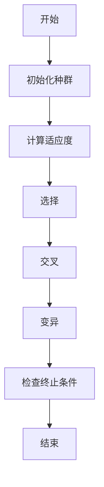
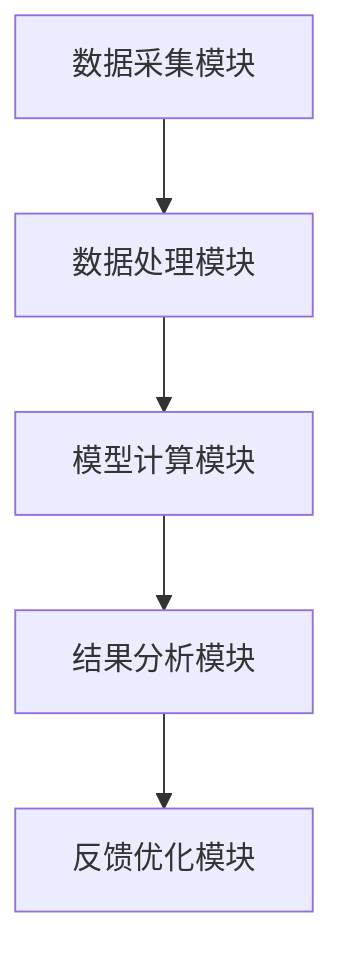
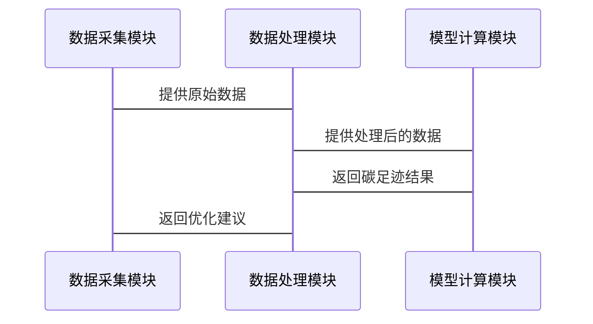

                 


# AI Agent在企业碳足迹计算与减排策略制定中的应用

> 关键词：AI Agent, 碳足迹计算, 企业减排策略, 可持续发展, 人工智能技术

> 摘要：随着全球气候变化的加剧，企业碳足迹的计算与减排策略的制定成为实现可持续发展的重要任务。本文详细探讨了AI Agent在企业碳足迹计算与减排策略制定中的应用，分析了其核心概念、技术原理、系统架构设计，以及实际项目中的应用案例。通过理论与实践相结合的方式，为读者提供了一个全面了解AI Agent在碳中和目标实现中的作用的视角。

---

# 第1章: 企业碳足迹的背景与挑战

## 1.1 企业碳足迹的定义与重要性
### 1.1.1 碳足迹的基本概念
碳足迹是指企业在整个生命周期中直接或间接产生的温室气体排放的总和。它不仅包括企业自身的运营活动，还包括供应链、产品使用阶段以及废弃物处理阶段的排放。

### 1.1.2 企业碳足迹的计算范围
企业碳足迹的计算通常涵盖以下范围：
1. **范围一**：直接排放，如企业自有能源的使用。
2. **范围二**：间接排放，如外购能源的使用。
3. **范围三**：价值链中的其他间接排放，如供应链和产品使用阶段的排放。

### 1.1.3 碳中和目标对企业的影响
企业通过实现碳中和目标，可以降低运营成本、提升品牌形象、满足法规要求，并在竞争中占据优势地位。

## 1.2 企业碳排放的主要来源
### 1.2.1 能源消耗
企业运营中消耗的电力、热能等能源是主要的碳排放来源。
### 1.2.2 供应链排放
原材料采购、生产过程中的碳排放。
### 1.2.3 产品生命周期
产品从设计、生产、使用到报废的全生命周期中的碳排放。

## 1.3 碳足迹计算的难点与挑战
### 1.3.1 数据收集的复杂性
碳足迹计算需要收集来自不同来源的数据，包括能源消耗、原材料采购、物流运输等，数据来源广泛且复杂。
### 1.3.2 方法学的多样性
不同行业、不同地区可能采用不同的碳足迹计算方法，增加了计算的复杂性。
### 1.3.3 跨界排放的处理
企业碳足迹可能涉及多个部门、多个地区，如何处理跨界排放是一个挑战。

## 1.4 AI Agent在碳足迹计算中的应用前景
### 1.4.1 AI技术的优势
AI技术可以通过大数据分析、机器学习等方法，提高碳足迹计算的准确性和效率。
### 1.4.2 AI Agent的核心作用
AI Agent可以在数据采集、模型构建、结果分析等方面发挥作用，帮助企业在复杂的环境中优化碳足迹计算。
### 1.4.3 未来发展趋势
随着AI技术的不断发展，AI Agent在碳足迹计算中的应用将更加广泛和深入。

---

# 第2章: AI Agent的核心概念与原理

## 2.1 AI Agent的基本定义
### 2.1.1 什么是AI Agent
AI Agent是一种能够感知环境、自主决策并执行任务的智能实体。它可以在复杂环境中与其他实体或系统进行交互，以实现预定目标。

### 2.1.2 AI Agent的分类
1. **简单反射型Agent**：基于当前输入做出反应，不涉及状态记忆。
2. **基于模型的反射型Agent**：利用内部状态模型来做出决策。
3. **目标驱动型Agent**：根据目标选择行动。
4. **效用驱动型Agent**：通过最大化效用函数来做出决策。

### 2.1.3 AI Agent的工作原理
AI Agent通过感知环境信息、分析问题、制定计划、执行行动并根据反馈调整策略，以实现目标。

## 2.2 AI Agent与传统计算的区别
### 2.2.1 数据处理方式的差异
AI Agent能够处理非结构化数据和复杂关系，而传统计算主要处理结构化数据。
### 2.2.2 决策机制的不同
AI Agent具备自主决策能力，而传统计算依赖于预设的规则。
### 2.2.3 交互方式的创新
AI Agent能够与环境和其他系统进行实时交互，而传统计算通常是单向处理。

## 2.3 AI Agent在碳足迹计算中的具体应用
### 2.3.1 数据采集与处理
AI Agent可以通过传感器、API等途径采集企业运营中的碳排放数据，并进行清洗和预处理。
### 2.3.2 模型构建与优化
AI Agent可以利用机器学习算法构建碳足迹预测模型，并通过优化算法提高模型的准确性。
### 2.3.3 结果分析与反馈
AI Agent能够对碳足迹计算结果进行分析，并根据反馈不断优化计算模型和策略。

---

# 第3章: 碳足迹计算的数学模型与算法

## 3.1 碳足迹计算的基本模型
### 3.1.1 简单线性模型
$$ y = \beta_0 + \beta_1x + \epsilon $$
其中，$y$表示碳排放量，$x$表示相关变量，$\beta_0$和$\beta_1$是模型参数，$\epsilon$是误差项。

### 3.1.2 加权平均模型
$$ y = \sum_{i=1}^{n} w_i x_i $$
其中，$w_i$是权重系数，$x_i$是相关变量。

### 3.1.3 生命周期评价模型
生命周期评价模型是一种综合考虑产品或服务从生产到报废的全生命周期碳排放的方法。

## 3.2 基于AI的优化算法
### 3.2.1 神经网络模型
神经网络模型通过多层感知机（MLP）结构，能够捕捉复杂的数据特征和关系。
$$ f(x) = \sigma(w x + b) $$
其中，$\sigma$是激活函数，$w$是权重矩阵，$b$是偏置向量。

### 3.2.2 支持向量机
支持向量机（SVM）通过构建最大-margin分类器，能够在高维空间中进行非线性分类。
$$ \text{目标函数} = \min_{w,b} \frac{1}{2}||w||^2 + C \sum_{i=1}^{n} \xi_i $$
$$ \text{约束条件} = y_i (w \cdot x_i + b) \geq 1 - \xi_i, \xi_i \geq 0 $$

### 3.2.3 遗传算法
遗传算法通过模拟自然选择和遗传机制，用于优化问题求解。
1. 初始化种群。
2. 计算适应度。
3. 选择、交叉和变异。
4. 重复迭代，直到满足终止条件。

## 3.3 算法的数学表达与公式
### 3.3.1 线性回归模型
$$ y = \beta_0 + \beta_1x + \epsilon $$
### 3.3.2 神经网络模型
$$ f(x) = \sigma(w x + b) $$
### 3.3.3 遗传算法流程图


---

# 第4章: 企业碳足迹计算系统的架构设计

## 4.1 系统功能模块划分
### 4.1.1 数据采集模块
负责采集企业运营中的碳排放数据，包括能源消耗、物流运输等。
### 4.1.2 数据处理模块
对采集到的数据进行清洗、转换和预处理，确保数据的准确性和一致性。
### 4.1.3 模型计算
基于处理后的数据，构建碳足迹预测模型，并进行优化和验证。

## 4.2 系统架构设计


## 4.3 系统交互流程


---

# 第5章: 项目实战与案例分析

## 5.1 项目背景介绍
某制造企业希望通过AI Agent技术优化碳足迹计算，降低运营成本，提升品牌形象。

## 5.2 系统核心实现
### 5.2.1 数据采集与处理
使用Python编写数据采集脚本，调用API获取能源消耗数据，并进行数据清洗和预处理。
```python
import requests
def get_energy_data():
    response = requests.get('https://api.example.com/energy')
    data = response.json()
    return data
```

### 5.2.2 碳足迹预测模型
基于神经网络构建碳足迹预测模型，利用Keras框架进行模型训练和优化。
```python
from tensorflow.keras import layers
model = layers.Dense(1, activation='linear')(input_layer)
model.compile(optimizer='adam', loss='mean_squared_error')
model.fit(X_train, y_train, epochs=100, batch_size=32)
```

### 5.2.3 结果分析与优化
通过分析模型预测结果，识别高碳排放环节，提出优化建议，并实时反馈优化效果。

## 5.3 实际案例分析
以某制造企业为例，详细分析AI Agent在碳足迹计算中的实际应用，展示如何通过优化能源使用和供应链管理，实现碳排放的显著降低。

---

# 第6章: 最佳实践与总结

## 6.1 最佳实践 tips
1. 数据采集要全面，确保覆盖所有相关环节。
2. 模型选择要合理，根据实际情况选择合适的算法。
3. 系统优化要持续，根据反馈不断改进。

## 6.2 小结
AI Agent在企业碳足迹计算与减排策略制定中具有重要作用。通过智能化的数据处理和模型优化，可以帮助企业在实现碳中和目标的过程中提高效率、降低成本。

## 6.3 注意事项
1. 数据隐私和安全问题需要注意。
2. 模型的可解释性要强，便于理解和优化。
3. 系统的实时性和稳定性要保证。

## 6.4 拓展阅读
1. 《可持续发展与人工智能》
2. 《机器学习在环境科学中的应用》
3. 《碳中和目标下的企业转型策略》

---

# 作者：AI天才研究院 & 禅与计算机程序设计艺术

