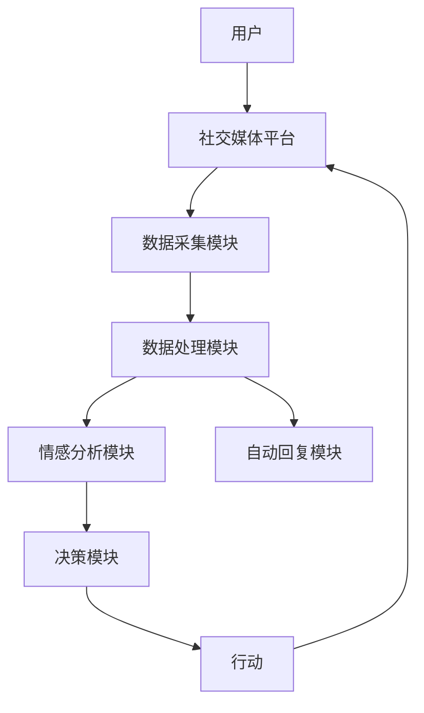
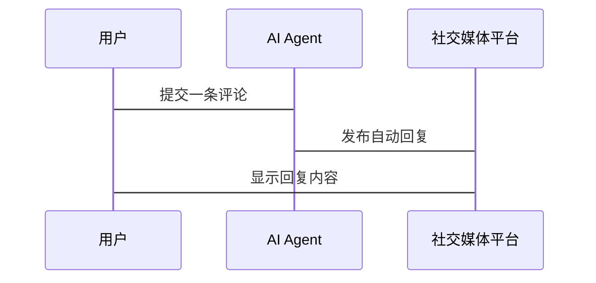

                 


# AI Agent在企业社交媒体管理中的应用

> **关键词**：AI Agent, 企业社交媒体管理, 自然语言处理, 强化学习, 知识图谱

> **摘要**：随着社交媒体在企业中的广泛应用，如何高效管理社交媒体内容成为一个重要的挑战。本文将介绍AI Agent在企业社交媒体管理中的应用，包括AI Agent的核心原理、系统架构设计、算法实现以及实际案例分析。通过详细的技术分析和实战演示，帮助读者全面理解AI Agent在社交媒体管理中的价值和应用潜力。

---

## 第一部分：AI Agent与企业社交媒体管理的背景介绍

### 第1章：AI Agent的核心概念与背景

#### 1.1 AI Agent的定义与特点
- **1.1.1 AI Agent的定义**
  AI Agent是一种能够感知环境、自主决策并执行任务的智能体。它能够通过学习和优化算法，适应不同的应用场景。
  
- **1.1.2 AI Agent的核心特点**
  - 自主性：能够独立决策。
  - 反应性：能够实时感知环境并做出反应。
  - 学习性：能够通过数据不断优化自身性能。
  - 可扩展性：能够适应不同的应用场景和规模。

- **1.1.3 AI Agent与传统自动化工具的区别**
  AI Agent不仅仅是一个自动化的工具，它具备学习和自适应能力，能够根据环境变化调整行为。

#### 1.2 企业社交媒体管理的背景与挑战
- **1.2.1 社交媒体在企业管理中的重要性**
  社交媒体已经成为企业与客户、员工以及其他利益相关者进行沟通和互动的重要渠道。高效管理社交媒体内容能够提升品牌形象、增强客户互动并提高市场影响力。

- **1.2.2 传统社交媒体管理的痛点**
  - 内容量大：每天产生的社交媒体内容数量庞大，人工管理效率低下。
  - 信息分散：社交媒体内容分布在不同的平台，难以统一管理。
  - 情况复杂：社交媒体内容涉及情感、意图等多种因素，难以通过简单规则进行处理。

- **1.2.3 AI技术在社交媒体管理中的应用潜力**
  AI技术可以通过自然语言处理、机器学习等手段，帮助企业实现自动化的社交媒体内容管理、情感分析、用户行为预测等功能。

#### 1.3 AI Agent在企业社交媒体管理中的定位
- **1.3.1 AI Agent在社交媒体管理中的角色**
  AI Agent作为企业的数字化助手，能够自动处理社交媒体上的内容，包括发布、回复、分析等。

- **1.3.2 AI Agent的核心功能与应用场景**
  - 内容发布与管理：自动发布符合品牌调性的内容。
  - 情感分析：分析社交媒体上的用户情感，识别潜在的舆情风险。
  - 用户互动：自动回复用户评论，提升客户满意度。
  - 数据分析：生成社交媒体运营报告，帮助企业优化策略。

- **1.3.3 AI Agent与企业业务目标的结合**
  AI Agent通过优化社交媒体管理流程，提升企业的品牌影响力、客户满意度和市场竞争力。

#### 1.4 本章小结
- **1.4.1 AI Agent的核心概念总结**
  AI Agent是一种具备自主性、反应性、学习性和可扩展性的智能体，能够感知环境并执行任务。

- **1.4.2 企业社交媒体管理的挑战与机遇**
  企业社交媒体管理面临着内容量大、信息分散、情况复杂等挑战，而AI Agent为企业提供了智能化的解决方案。

- **1.4.3 AI Agent在社交媒体管理中的价值**
  AI Agent能够提升社交媒体管理的效率和精准度，帮助企业更好地与客户互动，优化品牌形象。

---

## 第二部分：AI Agent的核心原理与技术实现

### 第2章：AI Agent的核心原理

#### 2.1 AI Agent的算法与模型
- **2.1.1 基于自然语言处理的文本分析**
  - 文本分类：识别文本的情感倾向（正面、负面、中性）。
  - 实体识别：从文本中提取人名、地点、组织等实体信息。
  - 情感分析：分析用户评论中的情感倾向。

- **2.1.2 基于强化学习的决策优化**
  - 状态空间：定义AI Agent所处的状态，例如当前的社交媒体数据。
  - 行动空间：定义AI Agent可以执行的动作，例如发布一条新帖子。
  - 奖励机制：定义AI Agent在执行动作后所获得的奖励，例如用户点赞数增加。

- **2.1.3 基于知识图谱的知识表示**
  - 知识图谱构建：通过爬取社交媒体数据，构建企业的知识图谱。
  - 知识推理：基于知识图谱进行推理，例如识别潜在的客户群体。

#### 2.2 AI Agent的算法流程
- **2.2.1 数据输入与预处理**
  - 数据清洗：去除噪声数据，例如重复内容、无效信息。
  - 数据转换：将数据转换为适合算法处理的格式。

- **2.2.2 模型训练与优化**
  - 模型训练：使用训练数据训练AI Agent的模型。
  - 模型优化：通过调整超参数和优化算法提升模型性能。

- **2.2.3 结果输出与反馈**
  - 结果输出：AI Agent根据模型预测结果输出行动。
  - 反馈机制：AI Agent根据实际结果更新模型，形成闭环。

#### 2.3 AI Agent的数学模型与公式
- **2.3.1 自然语言处理模型的数学表达**
  - 词嵌入：使用词向量表示词语，例如Word2Vec模型。
  - 文本分类：使用逻辑回归或支持向量机（SVM）进行分类。

- **2.3.2 强化学习算法的数学推导**
  - 状态空间：S ∈ {s₁, s₂, ..., sₙ}。
  - 行动空间：A ∈ {a₁, a₂, ..., aₘ}。
  - 奖励函数：R: S × A → ℝ。

- **2.3.3 知识图谱构建的数学基础**
  - 实体表示：使用向量表示实体。
  - 关系建模：使用关系图表示实体之间的关系。

### 第3章：AI Agent的系统架构与设计

#### 3.1 系统架构设计
- **3.1.1 分层架构设计**
  - 数据层：负责数据的存储和管理。
  - 服务层：负责具体的业务逻辑实现。
  - 表示层：负责用户界面的展示。

- **3.1.2 模块化设计**
  - 数据采集模块：负责采集社交媒体数据。
  - 数据处理模块：负责数据的预处理和分析。
  - 决策模块：负责根据分析结果做出决策。

- **3.1.3 扩展性设计**
  - 支持多种社交媒体平台。
  - 支持多种语言和文化背景。

#### 3.2 系统功能设计
- **3.2.1 数据采集与处理**
  - 实时采集社交媒体数据。
  - 对数据进行清洗和转换。

- **3.2.2 情感分析**
  - 使用自然语言处理技术分析文本情感。
  - 识别潜在的舆情风险。

- **3.2.3 自动回复**
  - 根据规则或模型生成自动回复。
  - 支持多种回复策略。

- **3.2.4 数据分析与报告**
  - 生成社交媒体运营报告。
  - 提供数据可视化界面。

#### 3.3 系统架构图（使用 Mermaid）


#### 3.4 系统接口设计
- **3.4.1 数据接口**
  - REST API：用于数据的上传和下载。
  - 数据格式：JSON或CSV。

- **3.4.2 用户接口**
  - Web界面：用于用户与AI Agent的交互。
  - API接口：用于其他系统的集成。

#### 3.5 系统交互流程（使用 Mermaid）


---

## 第三部分：AI Agent在企业社交媒体管理中的项目实战

### 第4章：项目实战

#### 4.1 项目背景与目标
- **项目背景**：某企业希望优化其社交媒体管理流程，提升客户互动率。
- **项目目标**：实现自动化的社交媒体内容发布、情感分析和用户互动。

#### 4.2 环境配置
- **4.2.1 系统环境**
  - 操作系统：Linux/Windows/MacOS。
  - 开发工具：Python、Jupyter Notebook。
  - 依赖库：TensorFlow、Keras、Scikit-learn、Numpy。

#### 4.3 核心代码实现
- **4.3.1 数据采集模块**
  ```python
  import requests
  from bs4 import BeautifulSoup

  def fetch_data(url):
      response = requests.get(url)
      soup = BeautifulSoup(response.text, 'html.parser')
      return soup.find_all('div', class_='post')
  ```

- **4.3.2 情感分析模块**
  ```python
  from sklearn.feature_extraction.text import TfidfVectorizer
  from sklearn.svm import SVC

  def train_model(X_train, y_train):
      vectorizer = TfidfVectorizer()
      X = vectorizer.fit_transform(X_train)
      model = SVC()
      model.fit(X, y_train)
      return model, vectorizer

  def predict(model, vectorizer, text):
      X = vectorizer.transform([text])
      return model.predict(X)[0]
  ```

- **4.3.3 自动回复模块**
  ```python
  def generate_reply(text):
      # 使用预训练的模型生成回复
      # 返回回复内容
      pass
  ```

#### 4.4 实际案例分析
- **案例1：情感分析**
  - 输入：用户评论“这个产品真的很好用！”
  - 输出：情感倾向为正面。

- **案例2：自动回复**
  - 输入：用户评论“你们的产品有问题。”
  - 输出：自动回复“感谢您的反馈，我们会尽快解决问题。”

#### 4.5 项目小结
- **4.5.1 核心实现总结**
  - 数据采集模块实现了从社交媒体平台获取数据。
  - 情感分析模块能够准确识别文本的情感倾向。
  - 自动回复模块能够生成符合品牌调性的回复内容。

- **4.5.2 项目成果**
  - 提升了社交媒体管理的效率。
  - 提高了客户互动率和满意度。

- **4.5.3 项目经验**
  - 数据质量对模型性能影响重大。
  - 需要根据具体业务需求调整模型参数。

---

## 第四部分：总结与展望

### 第5章：总结与展望

#### 5.1 总结
- AI Agent在企业社交媒体管理中的应用价值显著，能够提升管理效率和精准度。
- 通过自然语言处理、强化学习等技术，AI Agent能够实现复杂的情感分析和自动回复功能。

#### 5.2 未来展望
- **技术发展**：随着AI技术的不断进步，AI Agent的功能将更加智能化和个性化。
- **应用场景扩展**：AI Agent将应用于更多领域，例如社交媒体广告投放、用户行为预测等。
- **挑战与机遇**：需要解决数据隐私、模型解释性等挑战，同时也将迎来更广阔的发展空间。

#### 5.3 最佳实践 Tips
- 在使用AI Agent前，明确业务目标和需求。
- 数据质量和多样性对模型性能至关重要。
- 定期更新模型，保持其适应性和准确性。

#### 5.4 作者小结
- AI Agent作为一项前沿技术，正在改变企业社交媒体管理的方式。
- 通过不断学习和实践，我们能够更好地利用AI技术为企业创造价值。

---

## 作者：AI天才研究院/AI Genius Institute & 禅与计算机程序设计艺术 /Zen And The Art of Computer Programming

---

以上是《AI Agent在企业社交媒体管理中的应用》的技术博客文章的大纲和内容。文章从背景介绍、核心原理、系统设计到项目实战，全面详细地探讨了AI Agent在企业社交媒体管理中的应用，帮助读者理解其技术本质和实际价值。

