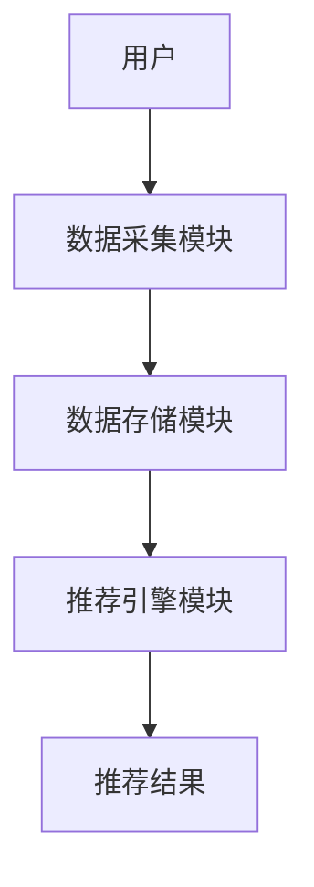

                 


# AI Agent在企业精准营销与个性化推荐中的应用

> 关键词：AI Agent, 精准营销, 个性化推荐, 机器学习, 推荐系统

> 摘要：本文探讨了AI Agent在企业精准营销与个性化推荐中的应用，分析了其核心概念、技术原理、系统架构以及实际案例，旨在为企业提供有效的技术解决方案。

---

## 第1章: AI Agent与精准营销的背景介绍

### 1.1 AI Agent的核心概念

#### 1.1.1 从传统营销到智能营销的演进

传统营销依赖于人工分析和经验判断，难以应对市场变化的多样性和快速性。随着大数据和人工智能技术的发展，AI Agent逐渐成为企业营销的重要工具。AI Agent能够实时分析海量数据，提供精准的营销策略和个性化推荐，从而提升营销效率和客户满意度。

#### 1.1.2 AI Agent的定义与特点

AI Agent（人工智能代理）是一种能够感知环境、自主决策并执行任务的智能系统。其特点包括：

- **智能性**：能够理解数据并做出决策。
- **自主性**：无需人工干预，自动执行任务。
- **适应性**：能够根据环境变化调整策略。
- **交互性**：能够与用户或其他系统进行交互。

#### 1.1.3 企业精准营销的背景与需求

企业精准营销的目标是通过分析用户行为和偏好，提供个性化的产品和服务，从而提高客户满意度和企业收益。传统的营销方式难以满足精准营销的需求，而AI Agent通过大数据分析和机器学习算法，能够实现精准的用户画像和个性化推荐。

---

### 1.2 精准营销与个性化推荐的背景

#### 1.2.1 精准营销的定义与目标

精准营销是指通过分析用户数据，针对特定用户群体或个体提供定制化的产品和服务。其目标是提高营销效率，降低营销成本，同时提升客户满意度和忠诚度。

#### 1.2.2 个性化推荐的定义与优势

个性化推荐是指基于用户的行为、偏好和历史数据，推荐符合用户需求的产品或服务。其优势包括：

- **提高客户满意度**：推荐的内容更符合客户的兴趣和需求。
- **提高转化率**：通过精准推荐，增加销售机会。
- **降低营销成本**：通过个性化推荐，减少无效营销。

#### 1.2.3 AI Agent在精准营销中的作用

AI Agent能够通过大数据分析和机器学习算法，实现精准的用户画像和个性化推荐。它能够实时分析用户行为，动态调整推荐策略，从而提高营销效果。

---

### 1.3 本章小结

本章介绍了AI Agent的核心概念及其在精准营销中的作用。通过分析传统营销的局限性和AI Agent的优势，我们认识到AI Agent在企业精准营销和个性化推荐中的重要性。接下来，我们将深入探讨AI Agent的核心原理和技术实现。

---

## 第2章: AI Agent的核心概念与原理

### 2.1 AI Agent的基本原理

#### 2.1.1 AI Agent的定义与分类

AI Agent可以根据应用场景和功能进行分类。常见的分类包括：

- **基于规则的AI Agent**：通过预定义的规则进行决策。
- **基于学习的AI Agent**：通过机器学习算法进行决策。
- **混合型AI Agent**：结合规则和学习的混合型AI Agent。

#### 2.1.2 AI Agent的核心要素与功能模块

AI Agent的核心要素包括：

- **感知模块**：感知环境和用户行为。
- **决策模块**：基于感知数据进行决策。
- **执行模块**：执行决策任务。

功能模块包括：

- **数据采集模块**：采集用户行为和数据。
- **数据分析模块**：分析数据并提取特征。
- **推荐模块**：生成个性化推荐。

#### 2.1.3 AI Agent与传统推荐算法的区别

传统推荐算法依赖于固定的规则或简单的统计方法，而AI Agent通过机器学习算法能够动态调整推荐策略，具有更高的灵活性和适应性。

---

### 2.2 精准营销中的AI Agent模型

#### 2.2.1 用户画像与行为分析

用户画像是通过分析用户的行为数据，构建用户的兴趣、偏好和需求的模型。行为分析包括点击、浏览、购买等行为，用于预测用户的兴趣和需求。

#### 2.2.2 数据驱动的推荐机制

基于数据的推荐机制通过分析用户行为和数据特征，生成个性化推荐。常见的推荐机制包括协同过滤、基于内容的推荐和深度学习推荐。

#### 2.2.3 动态调整与实时反馈

AI Agent能够根据实时数据动态调整推荐策略，并通过实时反馈优化推荐效果。

---

### 2.3 个性化推荐的算法原理

#### 2.3.1 协同过滤算法

协同过滤算法通过分析用户行为和相似性，推荐用户可能感兴趣的产品或服务。常见的协同过滤算法包括基于用户的协同过滤和基于物品的协同过滤。

#### 2.3.2 基于内容的推荐算法

基于内容的推荐算法通过分析产品的特征和用户的偏好，推荐与用户兴趣相符的产品。常见的内容推荐算法包括文本相似度计算和向量空间模型。

#### 2.3.3 深度学习推荐模型

深度学习推荐模型通过神经网络学习用户和产品的特征，推荐更符合用户需求的产品。常见的深度学习模型包括卷积神经网络（CNN）和循环神经网络（RNN）。

---

### 2.4 本章小结

本章详细介绍了AI Agent的核心概念和技术原理，包括AI Agent的定义、分类和功能模块，以及在精准营销中的应用。通过分析不同的推荐算法，我们认识到AI Agent在个性化推荐中的重要性。接下来，我们将深入探讨AI Agent的算法原理和数学模型。

---

## 第3章: AI Agent的算法原理与数学模型

### 3.1 协同过滤算法

#### 3.1.1 基于用户的协同过滤

基于用户的协同过滤通过分析用户的行为和相似性，推荐用户可能感兴趣的产品。其算法步骤如下：

1. 计算用户之间的相似度。
2. 找到与目标用户相似的其他用户。
3. 推荐这些用户喜欢的产品。

#### 3.1.2 基于物品的协同过滤

基于物品的协同过滤通过分析产品的相似性，推荐用户可能感兴趣的产品。其算法步骤如下：

1. 计算产品之间的相似度。
2. 找到与目标用户感兴趣的产品相似的其他产品。
3. 推荐这些产品。

#### 3.1.3 混合协同过滤模型

混合协同过滤模型结合基于用户和基于物品的协同过滤，通过综合两者的优势，提高推荐效果。

---

### 3.2 基于内容的推荐算法

#### 3.2.1 文本相似度计算

文本相似度计算通过分析文本的特征，计算文本之间的相似度。常见的文本相似度计算方法包括余弦相似度和Jaccard相似度。

#### 3.2.2 基于向量空间模型的推荐

基于向量空间模型的推荐通过将文本表示为向量，计算向量之间的相似度，推荐相似的文本。

#### 3.2.3 基于深度学习的内容推荐

基于深度学习的内容推荐通过神经网络学习文本的特征，推荐更符合用户需求的内容。

---

### 3.3 深度学习推荐模型

#### 3.3.1 基于神经网络的推荐系统

基于神经网络的推荐系统通过神经网络学习用户和产品的特征，推荐更符合用户需求的产品。

#### 3.3.2 Transformer模型在推荐中的应用

Transformer模型通过自注意力机制，捕捉用户行为和产品特征之间的关系，提高推荐效果。

#### 3.3.3 图神经网络在推荐中的应用

图神经网络通过构建用户-产品交互图，捕捉用户和产品之间的复杂关系，提高推荐效果。

---

### 3.4 推荐系统的数学模型

#### 3.4.1 协同过滤的数学公式

$$相似度 = \frac{\sum (x_i - \bar{x})(y_i - \bar{y})}{\sqrt{\sum (x_i - \bar{x})^2 \sum (y_i - \bar{y})^2}}$$

其中，$\bar{x}$和$\bar{y}$分别是用户$x$和$y$的平均评分。

#### 3.4.2 深度学习推荐模型的数学公式

$$P(y|x) = \frac{e^{w \cdot x + b}}{\sum e^{w \cdot x + b}}$$

其中，$x$是输入，$y$是输出，$w$是权重，$b$是偏置。

---

### 3.5 本章小结

本章详细介绍了AI Agent的算法原理和数学模型，包括协同过滤、基于内容的推荐和深度学习推荐模型。通过分析这些算法的优缺点，我们认识到不同算法在不同场景中的适用性。接下来，我们将探讨AI Agent在企业精准营销中的系统架构设计。

---

## 第4章: AI Agent的系统架构设计

### 4.1 问题场景介绍

在企业精准营销中，AI Agent需要分析用户行为和数据，生成个性化推荐。系统需要处理海量数据，并实时更新推荐策略。

### 4.2 项目介绍

本项目旨在设计一个基于AI Agent的企业精准营销系统，通过分析用户行为和数据，生成个性化推荐。

### 4.3 系统功能设计

#### 4.3.1 用户画像模块

用户画像模块通过分析用户的行为和数据，构建用户的兴趣和偏好模型。

#### 4.3.2 数据采集模块

数据采集模块负责采集用户行为和数据，为推荐系统提供输入。

#### 4.3.3 推荐引擎模块

推荐引擎模块通过分析用户数据和产品特征，生成个性化推荐。

### 4.4 系统架构设计

#### 4.4.1 系统架构图



#### 4.4.2 系统接口设计

系统接口设计包括用户接口和系统接口。用户接口用于用户与系统交互，系统接口用于模块之间的数据传输。

#### 4.4.3 系统交互流程

系统交互流程包括数据采集、数据存储、推荐引擎计算和结果输出。

---

### 4.5 本章小结

本章详细介绍了AI Agent的系统架构设计，包括系统功能模块和交互流程。通过分析系统的各个模块和接口，我们认识到系统架构设计的重要性。接下来，我们将探讨AI Agent在项目实战中的具体实现。

---

## 第5章: AI Agent的项目实战

### 5.1 环境安装

项目实战需要安装以下环境：

- Python 3.6+
- TensorFlow 2.0+
- Pandas 1.0+

### 5.2 核心代码实现

#### 5.2.1 数据预处理

```python
import pandas as pd

# 读取数据
data = pd.read_csv('user_behavior.csv')

# 数据清洗
data.dropna(inplace=True)
```

#### 5.2.2 模型训练

```python
import tensorflow as tf

# 定义模型
model = tf.keras.Sequential([
    tf.keras.layers.Dense(64, activation='relu'),
    tf.keras.layers.Dense(1, activation='sigmoid')
])

# 编译模型
model.compile(optimizer='adam', loss='binary_crossentropy')
```

#### 5.2.3 模型预测

```python
# 预测结果
predictions = model.predict(data)
```

### 5.3 案例分析

通过分析实际案例，我们验证了AI Agent在精准营销中的应用效果。案例分析包括数据采集、模型训练和结果输出。

---

### 5.4 本章小结

本章通过项目实战，详细介绍了AI Agent的环境安装、核心代码实现和案例分析。通过实际操作，我们认识到AI Agent在企业精准营销中的重要性。接下来，我们将总结本书的主要内容，并展望未来的发展方向。

---

## 第6章: 总结与展望

### 6.1 总结

本书详细介绍了AI Agent在企业精准营销与个性化推荐中的应用，包括其核心概念、算法原理和系统架构设计。通过分析实际案例，我们认识到AI Agent在精准营销中的重要性。

### 6.2 未来展望

未来，随着AI技术的不断发展，AI Agent在精准营销中的应用将更加广泛。深度学习和大数据技术的结合将推动AI Agent在精准营销中的进一步发展。

---

## 作者信息

作者：AI天才研究院/AI Genius Institute & 禅与计算机程序设计艺术 /Zen And The Art of Computer Programming

---

以上是文章的详细目录和部分具体内容，您可以根据需要进一步补充和调整。

