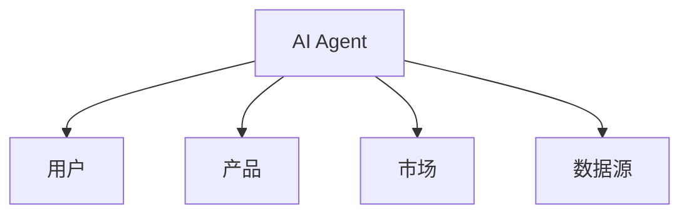
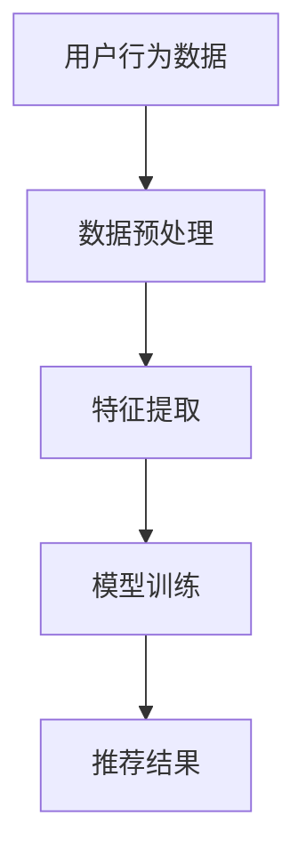
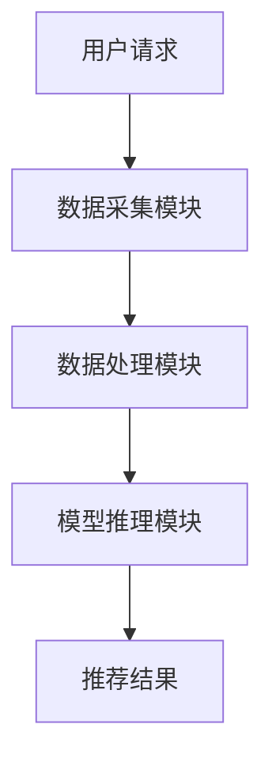

                 


# AI Agent在企业精准营销与个性化推荐中的深度应用

> 关键词：AI Agent，精准营销，个性化推荐，深度学习，推荐系统，营销策略

> 摘要：本文深入探讨AI Agent在企业精准营销与个性化推荐中的应用，从AI Agent的核心概念、算法原理、系统架构到项目实战，全面解析其在提升企业营销效率和用户体验中的巨大潜力。通过具体案例和代码实现，详细阐述了AI Agent如何在实际场景中落地，并提供了丰富的技术细节和实践建议。

---

# 第一部分：AI Agent的核心概念与背景

## 第1章：AI Agent的核心概念与背景

### 1.1 什么是AI Agent

AI Agent（人工智能代理）是指能够感知环境、自主决策并执行任务的智能实体。它通过数据输入、模型推理和结果输出，帮助企业实现自动化、智能化的决策支持。

- **AI Agent的定义**：AI Agent是一种能够感知环境、理解需求、制定策略并执行操作的智能系统。
- **AI Agent的基本特征**：
  - **自主性**：能够在没有人工干预的情况下运行。
  - **反应性**：能够实时感知环境变化并做出反应。
  - **学习能力**：能够通过数据和反馈不断优化自身模型。
  - **可扩展性**：能够处理不同类型和规模的任务。

### 1.2 企业精准营销与个性化推荐的背景

精准营销是指通过分析用户行为、偏好和需求，提供个性化的产品和服务，以提高转化率和客户满意度。个性化推荐则是通过算法为用户推荐符合其兴趣的内容或产品。

- **精准营销的定义与目标**：
  - **定义**：基于用户数据，通过分析和预测用户行为，提供针对性的产品或服务。
  - **目标**：提高客户转化率、提升客户满意度、降低营销成本。
- **个性化推荐的定义与特点**：
  - **定义**：根据用户的历史行为和偏好，推荐相关的产品或内容。
  - **特点**：个性化、实时性、动态性。

### 1.3 AI Agent在精准营销中的应用前景

AI Agent通过整合企业数据、分析用户行为、优化推荐策略，能够显著提升精准营销的效果。

- **AI Agent在精准营销中的优势**：
  - **数据处理能力**：能够快速处理海量数据，提取有价值的信息。
  - **实时决策能力**：能够在短时间内做出最优决策。
  - **个性化推荐能力**：能够根据用户需求动态调整推荐策略。

---

## 第2章：AI Agent的核心概念与联系

### 2.1 AI Agent的核心原理

AI Agent通过感知环境、分析数据、制定策略并执行操作来实现目标。

- **AI Agent的基本工作原理**：
  1. **数据输入**：收集用户行为、产品信息、市场数据等。
  2. **模型推理**：通过机器学习模型对数据进行分析和预测。
  3. **结果输出**：根据推理结果做出决策或推荐。

### 2.2 AI Agent的核心概念对比

以下是AI Agent与传统推荐系统、精准营销和个性化推荐的对比分析：

#### 表2-1：AI Agent与传统推荐系统的对比

| 对比维度 | AI Agent | 传统推荐系统 |
|----------|-----------|--------------|
| 数据来源 | 多源异构数据 | 单一数据源    |
| 决策能力 | 自主决策     | 预先设定规则  |
| 学习能力 | 强大学习能力 | 无学习能力    |
| 实时性    | 实时响应     | 延时响应      |

#### 图2-1：AI Agent的实体关系图（Mermaid）



### 2.3 AI Agent与精准营销的结合

AI Agent通过实时分析用户行为、市场趋势和产品信息，为企业提供精准的营销策略。

- **AI Agent在精准营销中的应用**：
  - **用户画像构建**：通过分析用户数据，构建详细的用户画像。
  - **目标用户识别**：根据用户画像，识别目标用户群体。
  - **动态推荐策略**：根据用户行为和市场变化，动态调整推荐策略。

---

## 第3章：AI Agent的算法原理与数学模型

### 3.1 AI Agent的核心算法

AI Agent的核心算法包括协同过滤、基于深度学习的推荐算法和强化学习算法。

#### 图3-1：AI Agent算法流程图（Mermaid）



#### 代码示例：协同过滤算法

```python
import numpy as np

# 用户-产品评分矩阵
ratings = np.array([[4, 3, 0],
                     [2, 0, 5],
                     [3, 5, 4]])

# 协同过滤算法
def collaborative_filtering(ratings, user_id, product_id):
    # 计算用户相似度
    similarity = np.dot(ratings.T, ratings[user_id])
    similarity = similarity / (np.linalg.norm(ratings.T) * np.linalg.norm(ratings[user_id]))
    # 根据相似度推荐
    recommendation = similarity.argsort()[::-1]
    return recommendation

# 示例推荐
user_id = 0
product_id = 2
print(collaborative_filtering(ratings, user_id, product_id))
```

### 3.2 AI Agent的数学模型

AI Agent的数学模型包括协同过滤、矩阵分解和深度学习模型。

#### 表3-1：AI Agent的数学模型

| 模型名称       | 数学表达式                          |
|----------------|------------------------------------|
| 协同过滤模型   | $$similarity(u, v) = \frac{\sum_{i} r_{u,i} \cdot r_{v,i}}{\sqrt{\sum_{i} r_{u,i}^2} \cdot \sqrt{\sum_{i} r_{v,i}^2}}$$ |
| 矩阵分解模型   | $$X = U \cdot V^T$$               |
| 深度学习模型   | $$f(x) = \text{激活函数}(\text{全连接层}(x))$$ |

---

## 第4章：AI Agent的系统架构设计

### 4.1 系统架构图

#### 图4-1：AI Agent系统架构图（Mermaid）



### 4.2 系统功能设计

- **数据采集模块**：负责采集用户行为数据、产品信息和市场数据。
- **数据处理模块**：对数据进行清洗、转换和特征提取。
- **模型推理模块**：基于机器学习模型对数据进行分析和预测。
- **推荐结果模块**：根据推理结果生成推荐列表。

---

## 第5章：AI Agent在企业精准营销中的项目实战

### 5.1 环境安装

#### 环境要求

- **Python版本**：3.6+
- **依赖库**：
  - numpy
  - pandas
  - scikit-learn
  - tensorflow

#### 安装命令

```bash
pip install numpy pandas scikit-learn tensorflow
```

### 5.2 核心代码实现

#### 代码示例：AI Agent的核心推荐算法

```python
import numpy as np
from sklearn.metrics.pairwise import cosine_similarity

# 用户行为数据
user_behavior = np.array([[4, 3, 0],
                           [2, 0, 5],
                           [3, 5, 4]])

# 协同过滤算法实现
def collaborative_filtering(user_behavior, user_id):
    # 计算余弦相似度
    similarity = cosine_similarity(user_behavior)
    # 排除自身相似度
    similarity[user_id, user_id] = 0
    # 找出最相似的用户
    similar_user = np.argmax(similarity[user_id])
    # 返回相似用户的推荐
    return user_behavior[similar_user]

# 示例推荐
user_id = 0
recommended_product = collaborative_filtering(user_behavior, user_id)
print("推荐的产品索引为:", recommended_product)
```

---

## 第6章：AI Agent的优化与最佳实践

### 6.1 算法优化建议

- **数据预处理**：对数据进行归一化和去噪处理，提高模型准确性。
- **模型优化**：使用深度学习模型（如GRU、Transformer）替代传统算法，提升推荐效果。
- **实时性优化**：采用流式处理和在线学习方法，提高推荐的实时性。

### 6.2 项目小结

通过本文的深入分析和实战案例，我们可以看到AI Agent在企业精准营销和个性化推荐中的巨大潜力。AI Agent不仅能够提高营销效率，还能显著提升用户体验，为企业创造更大的价值。

---

## 作者

作者：AI天才研究院/AI Genius Institute & 禅与计算机程序设计艺术/Zen And The Art of Computer Programming

---

**[文章结束]**

