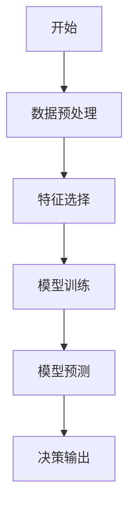
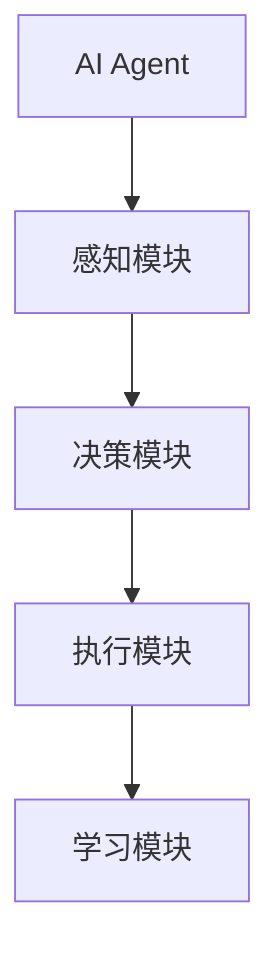

                 


# AI Agent在企业精准营销策略制定中的应用

> 关键词：AI Agent, 精准营销, 企业策略, 人工智能, 营销优化

> 摘要：本文详细探讨了AI Agent在企业精准营销中的应用，从背景、核心概念、算法原理到系统架构和项目实战，全面分析了AI Agent如何帮助企业在精准营销中制定最优策略。文章结合理论与实践，通过丰富的图表和代码示例，深入解读了AI Agent在营销决策中的数学模型和优化算法，为企业应用AI Agent提供了全面的技术指导。

---

## 第一部分: AI Agent与企业精准营销的背景

### 第1章: AI Agent的基本概念

#### 1.1 AI Agent的定义与特点
AI Agent（人工智能智能体）是指能够感知环境、自主决策并执行任务的智能系统。其核心特点包括：
- **自主性**：无需人工干预，自动完成任务。
- **反应性**：能够实时感知环境变化并调整策略。
- **学习能力**：通过数据和反馈不断优化自身算法。
- **目标导向**：基于明确的目标进行决策和行动。

#### 1.2 AI Agent的核心要素与功能
AI Agent的功能模块包括：
- **感知模块**：收集和分析环境数据。
- **决策模块**：基于数据进行策略选择。
- **执行模块**：将决策转化为具体行动。
- **学习模块**：通过反馈优化算法。

#### 1.3 AI Agent与传统营销工具的区别
| 概念 | 定义 | 优势 | 局限 |
|------|------|------|------|
| AI Agent | 具备自主决策能力的智能体 | 高效、精准 | 需要大量数据支持 |
| 传统营销工具 | 基于规则的营销工具 | 易用性高 | 精准度低 |

---

### 第2章: 企业精准营销的定义与挑战

#### 2.1 企业精准营销的定义
精准营销是指通过分析客户数据，制定个性化的营销策略，以提高客户转化率和满意度。

#### 2.2 精准营销的核心要素与目标
- **客户画像**：基于数据分析构建客户画像。
- **需求预测**：预测客户潜在需求。
- **策略优化**：动态调整营销策略。

#### 2.3 传统营销与精准营销的主要区别
| 概念 | 定义 | 优势 | 局限 |
|------|------|------|------|
| 传统营销 | 基于经验的营销策略 | 简单易行 | 精准度低 |
| 精准营销 | 基于数据的营销策略 | 高精准度 | 数据依赖性强 |

#### 2.4 企业精准营销的常见挑战
- **数据不足**：缺乏足够的客户数据进行分析。
- **算法复杂**：精准营销需要复杂的算法支持。
- **成本高**：数据收集和处理成本较高。

---

## 第二部分: AI Agent的核心概念与原理

### 第3章: AI Agent的核心概念与原理

#### 3.1 AI Agent的基本原理
AI Agent通过感知环境、分析数据、制定决策并执行任务，实现营销策略的优化。其决策过程基于以下步骤：
1. **感知环境**：收集客户行为数据。
2. **分析数据**：利用机器学习算法进行预测。
3. **制定决策**：基于分析结果选择最优策略。
4. **执行任务**：将决策转化为具体的营销行动。

#### 3.2 AI Agent的决策机制与流程
1. **输入数据**：客户行为数据、市场趋势等。
2. **数据预处理**：清洗、归一化等。
3. **模型训练**：使用机器学习算法训练模型。
4. **决策输出**：基于模型预测结果制定营销策略。

---

## 第三部分: AI Agent在企业精准营销中的算法原理

### 第4章: AI Agent的核心算法与实现

#### 4.1 AI Agent的核心算法
- **决策树算法**：用于客户分类和需求预测。
- **神经网络算法**：用于复杂模式识别。
- **强化学习算法**：用于动态策略优化。

#### 4.2 AI Agent的决策树算法实现


#### 4.3 AI Agent的神经网络算法实现
```python
import numpy as np

def sigmoid(x):
    return 1 / (1 + np.exp(-x))

def forward_propagation(x, weights, bias):
    return sigmoid(np.dot(x, weights) + bias)

x = np.array([1, 2, 3])
weights = np.array([0.5, 0.5, 0.5])
bias = 0.1

output = forward_propagation(x, weights, bias)
print(output)
```

---

## 第四部分: AI Agent在企业精准营销中的系统架构

### 第5章: AI Agent的系统架构设计

#### 5.1 AI Agent的系统架构
1. **感知模块**：负责数据的采集和预处理。
2. **决策模块**：基于数据进行策略选择。
3. **执行模块**：将决策转化为具体行动。
4. **学习模块**：通过反馈优化算法。

#### 5.2 AI Agent的系统架构图


---

## 第五部分: AI Agent在企业精准营销中的项目实战

### 第6章: AI Agent的项目实战

#### 6.1 项目背景与目标
- **项目背景**：某电商平台希望通过AI Agent优化精准营销策略。
- **项目目标**：提高客户转化率和满意度。

#### 6.2 项目实施步骤
1. **数据收集**：收集客户行为数据。
2. **数据预处理**：清洗和归一化数据。
3. **模型训练**：训练机器学习模型。
4. **策略优化**：基于模型预测结果优化营销策略。

#### 6.3 项目代码实现
```python
import pandas as pd
from sklearn.tree import DecisionTreeClassifier

# 数据加载
data = pd.read_csv('customer_data.csv')

# 特征选择
X = data[['age', 'gender', 'income']]
y = data['purchase']

# 模型训练
model = DecisionTreeClassifier()
model.fit(X, y)

# 预测结果
predictions = model.predict(X)
print(predictions)
```

---

## 第六部分: 总结与展望

### 第7章: 总结与展望

#### 7.1 总结
AI Agent在企业精准营销中的应用具有重要意义，能够显著提高营销效率和精准度。

#### 7.2 展望
未来，随着AI技术的不断发展，AI Agent在精准营销中的应用将更加广泛和深入。

---

## 作者信息

作者：AI天才研究院/AI Genius Institute & 禅与计算机程序设计艺术 /Zen And The Art of Computer Programming

---

通过以上详细的内容，您可以根据需要调整各个部分的具体内容，确保文章逻辑清晰、结构紧凑、语言专业。希望这篇技术博客能够为您提供有价值的参考和启发！

