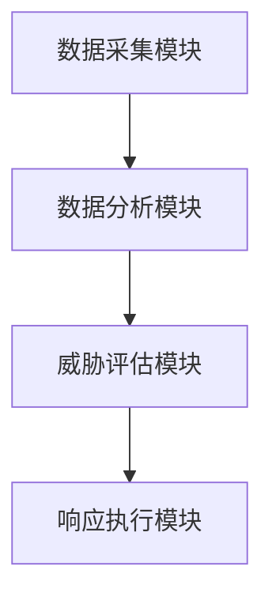
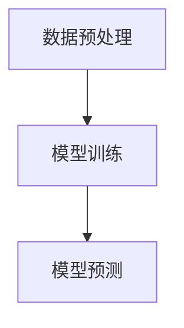

                 


# AI Agent在企业网络安全态势感知与威胁响应中的应用

> **关键词**：AI Agent，网络安全，态势感知，威胁响应，机器学习，网络安全架构

> **摘要**：随着企业网络环境的日益复杂化，传统的网络安全防护手段逐渐暴露出诸多局限性。本文深入探讨了AI Agent（人工智能代理）在企业网络安全态势感知与威胁响应中的应用，详细分析了AI Agent的核心概念、技术原理、系统实现及其在实际场景中的应用案例。文章从理论到实践，系统地阐述了如何利用AI Agent提升网络安全的智能化水平，为企业的网络安全防护提供新的思路和解决方案。

---

# 第1章: AI Agent的基本概念与优势

## 1.1 AI Agent的定义与特点

### 1.1.1 AI Agent的定义
AI Agent（人工智能代理）是一种能够感知环境、自主决策并执行任务的智能体。在网络安全领域，AI Agent通常被设计为能够实时监控网络环境、识别潜在威胁、评估风险并采取相应措施的智能系统。

### 1.1.2 AI Agent的核心特点
- **自主性**：AI Agent能够在没有人工干预的情况下自主运行。
- **反应性**：能够实时感知网络环境的变化并做出响应。
- **学习能力**：通过机器学习算法不断优化自身的威胁检测和响应能力。
- **可扩展性**：能够适应不同规模和复杂度的企业网络环境。

### 1.1.3 AI Agent与传统安全工具的对比

| **特性**       | **传统安全工具**                     | **AI Agent**                          |
|----------------|--------------------------------------|---------------------------------------|
| 数据处理能力   | 基于规则，处理能力有限               | 基于机器学习，处理能力强             |
| 威胁检测精度   | 依赖预定义规则，精度有限             | 能够学习和优化，精度高               |
| 响应速度       | 依赖人工或固定规则，响应速度较慢     | 实时响应，速度快                   |
| 可扩展性       | 难以适应复杂多变的网络环境           | 具有高度可扩展性，适应性强           |

---

## 1.2 网络安全态势感知的背景与挑战

### 1.2.1 网络安全态势感知的定义
网络安全态势感知（Cybersecurity Situational Awareness）是指通过对网络环境中的各种数据进行采集、分析和处理，实时了解网络的安全状态，并预测潜在威胁的过程。

### 1.2.2 当前网络安全的主要挑战
- **复杂性**：企业网络环境日益复杂，传统的基于规则的安全工具难以应对新型威胁。
- **实时性**：网络安全威胁往往具有突发性和隐蔽性，需要实时监控和快速响应。
- **智能化**：攻击者不断采用新技术和新策略，要求防御系统具备更高的智能化水平。

### 1.2.3 网络安全态势感知的重要性
- **提高威胁检测能力**：通过实时监控和分析网络流量，快速发现潜在威胁。
- **降低安全风险**：通过态势感知，企业可以提前采取措施，降低安全事件的发生概率。
- **优化安全策略**：基于态势感知的结果，优化企业的安全防护策略。

---

## 1.3 AI Agent在网络安全中的优势

### 1.3.1 提高威胁检测的准确性
AI Agent通过机器学习算法，能够从海量数据中发现隐藏的威胁模式，显著提高威胁检测的准确性。

### 1.3.2 实现自动化威胁响应
AI Agent能够根据预设的规则或学习得到的策略，自动采取相应的安全措施，如隔离异常设备、阻止恶意流量等。

### 1.3.3 降低人为错误的影响
通过AI Agent的自动化处理，可以减少人为操作中的错误，提高安全防护的可靠性。

---

## 1.4 本章小结

本章介绍了AI Agent的基本概念和特点，并探讨了网络安全态势感知的背景与挑战。通过对比传统安全工具和AI Agent的优缺点，提出了AI Agent在网络安全中的独特优势。这为后续章节的深入分析奠定了基础。

---

# 第2章: 网络安全态势感知的理论与方法

## 2.1 网络安全态势感知的定义与框架

### 2.1.1 网络安全态势感知的定义
网络安全态势感知是一种通过整合多源数据，分析网络环境的安全状态，并提供实时威胁情报的技术。

### 2.1.2 网络安全态势感知的框架
网络安全态势感知的框架通常包括以下几个部分：
1. **数据采集**：从网络设备、日志、流量等多源数据中采集信息。
2. **数据分析**：通过机器学习、统计分析等方法对数据进行处理和分析。
3. **威胁评估**：基于分析结果，评估潜在威胁的严重性。
4. **响应决策**：根据威胁评估结果，制定相应的安全响应策略。

---

## 2.2 网络安全态势感知的关键技术

### 2.2.1 数据采集与整合
数据采集是网络安全态势感知的第一步，主要包括以下几种数据源：
- **网络流量数据**：包括IP地址、端口号、流量大小等。
- **日志数据**：包括系统日志、安全日志等。
- **威胁情报数据**：包括已知威胁、恶意软件信息等。

### 2.2.2 数据分析与建模
数据分析是网络安全态势感知的核心环节，常用的技术包括：
- **统计分析**：如异常检测、聚类分析等。
- **机器学习**：如支持向量机（SVM）、随机森林（Random Forest）等算法。
- **深度学习**：如卷积神经网络（CNN）、循环神经网络（RNN）等。

### 2.2.3 威胁评估与预测
基于分析结果，网络安全态势感知系统需要对潜在威胁进行评估和预测，以便采取相应的措施。

---

## 2.3 网络安全态势感知的实现步骤

### 2.3.1 数据采集与预处理
- 数据采集：从各种数据源中采集数据。
- 数据清洗：去除噪声数据，确保数据质量。

### 2.3.2 数据分析与特征提取
- 数据分析：使用统计分析和机器学习算法对数据进行分析。
- 特征提取：提取有助于威胁检测的关键特征。

### 2.3.3 威胁评估与响应策略
- 威胁评估：基于提取的特征，评估潜在威胁的严重性。
- 响应策略：根据评估结果，制定相应的安全响应策略。

---

## 2.4 本章小结

本章详细介绍了网络安全态势感知的定义与框架，并探讨了其中的关键技术，包括数据采集、数据分析与建模以及威胁评估与预测。通过这些技术，企业可以更好地应对网络安全威胁。

---

# 第3章: AI Agent在威胁检测与响应中的应用

## 3.1 基于AI Agent的威胁检测原理

### 3.1.1 威胁检测的基本原理
AI Agent通过实时监控网络流量，利用机器学习算法检测异常行为，从而发现潜在威胁。

### 3.1.2 AI Agent在威胁检测中的作用
- **实时监控**：AI Agent能够实时监控网络环境，发现异常行为。
- **模式识别**：通过机器学习算法，识别隐藏在正常流量中的异常模式。

---

## 3.2 基于机器学习的威胁检测算法

### 3.2.1 算法原理
以随机森林算法为例，其基本原理如下：
1. **数据特征提取**：从网络流量中提取特征，如流量大小、源IP地址、目标IP地址等。
2. **训练模型**：使用训练数据训练随机森林模型。
3. **预测威胁**：将实时流量数据输入模型，预测是否存在威胁。

### 3.2.2 Python代码实现
```python
import pandas as pd
from sklearn.ensemble import RandomForestClassifier
from sklearn.metrics import accuracy_score

# 加载数据
data = pd.read_csv('network_traffic.csv')

# 特征工程
X = data.drop('label', axis=1)
y = data['label']

# 训练模型
model = RandomForestClassifier(n_estimators=100)
model.fit(X, y)

# 预测
y_pred = model.predict(X)

# 评估准确率
print('准确率:', accuracy_score(y, y_pred))
```

### 3.2.3 数学模型
随机森林算法的数学模型如下：
$$
\text{预测结果} = \sum_{i=1}^{n} \text{决策树结果} \times \text{权重}
$$

---

## 3.3 AI Agent的威胁响应机制

### 3.3.1 响应策略
- **隔离异常设备**：将检测到的异常设备从网络中隔离，防止威胁扩散。
- **阻止恶意流量**：通过防火墙或流量控制设备阻止恶意流量。

### 3.3.2 响应流程
1. **检测威胁**：AI Agent检测到潜在威胁。
2. **评估威胁**：评估威胁的严重性和影响范围。
3. **执行响应**：根据威胁评估结果，执行相应的响应策略。

---

## 3.4 本章小结

本章详细介绍了AI Agent在威胁检测与响应中的应用，包括威胁检测的基本原理、基于机器学习的威胁检测算法以及威胁响应机制。通过这些方法，AI Agent能够显著提高企业的网络安全防护能力。

---

# 第4章: AI Agent的系统实现

## 4.1 系统架构设计

### 4.1.1 系统组成
AI Agent系统通常包括以下模块：
- **数据采集模块**：负责采集网络流量数据。
- **数据分析模块**：负责对数据进行分析和处理。
- **威胁评估模块**：负责评估潜在威胁。
- **响应执行模块**：负责执行相应的安全响应策略。

### 4.1.2 系统架构图


---

## 4.2 核心算法实现

### 4.2.1 算法实现步骤
1. **数据预处理**：清洗数据，提取特征。
2. **模型训练**：使用训练数据训练机器学习模型。
3. **模型预测**：将实时数据输入模型，预测是否存在威胁。

### 4.2.2 算法流程图


---

## 4.3 数据处理流程

### 4.3.1 数据采集流程
1. 从网络设备中采集流量数据。
2. 将数据存储到数据库中。
3. 从数据库中读取数据进行分析。

### 4.3.2 数据分析流程
1. 对数据进行清洗和特征提取。
2. 使用机器学习算法对数据进行分析。

---

## 4.4 系统测试与优化

### 4.4.1 系统测试
- **功能测试**：测试系统是否能够正常运行。
- **性能测试**：测试系统在高负载下的表现。
- **安全测试**：测试系统是否能够抵御攻击。

### 4.4.2 系统优化
- **算法优化**：优化机器学习算法，提高检测精度。
- **系统调优**：优化系统架构，提高处理效率。

---

## 4.5 本章小结

本章详细介绍了AI Agent系统的实现过程，包括系统架构设计、核心算法实现、数据处理流程以及系统测试与优化。通过这些步骤，可以构建一个高效、稳定的网络安全态势感知系统。

---

# 第5章: AI Agent的安全性与可扩展性

## 5.1 系统安全性设计

### 5.1.1 多层次防护策略
- **网络层**：通过防火墙等设备进行流量过滤。
- **应用层**：通过入侵检测系统（IDS）进行应用层防护。
- **数据层**：通过加密和访问控制保护数据安全。

### 5.1.2 安全性实现
- **身份认证**：确保只有授权用户可以访问系统。
- **权限管理**：根据用户角色分配不同的权限。
- **日志审计**：记录系统的操作日志，便于审计和追溯。

---

## 5.2 系统可扩展性设计

### 5.2.1 模块化设计
将系统划分为多个功能模块，每个模块独立实现特定功能，便于扩展和维护。

### 5.2.2 扩展性实现
- **动态加载模块**：支持动态加载新的功能模块。
- **分布式架构**：通过分布式架构扩展系统的处理能力。

---

## 5.3 本章小结

本章探讨了AI Agent系统的安全性与可扩展性设计，提出了多层次防护策略和模块化设计方法。通过这些方法，可以确保系统的安全性和可扩展性，适应未来的发展需求。

---

# 第6章: 总结与展望

## 6.1 本章总结

本文系统地探讨了AI Agent在企业网络安全态势感知与威胁响应中的应用，详细介绍了AI Agent的基本概念、技术原理以及系统实现。通过这些内容，展示了AI Agent在网络安全领域的巨大潜力。

---

## 6.2 未来展望

随着人工智能技术的不断发展，AI Agent在网络安全中的应用将更加广泛和深入。未来的研究方向包括：
- **更复杂的算法**：开发更高效的机器学习算法，提高威胁检测的精度。
- **智能化的响应机制**：实现更加智能化的威胁响应机制。
- **多领域应用**：将AI Agent技术应用到更多的领域，如工业互联网、物联网等。

---

# 作者：AI天才研究院/AI Genius Institute & 禅与计算机程序设计艺术 /Zen And The Art of Computer Programming

---

感谢您的耐心阅读！如果对本文内容有任何疑问或建议，请随时与我们联系。

