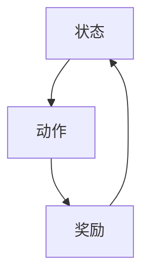
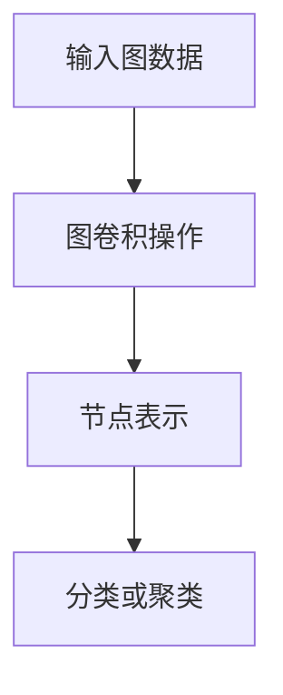

                 

# AI Agent在企业网络安全防御中的前沿应用

> 关键词：AI Agent, 企业网络安全, 强化学习, 图神经网络, 网络安全防御, 自动化安全

> 摘要：随着企业网络安全威胁的日益复杂化，传统的安全防御方法逐渐暴露出其局限性。AI Agent作为一种智能化的安全解决方案，正在成为企业网络安全防御的重要组成部分。本文将深入探讨AI Agent的核心概念、算法原理、系统架构以及在企业网络安全中的具体应用，为企业安全团队提供实践指导和前沿洞察。

---

## 第一部分: AI Agent在企业网络安全防御中的前沿应用

### 第1章: AI Agent与企业网络安全概述

#### 1.1 AI Agent的基本概念

##### 1.1.1 什么是AI Agent
AI Agent（人工智能代理）是一种能够感知环境、做出决策并采取行动的智能实体。它通过数据采集、分析和学习，能够自主执行安全任务，如威胁检测、漏洞修复和安全策略优化。

##### 1.1.2 AI Agent的核心特点
- **自主性**：能够自主执行任务，无需人工干预。
- **反应性**：能够实时感知环境变化并做出反应。
- **学习能力**：通过机器学习算法不断优化自身的安全策略。

##### 1.1.3 AI Agent与传统安全防御的区别
传统安全防御依赖于规则匹配和静态策略，而AI Agent能够动态学习和适应，能够在复杂环境下主动发现和应对威胁。

#### 1.2 企业网络安全的现状与挑战

##### 1.2.1 传统企业网络安全的局限性
传统安全防御方法依赖于规则匹配和静态策略，难以应对日益复杂的网络攻击手段，如高级持续性威胁（APT）和零日攻击。

##### 1.2.2 网络攻击的复杂化趋势
攻击者利用人工智能技术进行攻击，使得网络安全威胁更加隐蔽和难以检测。

##### 1.2.3 企业网络安全防御的新需求
企业需要更加智能化、动态化的安全解决方案，以应对复杂多变的网络安全威胁。

#### 1.3 AI Agent在企业网络安全中的作用

##### 1.3.1 AI Agent如何提升网络安全能力
通过实时监控网络流量、分析异常行为模式和学习攻击者的策略，AI Agent能够快速识别和应对潜在威胁。

##### 1.3.2 AI Agent在企业网络安全中的应用场景
- **入侵检测与防御**
- **漏洞发现与修复**
- **安全策略优化**
- **事件响应与恢复**

##### 1.3.3 AI Agent与企业安全策略的结合
AI Agent能够与企业现有的安全策略和系统无缝集成，提供更加智能化的安全防护能力。

---

### 第2章: AI Agent的核心概念与原理

#### 2.1 AI Agent的核心概念

##### 2.1.1 感知层
感知层负责采集网络环境中的各种数据，包括网络流量、日志信息和用户行为等。

##### 2.1.2 决策层
决策层基于感知层获取的数据，利用机器学习算法进行分析和判断，制定相应的安全策略。

##### 2.1.3 执行层
执行层根据决策层的指令，采取具体的行动，如封禁恶意IP、隔离受感染的设备等。

#### 2.2 AI Agent的感知机制

##### 2.2.1 数据采集与处理
AI Agent通过网络传感器、日志分析工具和行为分析模块，实时采集网络环境中的数据。

##### 2.2.2 异常检测算法
利用异常检测算法（如基于统计的异常检测和基于机器学习的异常检测）识别网络中的异常行为。

##### 2.2.3 行为模式识别
通过用户行为分析（UEBA）技术，识别用户的异常行为模式，发现潜在的安全威胁。

#### 2.3 AI Agent的决策机制

##### 2.3.1 基于强化学习的决策
AI Agent通过强化学习算法（如Q-learning）在复杂的网络环境中做出最优决策。

##### 2.3.2 基于规则的决策
AI Agent也可以基于预定义的安全规则和策略进行决策，适用于已知威胁的应对。

##### 2.3.3 综合决策模型
结合强化学习和规则驱动的决策模型，构建更加鲁棒的综合决策系统。

#### 2.4 AI Agent的执行机制

##### 2.4.1 自动化响应策略
AI Agent能够根据决策结果自动执行安全响应，如封锁恶意IP、隔离设备等。

##### 2.4.2 安全策略优化
AI Agent通过学习和优化，不断调整和改进安全策略，提高防御能力。

##### 2.4.3 实时监控与反馈
AI Agent能够实时监控网络环境的变化，并根据反馈信息不断优化自身的安全策略。

---

### 第3章: AI Agent的算法原理与数学模型

#### 3.1 常见AI算法在网络安全中的应用

##### 3.1.1 强化学习
强化学习是一种通过试错和奖励机制来优化决策的算法，广泛应用于网络安全中的自主决策场景。

##### 3.1.2 图神经网络
图神经网络能够处理复杂的网络结构数据，适用于网络安全中的威胁传播建模和异常检测。

##### 3.1.3 聚类与分类算法
聚类和分类算法常用于网络流量分析和异常行为识别。

#### 3.2 强化学习在AI Agent中的应用

##### 3.2.1 Q-learning算法
Q-learning是一种经典的强化学习算法，适用于离散动作空间的决策问题。

##### 3.2.2 算法流程图（Mermaid）

##### 3.2.3 数学模型与公式
$$ Q(s,a) = r + \gamma \max Q(s',a') $$

其中，$s$表示当前状态，$a$表示动作，$r$表示奖励，$\gamma$表示折扣因子，$Q(s',a')$表示下一个状态的最大Q值。

#### 3.3 图神经网络在网络安全中的应用

##### 3.3.1 图结构数据的表示
网络安全中的图结构数据包括网络拓扑、用户行为网络和威胁传播图。

##### 3.3.2 图神经网络模型
常用的图神经网络模型包括GCN、GAT和GraphSAGE。

##### 3.3.3 算法流程图（Mermaid）

---

### 第4章: AI Agent的系统架构与实现

#### 4.1 系统架构设计

##### 4.1.1 数据采集模块
数据采集模块负责收集网络流量、日志和用户行为数据。

##### 4.1.2 数据分析模块
数据分析模块利用机器学习算法对数据进行分析和处理，识别异常行为。

##### 4.1.3 决策模块
决策模块基于分析结果制定安全策略，并通过强化学习优化决策。

##### 4.1.4 执行模块
执行模块根据决策结果执行具体的网络安全操作，如封锁IP、隔离设备等。

#### 4.2 系统实现细节

##### 4.2.1 数据采集与预处理
数据采集模块需要支持多种数据源，并对数据进行清洗和预处理。

##### 4.2.2 算法实现
实现强化学习和图神经网络算法，并将其集成到AI Agent系统中。

##### 4.2.3 系统接口设计
设计系统接口，实现与企业现有安全系统的集成。

#### 4.3 项目实战: 企业网络入侵检测系统

##### 4.3.1 项目环境配置
安装必要的软件和工具，配置网络环境。

##### 4.3.2 核心代码实现
实现数据采集、异常检测和决策模块的代码。

##### 4.3.3 系统设计与实现
设计系统架构，实现各模块的集成和协调。

##### 4.3.4 测试与优化
进行系统测试，优化算法和系统性能。

---

### 第5章: 最佳实践与未来展望

#### 5.1 最佳实践

##### 5.1.1 系统部署与配置
确保AI Agent系统的稳定运行，定期更新算法模型。

##### 5.1.2 安全策略优化
根据实际运行情况，不断优化安全策略和决策模型。

##### 5.1.3 团队协作
AI Agent的部署和维护需要安全团队、运维团队和开发团队的紧密合作。

#### 5.2 小结

##### 5.2.1 AI Agent的优势
- **智能化**：能够自主学习和适应网络环境。
- **动态性**：能够实时感知和应对网络安全威胁。
- **高效性**：能够快速识别和应对复杂的安全威胁。

##### 5.2.2 需要注意的事项
- **数据隐私**：确保数据采集和处理过程中的隐私保护。
- **算法选择**：根据具体需求选择合适的算法和模型。
- **系统维护**：定期更新和优化系统，确保其正常运行。

#### 5.3 未来展望

##### 5.3.1 AI Agent的进一步发展
随着人工智能技术的不断进步，AI Agent在企业网络安全中的应用将更加广泛和深入。

##### 5.3.2 新兴技术的影响
新兴技术（如边缘计算和区块链）将为AI Agent在企业网络安全中的应用提供新的机遇和挑战。

##### 5.3.3 行业趋势
企业网络安全将更加智能化和自动化，AI Agent将成为企业安全防护的核心组成部分。

---

### 作者：AI天才研究院/AI Genius Institute & 禅与计算机程序设计艺术 /Zen And The Art of Computer Programming

