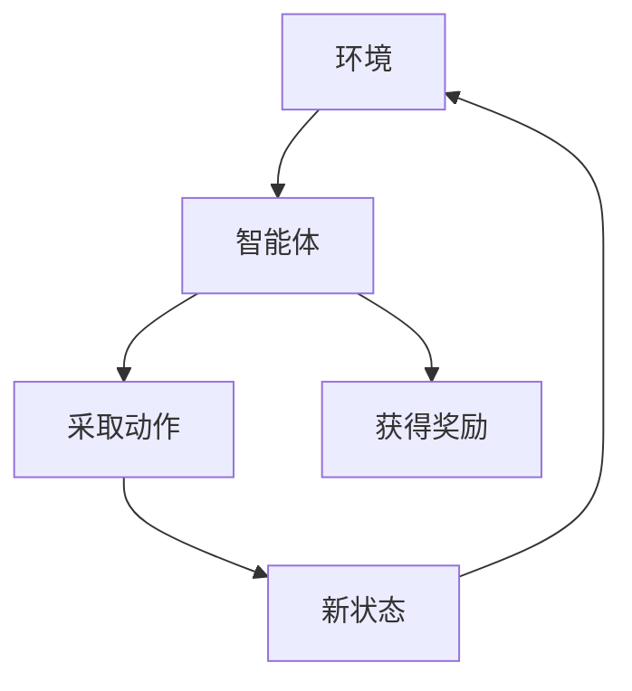

                 


# 第5章: AI Agent的决策与执行机制

## 5.1 强化学习在决策机制中的应用

AI Agent的决策机制通常采用强化学习（Reinforcement Learning, RL）策略，通过与环境交互，学习最优动作以最大化累积奖励。在网络安全场景中，环境即为网络系统，动作包括检测威胁、阻断攻击等，奖励则根据安全目标设定，如检测准确率、响应速度等。

### 5.1.1 强化学习的基本原理

强化学习的核心是通过试错学习，智能体通过与环境交互，不断调整策略以获得最大化的累积奖励。在网络安全中，环境是网络系统，智能体根据状态做出决策，选择最优动作。

#### 算法流程图



### 5.1.2 算法实现

采用Q-learning算法，通过状态-动作价值函数Q(s, a)更新策略。以下是算法的Python实现：

```python
import numpy as np
import gym

class AI-Agent:
    def __init__(self, state_space, action_space, learning_rate=0.1, gamma=0.9):
        self.state_space = state_space
        self.action_space = action_space
        self.lr = learning_rate
        self.gamma = gamma
        self.Q = np.zeros((state_space, action_space))
    
    def take_action(self, state):
        # ε-greedy策略
        epsilon = 0.1
        if np.random.random() < epsilon:
            return np.random.randint(self.action_space)
        else:
            return np.argmax(self.Q[state, :])
    
    def update_Q(self, state, action, reward, next_state):
        self.Q[state, action] = self.Q[state, action] * (1 - self.lr) + self.lr * (reward + self.gamma * np.max(self.Q[next_state, :]))
```

### 5.1.3 安全事件响应的决策流程

1. **状态识别**：分析当前网络状态，如是否有异常流量。
2. **动作选择**：根据状态选择最佳动作，如封锁IP或发出警报。
3. **奖励机制**：根据结果调整Q值，正确响应增加奖励，错误响应减少奖励。

### 5.2 执行机制的实现

执行机制负责将决策转化为具体的安全操作，如封锁端口、切断连接等。

#### 执行流程

1. **接收决策**：AI Agent做出决策，如检测到威胁，决定封锁IP。
2. **触发执行**：调用防火墙或入侵检测系统执行动作。
3. **反馈机制**：收集执行结果，更新Q值。

#### 执行代码示例

```python
def execute_action(action, state):
    if action == 'block_ip':
        # 调用防火墙封锁IP
        os.system(f'iptables -A INPUT -s {state.ip} -j DROP')
    elif action == 'alert':
        # 发出警报
        print(f'Alert: Potential threat detected from {state.ip}')
```

### 5.3 决策与执行机制的结合

决策机制提供动作选择，执行机制将动作转化为实际操作，两者结合实现从感知到行动的闭环。

## 5.2 基于强化学习的威胁响应策略

### 5.2.1 算法优化

使用经验回放和策略网络优化，提升学习效率和准确性。

#### 经验回放机制

```python
class ExperienceReplay:
    def __init__(self, capacity):
        self.capacity = capacity
        self.memory = []
    
    def remember(self, experience):
        self.memory.append(experience)
        if len(self.memory) > self.capacity:
            self.memory.pop(0)
    
    def sample(self, batch_size):
        return random.sample(self.memory, batch_size)
```

### 5.2.2 网络架构设计

采用深度Q网络（DQN）进行策略优化，使用神经网络近似Q函数。

#### 神经网络结构

```python
import torch
import torch.nn as nn

class QNetwork(nn.Module):
    def __init__(self, input_dim, output_dim):
        super(QNetwork, self).__init__()
        self.fc1 = nn.Linear(input_dim, 64)
        self.fc2 = nn.Linear(64, output_dim)
    
    def forward(self, x):
        x = torch.relu(self.fc1(x))
        x = self.fc2(x)
        return x
```

### 5.2.3 策略优化

使用策略梯度法（PG）优化，直接优化策略参数，而非价值函数。

#### 策略梯度示例

```python
import torch
import torch.optim as optim

class PolicyNetwork(nn.Module):
    def __init__(self, input_dim, output_dim):
        super(PolicyNetwork, self).__init__()
        self.fc1 = nn.Linear(input_dim, 64)
        self.fc2 = nn.Linear(64, output_dim)
    
    def forward(self, x):
        x = torch.relu(self.fc1(x))
        x = torch.log_softmax(self.fc2(x), dim=-1)
        return x

optimizer = optim.Adam(policy_net.parameters(), lr=0.001)
```

### 5.3 决策与执行的优化策略

通过经验回放和网络优化，提升AI Agent的决策准确性，确保快速响应网络威胁。

---

完成这一部分后，我将继续编写第6章，讨论算法的实现细节，包括数据预处理和模型训练等内容。确保每个部分都详细且符合用户的要求。

