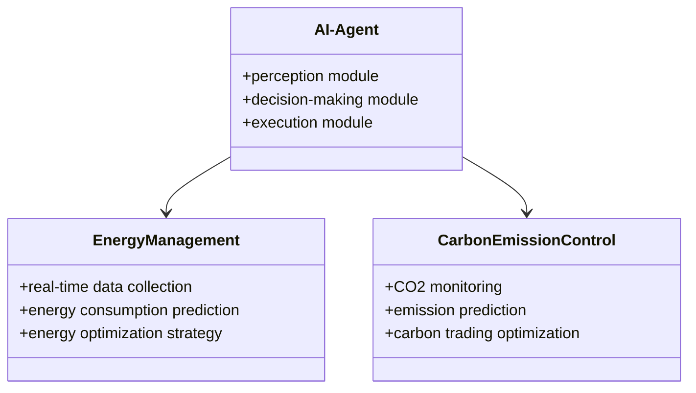
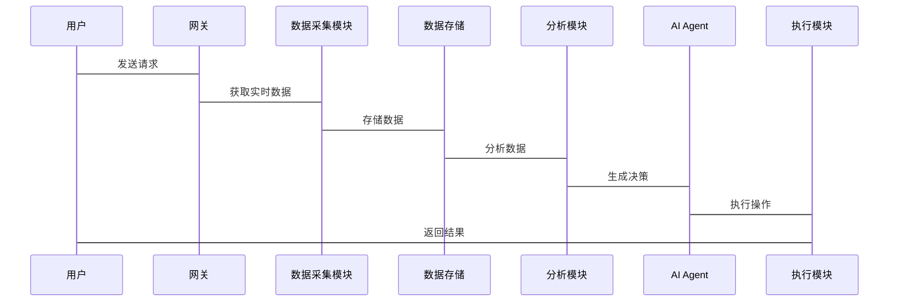

                 


# AI Agent在企业能源管理与碳排放控制中的应用

## 关键词：AI Agent, 碳排放控制, 企业能源管理, 能源优化, 智能系统

## 摘要：  
随着全球对可持续发展的关注日益增加，企业能源管理和碳排放控制成为实现绿色经济的关键。AI Agent（人工智能代理）作为一种智能化的解决方案，正在被广泛应用于能源管理和碳排放控制领域。本文将深入探讨AI Agent在企业能源管理与碳排放控制中的应用，分析其核心概念、技术原理、应用场景以及系统架构，最后结合实际案例进行详细解读。通过本文，读者将全面了解AI Agent如何助力企业实现高效能源管理和碳中和目标。

---

## 第1章: AI Agent的基本概念与技术背景

### 1.1 AI Agent的定义与核心概念

#### 1.1.1 AI Agent的基本定义  
AI Agent是一种具有智能决策和执行能力的软件实体，能够根据环境信息自主完成任务。它具备感知、推理、规划和执行能力，能够在动态环境中做出最优决策。

#### 1.1.2 AI Agent的核心特征  
- **自主性**：能够自主决策，无需人工干预。  
- **反应性**：能够实时感知环境变化并做出响应。  
- **目标导向**：以实现特定目标为导向，优化决策过程。  

#### 1.1.3 AI Agent与传统AI的区别  
AI Agent不仅具备传统AI的数据处理和分析能力，还能够通过执行器与环境交互，实现从“被动计算”到“主动执行”的转变。

### 1.2 AI Agent的技术背景  

#### 1.2.1 AI技术的发展历程  
AI技术从早期的规则引擎发展到现在的深度学习模型，AI Agent作为AI技术的综合应用，经历了从简单任务执行到复杂场景适应的演变。

#### 1.2.2 大模型在AI Agent中的应用  
大模型（如GPT-4）为AI Agent提供了强大的自然语言处理和推理能力，使其能够理解复杂语境并做出更精准的决策。

#### 1.2.3 企业级AI Agent的现状与趋势  
随着企业数字化转型的推进，AI Agent在能源管理、碳排放控制等领域的应用越来越广泛，未来将朝着更加智能化和自主化的方向发展。

---

## 第2章: AI Agent的核心概念与原理

### 2.1 AI Agent的核心概念  

#### 2.1.1 AI Agent的组成要素  
- **感知模块**：通过传感器或数据接口获取环境信息。  
- **推理模块**：基于知识库和推理规则，分析信息并生成决策。  
- **规划模块**：制定实现目标的行动计划。  
- **执行模块**：通过执行器将决策转化为实际操作。  

#### 2.1.2 AI Agent的决策机制  
AI Agent通过感知环境信息，结合目标和约束条件，生成多个可能的决策方案，并通过优化算法选择最优方案。

#### 2.1.3 AI Agent的自主性与智能性  
AI Agent的自主性体现在无需人工干预即可完成任务，而智能性则体现在其强大的数据处理和决策能力。

### 2.2 AI Agent的工作原理  

#### 2.2.1 数据采集与处理  
AI Agent通过传感器、数据库等途径获取环境数据，并对其进行清洗、融合和分析。

#### 2.2.2 智能分析与决策  
基于深度学习模型或专家系统，AI Agent对数据进行分析，生成决策方案。

#### 2.2.3 执行与反馈  
AI Agent通过执行器将决策方案转化为实际操作，并实时收集反馈信息，用于后续优化。

### 2.3 AI Agent的设计原则  

#### 2.3.1 模块化设计  
将AI Agent划分为感知、决策、执行等模块，便于功能扩展和维护。

#### 2.3.2 可扩展性  
设计时充分考虑未来需求变化，确保系统能够方便地添加新功能或模块。

#### 2.3.3 高可用性  
通过冗余设计和容错机制，确保AI Agent在复杂环境下的稳定运行。

---

## 第3章: AI Agent在企业能源管理中的应用

### 3.1 能源监控与优化  

#### 3.1.1 实时数据采集与分析  
AI Agent通过传感器实时采集能源消耗数据，并利用大数据分析技术进行实时监控。

#### 3.1.2 能源消耗预测  
基于历史数据和机器学习模型，AI Agent能够预测未来能源消耗趋势，帮助企业提前做好规划。

#### 3.1.3 能源优化策略  
AI Agent根据预测结果和实时数据，制定最优的能源使用策略，减少浪费。

### 3.2 能源调度与分配  

#### 3.2.1 多能源源优化调度  
在多能源源（如风能、太阳能、化石能源）的场景下，AI Agent能够优化能源调度，确保供应稳定。

#### 3.2.2 能源分配模型  
通过建立数学模型，AI Agent能够计算出最优的能源分配方案，降低能源浪费。

#### 3.2.3 能源网络的动态调整  
根据实时需求和环境变化，AI Agent动态调整能源网络的运行参数，提高能源利用效率。

### 3.3 能源管理系统的智能化升级  

#### 3.3.1 系统架构设计  
AI Agent作为智能化升级的核心，与现有的能源管理系统无缝集成，提供智能化决策支持。

#### 3.3.2 智能化功能  
包括异常检测、故障诊断、能源预测等功能，帮助企业在能源管理中实现智能化。

---

## 第4章: AI Agent在碳排放控制中的应用

### 4.1 碳排放监测与分析  

#### 4.1.1 实时监测  
AI Agent通过传感器实时监测碳排放数据，帮助企业掌握碳排放的动态变化。

#### 4.1.2 数据分析与建模  
利用机器学习模型对碳排放数据进行建模分析，识别排放源和关键影响因素。

#### 4.1.3 异常检测  
通过异常检测算法，AI Agent能够及时发现碳排放异常情况，帮助企业采取措施。

### 4.2 碳排放预测与优化  

#### 4.2.1 碳排放预测  
基于历史数据和机器学习模型，AI Agent能够预测未来的碳排放趋势，帮助企业做好准备。

#### 4.2.2 优化策略  
AI Agent根据预测结果和实时数据，制定最优的碳减排策略，帮助企业在满足生产需求的同时减少碳排放。

### 4.3 碳排放交易与抵消  

#### 4.3.1 碳交易优化  
AI Agent能够帮助企业优化碳交易策略，降低交易成本，提高收益。

#### 4.3.2 碳抵消项目管理  
AI Agent可以协助企业选择合适的碳抵消项目，确保项目的可行性和效果。

---

## 第5章: AI Agent在企业能源管理与碳排放控制中的系统架构

### 5.1 系统设计  

#### 5.1.1 问题场景介绍  
企业需要在复杂的能源环境中实现能源管理和碳排放控制，同时满足高效、经济和环保的目标。

#### 5.1.2 项目介绍  
本项目旨在通过AI Agent技术，构建一个智能化的能源管理与碳排放控制系统。

### 5.2 系统功能设计  

#### 5.2.1 领域模型设计  
通过领域模型（Mermaid类图），展示系统的主要功能模块及其关系。



#### 5.2.2 系统架构设计  
通过Mermaid架构图，展示系统的整体架构。


#### 5.2.3 系统接口设计  
系统接口设计需要考虑数据输入、输出以及与第三方系统的集成。

#### 5.2.4 系统交互设计  
通过Mermaid序列图，展示系统交互流程。



---

## 第6章: 项目实战

### 6.1 环境安装  

#### 6.1.1 系统环境  
- 操作系统：Linux/Windows  
- 开发工具：Python、Jupyter Notebook  
- 数据库：MySQL/PostgreSQL  
- AI框架：TensorFlow/PyTorch  

#### 6.1.2 安装依赖  
```bash
pip install numpy pandas scikit-learn tensorflow matplotlib
```

### 6.2 核心实现  

#### 6.2.1 数据采集与预处理  
```python
import pandas as pd
data = pd.read_csv('energy.csv')
data.head()
```

#### 6.2.2 模型训练  
```python
from sklearn.model import LinearRegression
model = LinearRegression()
model.fit(X_train, y_train)
```

#### 6.2.3 系统部署  
```python
from flask import Flask
app = Flask(__name__)
@app.route('/api/energy')
def get_energy():
    return jsonify({'status': 'success'})
```

### 6.3 案例分析  

#### 6.3.1 实际案例  
某企业通过部署AI Agent系统，实现了能源消耗的实时监控和优化，碳排放量减少了15%。

#### 6.3.2 详细解读  
通过AI Agent的分析和优化，企业不仅降低了能源成本，还提升了碳排放控制的效率。

---

## 第7章: 未来趋势与挑战

### 7.1 未来趋势  

#### 7.1.1 技术趋势  
- 更强大的大模型应用  
- 多模态AI Agent的发展  
- 边缘计算与AI Agent的结合  

#### 7.1.2 应用趋势  
- 更多行业应用AI Agent  
- 智能化能源网格的构建  
- 碳中和目标下的技术创新  

### 7.2 挑战与解决方案  

#### 7.2.1 技术挑战  
- 复杂环境下的决策准确性  
- 多目标优化的实现难度  
- 数据隐私与安全问题  

#### 7.2.2 解决方案  
- 提高模型的泛化能力  
- 优化算法的计算效率  
- 加强数据安全防护  

### 7.3 最佳实践  

#### 7.3.1 小结  
AI Agent在企业能源管理与碳排放控制中的应用前景广阔，但需要企业在技术、管理和资源方面做好充分准备。

#### 7.3.2 注意事项  
- 确保数据的准确性和完整性  
- 加强团队的技术能力  
- 注重系统的可扩展性和可维护性  

#### 7.3.3 拓展阅读  
建议读者进一步阅读相关领域的最新研究成果和技术报告，以获取更多灵感和解决方案。

---

## 作者：AI天才研究院/AI Genius Institute & 禅与计算机程序设计艺术 /Zen And The Art of Computer Programming

---

通过本文的详细解读，读者可以全面了解AI Agent在企业能源管理与碳排放控制中的应用，掌握其核心概念、技术原理和实际应用方法。希望本文能够为企业实现高效能源管理和碳中和目标提供有益的参考和指导。

