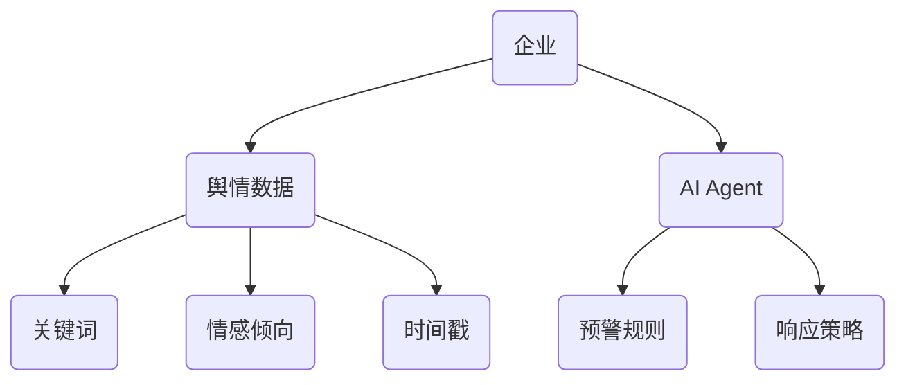
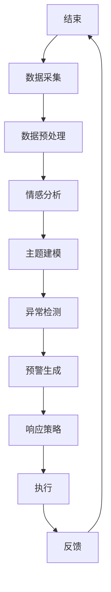

                 


好的，让我们一步步思考如何构建这篇文章。

### 第一步：确定文章结构和目标

我们希望撰写一篇关于AI Agent在企业舆情危机预警与响应中的实时应用的文章，目标是通过清晰的结构、专业的技术语言和丰富的案例分析，帮助读者理解AI Agent在舆情管理中的重要性及其实际应用。

### 第二步：撰写摘要

摘要部分需要简明扼要地概括文章的核心内容，说明AI Agent如何利用自然语言处理、机器学习和实时数据处理技术，实现对企业舆情的实时监控和智能响应，从而帮助企业有效管理和应对舆情危机。

### 第三步：撰写关键词

列出5-7个核心关键词，包括AI Agent、企业舆情、实时预警、智能响应、自然语言处理、机器学习、实时数据处理。

### 第四步：撰写文章正文

接下来，我们将根据提供的目录大纲，逐步撰写每个章节的内容。

#### 第1章：问题背景与描述

##### 1.1 问题背景
- **企业舆情危机的定义与特征**：企业舆情是指对企业形象、声誉和市场表现产生影响的公众意见和媒体评论。舆情危机指的是负面舆情对企业造成的严重威胁，包括声誉损失、客户信任度下降等。其特征包括突发性、扩散性、破坏性和公众关注性。
- **对企业的影响**：负面舆情可能导致品牌形象受损、客户流失、股价下跌等问题，甚至引发法律纠纷。
- **当前舆情预警与响应的主要挑战**：信息来源多样、数据量大、处理实时性要求高、情感分析复杂等。

##### 1.2 问题描述
- **舆情数据的实时性要求**：需要实时采集和处理海量数据，确保预警的及时性。
- **舆情信息的多源异构特性**：包括社交媒体、新闻网站、论坛等多种来源，数据格式多样。
- **舆情分析的复杂性与不确定性**：需要处理语言的模糊性、歧义性和情感的多样性。

##### 1.3 问题解决思路
- **引入AI Agent的必要性**：AI Agent能够实时监控、分析和响应舆情，提供智能化的解决方案。
- **AI Agent在舆情预警与响应中的角色定位**：作为智能代理，AI Agent负责数据采集、分析、预警和响应策略的执行。
- **实时应用的核心目标与关键任务**：核心目标是通过实时监控和分析，及时发现潜在风险并采取应对措施。

##### 1.4 边界与外延
- **舆情预警的边界条件**：包括数据来源的限制、预警的范围和精度。
- **舆情响应的范围与限制**：包括响应的及时性、有效性以及资源限制。
- **AI Agent应用的适用场景与局限性**：适用于需要实时响应的场景，但可能受限于数据质量和模型的准确性。

##### 1.5 核心要素与概念结构
- **舆情数据的构成要素**：包括文本内容、发布时间、发布平台、情感倾向等。
- **AI Agent的核心功能模块**：数据采集、分析、预警和响应。
- **实时应用的系统架构**：包括数据源、处理引擎、预警模块和响应模块。

#### 第2章：核心概念与联系

##### 2.1 核心概念原理
- **AI Agent的基本原理**：AI Agent通过感知环境、分析信息并采取行动来实现目标。
- **舆情分析的关键技术**：包括文本挖掘、情感分析、主题建模等。
- **实时数据处理的机制**：通过流数据处理技术，实时采集、处理和分析数据。

##### 2.2 概念属性特征对比
- **舆情数据特征对比表**：比较不同来源的数据特征，如文本长度、情感极性等。
- **AI Agent功能特征对比表**：比较不同AI Agent的功能，如数据采集能力、分析能力等。
- **实时应用性能指标对比表**：比较不同系统的响应时间、处理能力等。

##### 2.3 ER实体关系图


#### 第3章：算法原理讲解

##### 3.1 算法流程


##### 3.2 Python源代码示例
```python
import pandas as pd
from transformers import pipeline

# 数据采集与预处理
def collect_data():
    # 示例：从社交媒体API获取数据
    data = [{'text': '产品不错，但服务有问题', 'time': '2023-10-01'}, {'text': '公司又出问题了', 'time': '2023-10-02'}]
    return data

# 情感分析
sentiment_analyzer = pipeline('sentiment-analysis')
def analyze_sentiment(texts):
    results = []
    for text in texts:
        result = sentiment_analyzer(text)
        results.append({'text': text, 'sentiment': result[0]['label']})
    return results

# 主题建模
from sklearn.decomposition import LatentDirichletAllocation
def topic_modeling(texts):
    # 示例：使用LDA进行主题建模
    vectorizer = CountVectorizer()
    X = vectorizer.fit_transform(texts)
    lda = LatentDirichletAllocation(n_components=3)
    topics = lda.fit_transform(X)
    return topics

# 异常检测
from sklearn.ensemble import IsolationForest
def detect_anomalies(features):
    model = IsolationForest(n_estimators=100, random_state=42)
    model.fit(features)
    anomalies = model.predict(features)
    return anomalies
```

##### 3.3 数学模型和公式
- **情感分析模型**：使用逻辑回归进行二分类任务，公式如下：
  $$ P(y=1|x) = \frac{1}{1 + e^{-(\beta_0 + \beta_1x)}} $$
- **主题建模**：使用LDA模型，主题概率分布公式：
  $$ \theta_{d,k} = \frac{\alpha_k + \sum_{i=1}^{n} \phi_{i,k}}{\sum_{k=1}^{K} (\alpha_k + \sum_{i=1}^{n} \phi_{i,k})} $$

#### 第4章：系统分析与架构设计

##### 4.1 问题场景介绍
企业需要实时监控舆情，及时发现潜在危机，快速响应，以最小化负面影响。

##### 4.2 项目介绍
开发一个基于AI Agent的企业舆情实时预警与响应系统，包括数据采集、分析、预警和响应模块。

##### 4.3 系统功能设计
- **领域模型**：定义系统中的实体和关系，如企业、舆情数据、AI Agent等。
  ```mermaid
  classDiagram
      class 舆情数据 {
          text: str
          time: str
          sentiment: str
      }
      class AI Agent {
          collect_data(): list[舆情数据]
          analyze(): list[分析结果]
          generate预警(): 预警信息
          execute_response(): 响应措施
      }
      class 预警模块 {
          generate_alarm(): 预警信号
      }
      class 响应模块 {
          execute_action(): 响应措施
      }
      舆情数据 --> AI Agent
      AI Agent --> 预警模块
      AI Agent --> 响应模块
  ```

- **系统架构设计**
  ```mermaid
  architecture
      Client --> API Gateway
      API Gateway --> 数据采集模块
      数据采集模块 --> 数据存储
      数据存储 --> 数据处理模块
      数据处理模块 --> 分析模块
      分析模块 --> 预警模块
      预警模块 --> 响应模块
      响应模块 --> 输出
  ```

- **系统接口设计**
  - 数据采集接口：用于从不同数据源获取舆情数据。
  - 分析接口：提供情感分析和主题建模功能。
  - 预警接口：生成并发送预警信号。
  - 响应接口：执行预定义的响应策略。

- **系统交互流程**
  ```mermaid
  sequenceDiagram
      Client ->+ API Gateway: 获取舆情数据
      API Gateway ->+ 数据采集模块: 采集数据
      数据采集模块 ->+ 数据存储: 存储数据
      数据存储 ->+ 数据处理模块: 处理数据
      数据处理模块 ->+ 分析模块: 分析数据
      分析模块 ->+ 预警模块: 生成预警
      预警模块 ->+ 响应模块: 执行响应
      响应模块 -> Client: 返回响应结果
  ```

#### 第5章：项目实战

##### 5.1 环境安装
安装必要的Python库，如`transformers`、`pandas`、`scikit-learn`等。

##### 5.2 核心实现
实现数据采集、情感分析、主题建模和异常检测功能。

##### 5.3 代码解读与分析
- **数据采集模块**：从社交媒体API获取舆情数据。
- **情感分析模块**：使用预训练模型进行情感分析。
- **主题建模模块**：使用LDA进行主题建模。
- **异常检测模块**：识别异常舆情数据。

##### 5.4 实际案例分析
通过具体案例，展示系统如何实时监控舆情，及时预警并采取响应措施。

##### 5.5 项目小结
总结项目实现的关键点和成功经验，讨论可能的优化方向。

#### 第6章：最佳实践、小结、注意事项和拓展阅读

##### 6.1 最佳实践
- 数据预处理的重要性。
- 模型调优和持续学习的必要性。
- 系统的可扩展性和可维护性。

##### 6.2 小结
总结全文，强调AI Agent在企业舆情管理中的重要性及其实际应用价值。

##### 6.3 注意事项
- 数据隐私和安全问题。
- 系统的实时性和稳定性。
- 模型的准确性和可解释性。

##### 6.4 拓展阅读
推荐相关的技术书籍和论文，供读者深入学习。

### 第五步：撰写作者信息

**作者：AI天才研究院 & 禅与计算机程序设计艺术**

### 第六步：检查和润色

确保文章结构清晰，内容详实，语言专业且易于理解。检查所有代码和图表是否正确嵌入，公式是否准确，确保整体逻辑连贯。

完成以上步骤后，文章将具备完整的结构和内容，能够有效地传达AI Agent在企业舆情危机预警与响应中的实时应用价值。

