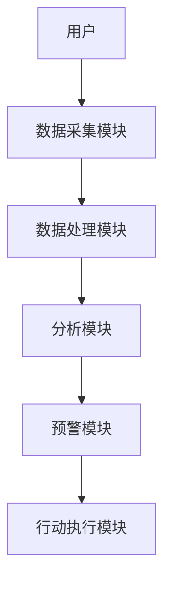

                 


# AI Agent在企业舆情监测与危机公关中的应用

---

## 关键词：  
AI Agent, 企业舆情监测, 危机公关, 自然语言处理, 机器学习, 实时预警

---

## 摘要：  
随着数字化时代的快速发展，企业面临的舆论环境日益复杂，舆情监测与危机公关的重要性愈发凸显。AI Agent（人工智能代理）作为一项前沿技术，能够通过自然语言处理、机器学习等技术，实时监控、分析和应对企业舆情，为企业提供智能化的解决方案。本文将深入探讨AI Agent在企业舆情监测与危机公关中的应用，分析其核心技术、系统架构，并通过实际案例展示其在现实中的价值。

---

## 第一章：AI Agent的基本概念与技术基础

### 1.1 AI Agent的定义与分类

#### 1.1.1 AI Agent的定义  
AI Agent（人工智能代理）是指能够感知环境、自主决策并执行任务的智能系统。它通过传感器获取信息，利用算法进行分析，最终做出决策并采取行动。

#### 1.1.2 AI Agent的主要分类  
AI Agent可以根据功能和应用场景分为以下几类：  
- **基于规则的AI Agent**：通过预定义的规则进行决策，适用于简单的任务。  
- **基于学习的AI Agent**：通过机器学习算法从数据中学习，适用于复杂场景。  
- **基于知识的AI Agent**：依赖知识库进行推理和决策，适用于需要深度理解的任务。  

#### 1.1.3 AI Agent的核心属性与特征  
AI Agent的核心属性包括：  
1. **自主性**：能够自主决策和执行任务。  
2. **反应性**：能够实时感知环境变化并做出反应。  
3. **学习性**：能够通过数据学习和优化。  
4. **适应性**：能够根据环境变化调整自身行为。

---

### 1.2 AI Agent的工作原理

#### 1.2.1 信息感知与数据处理  
AI Agent通过多种传感器（如社交媒体API、新闻爬虫等）获取数据，并利用自然语言处理技术进行文本分析。  

#### 1.2.2 智能决策与行动执行  
AI Agent通过机器学习模型对数据进行分析，生成决策，并通过API或其他接口执行相应的行动（如发布声明、调整营销策略等）。  

#### 1.2.3 自适应与学习能力  
AI Agent能够根据历史数据和新数据不断优化自身的模型，提升决策的准确性。

---

### 1.3 AI Agent与传统软件的区别

#### 1.3.1 传统软件的特点  
传统软件依赖于预定义的规则和逻辑，无法自主学习和适应环境。  

#### 1.3.2 AI Agent的独特优势  
AI Agent能够通过学习和适应，处理复杂和动态的环境，提供更智能的解决方案。  

#### 1.3.3 两者的对比分析  
| 对比维度 | 传统软件 | AI Agent |  
|----------|-----------|-----------|  
| 自主性 | 低 | 高 |  
| 学习能力 | 无 | 有 |  
| 适应性 | 低 | 高 |  

---

## 第二章：企业舆情监测的背景与需求

### 2.1 企业舆情监测的背景

#### 2.1.1 当前舆论环境的特点  
随着社交媒体的普及，舆论传播速度快、范围广，企业面临的风险也日益增加。  

#### 2.1.2 企业舆情监测的重要性  
舆情监测能够帮助企业及时发现潜在风险，制定应对策略，维护品牌形象。  

#### 2.1.3 传统舆情监测方法的局限性  
传统方法依赖人工分析，效率低、成本高，难以应对海量数据。

---

### 2.2 AI Agent在舆情监测中的应用价值

#### 2.2.1 提高舆情监测的效率  
AI Agent能够实时监控海量数据，快速生成报告。  

#### 2.2.2 增强舆情分析的准确性  
通过自然语言处理技术，AI Agent能够准确识别情感倾向和关键词。  

#### 2.2.3 实现实时监控与预警  
AI Agent能够在舆情事件发生初期发出预警，帮助企业提前应对。

---

### 2.3 本章小结  
本章介绍了企业舆情监测的背景与需求，并分析了AI Agent在其中的应用价值。

---

## 第三章：AI Agent的核心技术与实现

### 3.1 自然语言处理技术

#### 3.1.1 自然语言处理的基本概念  
自然语言处理（NLP）是研究人类语言规律的计算机科学，旨在让计算机能够理解人类语言。  

#### 3.1.2 文本情感分析  
情感分析是NLP中的重要任务，用于判断文本的情感倾向（如正面、负面、中性）。  

#### 3.1.3 情感分析在舆情监测中的应用  
通过情感分析，AI Agent能够快速判断公众对企业某一事件的舆论倾向。

---

### 3.2 机器学习技术

#### 3.2.1 机器学习的基本概念  
机器学习是一种人工智能技术，通过数据训练模型，使其能够进行预测和分类。  

#### 3.2.2 机器学习在舆情监测中的应用  
- **分类任务**：将舆情分为正面、负面、中性。  
- **聚类任务**：将相似的舆情归为一类。  

---

### 3.3 实时数据处理技术

#### 3.3.1 数据采集与预处理  
AI Agent通过API获取社交媒体数据，并进行清洗和标注。  

#### 3.3.2 数据分析与预警  
通过对数据的实时分析，AI Agent能够快速识别潜在危机，并发出预警。

---

### 3.4 本章小结  
本章详细介绍了AI Agent在舆情监测中的核心技术，包括自然语言处理和机器学习技术。

---

## 第四章：系统架构设计与实现

### 4.1 系统功能设计

#### 4.1.1 领域模型设计  
- **实体识别**：识别文本中的关键实体（如人名、地名）。  
- **情感分析**：判断文本的情感倾向。  

#### 4.1.2 系统功能模块  
- **数据采集模块**：负责采集舆情数据。  
- **数据处理模块**：对数据进行清洗和标注。  
- **分析模块**：利用NLP和机器学习技术进行分析。  
- **预警模块**：根据分析结果发出预警。  

---

### 4.2 系统架构设计

#### 4.2.1 总体架构图  


#### 4.2.2 关键模块设计  
- **数据采集模块**：通过API获取社交媒体数据。  
- **分析模块**：利用预训练的NLP模型进行分析。  

---

### 4.3 接口设计

#### 4.3.1 数据接口  
- **输入接口**：接收舆情数据。  
- **输出接口**：返回分析结果。  

#### 4.3.2 用户接口  
- **Web界面**：供用户查看分析结果。  

---

### 4.4 本章小结  
本章详细介绍了AI Agent舆情监测系统的架构设计与实现。

---

## 第五章：项目实战与案例分析

### 5.1 项目背景

#### 5.1.1 项目目标  
开发一个基于AI Agent的企业舆情监测系统。  

#### 5.1.2 项目需求  
- 实时监控社交媒体数据。  
- 自动生成舆情分析报告。  

---

### 5.2 系统实现

#### 5.2.1 环境搭建  
- **Python 3.8+**  
- **NLP库**：spaCy、NLTK  
- **机器学习库**：Scikit-learn  

#### 5.2.2 核心代码实现  

##### 数据采集模块  
```python
import requests

def fetch_data(api_key):
    url = f"https://api.social media.com/v1/tweets?access_token={api_key}"
    response = requests.get(url)
    return response.json()
```

##### 情感分析模块  
```python
from sklearn.feature_extraction.text import TfidfVectorizer
from sklearn.svm import SVC

vectorizer = TfidfVectorizer()
model = SVC()
```

---

### 5.3 案例分析

#### 5.3.1 案例背景  
某企业面临负面舆情，AI Agent通过实时监控发现并发出预警。  

#### 5.3.2 处理流程  
1. 数据采集模块获取相关数据。  
2. 分析模块进行情感分析，判断为负面舆情。  
3. 预警模块发出预警，并建议应对策略。  

---

### 5.4 本章小结  
本章通过实际案例展示了AI Agent在企业舆情监测中的应用。

---

## 第六章：最佳实践与未来展望

### 6.1 最佳实践

#### 6.1.1 数据质量管理  
确保数据的准确性和完整性。  

#### 6.1.2 模型优化  
定期更新模型，提升分析精度。  

---

### 6.2 未来展望

#### 6.2.1 技术发展方向  
- 更加智能化的舆情预测模型。  
- 多模态数据的融合分析。  

#### 6.2.2 应用场景拓展  
AI Agent技术可以应用于更多领域，如金融风险监控、医疗舆情分析等。

---

## 第七章：总结与展望

### 7.1 本章总结  
本文详细探讨了AI Agent在企业舆情监测与危机公关中的应用，分析了其核心技术、系统架构，并通过实际案例展示了其价值。

### 7.2 未来展望  
随着技术的不断发展，AI Agent将在更多领域发挥重要作用，为企业提供更智能的解决方案。

---

## 作者：AI天才研究院/AI Genius Institute & 禅与计算机程序设计艺术 /Zen And The Art of Computer Programming

