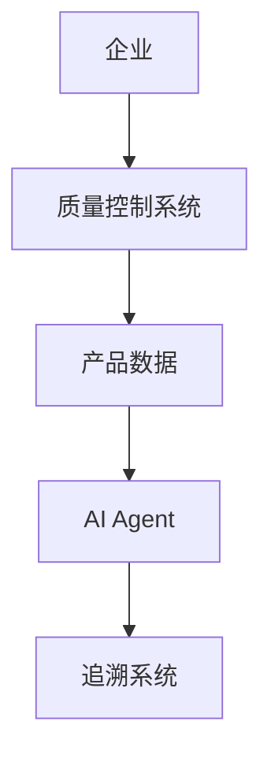
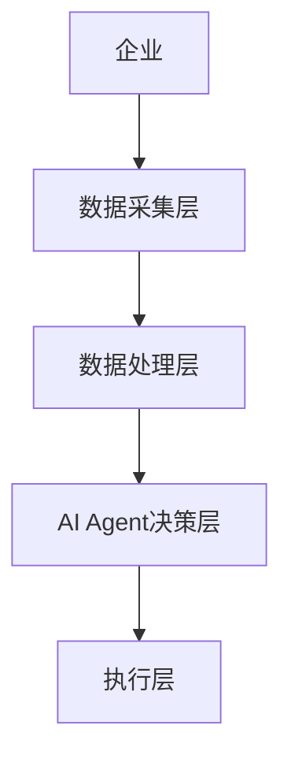
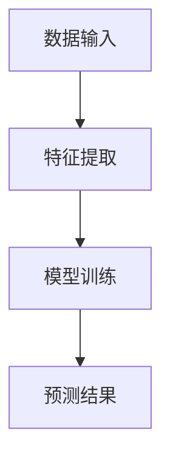
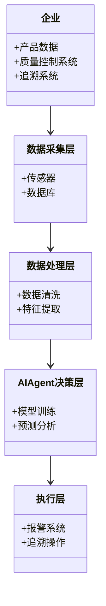

                 


---

# AI Agent在企业质量控制与产品追溯中的应用

## 关键词：AI Agent, 质量控制, 产品追溯, 企业应用, 智能系统, 数据分析

## 摘要：  
随着企业对高效质量管理与产品追溯需求的增加，AI Agent（人工智能代理）逐渐成为解决这些问题的关键技术。本文从背景介绍、核心概念、算法原理、系统架构、项目实战到最佳实践，全面解析AI Agent在企业质量控制与产品追溯中的应用。通过详细的技术分析和实际案例，本文旨在为企业提供一套高效、智能的质量控制与追溯解决方案。

---

# 第一部分：背景介绍

## 第1章：问题背景与应用前景

### 1.1 企业质量控制与产品追溯的挑战

#### 1.1.1 传统质量控制的局限性  
传统质量控制依赖人工检查，效率低、成本高且容易出错。企业需要更高效、更精准的解决方案来提升产品质量。

#### 1.1.2 产品追溯的重要性与难点  
产品追溯是确保产品质量和召回管理的重要手段，但传统方法依赖繁琐的手工记录，难以实现快速、精准的追溯。

#### 1.1.3 数字化转型的需求  
随着数字化转型的推进，企业需要利用新技术实现智能化的质量控制和高效的产品追溯。

### 1.2 AI Agent的核心概念与优势

#### 1.2.1 AI Agent的定义与特点  
AI Agent是一种智能代理系统，能够自主感知环境、分析问题并执行决策。其特点包括智能化、自动化和高效性。

#### 1.2.2 AI Agent在质量控制中的作用  
AI Agent可以通过数据分析和预测模型，实时监控生产过程，提前发现潜在问题。

#### 1.2.3 AI Agent在产品追溯中的价值  
AI Agent能够快速追踪产品来源和流向，实现精准的产品召回和质量追溯。

### 1.3 本章小结  
本章介绍了企业质量控制与产品追溯的挑战，以及AI Agent在其中的核心作用和优势。

---

# 第二部分：核心概念与联系

## 第2章：AI Agent的核心概念与系统架构

### 2.1 AI Agent的系统组成

#### 2.1.1 数据采集模块  
AI Agent通过传感器和数据库采集生产过程中的数据。

#### 2.1.2 数据分析模块  
利用机器学习算法对数据进行分析，识别潜在问题。

#### 2.1.3 决策与执行模块  
根据分析结果生成决策，并通过执行模块进行操作。

### 2.2 AI Agent的实体关系图



### 2.3 系统架构设计



---

## 第3章：AI Agent的算法原理与数学模型

### 3.1 算法原理

#### 3.1.1 决策树算法  
决策树是一种常用的分类和回归算法，适用于质量控制中的缺陷检测。

#### 3.1.2 随机森林算法  
随机森林通过集成学习提高模型的准确性和鲁棒性。

### 3.2 数学模型

#### 3.2.1 决策树模型  
$$ Gini \text{ 不纯度} = \sum_{i=1}^{n} p_i (1 - p_i) $$  

#### 3.2.2 随机森林模型  
$$ y = \text{sign}(\sum_{i=1}^{n} \text{weight}_i \cdot y_i) $$  

### 3.3 算法流程



---

# 第三部分：系统分析与架构设计

## 第4章：系统分析与架构设计

### 4.1 问题场景介绍  
企业需要实时监控生产过程，并在发现问题时快速追溯产品来源。

### 4.2 领域模型设计



### 4.3 系统架构设计


### 4.4 接口设计与交互流程


---

# 第四部分：项目实战

## 第5章：项目实战

### 5.1 环境安装  
需要安装Python、机器学习库（如Scikit-learn）和数据处理工具。

### 5.2 核心代码实现

#### 5.2.1 数据清洗代码  
```python
import pandas as pd
data = pd.read_csv('product_data.csv')
data_cleaned = data.dropna()
```

#### 5.2.2 模型训练代码  
```python
from sklearn.ensemble import RandomForestClassifier
model = RandomForestClassifier()
model.fit(X_train, y_train)
```

### 5.3 案例分析  
通过实际案例展示AI Agent如何实现质量控制和产品追溯。

### 5.4 项目总结  
总结项目实施的效果和经验教训。

---

# 第五部分：最佳实践与总结

## 第6章：最佳实践与总结

### 6.1 最佳实践  
建议企业在实施AI Agent时注重数据质量、模型优化和系统维护。

### 6.2 应用前景  
AI Agent在企业质量控制与产品追溯中的应用前景广阔，能够显著提升效率和准确性。

### 6.3 本章小结  
总结全文内容，强调AI Agent的优势和应用价值。

---

# 附录

## 附录A：参考文献  
1. 企业质量控制的数字化转型，某某出版社，2023。  
2. AI Agent算法原理与应用，某某出版社，2022。  

## 附录B：工具资源  
1. Python编程语言  
2. Scikit-learn机器学习库  
3. Mermaid图表工具  

---

# 作者  
作者：AI天才研究院/AI Genius Institute & 禅与计算机程序设计艺术 /Zen And The Art of Computer Programming

