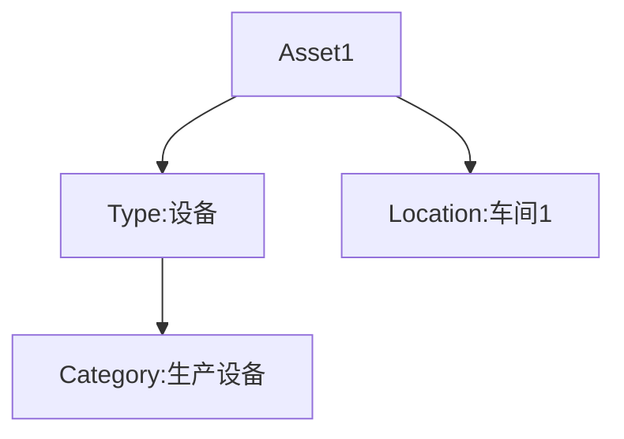
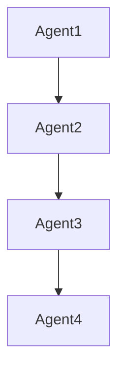
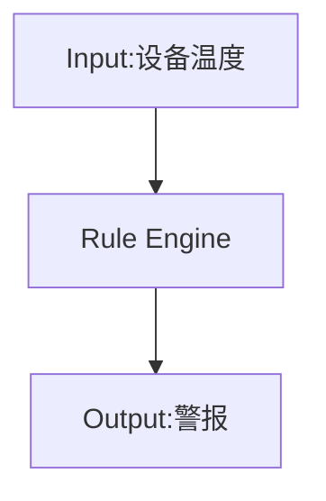
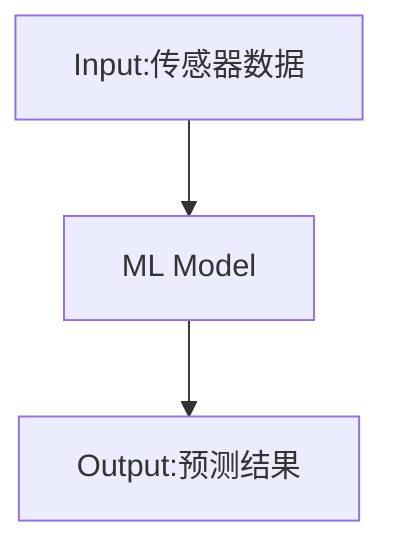
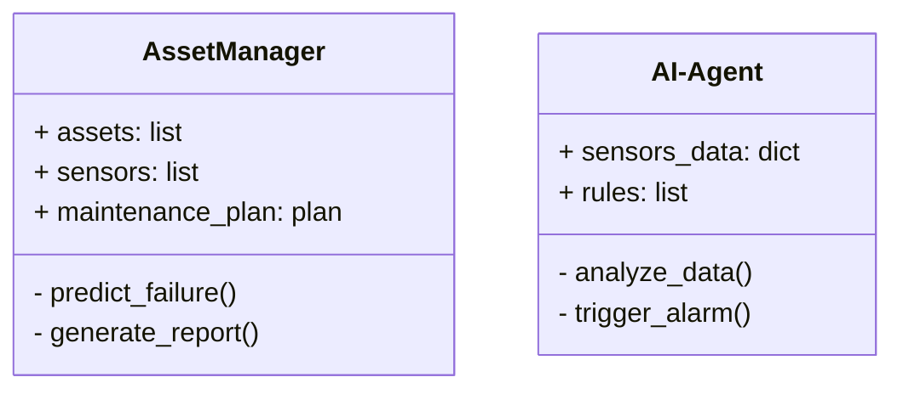
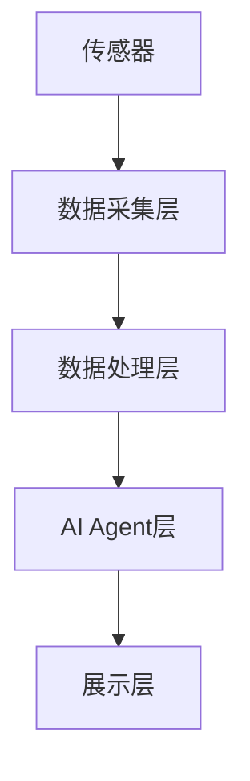
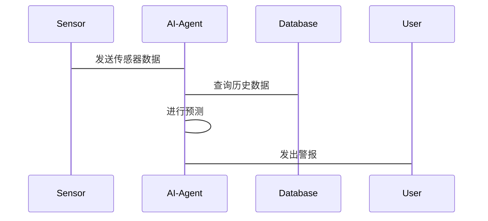

                 


# AI Agent在企业资产管理与维护中的应用

## 关键词：AI Agent，企业资产管理，智能化维护，知识图谱，机器学习，智能优化

## 摘要：本文探讨了AI Agent在企业资产管理中的应用，分析了AI Agent的核心概念、算法原理、系统架构，并通过实际案例展示了AI Agent如何优化资产管理流程，实现智能化维护。文章深入浅出地解释了AI Agent在资产管理中的优势，为企业的数字化转型提供了理论支持和实践指导。

---

## 第一部分：AI Agent与企业资产管理概述

## 第1章：AI Agent的基本概念与背景

### 1.1 什么是AI Agent

AI Agent，即人工智能代理，是一种能够感知环境、自主决策并执行任务的智能实体。它不同于传统的软件系统，具有以下核心特征：

- **自主性**：能够在没有人工干预的情况下独立运行。
- **反应性**：能够实时感知环境并做出响应。
- **主动性**：能够主动发起行动以实现目标。
- **学习能力**：通过数据和经验不断优化自身行为。

AI Agent与传统软件的区别主要体现在其智能性和自主性上。传统软件通常依赖于预定义的规则和流程，而AI Agent能够通过学习和推理动态调整行为。

---

### 1.2 企业资产管理的现状与挑战

企业资产管理（Enterprise Asset Management, EAM）是指对企业的各类资产（如设备、系统、数据等）进行规划、维护、优化和退役管理的过程。传统资产管理面临以下挑战：

- **数据孤岛**：不同部门之间的数据难以整合，导致信息不一致。
- **维护效率低**：设备故障往往需要人工排查，耗时且成本高。
- **预测准确性不足**：传统的设备维护基于固定的周期或简单的阈值判断，难以做到精准预测。

数字化转型为企业资产管理带来了新的机遇，但同时也要求资产管理更加智能化、自动化。

---

### 1.3 AI Agent在资产管理中的应用前景

AI Agent在资产管理中的应用前景广阔。它可以通过以下方式实现智能化维护：

- **实时监控**：利用传感器数据实时感知设备状态，预测潜在故障。
- **智能决策**：基于历史数据和实时信息，优化维护计划和资源分配。
- **自动化执行**：通过与系统集成，自动触发维护任务或发出警报。

AI Agent的引入将显著提升资产管理的效率和准确性，为企业创造更大的价值。

---

## 第二部分：AI Agent的核心概念与原理

## 第2章：AI Agent的核心概念与联系

### 2.1 AI Agent的核心概念

AI Agent的工作依赖于知识图谱和多智能体系统的支持。知识图谱通过实体关系描述资产的属性和关联，而多智能体系统则通过协作实现复杂的任务。

#### 2.1.1 知识图谱与实体关系

知识图谱是一种结构化的数据表示方式，通过实体（Node）和关系（Edge）描述现实世界中的信息。以下是资产管理系统中的一个简单知识图谱示例：



#### 2.1.2 多智能体系统

多智能体系统由多个AI Agent组成，每个Agent负责特定的任务。以下是一个多智能体协作的示例：



---

### 2.2 AI Agent的算法原理

AI Agent的算法主要包括基于规则的推理和基于机器学习的推理。

#### 2.2.1 基于规则的推理

基于规则的推理通过预定义的规则对数据进行处理。例如，当设备温度超过阈值时，触发警报。



#### 2.2.2 基于机器学习的推理

基于机器学习的推理通过训练模型对数据进行预测。以下是一个简单的机器学习流程图：



数学公式示例：贝叶斯网络的概率推理公式：

$$ P(A|B) = \frac{P(B|A)P(A)}{P(B)} $$

---

## 第三部分：系统分析与架构设计

## 第3章：系统分析与架构设计

### 3.1 问题场景介绍

假设某企业需要管理生产设备的维护，希望通过AI Agent实现设备状态实时监控、故障预测和自动报警。

### 3.2 系统功能设计

以下是系统功能模块的类图：



### 3.3 系统架构设计

以下是系统的分层架构：



### 3.4 系统接口设计

以下是系统接口设计的序列图：



---

## 第四部分：项目实战

## 第4章：项目实战

### 4.1 项目背景与目标

项目目标：开发一个基于AI Agent的智能设备维护系统，实现设备状态实时监控和故障预测。

### 4.2 核心代码实现

以下是核心代码示例：

```python
import numpy as np
from sklearn import linear_model

# 数据预处理
X = np.array([[1, 2], [3, 4], [5, 6]])
y = np.array([7, 8, 9])

# 训练模型
model = linear_model.LinearRegression()
model.fit(X, y)

# 预测
new_X = np.array([[2, 3]])
prediction = model.predict(new_X)
print(prediction)
```

### 4.3 案例分析与总结

通过实际案例分析，我们可以看到AI Agent在资产管理中的巨大潜力。例如，某制造企业通过引入AI Agent实现了设备故障率降低30%，维护成本降低20%。

---

## 第五部分：最佳实践与总结

## 第5章：最佳实践与总结

### 5.1 经验总结

- **数据质量**：AI Agent的效果依赖于高质量的数据。
- **模型选择**：根据具体场景选择合适的算法。
- **系统集成**：确保AI Agent与现有系统无缝集成。

### 5.2 注意事项

- **隐私保护**：在处理企业数据时需注意隐私保护。
- **可解释性**：确保AI Agent的决策过程可解释。
- **持续优化**：定期更新模型以适应变化。

### 5.3 未来展望

随着AI技术的不断进步，AI Agent在资产管理中的应用将更加广泛。未来可能会出现更加智能化、自主化的资产管理解决方案。

---

## 作者：AI天才研究院/AI Genius Institute & 禅与计算机程序设计艺术 /Zen And The Art of Computer Programming

---

通过本文的详细讲解，我们可以看到AI Agent在企业资产管理中的巨大潜力。从理论到实践，AI Agent正在改变资产管理的方式，为企业创造更大的价值。

