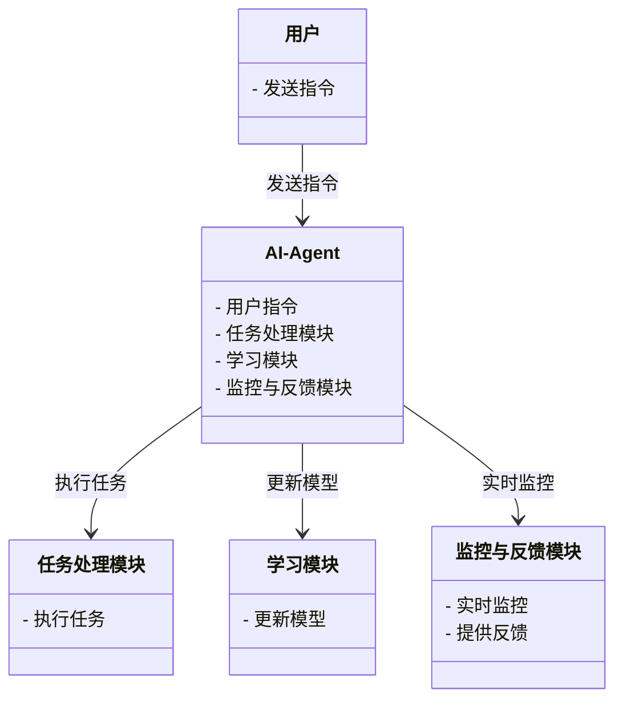
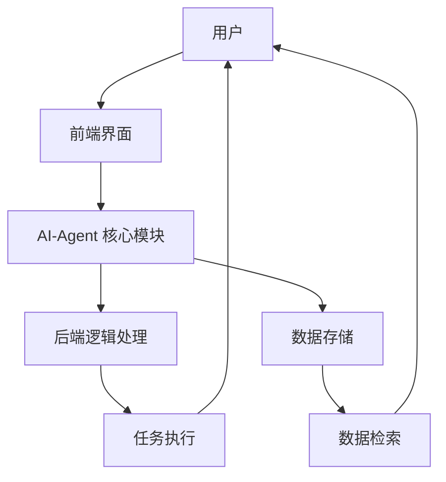

                 


# AI Agent 在企业远程办公支持中的应用

> 关键词：AI Agent, 远程办公, 企业支持, 智能助手, 自动化工具, 信息检索, 工作效率

> 摘要：本文探讨了AI Agent在企业远程办公中的应用，分析了其核心概念、算法原理、系统架构，并通过实际案例展示了其在提升工作效率和团队协作中的潜力。文章旨在为企业在远程办公环境下提供智能化支持的解决方案。

---

## 第1章 AI Agent 的核心概念

### 1.1 AI Agent 的定义与特点

AI Agent（人工智能代理）是一种能够感知环境、自主决策并采取行动以实现目标的智能体。在企业远程办公场景中，AI Agent可以充当员工的智能助手，自动化处理任务、优化流程并提供实时支持。

#### 1.1.1 AI Agent 的核心特点
- **自主性**：AI Agent能够独立执行任务，无需人工干预。
- **反应性**：能够实时感知环境变化并做出响应。
- **目标导向**：基于预设目标或用户需求，采取相应行动。
- **学习能力**：通过机器学习算法不断优化自身的决策能力。

#### 1.1.2 AI Agent 与其他技术的对比
| **技术**       | **特点**                                                                 |
|----------------|--------------------------------------------------------------------------|
| 传统软件       | 需要人工操作，缺乏自主性和适应性                                         |
| 规则引擎       | 基于预设规则进行决策，灵活性有限                                         |
| 机器学习模型   | 基于数据训练，具有较强的学习能力，但需要大量数据支持                 |
| AI Agent       | 结合自主性、目标导向和学习能力，能够灵活适应复杂环境                 |

### 1.2 远程办公的核心需求

远程办公环境下，企业面临以下核心需求：
1. **高效沟通与协作**：确保团队成员能够实时沟通并高效协作。
2. **信息管理与共享**：快速检索和共享相关信息。
3. **任务自动化**：减少重复性工作，提高工作效率。
4. **信息安全**：确保数据在传输和存储过程中的安全性。

### 1.3 AI Agent 在远程办公中的应用场景

#### 1.3.1 智能助手
AI Agent可以作为员工的个人智能助手，帮助其管理日程、安排会议、处理邮件等任务。例如，通过自然语言处理技术，员工只需发送一条指令，AI Agent就能自动完成任务。

#### 1.3.2 自动化流程管理
AI Agent可以自动化处理企业中的重复性任务，如订单处理、数据录入等。通过与企业现有系统的集成，AI Agent能够显著提高工作效率。

#### 1.3.3 智能监控与反馈
AI Agent可以实时监控员工的工作状态，并提供反馈。例如，通过分析键盘输入和鼠标移动，AI Agent可以识别员工的工作效率，并提供建议以优化工作流程。

---

## 第2章 AI Agent 的算法原理

### 2.1 基于规则的AI Agent

基于规则的AI Agent通过预设的规则集来做出决策。例如，当收到一封邮件时，AI Agent可以根据邮件的主题和内容，匹配相应的规则，决定如何处理这封邮件。

#### 2.1.1 算法实现
```python
def handle_email(email_content):
    if 'urgent' in email_content.lower():
        return '标记为紧急'
    elif 'meeting' in email_content.lower():
        return '安排会议'
    else:
        return '存档'
```

### 2.2 基于机器学习的AI Agent

基于机器学习的AI Agent能够通过历史数据进行训练，学习用户的行为模式，并做出更智能的决策。常用的算法包括支持向量机（SVM）和随机森林（Random Forest）。

#### 2.2.1 支持向量机（SVM）
支持向量机是一种监督学习算法，适用于分类任务。在远程办公场景中，可以用于分类员工的工作状态（忙碌、空闲等）。

$$ SVM: \text{minimize} \quad \frac{1}{2} \|w\|^2 + C \sum_{i=1}^{n} \xi_i $$
$$ \text{subject to} \quad y_i (w \cdot x_i + b) \geq 1 - \xi_i $$
$$ \xi_i \geq 0 $$

### 2.3 基于深度学习的AI Agent

基于深度学习的AI Agent利用神经网络进行复杂模式的识别和预测。例如，可以通过自然语言处理（NLP）技术，理解员工的查询内容，并提供相应的建议。

#### 2.3.1 Transformer 模型
Transformer模型是一种基于自注意力机制的深度学习模型，广泛应用于自然语言处理任务。在远程办公场景中，可以用于实时翻译和信息检索。

$$ \text{自注意力机制} = \frac{QK^T}{\sqrt{d_k}} $$
$$ Q, K, V \text{：查询、键、值向量} $$

---

## 第3章 AI Agent 的系统架构设计

### 3.1 系统功能设计

AI Agent 的系统功能设计包括以下几个模块：
1. **用户界面**：提供人机交互的界面，用户可以通过文本或语音输入需求。
2. **任务处理模块**：根据用户的指令，执行相应的任务。
3. **学习模块**：通过机器学习算法不断优化自身的决策能力。
4. **监控与反馈模块**：实时监控用户的工作状态，并提供反馈。

#### 3.1.1 领域模型类图


### 3.2 系统架构设计

#### 3.2.1 系统架构图


---

## 第4章 项目实战

### 4.1 环境安装

为了运行AI Agent，需要安装以下工具和库：
- Python 3.8+
- TensorFlow 2.5+
- Keras 2.5.0
- NLTK 3.7

### 4.2 核心代码实现

#### 4.2.1 自然语言处理模块
```python
from nltk.tokenize import word_tokenize
from nltk.classify import NaiveBayesClassifier

# 示例：分类员工的查询内容
def classify_query(query):
    tokens = word_tokenize(query)
    features = {}
    for word in tokens:
        features[word.lower()] = True
    return NaiveBayesClassifier.classify(features)
```

#### 4.2.2 任务处理模块
```python
import os

def process_task(task):
    if task == 'send_email':
        os.system('python send_email.py')
    elif task == 'schedule_meeting':
        os.system('python schedule_meeting.py')
```

### 4.3 案例分析

#### 4.3.1 查询处理
假设员工发送查询：“如何安排下周的团队会议？” AI Agent通过自然语言处理模块识别出这是一个会议安排请求，并调用任务处理模块安排会议。

#### 4.3.2 自动化处理
AI Agent可以自动处理员工的邮件，例如将邮件分类为“紧急”或“普通”，并根据优先级自动安排处理顺序。

### 4.4 项目小结

通过以上实现，AI Agent能够有效地帮助员工处理日常工作中的各种任务，提高工作效率。同时，通过机器学习算法的不断优化，AI Agent的决策能力将不断增强。

---

## 第5章 最佳实践与未来展望

### 5.1 小结

AI Agent在企业远程办公支持中的应用前景广阔。通过智能化的助手和自动化工具，企业能够显著提高工作效率，降低运营成本。

### 5.2 注意事项

- 数据隐私与安全：在处理员工信息时，必须确保数据的安全性。
- 系统稳定性：AI Agent需要具备高度的稳定性，以确保在关键时刻能够正常运行。
- 用户体验：界面设计应简洁直观，确保用户能够轻松上手。

### 5.3 拓展阅读

- 《Effective Python》：深入理解Python编程的最佳实践。
- 《Deep Learning》：学习深度学习的理论基础和应用。

---

## 作者信息

作者：AI天才研究院 & 禅与计算机程序设计艺术

---

通过以上分析和实践，我们可以看到AI Agent在企业远程办公中的巨大潜力。未来，随着技术的不断发展，AI Agent将为企业提供更加智能化、个性化的支持，推动远程办公进入一个新的高效协作时代。

