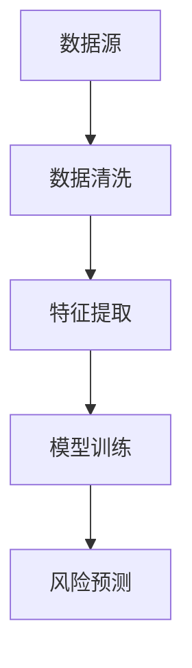
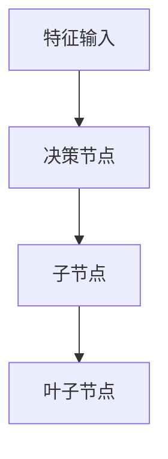
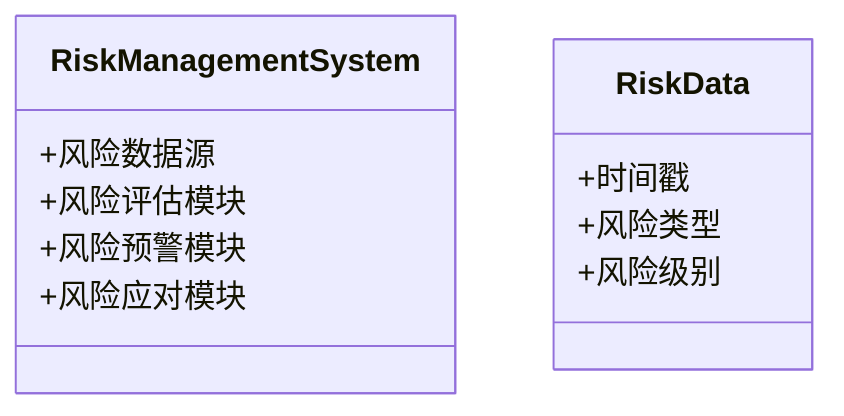
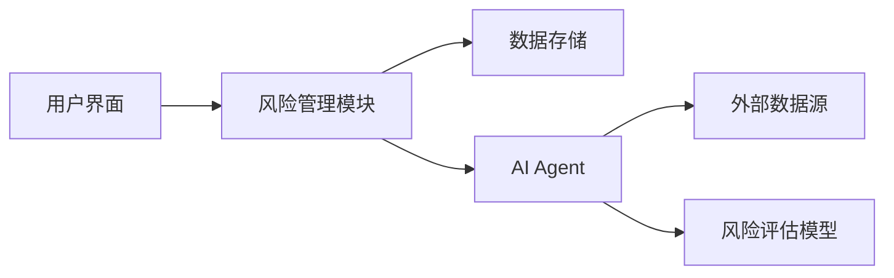

                 


# AI Agent在企业风险管理中的应用：预测与防控

> 关键词：AI Agent, 企业风险管理, 风险预测, 机器学习, 数据挖掘, 系统架构, 项目实战

> 摘要：本文深入探讨了AI Agent在企业风险管理中的应用，结合技术原理、系统架构和项目实战，详细讲解了如何利用AI Agent进行风险预测与防控。文章从背景介绍、核心概念、算法原理、系统设计、项目实现到最佳实践，全面阐述了AI Agent在企业风险管理中的作用及其实际应用。

---

## 第一部分: AI Agent与企业风险管理概述

### 第1章: AI Agent与企业风险管理概述

#### 1.1 AI Agent的基本概念

##### 1.1.1 什么是AI Agent
AI Agent（人工智能代理）是指能够感知环境、自主决策并采取行动的智能实体。它可以是一个软件程序、机器人或其他智能系统，旨在帮助用户完成特定任务或优化决策过程。AI Agent的核心特征包括自主性、反应性、目标导向性和社交能力。

##### 1.1.2 AI Agent的类型与特点
AI Agent可以分为以下几种类型：
- **简单反射型Agent**：基于预定义规则对输入做出反应。
- **基于模型的反射型Agent**：通过内部模型和环境信息进行推理和决策。
- **目标导向型Agent**：根据目标选择最优行动。
- **实用导向型Agent**：通过最大化效用函数来优化决策。

##### 1.1.3 AI Agent在企业中的应用领域
AI Agent在企业中的应用领域广泛，包括：
- **客户关系管理（CRM）**：优化客户互动和营销策略。
- **供应链管理**：优化库存管理和物流调度。
- **风险管理**：预测和防控各种企业风险。

#### 1.2 企业风险管理的基本概念

##### 1.2.1 什么是风险管理
风险管理是指识别、评估和应对可能影响企业目标实现的各种风险的过程。目标是通过降低风险发生的概率或影响程度，确保企业稳健运营。

##### 1.2.2 企业风险管理的目标与流程
企业风险管理的目标包括：
- **风险识别**：识别可能影响企业目标的风险。
- **风险评估**：评估风险的可能性和影响程度。
- **风险应对**：制定和实施应对策略。
- **风险监控**：持续监控风险并调整应对策略。

##### 1.2.3 传统风险管理方法的局限性
传统风险管理方法通常依赖人工分析和经验判断，存在以下局限性：
- **效率低下**：人工分析耗时且容易出错。
- **覆盖不全**：难以覆盖所有潜在风险。
- **反应滞后**：无法实时响应风险变化。

#### 1.3 AI Agent在企业风险管理中的作用

##### 1.3.1 AI Agent如何提升风险管理效率
AI Agent通过自动化数据采集、分析和决策，显著提升了风险管理的效率。例如，AI Agent可以实时监控市场波动，识别潜在的财务风险，并迅速制定应对策略。

##### 1.3.2 AI Agent在风险预测与防控中的优势
AI Agent在风险预测与防控中的优势包括：
- **快速响应**：能够实时感知风险并迅速采取行动。
- **精准预测**：利用机器学习算法，提高风险预测的准确性。
- **智能决策**：基于数据和模型，优化风险应对策略。

##### 1.3.3 企业风险管理的未来趋势
随着AI技术的不断发展，企业风险管理将更加智能化和自动化。AI Agent将成为企业风险管理的核心工具，帮助企业在复杂多变的环境中保持稳健运营。

---

## 第2章: AI Agent的核心技术与原理

### 2.1 AI Agent的核心技术

#### 2.1.1 机器学习算法
机器学习是AI Agent的核心技术之一。通过训练模型，AI Agent能够从历史数据中学习规律，并预测未来可能发生的风险。

##### 使用Python实现线性回归模型
```python
import numpy as np
import matplotlib.pyplot as plt

# 生成数据
X = np.linspace(0, 10, 200)
Y = 2 * X + 1 + np.random.normal(0, 1, 200)

# 训练模型
theta = np.linalg.inv(X[:, np.newaxis].T.dot(X[:, np.newaxis])).dot(X[:, np.newaxis].T.dot(Y))

# 预测
Y_pred = theta * X + 1

# 绘制图像
plt.scatter(X, Y, label='真实值')
plt.plot(X, Y_pred, label='预测值', color='red')
plt.xlabel('X')
plt.ylabel('Y')
plt.legend()
plt.show()
```

##### 线性回归的数学公式
$$ Y = \theta X + b $$

其中，$$ \theta $$ 是斜率，$$ b $$ 是截距。

#### 2.1.2 自然语言处理（NLP）
NLP技术使AI Agent能够理解和处理文本数据，例如从新闻报道中提取市场风险信息。

##### 使用Python实现文本分类
```python
from sklearn.feature_extraction.text import TfidfVectorizer
from sklearn.naive_bayes import MultinomialNB

# 文本数据
texts = ["Market crash expected due to economic downturn", "Company reports strong financial performance"]

# 特征提取
vectorizer = TfidfVectorizer()
X = vectorizer.fit_transform(texts)

# 训练模型
model = MultinomialNB()
model.fit(X, [0, 1])

# 预测
new_text = "Stock prices may drop due to geopolitical tensions"
X_new = vectorizer.transform([new_text])
print(model.predict(X_new))
```

#### 2.1.3 数据挖掘与分析
数据挖掘技术帮助AI Agent从大量数据中发现潜在风险模式。

##### 数据挖掘流程图


---

## 第3章: AI Agent在风险管理中的应用

### 3.1 风险管理的典型场景

#### 3.1.1 财务风险管理
##### 使用决策树算法进行风险分类
```python
from sklearn.tree import DecisionTreeClassifier

# 数据准备
features = [[1, 2, 3], [4, 5, 6], [7, 8, 9]]
labels = [0, 1, 0]

# 训练模型
model = DecisionTreeClassifier()
model.fit(features, labels)

# 预测
new_case = [10, 11, 12]
print(model.predict([new_case]))
```

##### 决策树流程图


#### 3.1.2 操作风险管理
##### 使用神经网络进行风险评估
```python
import numpy as np
from sklearn.neural_network import MLPClassifier

# 数据准备
X = np.array([[1, 2], [3, 4], [5, 6]])
y = np.array([0, 1, 0])

# 训练模型
model = MLPClassifier(hidden_layer_sizes=(2,))
model.fit(X, y)

# 预测
new_case = np.array([[7, 8]])
print(model.predict(new_case))
```

#### 3.1.3 市场风险管理
##### 使用时间序列分析预测市场波动
```python
import pandas as pd
from statsmodels.tsa.arima_model import ARIMA

# 数据准备
data = pd.read_csv('market_data.csv')
```

---

## 第4章: 系统分析与架构设计

### 4.1 风险管理系统的架构设计

#### 4.1.1 领域模型


#### 4.1.2 系统架构


---

## 第5章: 项目实战

### 5.1 安装与配置

#### 5.1.1 安装Python和机器学习库
```bash
pip install numpy scikit-learn matplotlib
```

### 5.2 核心代码实现

#### 5.2.1 风险预测模型
```python
import numpy as np
from sklearn.ensemble import RandomForestClassifier

# 数据准备
X = np.array([[1, 2, 3], [4, 5, 6], [7, 8, 9]])
y = np.array([0, 1, 0])

# 训练模型
model = RandomForestClassifier(n_estimators=3)
model.fit(X, y)

# 预测
new_case = np.array([[10, 11, 12]])
print(model.predict(new_case))
```

---

## 第6章: 最佳实践与总结

### 6.1 小结
本文详细探讨了AI Agent在企业风险管理中的应用，从技术原理到系统设计，再到项目实战，全面展示了如何利用AI Agent进行风险预测与防控。

### 6.2 注意事项
- 数据质量对模型性能至关重要。
- 模型的可解释性需要重点关注。
- 风险管理是一个动态过程，需要持续优化。

### 6.3 拓展阅读
- 《机器学习实战》
- 《风险管理与决策》
- 《人工智能：现代方法》

---

作者：AI天才研究院 & 禅与计算机程序设计艺术

