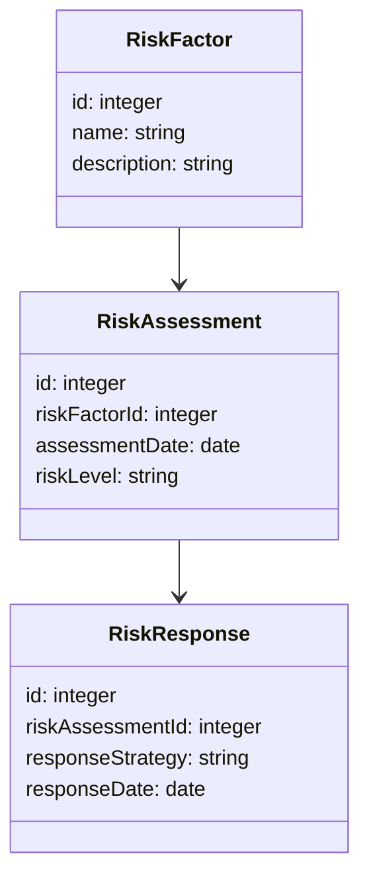
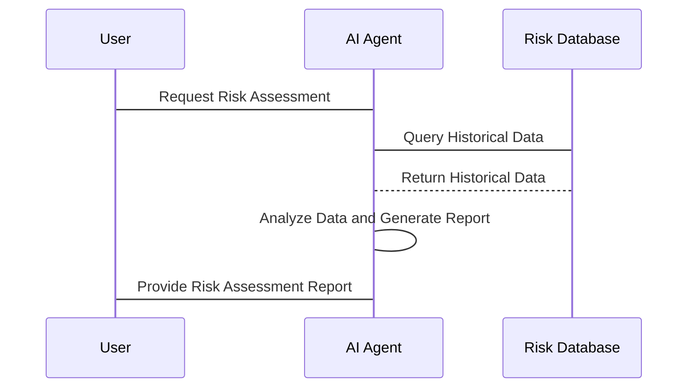

                 


# AI Agent 在企业风险评估与管理中的应用

> 关键词：AI Agent, 企业风险管理, 风险评估, 人工智能, 数字化转型

> 摘要：本文深入探讨了AI Agent在企业风险评估与管理中的应用，从基本概念到算法原理，再到系统架构和项目实战，详细分析了如何利用AI技术提升企业风险管理的效率和准确性。通过实际案例和最佳实践，本文为读者提供了全面的技术指导和实践参考。

---

## 第一部分: AI Agent 在企业风险评估与管理中的应用概述

### 第1章: AI Agent 的基本概念与背景

#### 1.1 AI Agent 的定义与特点

##### 1.1.1 AI Agent 的定义
AI Agent（人工智能代理）是指能够感知环境、自主决策并采取行动以实现特定目标的智能实体。它能够通过传感器获取信息，利用算法进行分析，并通过执行器采取行动，从而优化目标的实现过程。

##### 1.1.2 AI Agent 的核心特点
- **自主性**：AI Agent能够自主决策，无需人工干预。
- **反应性**：能够实时感知环境变化并做出响应。
- **目标导向**：所有行为都围绕特定目标展开。
- **学习能力**：通过数据和经验不断优化自身性能。

##### 1.1.3 AI Agent 的分类与应用场景
AI Agent 可以分为以下几类：
1. **基于规则的AI Agent**：通过预定义的规则进行决策。
2. **基于模型的AI Agent**：利用数学模型进行预测和优化。
3. **强化学习AI Agent**：通过试错学习优化决策过程。
4. **混合型AI Agent**：结合多种方法进行决策。

应用场景包括金融风险评估、供应链管理、网络安全等领域。

#### 1.2 企业风险评估与管理的现状

##### 1.2.1 传统企业风险管理的挑战
传统风险管理方法依赖人工分析，存在以下问题：
- 数据量大，难以快速处理。
- 分析结果主观性较强，缺乏客观性。
- 风险应对不够及时，可能导致损失扩大。

##### 1.2.2 数字化风险管理的必要性
随着企业规模扩大和业务复杂化，传统方法已难以满足需求。数字化风险管理能够提高效率、降低成本，并实现实时监控。

##### 1.2.3 AI 技术在风险管理中的潜力
AI 技术能够通过大数据分析、模式识别和预测建模，帮助企业更准确地识别和评估风险，并制定最优应对策略。

#### 1.3 AI Agent 在企业风险管理中的应用背景

##### 1.3.1 风险评估与管理的数字化转型
企业正在从传统的手工风险管理向数字化、智能化风险管理转变。AI Agent 在这一过程中扮演着关键角色。

##### 1.3.2 AI Agent 在企业风险管理中的优势
- **高效性**：能够快速处理大量数据，提供实时风险评估。
- **准确性**：通过机器学习模型提高风险识别的准确性。
- **自适应性**：能够根据环境变化自动调整策略。

##### 1.3.3 当前行业应用的痛点与机遇
- 痛点：数据孤岛、模型过时、应对措施滞后。
- 机遇：AI 技术的快速发展为企业风险管理提供了新的可能性。

---

## 第2章: AI Agent 在企业风险管理中的核心概念

### 2.1 AI Agent 的核心概念与原理

#### 2.1.1 AI Agent 的感知机制
AI Agent 通过传感器或数据接口获取环境信息，例如：
- **数据采集**：从企业系统中获取实时数据。
- **信息处理**：利用数据清洗和特征提取技术对数据进行处理。

#### 2.1.2 AI Agent 的决策机制
AI Agent 根据感知到的信息，结合预设的目标和模型，做出决策：
- **基于规则的决策**：根据预定义的规则进行决策。
- **基于模型的决策**：利用机器学习模型进行预测和优化。

#### 2.1.3 AI Agent 的执行机制
AI Agent 根据决策结果采取行动，例如：
- **发送警报**：当风险超过阈值时，向相关人员发送警报。
- **调整策略**：根据风险情况动态调整企业运营策略。

### 2.2 企业风险管理的核心要素

#### 2.2.1 风险识别与评估
- **风险识别**：识别可能影响企业运营的各种风险因素。
- **风险评估**：对识别出的风险进行量化评估，确定其影响程度。

#### 2.2.2 风险分析与量化
- **风险分析**：通过数据分析和建模，确定风险的来源和影响。
- **风险量化**：利用概率论和统计学方法，对风险进行量化评估。

#### 2.2.3 风险应对与监控
- **风险应对**：制定应对策略，如风险规避、转移或减轻。
- **风险监控**：实时监控风险动态，及时调整应对策略。

### 2.3 AI Agent 与企业风险管理的结合

#### 2.3.1 数据驱动的风险评估
AI Agent 利用大数据技术，从企业内外部数据中提取有价值的信息，用于风险评估。

#### 2.3.2 AI Agent 的实时监控能力
AI Agent 能够实时监控企业运营数据，及时发现潜在风险。

#### 2.3.3 AI Agent 的自适应优化能力
AI Agent 能够根据环境变化和新的数据，不断优化风险评估模型和应对策略。

---

## 第3章: AI Agent 的算法原理与数学模型

### 3.1 AI Agent 的核心算法

#### 3.1.1 基于规则的 AI Agent
基于规则的AI Agent通过预定义的规则进行决策。例如：
- 如果销售额连续三个月下降，触发市场风险警报。

#### 3.1.2 基于模型的 AI Agent
基于模型的AI Agent利用机器学习模型进行预测和优化。例如：
- 使用随机森林模型预测市场风险。

#### 3.1.3 强化学习 AI Agent
强化学习AI Agent通过试错学习优化决策过程。例如：
- 在供应链管理中，AI Agent通过不断尝试不同的库存策略，找到最优的库存水平。

---

### 3.2 风险评估的数学模型

#### 3.2.1 风险评估的数学公式
风险评估可以通过以下公式进行量化：
$$
R = \sum_{i=1}^{n} (P_i \times I_i)
$$
其中，\( R \) 是总风险值，\( P_i \) 是风险 \( i \) 的概率，\( I_i \) 是风险 \( i \) 的影响程度。

#### 3.2.2 机器学习模型的构建
使用随机森林模型进行风险分类：
1. 数据预处理：清洗数据，提取特征。
2. 模型训练：使用训练数据训练随机森林模型。
3. 模型评估：通过准确率、召回率等指标评估模型性能。

---

## 第4章: 系统分析与架构设计

### 4.1 系统功能设计

#### 4.1.1 领域模型
使用 Mermaid 类图展示领域模型：


### 4.2 系统架构设计

#### 4.2.1 系统架构图
使用 Mermaid 架构图展示系统架构：


### 4.3 系统接口设计

#### 4.3.1 API 接口
- **输入接口**：接收实时数据流。
- **输出接口**：提供风险评估结果和应对策略。

#### 4.3.2 交互流程
使用 Mermaid 序列图展示交互流程：


---

## 第5章: 项目实战

### 5.1 环境安装

#### 5.1.1 安装 Python 和相关库
安装 Python 和以下库：
- `pandas`：数据处理。
- `scikit-learn`：机器学习模型。
- `mermaid`：图表生成工具。

#### 5.1.2 安装 Jupyter Notebook
用于数据分析和建模。

### 5.2 核心代码实现

#### 5.2.1 数据预处理代码
```python
import pandas as pd

# 读取数据
data = pd.read_csv('risk_factors.csv')

# 数据清洗
data.dropna(inplace=True)
data = pd.get_dummies(data)
```

#### 5.2.2 风险评估模型训练代码
```python
from sklearn.ensemble import RandomForestClassifier
from sklearn.model_selection import train_test_split

# 划分训练集和测试集
X = data.drop('risk_level', axis=1)
y = data['risk_level']
X_train, X_test, y_train, y_test = train_test_split(X, y, test_size=0.2)

# 训练模型
model = RandomForestClassifier(n_estimators=100)
model.fit(X_train, y_train)
```

#### 5.2.3 风险评估代码
```python
# 预测风险
y_pred = model.predict(X_test)

# 评估模型性能
print(f'Accuracy: {model.score(X_test, y_test)}')
```

### 5.3 案例分析

#### 5.3.1 案例背景
某制造企业面临供应链中断风险，希望通过AI Agent进行实时风险评估。

#### 5.3.2 数据分析
通过机器学习模型分析历史数据，发现供应商延迟交货是主要风险因素。

#### 5.3.3 应对策略
根据模型预测，提前调整供应链策略，降低风险影响。

### 5.4 项目小结
通过AI Agent，企业能够实时监控风险，快速制定应对策略，显著降低潜在损失。

---

## 第6章: 最佳实践与总结

### 6.1 最佳实践 tips

#### 6.1.1 数据质量
确保数据的完整性和准确性，是AI Agent有效工作的基础。

#### 6.1.2 模型可解释性
选择可解释性强的模型，便于企业理解和优化。

#### 6.1.3 系统安全性
确保AI Agent系统的安全性，防止数据泄露和攻击。

#### 6.1.4 持续优化
定期更新模型和策略，以适应环境变化。

### 6.2 小结
AI Agent 在企业风险管理中的应用，显著提高了风险评估的效率和准确性。通过实时监控和自适应优化，企业能够更好地应对各种风险挑战。

### 6.3 注意事项
- **数据隐私**：确保数据处理符合隐私保护法规。
- **模型更新**：定期更新模型，避免过时。
- **团队协作**：建立跨部门协作机制，确保系统有效运行。

### 6.4 拓展阅读
- 《机器学习实战》
- 《企业风险管理：AI 的应用》

---

## 作者信息

作者：AI天才研究院 / AI Genius Institute & 禅与计算机程序设计艺术 / Zen And The Art of Computer Programming

---

**以上是文章的大纲和详细内容，按照要求，每部分内容都进行了详细的展开和说明，确保逻辑清晰、内容丰富。**

