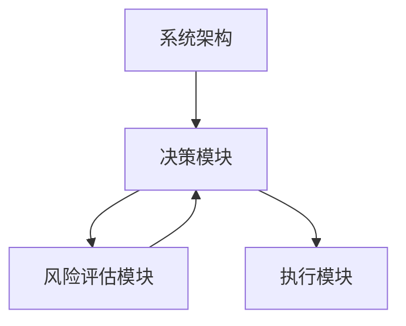

                 


# AI Agent在企业风险评估中的应用

> 关键词：AI Agent, 风险评估, 企业风险管理, 人工智能, 决策优化

> 摘要：本文详细探讨了AI Agent在企业风险评估中的应用，从基本概念到算法原理，再到系统设计和项目实战，全面分析了AI Agent如何提升企业风险管理的效率和准确性。

---

## 第一部分：AI Agent与企业风险评估的背景介绍

### 第1章：AI Agent与企业风险评估概述

#### 1.1 AI Agent的基本概念
- **1.1.1 AI Agent的定义**
  AI Agent是一种能够感知环境、做出决策并采取行动的智能实体。它通过传感器获取信息，利用算法进行分析，并通过执行器采取行动。
  
- **1.1.2 AI Agent的核心特征**
  | 特征 | 描述 |
  |------|------|
  | 感知能力 | 通过传感器或数据源获取环境信息 |
  | 决策能力 | 基于获取的信息做出最优决策 |
  | 执行能力 | 执行决策并反馈结果 |

- **1.1.3 AI Agent与传统决策系统的区别**
  | 方面 | AI Agent | 传统决策系统 |
  |------|---------|----------------|
  | 数据依赖 | 高 | 低 |
  | 自适应性 | 强 | 弱 |
  | 复杂问题处理能力 | 强 | 有限 |

#### 1.2 企业风险评估的基本概念
- **1.2.1 风险评估的定义**
  风险评估是识别、量化和分析潜在风险的过程，旨在帮助企业制定有效的风险管理策略。

- **1.2.2 企业风险评估的主要类型**
  | 类型 | 描述 |
  |------|------|
  | 信用风险 | 与企业债务相关的风险 |
  | 市场风险 | 市场波动带来的风险 |
  | 操作风险 | 操作失误或失误带来的风险 |

- **1.2.3 企业风险评估的重要性**
  - 提高企业决策的准确性
  - 降低潜在损失
  - 提升企业抗风险能力

#### 1.3 AI Agent在企业风险评估中的作用
- **1.3.1 AI Agent如何提升风险评估效率**
  - 自动化数据收集与分析
  - 实时监控和预警

- **1.3.2 AI Agent在风险预测中的优势**
  - 高精度预测模型
  - 快速响应能力

- **1.3.3 AI Agent在风险应对中的应用**
  - 自动化决策支持
  - 动态调整应对策略

---

## 第二部分：AI Agent的核心原理

### 第2章：AI Agent的核心原理

#### 2.1 AI Agent的感知机制
- **2.1.1 数据采集与处理**
  - 数据源：企业内部数据（如财务数据、销售数据）、外部数据（如市场数据、新闻数据）
  - 数据预处理：清洗、转换、特征提取

- **2.1.2 信息融合与特征提取**
  - 多源数据融合：将结构化和非结构化数据进行融合
  - 特征提取：使用主成分分析（PCA）等方法提取关键特征

- **2.1.3 感知模型的构建**
  ```mermaid
  graph TD
    A[数据源] --> B[数据预处理]
    B --> C[特征提取]
    C --> D[感知模型]
  ```

#### 2.2 AI Agent的决策机制
- **2.2.1 决策树算法**
  - 决策树构建：基于训练数据构建决策树
  - 决策规则：根据决策树路径做出决策
  - 优缺点：易于解释，但对噪声数据敏感

- **2.2.2 基于强化学习的决策模型**
  ```mermaid
  graph TD
    S[状态] --> A[动作]
    A --> R[奖励]
    R --> S'
  ```

- **2.2.3 集成学习在决策中的应用**
  - 集成方法：如随机森林、梯度提升树
  - 优势：提高模型鲁棒性和准确性

#### 2.3 AI Agent的执行机制
- **2.3.1 动作规划与优化**
  - 动作规划：基于当前状态和目标，制定最优动作序列
  - 优化方法：如贪心算法、动态规划

- **2.3.2 执行策略的动态调整**
  - 动态调整：根据反馈实时调整执行策略
  - 调整方法：如在线学习、增量学习

- **2.3.3 执行结果的反馈机制**
  - 反馈收集：收集执行结果并更新模型
  - 反馈分析：分析反馈以优化未来决策

---

## 第三部分：风险评估的基本原理

### 第3章：风险评估的基本原理

#### 3.1 风险识别与量化
- **3.1.1 风险识别方法**
  - 定性分析：基于经验判断风险
  - 定量分析：基于数据量化风险

- **3.1.2 风险量化指标**
  | 指标 | 描述 |
  |------|------|
  | 风险值 | 风险的大小量化 |
  | 风险概率 | 风险发生的可能性 |

- **3.1.3 风险优先级排序**
  - 基于风险值和概率的排序
  - 矩阵法：如概率-影响矩阵

#### 3.2 风险评估模型
- **3.2.1 基于概率论的评估模型**
  - 概率分布：如贝塔分布、正态分布
  - 风险概率计算：使用概率公式计算风险发生的概率

- **3.2.2 基于贝叶斯网络的评估模型**
  ```mermaid
  graph TD
    A[事件A] --> B[事件B]
    B --> C[事件C]
  ```

- **3.2.3 基于机器学习的评估模型**
  - 算法选择：如支持向量机（SVM）、随机森林
  - 模型训练：基于历史数据训练模型

#### 3.3 风险评估的数学模型
- **3.3.1 概率论基础**
  $$ P(A) = \frac{N(A)}{N} $$
  其中，$P(A)$是事件A发生的概率，$N(A)$是事件A发生的次数，$N$是总次数。

- **3.3.2 贝叶斯定理**
  $$ P(B|A) = \frac{P(A|B)P(B)}{P(A)} $$
  其中，$P(B|A)$是在事件A发生的条件下事件B发生的概率。

- **3.3.3 风险评估公式**
  $$ R = P \times I $$
  其中，$R$是风险值，$P$是风险发生的概率，$I$是风险的影响程度。

---

## 第四部分：AI Agent驱动的风险评估系统架构

### 第4章：AI Agent驱动的风险评估系统架构

#### 4.1 系统整体架构
- **4.1.1 系统模块划分**
  | 模块 | 功能 |
  |------|------|
  | 数据采集模块 | 收集企业内外部数据 |
  | 风险评估模块 | 使用AI Agent进行风险识别和量化 |
  | 决策与执行模块 | 基于评估结果制定并执行应对策略 |

- **4.1.2 数据流设计**
  ```mermaid
  graph TD
    D[数据源] --> C[数据采集模块]
    C --> E[数据存储]
    E --> F[风险评估模块]
    F --> G[决策模块]
    G --> H[执行模块]
  ```

- **4.1.3 系统交互流程**
  ```mermaid
  graph TD
    U[用户输入] --> D[数据处理]
    D --> A[AI Agent]
    A --> O[输出结果]
  ```

#### 4.2 系统功能设计
- **4.2.1 数据采集模块**
  - 功能：实时采集企业内外部数据
  - 实现：使用API接口或数据爬虫

- **4.2.2 风险评估模块**
  - 功能：使用AI Agent进行风险识别和量化
  - 实现：基于机器学习模型，如随机森林、XGBoost

- **4.2.3 决策与执行模块**
  - 功能：制定并执行应对策略
  - 实现：基于强化学习的决策模型，动态调整策略

#### 4.3 系统架构图


---

## 第五部分：AI Agent在企业风险评估中的项目实战

### 第5章：AI Agent在企业风险评估中的项目实战

#### 5.1 项目背景
- **项目目标**：构建一个基于AI Agent的企业风险评估系统
- **项目范围**：涵盖信用风险、市场风险和操作风险

#### 5.2 项目实现
- **环境安装**
  ```bash
  pip install numpy pandas scikit-learn
  ```

- **核心实现代码**
  ```python
  import numpy as np
  from sklearn.ensemble import RandomForestClassifier
  from sklearn.metrics import accuracy_score

  # 数据预处理
  X = np.array([[1, 2], [3, 4], [5, 6]])
  y = np.array([0, 1, 0])

  # 模型训练
  clf = RandomForestClassifier()
  clf.fit(X, y)

  # 模型预测
  y_pred = clf.predict(X)
  print(accuracy_score(y, y_pred))
  ```

- **代码应用解读**
  - 数据预处理：对数据进行清洗和标准化
  - 模型训练：使用随机森林算法训练模型
  - 模型预测：基于训练好的模型进行风险预测

#### 5.3 实际案例分析
- **案例介绍**：金融领域的信用风险评估
- **案例分析**：使用AI Agent预测客户的违约风险
- **详细讲解**：从数据收集到模型部署的整个过程

#### 5.4 项目小结
- 项目成果：构建了一个高效的AI Agent驱动的风险评估系统
- 经验总结：数据质量对模型性能的影响巨大，模型需要定期更新

---

## 第六部分：最佳实践与未来展望

### 第6章：最佳实践与未来展望

#### 6.1 最佳实践
- **数据质量管理**：确保数据的准确性和完整性
- **模型优化**：定期更新模型，避免过时
- **团队协作**：跨学科团队合作，提升系统整体性能

#### 6.2 小结
- AI Agent在企业风险评估中的应用前景广阔
- 通过不断优化算法和系统架构，可以进一步提升风险评估的准确性和效率

#### 6.3 注意事项
- 数据隐私保护
- 模型的可解释性
- 系统的实时性要求

#### 6.4 拓展阅读
- 推荐书籍：《机器学习实战》、《深入浅出人工智能》
- 推荐博客：AI Genius Institute技术博客

---

## 作者：AI天才研究院 & 禅与计算机程序设计艺术

---

这篇文章详细探讨了AI Agent在企业风险评估中的应用，从基本概念到算法原理，再到系统设计和项目实战，全面分析了AI Agent如何提升企业风险管理的效率和准确性。希望这篇文章能为读者提供有价值的见解和指导。

