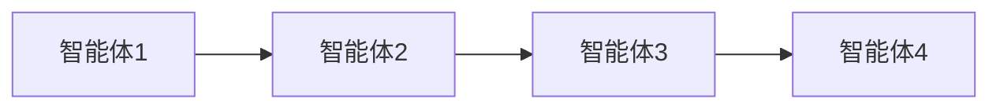
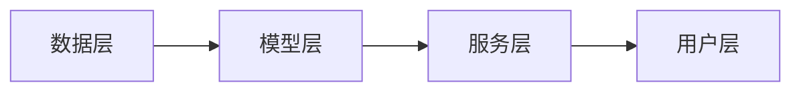

                 


# AI Agent在企业风险预测与情景模拟中的前沿应用

> 关键词：AI Agent，企业风险预测，情景模拟，强化学习，多智能体系统，风险管理

> 摘要：本文深入探讨了AI Agent在企业风险预测与情景模拟中的前沿应用，从基本概念到核心原理，再到实际项目实现，系统地分析了AI Agent如何通过强化学习、多智能体协作等技术帮助企业进行风险预测和优化决策。文章内容涵盖AI Agent的分类、算法原理、系统架构设计、项目实战以及最佳实践，旨在为企业技术决策者和开发者提供实践指导。

---

## 第一部分：AI Agent的基本概念与背景

### 第1章: AI Agent的基本概念与背景

#### 1.1 AI Agent的定义与核心概念

**1.1.1 AI Agent的基本定义**  
AI Agent（人工智能代理）是指能够感知环境、自主决策并采取行动的智能实体。它能够通过传感器获取信息，利用推理能力分析问题，并根据目标采取行动。AI Agent可以是软件程序、机器人或其他智能系统。

**1.1.2 多智能体系统与分布式AI**  
多智能体系统由多个相互作用的AI Agent组成，它们通过通信和协作完成复杂任务。分布式AI强调智能体的独立性和协作性，能够处理比单个智能体更复杂的问题。

**1.1.3 AI Agent在企业中的应用价值**  
AI Agent能够帮助企业进行实时数据分析、风险预测、情景模拟和决策优化。通过自动化和智能化的决策过程，企业可以提高效率、降低成本，并在复杂环境中做出更优决策。

#### 1.2 企业风险预测与情景模拟的背景

**1.2.1 企业风险预测的必要性**  
企业面临市场波动、经济变化等不确定性，风险预测能够帮助企业提前识别潜在风险，制定应对策略。

**1.2.2 情景模拟在企业决策中的作用**  
情景模拟通过构建多种可能的未来场景，帮助企业评估不同决策的影响，优化资源配置。

**1.2.3 AI Agent在风险预测与情景模拟中的优势**  
AI Agent能够实时处理海量数据，利用机器学习和强化学习算法，快速生成预测结果并优化决策。

---

## 第二部分：AI Agent的核心原理与技术基础

### 第2章: AI Agent的核心原理与技术基础

#### 2.1 AI Agent的分类与特点

**2.1.1 基于规则的AI Agent**  
基于规则的AI Agent通过预定义的规则进行决策，适用于简单、确定性的环境。例如，自动回复系统。

**2.1.2 基于机器学习的AI Agent**  
基于机器学习的AI Agent通过训练数据学习决策策略，适用于复杂、动态的环境。例如，风险预测模型。

**2.1.3 基于强化学习的AI Agent**  
基于强化学习的AI Agent通过与环境互动，学习最优策略，适用于需要动态调整的复杂任务。例如，动态投资组合优化。

| **分类**       | **特点**                                                                 |
|----------------|--------------------------------------------------------------------------|
| 基于规则的AI Agent | 依赖预定义规则，适用于简单任务，决策过程透明但缺乏灵活性。                     |
| 基于机器学习的AI Agent | 通过数据驱动决策，适用于复杂任务，决策过程可能不够透明。                 |
| 基于强化学习的AI Agent | 通过与环境互动学习，适用于动态环境，决策过程具有自适应性。                 |

#### 2.2 多智能体系统与协作机制

**2.2.1 多智能体系统的基本架构**  
多智能体系统由多个智能体组成，每个智能体负责特定任务，通过协作完成整体目标。



**2.2.2 智能体之间的通信与协作**  
智能体之间通过消息传递进行协作，共同完成复杂任务。

**2.2.3 智能体的分布式决策机制**  
每个智能体独立决策，同时通过协作优化整体决策过程。

---

## 第三部分：AI Agent在企业风险预测中的应用

### 第3章: AI Agent在企业风险预测中的应用

#### 3.1 风险预测的核心算法与模型

**3.1.1 基于机器学习的风险预测模型**  
常用的机器学习算法包括逻辑回归、支持向量机和随机森林。

**3.1.2 基于深度学习的风险预测模型**  
深度学习模型如LSTM和Transformer适用于时间序列数据和复杂模式识别。

**3.1.3 强化学习在风险预测中的应用**  
强化学习通过模拟不同决策路径，优化风险预测结果。

#### 3.2 AI Agent在风险预测中的具体实现

**3.2.1 数据采集与预处理**  
数据清洗、特征提取和标准化处理。

**3.2.2 模型训练与优化**  
利用训练数据训练模型，并通过交叉验证优化模型参数。

**3.2.3 模型部署与实时预测**  
将模型部署到生产环境，实时接收输入并生成预测结果。

---

## 第四部分：AI Agent在情景模拟中的前沿技术

### 第4章: AI Agent在情景模拟中的前沿技术

#### 4.1 情景模拟的基本原理与方法

**4.1.1 基于AI Agent的情景模拟框架**  
构建多个AI Agent，模拟不同角色的行为，生成多种可能的未来情景。

**4.1.2 动态环境建模**  
通过动态调整模型参数，模拟真实环境中的变化。

#### 4.2 基于强化学习的情景模拟优化

**4.2.1 强化学习在情景模拟中的应用**  
通过强化学习优化AI Agent的决策策略，提高情景模拟的准确性。

**4.2.2 多智能体协作在情景模拟中的优化**  
多个AI Agent协作，共同优化情景模拟结果。

---

## 第五部分：企业级AI Agent系统的架构与设计

### 第5章: 企业级AI Agent系统的架构与设计

#### 5.1 企业级AI Agent系统的整体架构

**5.1.1 系统的功能模块划分**  
数据采集、模型训练、预测推理和结果展示。

**5.1.2 系统的分层架构设计**  
数据层、模型层、服务层和用户层。



---

## 第六部分：项目实战

### 第6章: 项目实战

#### 6.1 环境安装与配置

**6.1.1 安装Python与相关库**  
安装Python 3.8以上版本，安装TensorFlow、Keras、Scikit-learn等库。

#### 6.2 核心代码实现

**6.2.1 数据预处理代码**  
```python
import pandas as pd
import numpy as np

# 加载数据
data = pd.read_csv('risk_data.csv')

# 数据清洗
data.dropna(inplace=True)

# 特征提取
features = data[['feature1', 'feature2', 'feature3']]
labels = data['label']
```

**6.2.2 模型训练代码**  
```python
from tensorflow.keras import models, layers

# 定义模型
model = models.Sequential()
model.add(layers.Dense(64, activation='relu', input_shape=(3,)))
model.add(layers.Dense(32, activation='relu'))
model.add(layers.Dense(1, activation='sigmoid'))

# 编译模型
model.compile(optimizer='adam', loss='binary_crossentropy', metrics=['accuracy'])

# 训练模型
model.fit(features, labels, epochs=100, batch_size=32)
```

---

## 第七部分：最佳实践、小结、注意事项和拓展阅读

### 第7章: 最佳实践与总结

#### 7.1 最佳实践

**数据质量**：确保数据的准确性和完整性。  
**模型调优**：通过交叉验证和超参数优化提高模型性能。  
**结果验证**：在实际场景中验证模型的有效性。

#### 7.2 小结

本文详细介绍了AI Agent在企业风险预测与情景模拟中的应用，从理论到实践，为企业技术决策者和开发者提供了实践指导。

#### 7.3 注意事项

**数据偏差**：避免训练数据中的偏差影响预测结果。  
**模型过拟合**：通过正则化和交叉验证防止过拟合。  
**计算资源**：确保有足够的计算资源进行模型训练和推理。

#### 7.4 拓展阅读

推荐学习《强化学习（深入浅出）》和《分布式系统与多智能体协作》。

---

## 作者信息

**作者：AI天才研究院/AI Genius Institute & 禅与计算机程序设计艺术 /Zen And The Art of Computer Programming**

---

希望这篇文章能够为您提供有价值的信息和启发！

