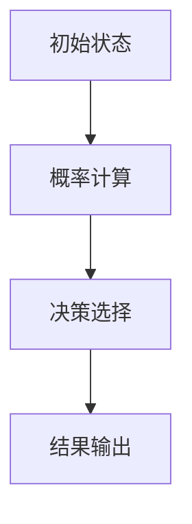
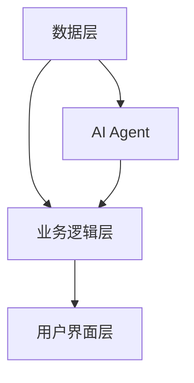
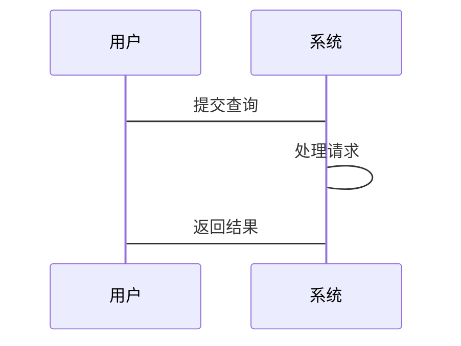

                 


# AI Agent在企业风险预测与情景模拟中的应用

## 关键词：AI Agent, 企业风险预测, 情景模拟, 多智能体协作, 概率推理, 知识表示

## 摘要：AI Agent作为一种智能化的决策辅助工具，通过知识表示、概率推理和多智能体协作等技术手段，能够有效地进行企业风险预测与情景模拟。本文从AI Agent的核心概念、算法原理、系统架构到实际项目应用，详细阐述了其在企业风险管理中的应用价值和实现方法。通过实际案例分析，展示了如何利用AI Agent进行风险评估、情景模拟和决策优化，为企业提供智能化的管理支持。

---

## 第一部分: AI Agent在企业风险预测与情景模拟中的应用概述

## 第1章: AI Agent的基本概念与背景介绍

### 1.1 AI Agent的定义与核心概念

AI Agent（人工智能代理）是一种能够感知环境、自主决策并采取行动的智能实体。在企业风险管理中，AI Agent通过分析历史数据、实时信息和外部因素，帮助企业在复杂环境中做出最优决策。

#### 1.1.1 AI Agent的基本定义

- **定义**：AI Agent是一种能够感知环境、处理信息、自主决策并执行任务的智能系统。
- **核心特征**：
  - 感知能力：通过传感器或数据源获取环境信息。
  - 决策能力：基于知识库和推理引擎做出决策。
  - 行动能力：通过执行器或接口与环境交互。
  - 自适应能力：能够根据反馈调整行为策略。

#### 1.1.2 AI Agent的核心属性与特征

- **知识表示**：AI Agent通过符号逻辑、概率模型或向量表示等方式，将领域知识编码为可计算的形式。
- **行为决策**：基于知识表示和推理，AI Agent能够选择最优的行为策略。
- **多智能体协作**：在复杂的环境中，多个AI Agent可以协同工作，通过消息传递或共享状态实现协作。

### 1.2 企业风险预测与情景模拟的背景

#### 1.2.1 企业风险预测的必要性

- **外部环境不确定性**：市场波动、政策变化、竞争压力等外部因素对企业经营产生重大影响。
- **内部管理复杂性**：企业内部资源分配、项目管理、风险控制等需要精确的预测和模拟。
- **传统方法的局限性**：基于经验的决策容易受到主观因素影响，缺乏数据支持和优化能力。

#### 1.2.2 情景模拟在企业管理中的作用

- **风险评估**：通过模拟不同情景，评估潜在风险并制定应对策略。
- **决策优化**：情景模拟帮助企业在多种方案中选择最优解。
- **策略验证**：在虚拟环境中测试策略的可行性，避免实际操作中的损失。

#### 1.2.3 AI Agent在企业风险管理中的优势

- **高效性**：AI Agent能够快速处理大量数据，提供实时决策支持。
- **准确性**：基于数学模型和概率推理，AI Agent的预测结果更加精确。
- **灵活性**：AI Agent可以根据环境变化自适应调整行为策略。

---

## 第2章: AI Agent的核心概念与联系

### 2.1 AI Agent的核心原理

#### 2.1.1 知识表示与推理机制

- **知识表示**：AI Agent通过符号逻辑、概率模型或向量表示等方式，将领域知识编码为可计算的形式。
- **推理机制**：基于知识表示，AI Agent通过逻辑推理或概率计算得出结论。

#### 2.1.2 行为决策与优化算法

- **决策模型**：包括Q-learning、随机策略和策略梯度等算法。
- **优化算法**：通过梯度下降、遗传算法等方法优化决策模型。

#### 2.1.3 多智能体协作与通信

- **协作机制**：通过消息传递、共享状态或分布式计算实现多智能体协作。
- **通信协议**：定义智能体之间交互的规则和格式。

### 2.2 核心概念属性对比表

| 概念 | 属性 | 描述 |
|------|------|------|
| 知识表示 | 表示方式 | 符号逻辑、概率推理、向量表示 |
| 行为决策 | 决策模型 | Q-learning、随机策略、策略梯度 |
| 多智能体协作 | 通信机制 | 基于消息传递、共享状态、分布式计算 |

### 2.3 ER实体关系图

```mermaid
er
  actor: AI Agent
  action: 行为决策
  knowledge: 知识库
  relation: 知识表示
  constraint: 约束条件
  goal: 目标设定
  interaction: 智能体交互
  outcome: 预测结果
```

---

## 第3章: AI Agent的算法原理与数学模型

### 3.1 基于概率的推理算法



### 3.2 数学模型与公式

- **概率计算公式**：$$P(A|B) = \frac{P(B|A)P(A)}{P(B)}$$
- **决策树模型**：$$V(n) = \max_{a \in A} (U(n,a) + \sum_{s} P(s|n,a) V(s))$$

### 3.3 算法实现代码示例

```python
import numpy as np
from sklearn.tree import DecisionTreeClassifier

# 示例数据
X = np.array([[0, 0], [0, 1], [1, 0], [1, 1]])
y = np.array([0, 1, 1, 1])

# 训练决策树模型
model = DecisionTreeClassifier()
model.fit(X, y)

# 预测新数据点
new_data = np.array([[1, 0]])
print("预测结果：", model.predict(new_data))
```

---

## 第4章: 系统分析与架构设计

### 4.1 项目介绍

#### 4.1.1 项目目标

- 开发一个基于AI Agent的企业风险预测系统。
- 实现风险评估、情景模拟和决策优化功能。

#### 4.1.2 系统功能设计

- **领域模型**：定义系统的实体、属性和关系。
- **架构设计**：采用分层架构，包括数据层、业务逻辑层和用户界面层。

### 4.2 系统架构设计



### 4.3 系统接口设计

- **输入接口**：接收用户输入和外部数据。
- **输出接口**：展示预测结果和模拟情景。

### 4.4 系统交互设计



---

## 第5章: 项目实战

### 5.1 环境安装

- **工具安装**：安装Python、TensorFlow、Scikit-learn等工具。
- **依赖管理**：使用虚拟环境管理项目依赖。

### 5.2 系统核心实现

#### 5.2.1 知识表示与推理

```python
from sklearn.naive_bayes import GaussianNB

# 示例数据
X = np.array([[1, 2], [2, 3], [3, 4], [4, 5]])
y = np.array([0, 1, 2, 3])

# 训练朴素贝叶斯模型
model = GaussianNB()
model.fit(X, y)

# 预测新数据点
new_data = np.array([[2, 3]])
print("预测结果：", model.predict(new_data))
```

#### 5.2.2 多智能体协作

```python
import threading

class Agent:
    def __init__(self, id):
        self.id = id
        self.state = "idle"

    def run(self):
        while True:
            print(f"Agent {self.id} is running")
            threading.sleep(1)

# 创建多个AI Agent实例
agents = [Agent(i) for i in range(1, 5)]
for agent in agents:
    thread = threading.Thread(target=agent.run)
    thread.start()
```

### 5.3 实际案例分析

#### 5.3.1 风险预测案例

- **案例背景**：某企业面临市场需求波动，需要预测未来三个月的销售情况。
- **数据来源**：历史销售数据、市场调研报告、行业趋势分析。
- **模型选择**：使用时间序列模型（如ARIMA）进行预测。

### 5.4 项目小结

- **实现成果**：成功开发了一个基于AI Agent的企业风险预测系统。
- **经验总结**：AI Agent的应用需要结合企业的具体需求和数据特点。

---

## 第6章: 最佳实践与总结

### 6.1 小结

- AI Agent在企业风险管理中的应用前景广阔。
- 通过知识表示、概率推理和多智能体协作等技术，AI Agent能够有效提升企业的风险预测和决策能力。

### 6.2 注意事项

- 数据质量是AI Agent性能的关键，需要确保数据的准确性和完整性。
- 在实际应用中，需要考虑模型的可解释性和鲁棒性。

### 6.3 拓展阅读

- 《机器学习实战》
- 《AI Agent在金融领域的应用》
- 《多智能体协作算法研究》

---

## 作者：AI天才研究院/AI Genius Institute & 禅与计算机程序设计艺术 /Zen And The Art of Computer Programming

---

通过以上详细的内容，读者可以全面了解AI Agent在企业风险预测与情景模拟中的应用，并掌握相关的理论知识和实际操作技能。

