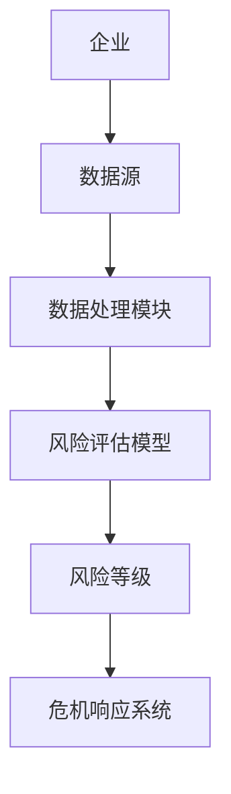
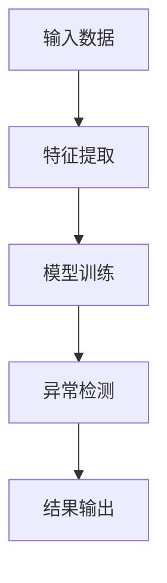
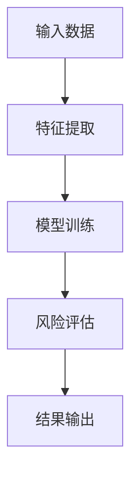
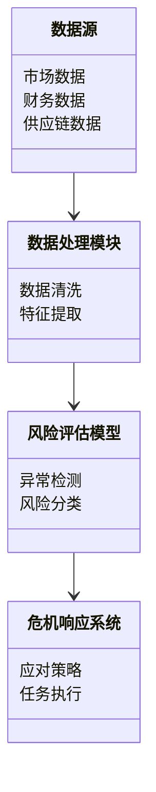
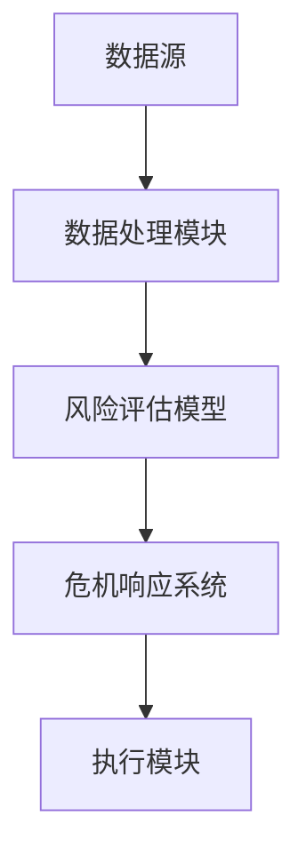
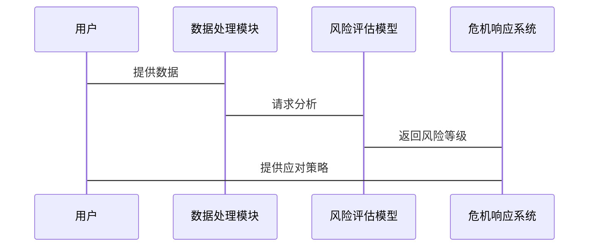

                 


# AI Agent在企业风险预警与危机管理中的应用

## 关键词：AI Agent, 企业风险预警, 危机管理, 数据驱动, 实时监控, 智能化决策

## 摘要：  
随着企业面临的内外部风险日益复杂和多样化，传统的风险管理方法已经难以满足现代企业的需求。AI Agent（人工智能代理）作为一种智能化、自动化、实时响应的解决方案，正在成为企业风险预警与危机管理的重要工具。本文从AI Agent的基本概念出发，详细探讨其在企业风险预警中的应用价值，分析其算法原理和系统架构，结合实际案例，为企业在风险预警与危机管理中的智能化转型提供理论支持和实践指导。

---

# 第1章: AI Agent的基本概念与应用背景

## 1.1 AI Agent的定义与核心概念

### 1.1.1 什么是AI Agent
AI Agent（人工智能代理）是一种能够感知环境、自主决策并执行任务的智能实体。它通过数据输入、模型分析和决策推理，为企业提供实时的风险预警和危机应对方案。

### 1.1.2 AI Agent的核心特征
- **自主性**：能够在没有人工干预的情况下独立运行。
- **反应性**：能够实时感知环境变化并做出响应。
- **学习性**：通过机器学习算法不断优化自身的决策能力。
- **协作性**：能够与其他系统、数据源或AI Agent协同工作。

### 1.1.3 AI Agent的类型与分类
AI Agent可以根据功能、应用场景和智能水平分为以下几类：
1. **基于规则的AI Agent**：通过预定义的规则进行决策。
2. **基于机器学习的AI Agent**：利用数据驱动的方法进行学习和推理。
3. **混合型AI Agent**：结合规则和机器学习的双重优势。
4. **实时响应型AI Agent**：适用于需要快速决策的场景。

### 1.1.4 AI Agent在企业中的应用价值
- **提高风险识别的准确性**：通过大数据分析和机器学习模型，发现潜在风险。
- **实现风险的实时监控**：实时感知企业内外部环境的变化，及时发出预警。
- **优化危机应对策略**：根据实时数据和历史案例，提供最优的应对方案。

## 1.2 企业风险预警与危机管理的现状

### 1.2.1 传统企业风险管理的局限性
- **滞后性**：传统方法通常基于历史数据，无法实时感知风险。
- **片面性**：难以全面考虑企业内外部的复杂因素。
- **低效性**：人工分析效率低下，难以应对海量数据。

### 1.2.2 现代企业风险管理的需求
- **实时性**：企业需要快速响应潜在风险。
- **数据驱动**：利用大数据技术进行精准分析。
- **智能化**：通过AI技术实现自动化决策。

### 1.2.3 危机管理中的关键问题
- **风险识别的准确性**：如何准确识别潜在风险。
- **决策的及时性**：如何快速制定应对策略。
- **资源的优化配置**：如何合理分配资源以应对危机。

---

# 第2章: AI Agent的核心概念与联系

## 2.1 AI Agent的原理与机制

### 2.1.1 AI Agent的基本原理
AI Agent通过感知环境、分析数据、推理决策和执行任务，实现对风险的预警和应对。其核心流程包括：
1. **数据采集**：从企业内外部获取相关数据。
2. **数据处理**：对数据进行清洗、特征提取和预处理。
3. **模型分析**：利用机器学习模型进行风险评估。
4. **决策推理**：根据模型结果生成应对策略。
5. **任务执行**：将决策结果转化为具体行动。

### 2.1.2 AI Agent的核心算法
- **监督学习**：用于分类和回归任务。
- **无监督学习**：用于聚类和异常检测。
- **强化学习**：用于动态环境中的决策优化。

### 2.1.3 AI Agent的决策机制
AI Agent通过构建决策树、概率模型或规则引擎，实现对风险的分类和优先级排序。

## 2.2 AI Agent与相关概念的对比

### 2.2.1 AI Agent与传统算法的对比
| 对比维度 | AI Agent | 传统算法 |
|----------|-----------|-----------|
| **自主性** | 高 | 低 |
| **适应性** | 强 | 弱 |
| **实时性** | 高 | 低 |
| **复杂性** | 高 | 中 |

### 2.2.2 AI Agent与机器学习的对比
- **AI Agent**：更注重自主决策和任务执行。
- **机器学习**：主要关注数据的模式识别和预测。

### 2.2.3 AI Agent与规则引擎的对比
- **AI Agent**：能够根据数据动态调整规则。
- **规则引擎**：依赖于预定义的规则。

## 2.3 AI Agent的实体关系图



---

# 第3章: AI Agent的算法原理与数学模型

## 3.1 基于概率论的异常检测算法

### 3.1.1 算法原理
异常检测算法通过分析数据的分布情况，识别偏离正常模式的点。常用的方法包括：
- **基于统计的方法**：如Z-score和标准差。
- **基于密度的方法**：如DBSCAN。

### 3.1.2 算法流程


### 3.1.3 算法实现
```python
import numpy as np
from sklearn.covariance import EllipticEnvelope

# 初始化模型
model = EllipticEnvelope(contamination=0.1)

# 训练模型
model.fit(X_train)

# 预测异常点
y_pred = model.predict(X_test)
```

### 3.1.4 数学公式
$$ y = \mu + \sigma \cdot z $$
其中，$\mu$ 是均值，$\sigma$ 是标准差，$z$ 是标准差分数。

---

## 3.2 基于机器学习的风险评估模型

### 3.2.1 算法原理
风险评估模型通过训练分类器，将风险分为高、中、低三个等级。常用的算法包括：
- **逻辑回归**：用于二分类问题。
- **随机森林**：用于多分类问题。

### 3.2.2 算法流程


### 3.2.3 算法实现
```python
from sklearn.ensemble import RandomForestClassifier

# 初始化模型
model = RandomForestClassifier(n_estimators=100)

# 训练模型
model.fit(X_train, y_train)

# 预测风险等级
y_pred = model.predict(X_test)
```

### 3.2.4 数学公式
$$ P(y|x) = \prod_{i=1}^{n} P(x_i|y) \cdot P(y) $$
其中，$P(y|x)$ 是后验概率，$P(x_i|y)$ 是似然概率，$P(y)$ 是先验概率。

---

# 第4章: AI Agent的系统分析与架构设计

## 4.1 问题场景介绍
企业面临的风险包括市场波动、供应链中断、财务异常、声誉损失等。AI Agent需要实时监控这些风险，并提供应对策略。

## 4.2 系统功能设计

### 4.2.1 领域模型


### 4.2.2 系统架构设计


### 4.2.3 接口设计
- **数据接口**：与企业数据源对接。
- **模型接口**：与机器学习模型对接。
- **用户接口**：提供可视化界面供用户查看结果。

### 4.2.4 交互流程图


---

# 第5章: AI Agent的项目实战

## 5.1 环境安装与配置

### 5.1.1 环境要求
- Python 3.6+
- Scikit-learn
- Pandas
- Mermaid

### 5.1.2 安装步骤
```bash
pip install numpy scikit-learn pandas
```

## 5.2 系统核心实现

### 5.2.1 核心代码
```python
import numpy as np
from sklearn.ensemble import RandomForestClassifier

# 数据加载
data = np.loadtxt('data.csv', delimiter=',')
X = data[:, :-1]
y = data[:, -1]

# 模型训练
model = RandomForestClassifier(n_estimators=100)
model.fit(X, y)

# 模型预测
y_pred = model.predict(X)
```

### 5.2.2 代码解读
- **数据加载**：从CSV文件中读取数据。
- **模型训练**：使用随机森林算法训练模型。
- **模型预测**：对测试数据进行预测。

## 5.3 实际案例分析

### 5.3.1 案例背景
某企业面临供应链中断的风险，希望通过AI Agent进行实时监控和预警。

### 5.3.2 案例分析
1. 数据采集：从供应链系统获取实时数据。
2. 数据处理：清洗和特征提取。
3. 模型分析：利用随机森林算法进行风险评估。
4. 危机响应：根据模型结果制定应对策略。

## 5.4 项目小结
通过实际案例分析，可以验证AI Agent在企业风险预警中的有效性。模型能够准确识别潜在风险，并提供实时的应对策略。

---

# 第6章: 最佳实践与小结

## 6.1 最佳实践 tips
1. **数据质量**：确保数据的准确性和完整性。
2. **模型可解释性**：选择能够解释的模型，便于企业理解和优化。
3. **实时性**：确保系统能够实时响应风险变化。

## 6.2 小结
AI Agent作为一种智能化、自动化的解决方案，正在为企业风险预警与危机管理带来革命性的变化。通过本文的分析，读者可以深入了解AI Agent的核心原理和应用场景，并为企业智能化转型提供有价值的参考。

## 6.3 注意事项
- **数据隐私**：确保数据的安全性和隐私性。
- **模型优化**：定期更新模型，避免过时。
- **团队协作**：AI Agent的部署需要跨部门的协作。

## 6.4 拓展阅读
- 《机器学习实战》
- 《深入浅出人工智能》
- 《数据驱动的决策管理》

---

作者：AI天才研究院/AI Genius Institute & 禅与计算机程序设计艺术 /Zen And The Art of Computer Programming

