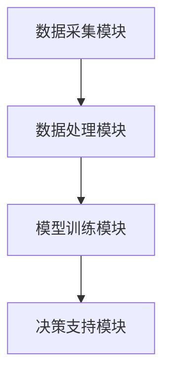
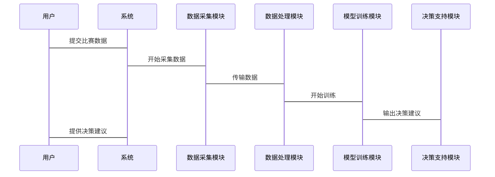

                 


# AI Agent在体育赛事分析中的应用

## 关键词：AI Agent，体育赛事分析，人工智能，机器学习，深度学习

## 摘要：  
随着人工智能技术的快速发展，AI Agent（人工智能代理）在体育赛事分析中的应用越来越广泛。通过结合多智能体系统、机器学习和深度学习等技术，AI Agent能够帮助分析员更精准地预测比赛结果、优化战术策略、评估运动员表现，并实时监控比赛动态。本文将详细探讨AI Agent在体育赛事分析中的核心原理、应用场景以及系统实现方案，旨在为读者提供全面的技术视角。

---

## 第1章: AI Agent的基本概念与应用背景

### 1.1 AI Agent的定义与核心要素

#### 1.1.1 什么是AI Agent
AI Agent（人工智能代理）是指能够感知环境、自主决策并执行任务的智能实体。它能够通过传感器获取数据，利用算法进行分析和推理，并通过执行器与环境交互。AI Agent的核心在于其自主性和智能性，能够根据任务需求动态调整行为。

#### 1.1.2 AI Agent的核心属性
- **自主性**：AI Agent能够在没有外部干预的情况下自主决策。
- **反应性**：能够实时感知环境并做出快速响应。
- **学习性**：通过机器学习算法不断优化自身的决策能力。
- **协作性**：能够在多智能体系统中与其他代理协作完成复杂任务。

#### 1.1.3 AI Agent在体育赛事分析中的应用潜力
AI Agent能够帮助分析员快速处理海量数据，发现潜在规律，并提供实时的战术建议。例如，在足球比赛中，AI Agent可以通过分析球员的运动轨迹和比赛数据，预测对手的进攻方向，并为教练提供最佳防守策略。

### 1.2 体育赛事分析的基本问题

#### 1.2.1 体育数据分析的挑战
体育赛事数据分析涉及大量多维数据，包括球员动作、比赛节奏、战术布局等。传统方法难以高效处理这些复杂数据。

#### 1.2.2 传统体育分析的局限性
传统体育分析主要依赖人工观察和经验，存在主观性强、效率低、覆盖范围有限等问题。

#### 1.2.3 AI Agent如何解决这些问题
AI Agent能够通过机器学习算法快速处理大量数据，发现隐藏在数据中的规律，并提供实时的决策支持。

### 1.3 本章小结
本章介绍了AI Agent的基本概念及其在体育赛事分析中的潜力，指出了传统体育分析的局限性，并为后续章节奠定了基础。

---

## 第2章: 多智能体系统与协作机制

### 2.1 多智能体系统（MAS）的基本原理

#### 2.1.1 多智能体系统的定义
多智能体系统是指由多个相互作用的智能体组成的系统，这些智能体能够通过通信和协作完成复杂任务。

#### 2.1.2 多智能体系统的核心组件
- **智能体**：具有感知和行动能力的个体。
- **通信机制**：智能体之间进行信息交换的通道。
- **协作协议**：智能体之间协作的规则和策略。

#### 2.1.3 多智能体系统在体育分析中的应用
在体育比赛中，多个AI Agent可以分别负责不同的任务，例如一个负责分析球员动作，另一个负责预测比赛结果。

### 2.2 AI Agent的知识表示与推理

#### 2.2.1 知识表示的基本方法
知识表示是AI Agent进行推理的基础。常见的知识表示方法包括规则表示、语义网络和知识图谱。

#### 2.2.2 逻辑推理与概率推理
逻辑推理通过逻辑规则进行推导，而概率推理则基于概率论进行不确定性推理。

#### 2.2.3 知识图谱在体育分析中的应用
知识图谱可以用来表示球员的技能、比赛规则和战术策略等知识，帮助AI Agent更好地理解比赛场景。

### 2.3 本章小结
本章详细介绍了多智能体系统和知识表示与推理的基本原理，并探讨了它们在体育分析中的应用。

---

## 第3章: 机器学习与深度学习在AI Agent中的应用

### 3.1 机器学习的基本原理

#### 3.1.1 机器学习的定义与分类
机器学习是一种通过数据训练模型的技术，主要分为监督学习、无监督学习和强化学习。

#### 3.1.2 监督学习、无监督学习与强化学习
- **监督学习**：基于标记数据进行训练，适用于分类和回归任务。
- **无监督学习**：基于未标记数据进行训练，适用于聚类和降维任务。
- **强化学习**：通过与环境交互获得奖励，适用于决策任务。

#### 3.1.3 机器学习在体育数据分析中的应用
机器学习可以用于预测比赛结果、分析球员表现和优化战术策略。

### 3.2 深度学习的核心算法

#### 3.2.1 神经网络的基本结构
深度学习的核心是神经网络，包括输入层、隐藏层和输出层。

#### 3.2.2 卷积神经网络（CNN）与循环神经网络（RNN）
- **CNN**：适用于图像识别任务。
- **RNN**：适用于序列数据处理任务。

#### 3.2.3 Transformer模型在自然语言处理中的应用
虽然主要应用于自然语言处理，但Transformer模型在体育数据分析中也有潜在的应用价值。

### 3.3 本章小结
本章介绍了机器学习和深度学习的基本原理，并探讨了它们在AI Agent中的应用。

---

## 第4章: 基于AI Agent的体育赛事分析系统

### 4.1 系统功能需求分析

#### 4.1.1 数据采集与预处理
- **数据来源**：包括比赛录像、传感器数据和历史比赛数据。
- **数据清洗**：去除噪声数据，提取有用特征。
- **数据标注**：为数据打标签，方便模型训练。

#### 4.1.2 球员动作预测与战术优化
通过分析球员的运动轨迹，预测其下一步动作，并优化球队的战术策略。

#### 4.1.3 对手行为模式识别
通过机器学习算法，识别对手的行为模式，帮助制定应对策略。

### 4.2 系统架构设计

#### 4.2.1 系统功能模块划分
- **数据采集模块**：负责采集比赛数据。
- **数据处理模块**：对数据进行清洗和标注。
- **模型训练模块**：训练机器学习模型。
- **决策支持模块**：基于模型输出提供决策建议。

#### 4.2.2 系统架构图


#### 4.2.3 系统交互流程


### 4.3 项目实战

#### 4.3.1 环境安装
- 安装Python和相关库（如NumPy、TensorFlow、Keras）。
- 安装数据采集工具（如OpenCV、传感器接口）。

#### 4.3.2 核心实现代码
```python
import numpy as np
from tensorflow import keras

# 数据预处理
def preprocess_data(data):
    # 假设data是包含球员动作的数据
    # 这里进行归一化处理
    normalized_data = (data - np.mean(data)) / np.std(data)
    return normalized_data

# 神经网络模型
model = keras.Sequential([
    keras.layers.Dense(64, activation='relu'),
    keras.layers.Dense(1, activation='sigmoid')
])
model.compile(optimizer='adam', loss='binary_crossentropy', metrics=['accuracy'])

# 训练模型
preprocessed_data = preprocess_data(raw_data)
model.fit(preprocessed_data, labels, epochs=100, batch_size=32)
```

#### 4.3.3 实际案例分析
以一场足球比赛为例，AI Agent可以分析球员的跑位、传球路线，并预测对手的防守策略，帮助教练制定最优的战术。

### 4.4 本章小结
本章详细介绍了体育赛事分析系统的功能需求、架构设计和项目实现，展示了AI Agent在实际应用中的潜力。

---

## 第5章: 总结与展望

### 5.1 本章总结
本文详细探讨了AI Agent在体育赛事分析中的应用，包括其核心原理、系统架构和实际案例。AI Agent通过结合多智能体系统和机器学习技术，能够显著提高体育分析的效率和准确性。

### 5.2 未来展望
随着技术的不断发展，AI Agent在体育赛事分析中的应用将更加广泛和深入。未来的研究方向包括更高效的算法优化、多模态数据的融合以及更智能化的决策支持系统。

### 5.3 最佳实践 tips
- 在实际应用中，建议结合具体场景选择合适的算法。
- 数据的质量和完整性对模型性能有重要影响。
- 系统的设计需要考虑可扩展性和可维护性。

### 5.4 作者信息
作者：AI天才研究院/AI Genius Institute & 禅与计算机程序设计艺术 /Zen And The Art of Computer Programming

---

# 结语
AI Agent在体育赛事分析中的应用前景广阔，随着技术的不断进步，它将为体育行业带来更多的创新和变革。希望本文能为读者提供有价值的参考和启发。

