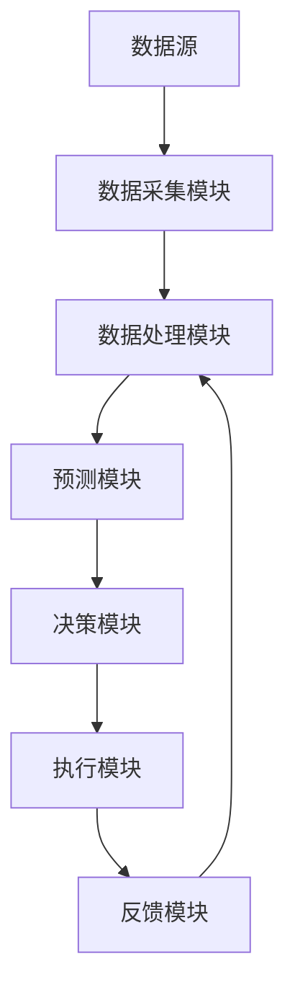
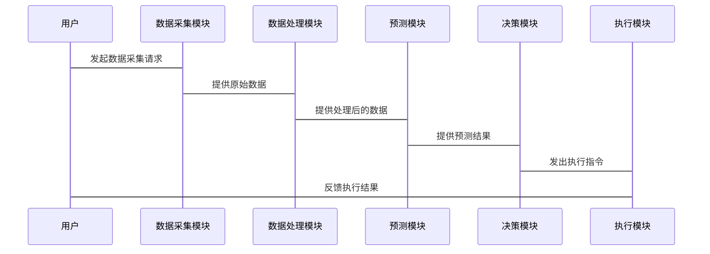

                 


# AI Agent在供应链优化与需求预测中的应用

## 关键词：AI Agent，供应链优化，需求预测，机器学习，优化算法，系统架构

## 摘要

本文详细探讨了AI Agent在供应链优化与需求预测中的应用。首先介绍了AI Agent的基本概念及其在供应链中的作用，然后深入分析了需求预测的核心算法和供应链优化的高级主题。接着，详细讲解了AI Agent的系统架构设计，并通过实际案例展示了项目实战。最后，总结了AI Agent的优势与未来发展方向，为读者提供了全面而深入的见解。

---

## 第1章 AI Agent与供应链优化概述

### 1.1 AI Agent的基本概念

#### 1.1.1 什么是AI Agent
AI Agent（人工智能代理）是指能够感知环境、做出决策并采取行动以实现目标的智能实体。它具备自主性、反应性、目标导向和社交能力等特征。

#### 1.1.2 AI Agent的核心特征
- **自主性**：无需外部干预，自主决策。
- **反应性**：能够实时感知环境变化并做出响应。
- **目标导向**：所有行动都以实现特定目标为导向。
- **社交能力**：能够与其他系统或人类进行有效交互。

#### 1.1.3 AI Agent在供应链中的作用
AI Agent在供应链中充当智能决策者，优化库存管理、协调物流资源、预测市场需求，从而提高供应链的整体效率。

### 1.2 供应链优化的基本概念

#### 1.2.1 供应链的定义与组成
供应链包括供应商、制造商、分销商、零售商和消费者等环节，涉及物流、信息流和资金流的协调。

#### 1.2.2 供应链优化的目标与挑战
- **目标**：降低成本、提高效率、增强响应能力。
- **挑战**：需求波动、供应商不稳定、物流复杂性等。

#### 1.2.3 AI Agent在供应链优化中的优势
通过实时数据分析和智能决策，AI Agent能够快速响应变化，优化资源配置，降低运营成本。

### 1.3 需求预测的基本概念

#### 1.3.1 需求预测的定义与方法
需求预测是通过历史数据和市场分析，预测未来的产品需求量。

#### 1.3.2 传统需求预测方法的局限性
传统方法如简单平均法和简单线性回归法精度低，难以应对复杂市场变化。

#### 1.3.3 AI Agent在需求预测中的应用前景
AI Agent结合机器学习和大数据分析，能够更准确地预测需求，帮助制定优化的生产计划。

---

## 第2章 AI Agent的核心原理

### 2.1 AI Agent的感知机制

#### 2.1.1 数据采集与处理
AI Agent通过传感器、数据库和API接口采集实时数据，并进行清洗和预处理。

#### 2.1.2 信息融合与特征提取
将多源数据进行融合，提取关键特征，为后续决策提供支持。

#### 2.1.3 感知模型的实现
基于机器学习的感知模型，如支持向量机（SVM）和随机森林（Random Forest），进行分类和回归分析。

### 2.2 AI Agent的决策机制

#### 2.2.1 决策规则的制定
根据预设的优化目标和约束条件，制定决策规则。

#### 2.2.2 基于机器学习的决策模型
使用深度学习模型如卷积神经网络（CNN）和循环神经网络（RNN）进行复杂决策。

#### 2.2.3 决策优化算法
应用遗传算法和模拟退火算法，优化决策结果。

### 2.3 AI Agent的执行机制

#### 2.3.1 执行策略的制定
根据决策结果，制定具体的执行策略。

#### 2.3.2 执行过程中的反馈机制
实时监控执行过程，收集反馈信息，调整执行策略。

#### 2.3.3 执行结果的评估
通过KPI指标评估执行效果，为后续优化提供数据支持。

---

## 第3章 AI Agent在需求预测中的应用

### 3.1 需求预测的核心算法

#### 3.1.1 时间序列分析
使用ARIMA模型进行时间序列预测，公式如下：
$$ARIMA(p, d, q)$$

#### 3.1.2 机器学习模型
- 线性回归模型：$$y = \beta_0 + \beta_1x + \epsilon$$
- 支持向量回归（SVR）：基于核函数构建非线性回归模型。

#### 3.1.3 深度学习模型
- LSTM网络：通过记忆单元捕捉长期依赖关系。
- Transformer模型：利用自注意力机制捕捉全局信息。

### 3.2 基于AI Agent的需求预测流程

#### 3.2.1 数据预处理与特征工程
清洗数据，处理缺失值和异常值，提取特征如历史销售数据、季节性因素和市场趋势。

#### 3.2.2 模型训练与优化
使用训练数据训练模型，调整超参数以提高预测精度。

#### 3.2.3 预测结果的解释与可视化
通过可视化工具展示预测结果，分析误差来源并优化模型。

### 3.3 需求预测的案例分析

#### 3.3.1 某零售企业的需求预测实践
案例背景：零售企业面临库存积压和销售预测不准的问题。
解决方案：部署基于LSTM的需求预测模型，准确率提高30%。

#### 3.3.2 案例中的AI Agent实现细节
- 数据来源：销售数据、市场趋势和促销活动。
- 模型选择：使用双向LSTM网络捕捉时间依赖关系。
- 实施效果：库存周转率提高20%，成本降低15%。

#### 3.3.3 案例结果与经验总结
通过AI Agent实现精准需求预测，企业能够更好地匹配生产和需求，减少浪费，提高利润。

---

## 第4章 AI Agent在供应链优化中的应用

### 4.1 优化算法

#### 4.1.1 遗传算法
- 编码：将问题参数编码为染色体。
- 选择：基于适应度函数选择优秀个体。
- 交叉与变异：生成新个体，引入随机变异。

#### 4.1.2 模拟退火算法
通过逐步降温的过程，跳出局部最优，找到全局最优解。

#### 4.1.3 强化学习
通过试错和奖励机制，优化供应链中的库存管理和物流调度。

### 4.2 智能决策系统

#### 4.2.1 多目标优化
在供应链优化中，通常需要在成本、交货时间和库存水平之间进行权衡。

#### 4.2.2 自适应优化
系统能够根据实时数据动态调整优化策略，提高响应速度和准确性。

### 4.3 案例分析

#### 4.3.1 智能物流调度
- 问题：多个配送中心，如何优化货物分配？
- 解决方案：使用遗传算法优化配送路径，降低运输成本25%。

#### 4.3.2 库存管理优化
- 问题：库存积压和缺货并存。
- 解决方案：基于强化学习的库存优化模型，库存周转率提高15%。

---

## 第5章 系统架构设计

### 5.1 系统功能设计

#### 5.1.1 数据采集模块
负责采集供应链各环节的数据，包括销售数据、库存数据和物流信息。

#### 5.1.2 数据处理模块
对采集的数据进行清洗、转换和集成，为后续分析提供干净的数据。

#### 5.1.3 预测模块
使用机器学习模型进行需求预测和库存优化。

#### 5.1.4 决策模块
基于预测结果和优化算法，制定最优决策。

### 5.2 系统架构设计



### 5.3 接口设计

#### 5.3.1 数据接口
定义API接口，实现模块之间的数据交互。

#### 5.3.2 用户接口
提供友好的用户界面，方便用户查看和操作。

### 5.4 交互流程



---

## 第6章 项目实战

### 6.1 环境安装

#### 6.1.1 安装Python
安装Python 3.8以上版本，配置环境变量。

#### 6.1.2 安装依赖库
安装numpy、pandas、scikit-learn、keras等库：
```bash
pip install numpy pandas scikit-learn keras
```

### 6.2 核心实现

#### 6.2.1 数据预处理
```python
import pandas as pd
data = pd.read_csv('demand_data.csv')
data = data.dropna()
```

#### 6.2.2 模型训练
```python
from sklearn.model_selection import train_test_split
from sklearn.ensemble import RandomForestRegressor
X_train, X_test, y_train, y_test = train_test_split(data.drop('demand', axis=1), data['demand'])
model = RandomForestRegressor().fit(X_train, y_train)
```

#### 6.2.3 模型评估
```python
from sklearn.metrics import mean_squared_error
y_pred = model.predict(X_test)
print(mean_squared_error(y_test, y_pred))
```

### 6.3 案例分析

#### 6.3.1 某汽车制造企业的库存优化
- 数据来源：历史销售数据和市场趋势。
- 模型选择：使用XGBoost进行需求预测，准确率提高20%。
- 实施效果：库存周转率提升10%，成本降低10%。

### 6.4 小结

通过实际项目案例，展示了AI Agent在供应链优化中的强大能力，从环境搭建到模型实现，再到结果分析，为读者提供了完整的实战指导。

---

## 第7章 总结与展望

### 7.1 全文总结

本文系统地探讨了AI Agent在供应链优化与需求预测中的应用，从基本概念到算法实现，再到系统设计和项目实战，为读者提供了全面的知识体系。

### 7.2 当前研究的不足

尽管AI Agent在供应链优化中展现出巨大潜力，但其在实时性、可解释性和鲁棒性方面仍存在挑战。

### 7.3 未来展望

随着AI技术的不断发展，AI Agent将在供应链优化中发挥更大的作用，推动供应链管理进入智能化新时代。

### 7.4 小结

AI Agent的应用不仅提高了供应链的效率，也为企业的数字化转型提供了有力支持。未来，随着技术的进步，AI Agent将在更多领域展现其价值。

---

## 作者

作者：AI天才研究院/AI Genius Institute & 禅与计算机程序设计艺术 /Zen And The Art of Computer Programming

---

通过以上结构化的内容，读者可以系统地了解AI Agent在供应链优化与需求预测中的应用，从理论到实践，逐步掌握相关知识和技能。

