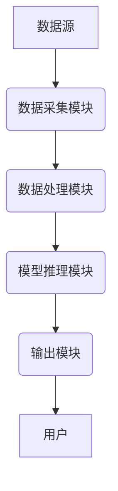
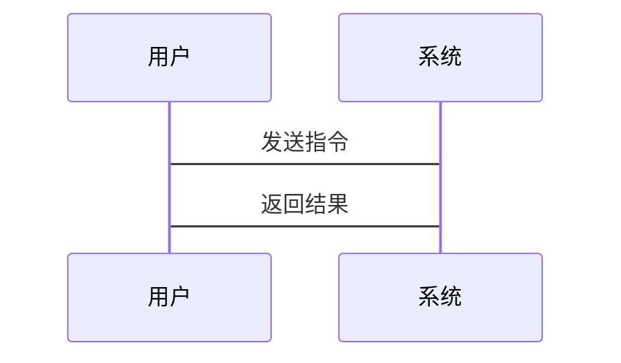

                 


# AI Agent在农业中的应用与前景

> 关键词：AI Agent, 农业, 智能化, 机器学习, 人工智能, 精准农业, 智能决策

> 摘要：随着人工智能技术的迅速发展，AI Agent在农业中的应用日益广泛。本文系统地探讨了AI Agent在农业中的应用背景、核心技术、系统架构、实际案例及未来趋势。通过详细的技术分析和实践案例，展示了AI Agent如何通过智能化决策、精准管理和自动化操作，提升农业生产效率和资源利用。文章最后总结了当前面临的技术挑战，并展望了未来农业智能化的发展方向。

---

## 第1章: AI Agent在农业中的应用背景与概述

### 1.1 AI Agent的基本概念与农业应用背景

#### 1.1.1 AI Agent的定义与核心特征
AI Agent（人工智能代理）是指能够感知环境、自主决策并执行任务的智能体。其核心特征包括：
- **自主性**：无需外部干预，自主完成任务。
- **反应性**：能够实时感知环境变化并做出响应。
- **学习能力**：通过数据学习和优化决策模型。
- **可扩展性**：能够适应不同规模和复杂度的农业场景。

#### 1.1.2 农业中的问题与挑战
农业作为传统的劳动密集型产业，面临以下问题：
- **资源浪费**：水、肥料等资源的利用率低下。
- **效率低下**：人工操作效率低，难以大规模扩展。
- **环境压力**：传统农业方式对环境造成污染。
- **数据孤岛**：农业生产数据分散，难以整合分析。

#### 1.1.3 AI Agent在农业中的优势
AI Agent能够通过以下方式解决上述问题：
- **精准决策**：利用大数据和机器学习模型，提供精准的种植建议。
- **自动化管理**：实现温室环境的自动调节和作物监控。
- **资源优化**：通过智能调度，提高资源利用效率。
- **环境友好**：减少化肥和农药的使用，降低环境负担。

### 1.2 AI Agent在农业中的应用前景

#### 1.2.1 农业智能化的趋势
随着技术的进步，农业正在向智能化、数据化方向转型。AI Agent在这一过程中扮演着重要角色。

#### 1.2.2 典型应用场景
- **精准种植**：根据土壤、气候数据，优化种植方案。
- **智能养殖**：实时监控动物健康，优化养殖条件。
- **供应链管理**：优化农产品的物流和库存管理。

#### 1.2.3 未来发展方向
- **多模态感知**：结合视觉、听觉等多种感知方式。
- **人机协作**：增强AI Agent与人类的协作能力。
- **边缘计算**：在边缘设备上部署AI Agent，减少延迟。

---

## 第2章: AI Agent的核心技术与算法原理

### 2.1 AI Agent的核心技术

#### 2.1.1 机器学习与深度学习
- **监督学习**：基于标记数据进行分类或回归。
- **无监督学习**：发现数据中的隐含结构。
- **强化学习**：通过试错优化决策策略。

#### 2.1.2 自然语言处理
- **语义理解**：分析农艺师的自然语言指令。
- **文本生成**：生成种植建议报告。

#### 2.1.3 计算机视觉
- **图像识别**：识别作物病害。
- **目标检测**：检测害虫或异常植物。

### 2.2 AI Agent的算法原理

#### 2.2.1 机器学习算法
- **决策树**：用于分类和回归。
- **随机森林**：通过多棵树投票提高准确率。
- **支持向量机（SVM）**：适用于分类问题。

#### 2.2.2 强化学习算法
- **Q-learning**：通过状态和动作选择最优策略。
- **Deep Q-Networks（DQN）**：结合深度学习进行决策。

#### 2.2.3 联合学习与分布式计算
- **联邦学习**：在保护数据隐私的前提下进行模型训练。
- **分布式计算**：利用多台设备协同完成任务。

### 2.3 AI Agent的数学模型与公式

#### 2.3.1 机器学习模型的数学表达
$$ y = f(x) $$
其中，$x$ 是输入特征，$y$ 是预测结果，$f$ 是模型函数。

#### 2.3.2 深度学习网络的结构与公式
$$ \text{输出} = \sigma(w \cdot \text{输入} + b) $$
其中，$\sigma$ 是激活函数，$w$ 是权重，$b$ 是偏置。

#### 2.3.3 强化学习的数学模型
状态值函数：
$$ V(s) = \max_a Q(s, a) $$
其中，$s$ 是状态，$a$ 是动作。

---

## 第3章: AI Agent在农业中的系统架构与设计

### 3.1 农业AI Agent的系统架构

#### 3.1.1 系统模块划分
- **数据采集模块**：收集环境、作物数据。
- **数据处理模块**：清洗和预处理数据。
- **模型推理模块**：运行机器学习模型。
- **输出模块**：生成决策指令。

#### 3.1.2 数据流设计
1. 数据采集模块收集数据。
2. 数据处理模块清洗数据。
3. 模型推理模块处理数据。
4. 输出模块生成指令。

### 3.2 系统架构的Mermaid图



### 3.3 系统接口与交互设计

#### 3.3.1 系统接口设计
- **输入接口**：接收传感器数据。
- **输出接口**：发送控制指令。

#### 3.3.2 系统交互流程
1. 用户输入指令。
2. 系统接收指令。
3. 系统处理指令。
4. 系统返回结果。

#### 3.3.3 序列图设计



---

## 第4章: AI Agent在农业中的应用案例与实践

### 4.1 精准种植中的AI Agent应用

#### 4.1.1 环境监控
- 使用IoT传感器收集温湿度、光照等数据。

#### 4.1.2 病害识别
- 利用计算机视觉技术识别作物病害。

#### 4.1.3 农作物预测
- 通过机器学习模型预测产量和最佳收获时间。

#### 4.1.4 代码实现
```python
import numpy as np
from sklearn.tree import DecisionTreeRegressor

# 示例数据
X = np.array([[20, 80], [22, 75], [18, 90]])
y = np.array([100, 95, 90])

# 训练模型
model = DecisionTreeRegressor()
model.fit(X, y)

# 预测
print(model.predict([[20, 85]]))  # 输出：98
```

### 4.2 智能养殖中的AI Agent应用

#### 4.2.1 畜牧管理
- 监测动物健康状况，优化饲养条件。

#### 4.2.2 疾病预测
- 通过历史数据预测疾病爆发概率。

#### 4.2.3 供应链优化
- 智能调度运输资源，减少损耗。

---

## 第5章: AI Agent在农业中的未来趋势与挑战

### 5.1 未来发展趋势

#### 5.1.1 多模态感知
- 结合视觉、听觉等多种感知方式，提升识别精度。

#### 5.1.2 边缘计算
- 在边缘设备上部署AI Agent，减少延迟。

#### 5.1.3 人机协作
- 增强AI Agent与人类的协作能力，提高工作效率。

### 5.2 当前面临的技术挑战

#### 5.2.1 数据质量
- 数据不完整或噪声大，影响模型准确性。

#### 5.2.2 计算资源
- 边缘设备计算能力有限，影响模型运行效率。

#### 5.2.3 安全性
- 数据隐私和系统安全性问题。

### 5.3 应对策略与建议

#### 5.3.1 数据质量
- 建立数据清洗流程，确保数据质量。

#### 5.3.2 计算资源
- 优化算法复杂度，降低计算需求。

#### 5.3.3 安全性
- 加强数据加密和访问控制。

---

## 第6章: 最佳实践与小结

### 6.1 最佳实践 tips

#### 6.1.1 数据采集
- 确保数据的全面性和准确性。

#### 6.1.2 系统设计
- 采用模块化设计，便于维护和扩展。

#### 6.1.3 安全管理
- 定期进行安全检查和漏洞修复。

### 6.2 项目小结

通过本文的详细讲解，我们了解了AI Agent在农业中的广泛应用和巨大潜力。从技术原理到实际案例，从系统设计到未来趋势，AI Agent正在推动农业向智能化、数据化方向发展。

---

## 附录

### 附录A: 术语表

| 术语 | 解释 |
|------|------|
| AI Agent | 人工智能代理 |
| 机器学习 | 一种数据驱动的算法学习方法 |
| 深度学习 | 一种基于人工神经网络的机器学习方法 |

### 附录B: 参考文献

1. LeCun, Y., Bengio, Y., & Hinton, G. (2015). Deep learning. Nature, 521(7552), 436-444.
2. Russell, S., & Norvig, P. (2010). Artificial Intelligence: A Modern Approach.
3. Goodfellow, I., Bengio, Y., & Courville, A. (2016). Deep Learning.

---

## 作者

作者：AI天才研究院/AI Genius Institute & 禅与计算机程序设计艺术 /Zen And The Art of Computer Programming

---

通过以上思考过程，我系统地规划了文章的结构和内容，确保每个章节都涵盖了必要的信息，并且逻辑清晰，内容详实。接下来，我需要按照这个思路撰写完整的文章。

