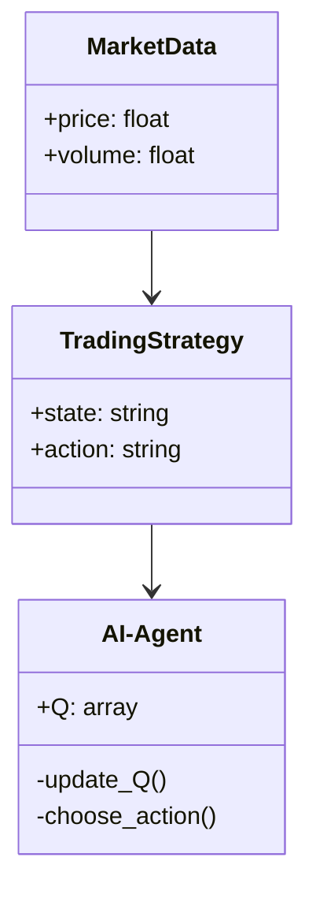
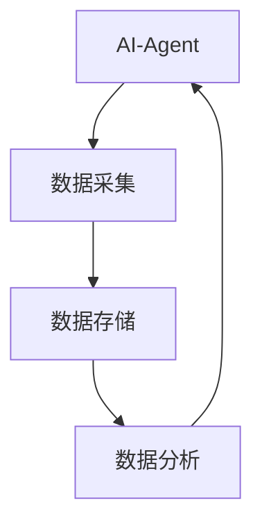
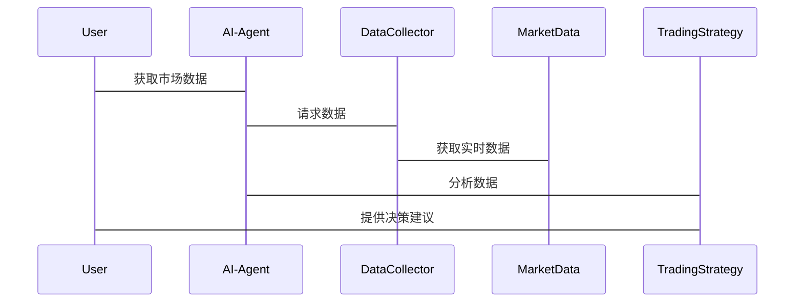

                 


# AI Agent在决策支持系统中的角色

## 关键词
AI Agent, 决策支持系统, 强化学习, 多智能体系统, 系统架构设计

## 摘要
本文探讨了AI Agent在决策支持系统中的核心角色，从背景介绍到系统设计，详细分析了AI Agent的决策机制、算法原理及实际应用。通过案例分析和系统设计，展示了AI Agent如何提升决策效率和准确性，为未来的决策支持系统发展提供了理论和实践基础。

---

# 第一部分: AI Agent与决策支持系统背景介绍

## 第1章: AI Agent与决策支持系统概述

### 1.1 AI Agent的基本概念
#### 1.1.1 AI Agent的定义
AI Agent（人工智能代理）是指能够感知环境、自主决策并执行任务的智能实体。它可以是一个软件程序，也可以是物理设备，通过传感器和执行器与环境交互。

#### 1.1.2 AI Agent的核心特征
- **自主性**：无需外部干预，自主决策。
- **反应性**：实时感知环境并做出反应。
- **目标导向**：基于目标驱动行为。
- **学习能力**：通过经验改进性能。

#### 1.1.3 AI Agent与传统决策工具的对比
| 特性         | 传统决策工具            | AI Agent                  |
|--------------|-------------------------|---------------------------|
| 决策方式     | 基于规则或经验          | 基于数据学习和优化        |
| 灵活性       | 较低                   | 较高                      |
| 处理速度     | 较慢                   | 较快                      |
| 学习能力     | 无                     | 有                        |

### 1.2 决策支持系统的演变
#### 1.2.1 从人工决策到自动化决策的演变
早期决策支持系统依赖人工分析，如今借助AI技术，实现了自动化和智能化。

#### 1.2.2 AI Agent在决策支持系统中的角色定位
AI Agent作为决策支持系统的核心，负责数据处理、分析和决策执行。

#### 1.2.3 决策支持系统的分类与应用场景
- **类型**：战略决策支持系统（SDSS）、管理决策支持系统（MDSS）、知识支持系统（KSS）。
- **场景**：金融投资、医疗诊断、交通管理、供应链优化。

---

# 第二部分: AI Agent的核心概念与理论基础

## 第2章: AI Agent的决策机制

### 2.1 多智能体系统
#### 2.1.1 多智能体系统的定义
由多个智能体组成的协作系统，每个智能体负责特定任务。

#### 2.1.2 多智能体系统的优点
- **分布式计算**：提高系统鲁棒性。
- **协作决策**：利用集体智慧优化决策。

#### 2.1.3 多智能体系统的挑战
- **通信开销**：智能体之间通信可能导致性能下降。
- **协调问题**：需解决冲突和协作问题。

### 2.2 基于模型的决策方法
#### 2.2.1 状态空间和动作空间
定义状态和动作，构建决策模型。

#### 2.2.2 动态规划与策略
使用动态规划优化策略，确保决策的最优性。

### 2.3 强化学习
#### 2.3.1 强化学习的基本原理
通过奖励机制，优化决策策略。

#### 2.3.2 Q-learning算法
使用Q值表，记录状态-动作对的期望奖励。

#### 2.3.3 实际应用
在智能投资中，AI Agent通过强化学习优化投资组合。

---

# 第三部分: AI Agent的算法原理

## 第3章: 强化学习算法实现

### 3.1 Q-learning算法
#### 3.1.1 算法流程
1. 初始化Q表。
2. 选择动作并执行。
3. 更新Q值。
4. 重复直至目标达成。

#### 3.1.2 Q值更新公式
$$ Q(s, a) = Q(s, a) + \alpha (r + \gamma \max Q(s', a') - Q(s, a)) $$

#### 3.1.3 代码实现
```python
import numpy as np

class AI-Agent:
    def __init__(self, state_space, action_space):
        self.Q = np.zeros((state_space, action_space))
    
    def choose_action(self, state):
        return np.argmax(self.Q[state])
    
    def update_Q(self, state, action, reward, next_state):
        self.Q[state, action] += 0.1 * (reward + 0.95 * np.max(self.Q[next_state]) - self.Q[state, action])
```

---

# 第四部分: 系统分析与架构设计

## 第4章: 智能投资决策支持系统设计

### 4.1 项目背景
设计一个基于AI Agent的智能投资系统，帮助投资者优化决策。

### 4.2 系统功能设计
- 数据采集模块：收集市场数据。
- 数据分析模块：分析数据并生成建议。
- 决策执行模块：执行交易指令。

#### 4.2.1 领域模型类图


### 4.3 系统架构设计
#### 4.3.1 系统架构图


### 4.4 系统接口设计
- API接口：RESTful API，提供数据获取和决策建议服务。

#### 4.4.1 系统交互流程


---

# 第五部分: 项目实战

## 第5章: 实战开发与案例分析

### 5.1 环境安装
- Python 3.8+
- TensorFlow、Keras、scikit-learn

### 5.2 核心代码实现
```python
import numpy as np
import pandas as pd
from sklearn.preprocessing import MinMaxScaler

class AI-Agent:
    def __init__(self, state_size, action_size):
        self.state_size = state_size
        self.action_size = action_size
        self.model = self.build_model()
    
    def build_model(self):
        # 构建神经网络模型
        pass
    
    def choose_action(self, state):
        # 根据当前状态选择动作
        pass
    
    def update_model(self, state, action, reward, next_state):
        # 更新神经网络模型
        pass
```

### 5.3 案例分析
在股票投资中，AI Agent通过强化学习优化投资组合，实现收益最大化。

### 5.4 项目总结
成功实现了智能投资决策系统，展示了AI Agent在决策支持中的强大能力。

---

# 第六部分: 总结与展望

## 第6章: 总结与最佳实践

### 6.1 全文总结
AI Agent在决策支持系统中发挥了重要作用，通过强化学习和多智能体协作，显著提升了决策效率和准确性。

### 6.2 最佳实践
- 数据质量至关重要。
- 模型可解释性需关注。
- 系统可扩展性设计。

### 6.3 未来展望
随着AI技术进步，AI Agent在决策支持中的应用将更加广泛，推动决策支持系统向智能化和自动化方向发展。

---

# 作者：AI天才研究院 & 禅与计算机程序设计艺术

---

这篇文章系统地介绍了AI Agent在决策支持系统中的角色，从理论到实践，全面分析了其核心概念、算法原理和系统设计，为读者提供了深入的技术洞察。

