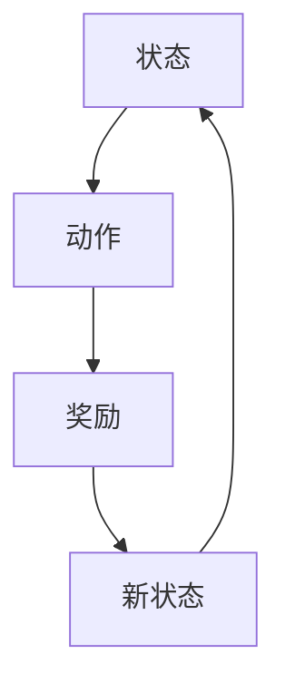
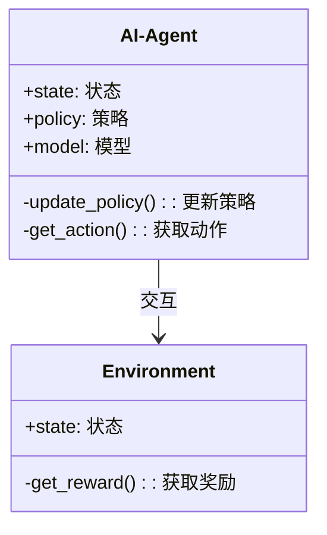
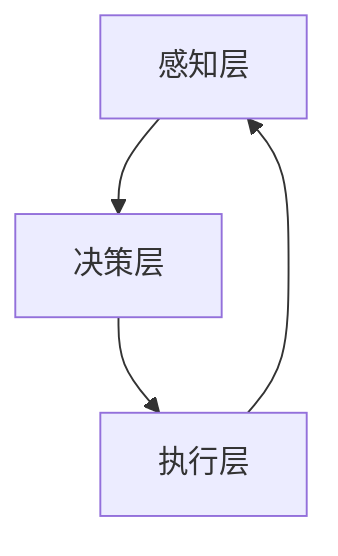

                 


# AI Agent在创意产业中的应用

## 关键词：AI Agent, 创意产业, 人工智能, 算法原理, 系统架构

## 摘要：  
本文探讨了AI Agent在创意产业中的应用，从概念、原理、算法到实际应用进行全面分析，结合实际案例和系统架构，提供深入的技术解读。

---

# 第一部分: AI Agent的背景与概念

## 第1章: AI Agent的基本概念

### 1.1 AI Agent的定义与特征  
AI Agent是一种智能体，具备感知环境、自主决策和执行任务的能力，其核心特征包括自主性、反应性、目标导向和学习能力。

### 1.2 创意产业的特点  
创意产业涵盖艺术、设计、广告等领域，具有非线性思维、个性化创作和高创造性需求的特点。

### 1.3 AI Agent与创意产业的结合  
AI Agent通过辅助创作、优化流程和提升效率，为创意产业带来创新解决方案。

---

## 第2章: AI Agent的核心概念

### 2.1 AI Agent的工作原理  
AI Agent通过感知环境、生成决策、执行动作，形成闭环系统。

### 2.2 AI Agent的类型  
- **基于规则的AI Agent**：简单但缺乏灵活性。  
- **基于学习的AI Agent**：通过数据学习，具备更强的适应性。  
- **基于推理的AI Agent**：结合逻辑推理，适用于复杂场景。

### 2.3 AI Agent的核心要素  
- 数据驱动：输入环境信息。  
- 算法驱动：处理数据的逻辑。  
- 环境交互：输出决策并影响环境。

---

# 第二部分: AI Agent的算法原理与数学模型

## 第3章: AI Agent的算法原理

### 3.1 算法框架  
- **问题建模**：定义状态、动作和奖励。  
- **状态空间**：环境的所有可能状态。  
- **动作空间**：AI Agent可执行的所有动作。

### 3.2 核心算法  
#### 3.2.1 Q-Learning算法  
Q-Learning是一种强化学习算法，通过更新Q值表来学习最优策略。



#### 3.2.2 DQN算法  
DQN结合深度神经网络，处理高维状态空间。

```python
class DQN:
    def __init__(self, state_space, action_space):
        self.model = self.build_model()
        self.target_model = self.build_model()
    
    def build_model(self):
        model = Sequential()
        model.add(Dense(32, input_dim=state_space))
        model.add(Activation('relu'))
        model.add(Dense(action_space))
        model.compile(optimizer='adam', loss='mse')
        return model
```

#### 3.2.3 Policy Gradient算法  
通过优化策略直接寻找最优动作分布。

### 3.3 数学模型  
- Q-Learning公式：  
$$ Q(s,a) = Q(s,a) + \alpha (r + \gamma \max Q(s',a') - Q(s,a)) $$  
- Policy Gradient目标函数：  
$$ \nabla \theta J(\theta) = \mathbb{E}[ \nabla \log \pi_\theta(a|s) Q(s,a) ] $$  

---

# 第三部分: AI Agent的系统架构与应用

## 第4章: 系统架构设计

### 4.1 领域模型  
使用Mermaid类图描述系统模块及其交互。



### 4.2 系统架构  
系统架构分为感知层、决策层和执行层，分别负责数据采集、策略生成和任务执行。



### 4.3 接口设计  
系统接口需定义输入输出格式，确保模块间高效交互。

---

## 第5章: 项目实战

### 5.1 环境安装  
安装必要的库：  
```bash
pip install numpy matplotlib tensorflow
```

### 5.2 核心代码实现  
实现一个简单的DQN算法：

```python
import numpy as np
import gym

env = gym.make('CartPole-v0')
env.seed(123)

# 初始化参数
state_space = env.observation_space.shape[0]
action_space = env.action_space.n
learning_rate = 0.01
gamma = 0.99
epsilon = 1.0
epsilon_min = 0.01
epsilon_decay = 0.995

# 简单的DQN实现
class DQN:
    def __init__(self, state_space, action_space, lr, gamma):
        self.state_space = state_space
        self.action_space = action_space
        self.lr = lr
        self.gamma = gamma
        self.epsilon = epsilon
        self.q_table = np.zeros((state_space, action_space))
    
    def get_action(self, state):
        if np.random.random() < self.epsilon:
            return np.random.randint(self.action_space)
        return np.argmax(self.q_table[state])
    
    def update(self, state, action, reward, next_state):
        self.q_table[state][action] += self.lr * (reward + self.gamma * np.max(self.q_table[next_state]) - self.q_table[state][action])
        self.epsilon = max(self.epsilon * epsilon_decay, epsilon_min)

# 训练过程
dqn = DQN(state_space, action_space, learning_rate, gamma)
for episode in range(1000):
    state = env.reset()
    total_reward = 0
    done = False
    while not done:
        action = dqn.get_action(state)
        next_state, reward, done, _ = env.step(action)
        dqn.update(state, action, reward, next_state)
        total_reward += reward
        state = next_state
    print(f"Episode {episode}: Total Reward = {total_reward}")

env.close()
```

### 5.3 案例分析  
以广告推荐系统为例，AI Agent通过实时数据优化推荐策略。

### 5.4 项目小结  
AI Agent在创意产业中的应用潜力巨大，但需结合具体场景进行优化。

---

## 第6章: 总结与展望

### 6.1 本章总结  
AI Agent通过算法和系统架构创新，为创意产业带来效率和创新的双重提升。

### 6.2 未来展望  
随着技术进步，AI Agent将更广泛地应用于创意设计、艺术创作等领域。

### 6.3 最佳实践  
- 明确需求，选择合适算法。  
- 数据质量至关重要。  
- 定期优化和调整模型。

### 6.4 注意事项  
- 避免过度依赖AI，保持人类创造力。  
- 注意隐私和数据安全问题。  

### 6.5 拓展阅读  
- 《强化学习入门》  
- 《深度学习与神经网络》  
- 《系统架构设计实践》

---

## 作者：AI天才研究院  
AI天才研究院致力于人工智能与计算机程序设计的研究与实践，探索技术与艺术的结合之道。

