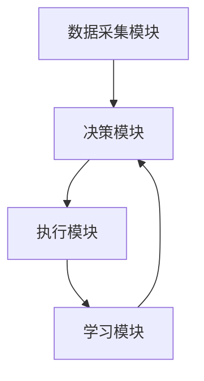

                 


# AI Agent在创意产业中的应用与限制

> 关键词：AI Agent, 创意产业, 应用, 限制, 创意技术

> 摘要：本文探讨了AI Agent在创意产业中的应用及其面临的限制。通过分析AI Agent的核心原理、算法原理、系统架构设计和项目实战，揭示了其在艺术、设计、广告等领域的潜力和局限性。文章旨在为读者提供一个全面的视角，了解AI Agent如何推动创意产业的发展，同时认识到其在实际应用中的挑战。

---

## 第一部分：AI Agent在创意产业中的应用背景

### 第1章：AI Agent的基本概念

#### 1.1 AI Agent的定义与特点
##### 1.1.1 AI Agent的定义
AI Agent，即人工智能代理，是指能够感知环境、执行任务并采取行动以实现特定目标的智能实体。它通过数据处理和决策算法，模拟人类的思考过程。

##### 1.1.2 AI Agent的核心特点
- **自主性**：AI Agent能够在没有外部干预的情况下独立运行。
- **反应性**：能够实时感知环境变化并做出响应。
- **目标导向**：所有行为均以实现预设目标为导向。
- **学习能力**：通过机器学习不断优化自身的决策和行动。

##### 1.1.3 AI Agent与传统AI的区别
传统的AI系统主要专注于特定任务，如语音识别或图像分类。而AI Agent则具备更强的自主性和目标导向性，能够在复杂环境中动态调整策略。

### 第2章：创意产业的现状与挑战

#### 2.1 创意产业的定义与范围
创意产业涵盖艺术、设计、广告、音乐、影视等多个领域，是推动文化创新和经济增长的重要力量。

#### 2.2 创意产业中的问题与挑战
- **效率问题**：创意过程通常耗时较长，需要多次迭代。
- **资源分配问题**：创意团队需要协调不同领域的资源，存在资源浪费的风险。
- **创新压力**：市场竞争激烈，创意团队需要不断推陈出新。

#### 2.3 AI Agent在创意产业中的定位
AI Agent可以作为辅助工具，帮助创意团队提高效率，同时激发新的创作灵感。

### 第3章：AI Agent在创意产业中的应用

#### 3.1 AI Agent的应用背景
随着技术的进步，AI Agent在创意产业中的应用逐渐增多，特别是在艺术创作和设计领域。

#### 3.2 AI Agent在创意产业中的具体应用
- **艺术创作**：生成图像、绘画和雕塑。
- **设计辅助**：优化平面设计和建筑设计。
- **广告创意**：生成广告文案和创意概念。

---

## 第二部分：AI Agent的核心概念与联系

### 第4章：AI Agent的核心原理

#### 4.1 AI Agent的基本原理
AI Agent通过感知环境、分析数据、制定决策并执行动作来实现目标。

#### 4.2 AI Agent的感知与决策过程
- **感知环境**：通过传感器或数据输入获取环境信息。
- **分析数据**：利用机器学习算法处理数据。
- **制定决策**：基于分析结果生成行动计划。
- **执行动作**：通过执行机构或软件实现决策。

### 第5章：AI Agent与创意产业的联系

#### 5.1 创意产业中的AI Agent应用场景
- **艺术创作**：生成抽象艺术作品。
- **设计优化**：辅助产品设计和用户体验优化。
- **广告创意**：生成广告文案和创意概念。

#### 5.2 AI Agent与创意产业的联系
AI Agent能够通过数据处理和决策算法，帮助创意团队提高效率和创造力。

---

## 第三部分：AI Agent的算法原理

### 第6章：AI Agent的核心算法

#### 6.1 强化学习算法
强化学习是一种通过试错机制来优化决策的算法，广泛应用于游戏AI和机器人控制。

#### 6.2 生成对抗网络
生成对抗网络（GAN）由生成器和判别器组成，用于生成逼真的图像和音频。

#### 6.3 转换器模型
转换器模型（如BERT）用于自然语言处理任务，能够生成高质量的文案和对话。

### 第7章：算法实现与案例分析

#### 7.1 强化学习算法的实现
```python
class Agent:
    def __init__(self, state_space, action_space):
        self.state_space = state_space
        self.action_space = action_space
        # 初始化策略网络
        self.policy = PolicyNetwork(state_space, action_space)
    
    def act(self, state):
        # 根据当前状态选择动作
        action = self.policy.act(state)
        return action
    
    def update(self, state, action, reward):
        # 更新策略网络
        self.policy.update(state, action, reward)
```

#### 7.2 生成对抗网络的实现
```python
import torch
import torch.nn as nn

class Generator(nn.Module):
    def __init__(self, z_dim, image_size):
        super(Generator, self).__init__()
        self.fc = nn.Linear(z_dim, image_size)
    
    def forward(self, z):
        return self.fc(z)

class Discriminator(nn.Module):
    def __init__(self, image_size):
        super(Discriminator, self).__init__()
        self.fc = nn.Linear(image_size, 1)
    
    def forward(self, x):
        return self.fc(x)
```

---

## 第四部分：AI Agent的系统架构设计

### 第8章：系统分析与架构设计

#### 8.1 系统功能设计
- **数据采集模块**：收集环境数据。
- **决策模块**：分析数据并制定决策。
- **执行模块**：根据决策执行动作。
- **学习模块**：优化算法模型。

#### 8.2 系统架构图


---

## 第五部分：AI Agent在创意产业中的应用案例

### 第9章：项目实战

#### 9.1 环境安装与配置
安装必要的库和框架，如TensorFlow、PyTorch和Keras。

#### 9.2 核心代码实现
```python
import numpy as np
import matplotlib.pyplot as plt

def generate_art():
    # 生成随机图像数据
    image = np.random.rand(28, 28)
    plt.imshow(image, cmap='gray')
    plt.show()

generate_art()
```

#### 9.3 案例分析与解读
通过生成艺术作品，展示AI Agent在艺术创作中的潜力和局限性。

---

## 第六部分：AI Agent的应用限制与未来展望

### 第10章：AI Agent的应用限制

#### 10.1 技术局限性
- **计算资源限制**：需要高性能计算资源。
- **算法限制**：当前算法仍有局限性，难以完全模拟人类创造力。

#### 10.2 伦理与法律问题
- **版权问题**：生成内容的版权归属尚不明确。
- **伦理问题**：AI Agent的决策可能引发伦理争议。

### 第11章：未来展望

#### 11.1 技术进步
随着算法优化和硬件升级，AI Agent在创意产业中的应用将更加广泛。

#### 11.2 应用场景拓展
未来，AI Agent可能在更多领域发挥作用，如教育、医疗和金融。

---

## 第七部分：最佳实践与总结

### 第12章：最佳实践

#### 12.1 小结
AI Agent在创意产业中的应用潜力巨大，但需要克服技术和伦理挑战。

#### 12.2 注意事项
- **数据质量**：确保训练数据的多样性和代表性。
- **用户反馈**：及时收集用户反馈以优化AI Agent性能。

#### 12.3 拓展阅读
推荐阅读相关书籍和论文，深入理解AI Agent的技术和应用。

---

## 作者

作者：AI天才研究院/AI Genius Institute  
联系邮箱：contact@aigeniusinstitute.com

---

**摘要**：本文系统地探讨了AI Agent在创意产业中的应用及其面临的挑战。通过分析AI Agent的核心原理、算法实现和系统架构，揭示了其在艺术、设计和广告等领域的潜力与限制。文章旨在为读者提供一个全面的视角，了解AI Agent如何推动创意产业的发展，同时认识到其在实际应用中的技术与伦理挑战。

---

**END**

