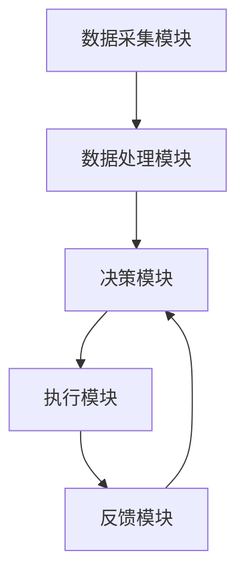

                 


# AI Agent在动物保护中的应用：行为分析与栖息地管理

> 关键词：AI Agent, 动物保护, 行为分析, 栖息地管理, 强化学习, 图像识别

> 摘要：本文探讨了AI Agent在动物保护中的应用，重点分析其在动物行为识别与监测、栖息地保护与恢复中的作用，通过具体算法和系统设计，展示了AI技术如何帮助我们更有效地保护濒危物种和维护生态平衡。

---

## 第1章: AI Agent与动物保护的背景介绍

### 1.1 AI Agent的基本概念
#### 1.1.1 AI Agent的定义与特点
AI Agent（人工智能代理）是一种能够感知环境、做出决策并执行任务的智能实体。它具有以下特点：
- **自主性**：能够在没有外部干预的情况下自主运行。
- **反应性**：能够实时感知环境并做出反应。
- **目标导向**：通过设定目标来驱动行为。
- **学习能力**：能够通过经验改进自身的性能。

#### 1.1.2 AI Agent的核心要素与功能模块
AI Agent通常包含以下功能模块：
1. **感知模块**：负责收集环境数据（如图像、声音、传感器数据等）。
2. **决策模块**：基于感知数据进行分析并制定决策。
3. **执行模块**：根据决策执行具体动作（如移动、发出指令等）。

#### 1.1.3 AI Agent与传统计算机视觉/机器学习的区别
AI Agent的核心区别在于其**自主性**和**交互性**。传统计算机视觉和机器学习算法通常需要人工干预或固定场景的应用，而AI Agent能够在动态环境中自主学习和适应。

---

### 1.2 动物保护的背景与挑战
#### 1.2.1 动物保护的现状与问题
随着人类活动的扩张，野生动物的栖息地被破坏，许多物种面临灭绝的威胁。传统的动物保护方法依赖人工观察和记录，效率低且覆盖面有限。

#### 1.2.2 传统动物保护方法的局限性
- **人工观察的局限性**：受时间和空间的限制，难以全面覆盖。
- **数据采集的低效性**：需要大量的人力物力，且数据质量不稳定。
- **缺乏实时性**：无法及时发现和处理紧急情况。

#### 1.2.3 AI技术在动物保护中的潜力
AI技术能够通过图像识别、行为分析、环境监测等手段，帮助我们更高效地保护动物。AI Agent的引入，进一步增强了技术的实时性和自主性。

---

### 1.3 AI Agent在动物保护中的应用场景
#### 1.3.1 行为分析与监测
AI Agent可以通过摄像头、传感器等设备，实时监测动物的行为，识别异常情况（如受伤或生病）。

#### 1.3.2 栖息地管理与保护
AI Agent可以帮助我们监测栖息地的环境变化，评估栖息地的健康状况，并制定保护计划。

#### 1.3.3 危险行为预警与干预
AI Agent可以实时识别可能对动物造成威胁的行为（如非法捕猎），并及时发出预警或采取干预措施。

---

## 第2章: AI Agent的核心概念与原理

### 2.1 AI Agent的感知模块
#### 2.1.1 数据采集与预处理
AI Agent的感知模块通常通过摄像头、麦克风、传感器等设备采集环境数据。数据预处理包括噪声消除、特征提取等。

#### 2.1.2 视觉感知与图像识别
基于深度学习的图像识别技术（如CNN）可以实现对动物的识别和行为分析。例如，可以通过图像分割技术定位动物的位置。

#### 2.1.3 传感器数据融合
将来自不同传感器的数据（如温度、湿度、光照等）进行融合，可以更全面地感知环境。

---

### 2.2 AI Agent的决策模块
#### 2.2.1 基于强化学习的决策
强化学习是一种通过试错方式优化决策的方法。例如，AI Agent可以通过强化学习学会如何在复杂的环境中做出最优决策。

#### 2.2.2 基于规则的决策
基于规则的决策适用于场景简单、规则明确的情况。例如，当检测到非法捕猎行为时，可以直接触发报警。

#### 2.2.3 多目标优化与权衡
在复杂的环境中，AI Agent需要在多个目标之间进行权衡。例如，既要保护动物，又要避免对环境造成破坏。

---

### 2.3 AI Agent的执行模块
#### 2.3.1 动作规划与路径优化
AI Agent需要根据决策结果规划具体的动作，例如，如何在复杂的地形中移动以达到目标位置。

#### 2.3.2 行为执行与反馈
AI Agent根据决策模块的指令执行具体动作，并通过反馈机制不断优化行为。

#### 2.3.3 系统自适应与调整
AI Agent能够根据环境的变化和反馈信息，动态调整自身的行为策略。

---

## 第3章: AI Agent在动物行为分析中的算法原理

### 3.1 基于深度学习的行为识别
#### 3.1.1 CNN在图像识别中的应用
卷积神经网络（CNN）是图像识别的核心技术。例如，可以通过预训练的ResNet模型对动物进行分类。

#### 3.1.2 RNN在时间序列数据中的应用
循环神经网络（RNN）可以用于分析动物的行为序列。例如，可以通过LSTM模型预测动物的下一步行为。

#### 3.1.3 图像分割与目标检测
目标检测技术（如YOLO、Faster R-CNN）可以用于实时监测动物的位置和数量。

---

### 3.2 基于强化学习的决策优化
#### 3.2.1 Q-learning算法
Q-learning是一种经典的强化学习算法，适用于离散动作空间的决策问题。

#### 3.2.2 DQN算法
深度强化学习（DQN）通过将Q值表示为深度神经网络的输出，能够处理更复杂的决策问题。

#### 3.2.3 策略梯度方法
策略梯度方法（如PG、PPO）通过优化策略直接调整动作的概率分布，适用于高维状态空间的决策问题。

---

## 第4章: AI Agent在栖息地管理中的系统设计

### 4.1 栖息地监测与数据采集
#### 4.1.1 数据采集系统设计
可以通过无人机、摄像头等设备实现对栖息地的实时监测。

#### 4.1.2 数据预处理与特征提取
需要对采集到的图像、视频数据进行预处理，并提取有用的特征（如动物种类、数量、位置等）。

#### 4.1.3 数据存储与管理
可以使用数据库（如MongoDB）或云存储（如AWS S3）来存储和管理大量数据。

---

### 4.2 栖息地保护的优化策略
#### 4.2.1 基于AI的栖息地评估
可以通过机器学习模型对栖息地的健康状况进行评估，并制定保护计划。

#### 4.2.2 基于AI的栖息地恢复与保护
AI Agent可以协助规划栖息地的恢复计划，并实时监控恢复效果。

#### 4.2.3 基于AI的栖息地动态监测
可以通过AI Agent实时监测栖息地的动态变化，并及时调整保护策略。

---

## 第5章: AI Agent在动物保护中的项目实战

### 5.1 项目背景与目标
#### 5.1.1 项目需求分析
假设我们希望开发一个用于监测濒危动物的AI Agent系统。

#### 5.1.2 项目目标设定
目标包括：实时监测动物行为、预警危险情况、优化栖息地保护策略。

#### 5.1.3 项目可行性分析
需要考虑技术可行性、数据获取难度、成本等因素。

---

### 5.2 系统架构设计
#### 5.2.1 系统功能模块划分
- 数据采集模块
- 数据处理模块
- 决策模块
- 执行模块
- 反馈模块

#### 5.2.2 系统架构图


---

### 5.3 核心代码实现
#### 5.3.1 环境安装
需要安装以下依赖：
```bash
pip install numpy tensorflow keras matplotlib cv2
```

#### 5.3.2 核心代码示例
```python
import cv2
import numpy as np
from tensorflow.keras.models import load_model

# 加载预训练模型
model = load_model('animal_classifier.h5')

# 摄像头采集图像
cap = cv2.VideoCapture(0)
while cap.isOpened():
    ret, frame = cap.read()
    if not ret:
        break
    # 图像预处理
    img = cv2.resize(frame, (224, 224))
    img = img / 255.0
    img = np.expand_dims(img, axis=0)
    # 预测类别
    prediction = model.predict(img)
    # 输出结果
    print('预测结果:', prediction)
cap.release()
```

#### 5.3.3 代码解读与分析
上述代码展示了如何使用预训练的深度学习模型对图像进行分类。实际应用中，可以将此代码扩展为完整的AI Agent系统。

---

## 第6章: 最佳实践与小结

### 6.1 项目小结
通过本项目，我们展示了AI Agent在动物保护中的应用潜力。从数据采集、模型训练到系统实现，每一步都需要精心设计和优化。

### 6.2 注意事项
- 数据质量和多样性直接影响模型的性能。
- 强化学习模型需要大量的训练数据和计算资源。
- 在实际应用中，需要考虑系统的实时性和可靠性。

### 6.3 拓展阅读
- 《强化学习实战》
- 《深度学习与计算机视觉》
- 《人工智能在生态学中的应用》

---

## 作者信息
作者：AI天才研究院 & 禅与计算机程序设计艺术

