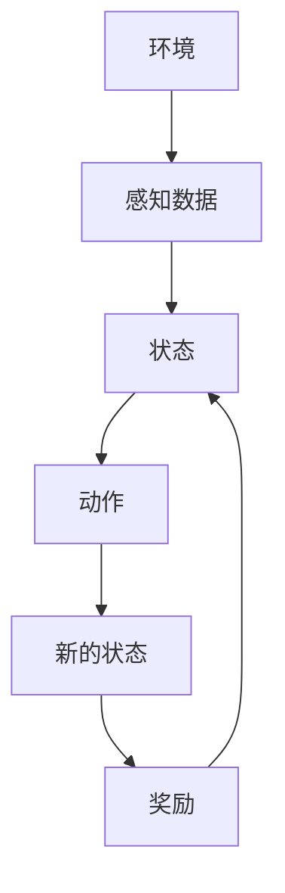
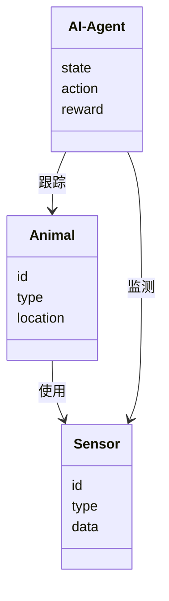
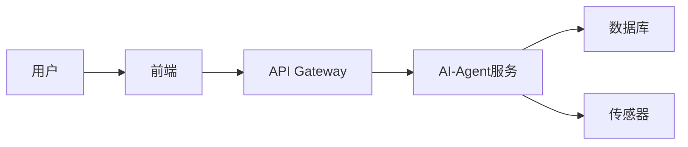

                 


# AI Agent在动物保护中的监测与追踪

> 关键词：AI Agent, 动物保护, 监测与追踪, 强化学习, 传感器网络, 数据分析

> 摘要：  
本文深入探讨了AI Agent在动物保护中的应用，特别是在监测与追踪方面的技术细节和实际应用。通过分析AI Agent的核心原理、算法模型、系统架构以及实际案例，本文展示了如何利用AI技术有效保护濒危动物种群，优化生态监测流程。文章还提供了详细的代码实现和系统设计，帮助读者更好地理解AI Agent在动物保护中的潜力和应用价值。

---

## 第一部分: AI Agent在动物保护中的监测与追踪概述

### 第1章: AI Agent与动物保护的背景介绍

#### 1.1 AI Agent的基本概念
- **1.1.1 AI Agent的定义**  
  AI Agent（人工智能代理）是一种能够感知环境、自主决策并执行任务的智能体。它可以基于传感器输入、历史数据和预设规则，实现对目标的实时监测与追踪。

- **1.1.2 AI Agent的核心特征**  
  - **自主性**：无需人工干预，自主完成任务。  
  - **反应性**：实时感知环境变化并调整行为。  
  - **学习能力**：通过数据反馈优化决策模型。  
  - **可扩展性**：支持多种传感器和数据源的接入。

- **1.1.3 AI Agent与传统追踪方法的对比**  
  传统的动物追踪方法依赖人工观察和记录，效率低且容易出错。AI Agent通过自动化处理、实时分析和自我优化，显著提高了监测效率和准确性。

#### 1.2 动物保护的背景与挑战
- **1.2.1 动物保护的重要性**  
  动物保护是维护生态平衡的重要组成部分。通过监测与追踪技术，可以更好地保护濒危物种，研究动物行为，优化栖息地保护策略。

- **1.2.2 动物保护中的传统方法及其局限性**  
  - **人工观察**：耗时且容易受到主观因素影响。  
  - **传统传感器**：数据采集范围有限，难以覆盖广袤的自然环境。  

- **1.2.3 AI Agent在动物保护中的应用价值**  
  AI Agent可以实时监控动物的活动，分析行为模式，预测迁徙路径，从而为保护工作提供科学依据。

---

### 第2章: AI Agent在动物保护中的核心概念与联系

#### 2.1 AI Agent的核心原理
- **2.1.1 AI Agent的感知机制**  
  AI Agent通过多种传感器（如摄像头、GPS、红外传感器）获取环境数据，结合图像识别和声音分析技术，实现对动物的实时感知。

- **2.1.2 AI Agent的决策逻辑**  
  基于感知数据，AI Agent通过强化学习和监督学习模型，预测动物的行为模式，并制定最优的监测策略。

- **2.1.3 AI Agent的执行方式**  
  AI Agent可以根据决策结果，通过无人机、智能摄像头等设备，执行监测任务或触发预警机制。

#### 2.2 AI Agent与动物保护的实体关系
- **2.2.1 ER实体关系图**  
  下图展示了AI Agent在动物保护中的核心实体关系：
  
```mermaid
er
  actor: AI Agent
  animal: 动物个体
  sensor: 传感器
  database: 数据库
  action: 监测行动
  relation: R1(actor, animal, '监测')
  relation: R2(animal, sensor, '连接')
  relation: R3(actor, database, '存储')
  relation: R4(actor, action, '执行')
```

---

## 第二部分: AI Agent的算法原理与数学模型

### 第3章: AI Agent的算法原理

#### 3.1 强化学习在AI Agent中的应用
- **3.1.1 强化学习的基本原理**  
  强化学习是一种通过试错机制优化决策模型的方法。AI Agent通过与环境的交互，获得奖励或惩罚，逐步优化其行为策略。

- **3.1.2 Q-learning算法的实现**  
  下图展示了Q-learning算法的流程：
  


  代码实现：
  ```python
  import numpy as np

  class QAgent:
      def __init__(self, state_size, action_size):
          self.q_table = np.zeros((state_size, action_size))
          self.learning_rate = 0.1
          self.discount_factor = 0.9

      def choose_action(self, state):
          return np.argmax(self.q_table[state])

      def update_q_table(self, state, action, reward, next_state):
          self.q_table[state][action] = self.q_table[state][action] * (1 - self.learning_rate) + self.learning_rate * (reward + self.discount_factor * np.max(self.q_table[next_state]))
  ```

- **3.1.3 监测任务中的应用案例**  
  例如，在野生动物迁徙路径预测中，AI Agent可以通过强化学习优化路径选择，减少监测成本。

#### 3.2 监督学习在AI Agent中的应用
- **3.2.1 监督学习的基本原理**  
  监督学习通过训练数据预测目标变量。在动物监测中，可以用于分类动物行为模式或识别动物个体。

- **3.2.2 支持向量机（SVM）的实现**  
  ```python
  from sklearn.svm import SVC

  def train_svm(X_train, y_train):
      clf = SVC()
      clf.fit(X_train, y_train)
      return clf

  def predict_svm(clf, X_test):
      return clf.predict(X_test)
  ```

---

### 第4章: AI Agent的数学模型与公式

#### 4.1 Q-learning算法的数学模型
- **Q-learning公式**  
  $$ Q(s, a) = Q(s, a) + \alpha \cdot (r + \gamma \cdot \max Q(s', a') - Q(s, a)) $$
  
  其中：  
  - \( s \)：当前状态  
  - \( a \)：当前动作  
  - \( r \)：奖励  
  - \( \gamma \)：折扣因子  
  - \( \alpha \)：学习率  

#### 4.2 监督学习的数学模型
- **线性回归公式**  
  $$ y = \theta^T x + \beta $$
  
  其中：  
  - \( \theta \)：权重向量  
  - \( x \)：输入特征向量  
  - \( \beta \)：截距  

---

## 第三部分: 系统分析与架构设计方案

### 第5章: AI Agent的系统架构设计

#### 5.1 项目背景与目标
- 项目目标：开发一个基于AI Agent的动物监测系统，实现对野生动物的实时监测与追踪。

#### 5.2 系统功能设计
- **5.2.1 领域模型类图**  
  下图展示了系统的领域模型：
  


#### 5.3 系统架构设计
- **5.3.1 系统架构图**  
  下图展示了系统的整体架构：



---

## 第四部分: 项目实战与应用案例

### 第6章: AI Agent在动物保护中的实战应用

#### 6.1 环境安装与配置
- **安装依赖**：
  ```bash
  pip install numpy scikit-learn tensorflow mermaid
  ```

#### 6.2 核心代码实现
- **AI-Agent实现**：
  ```python
  class AI-Agent:
      def __init__(self, sensors):
          self.sensors = sensors
          self.model = self.build_model()

      def build_model(self):
          # 构建深度学习模型
          pass

      def perceive(self):
          # 从传感器获取数据
          pass

      def decide(self, data):
          # 基于数据做出决策
          pass

      def act(self, decision):
          # 执行决策
          pass
  ```

#### 6.3 实际案例分析
- **案例1**：北极熊监测项目  
  使用AI Agent结合无人机和红外传感器，实时监测北极熊的活动范围，保护其栖息地。

---

## 第五部分: 总结与展望

### 第7章: 总结与展望

#### 7.1 小结
- AI Agent在动物保护中的应用前景广阔，特别是在监测与追踪方面，可以显著提高保护效率。

#### 7.2 注意事项
- 数据隐私与动物个体识别的伦理问题需要重视。  
- 系统的鲁棒性和抗干扰能力需要进一步优化。

#### 7.3 拓展阅读
- 推荐阅读《强化学习实战》、《传感器网络与边缘计算》等书籍。

---

## 作者信息

**作者：AI天才研究院/AI Genius Institute**  
**联系方式：contact@aicourse.com**  
**GitHub链接：https://github.com/aiagent4wildlife**  

---

**AI天才研究院**致力于人工智能与生态保护的交叉研究，探索技术在动物保护中的创新应用。如需进一步了解，请访问我们的官方网站或关注我们的社交媒体账号。

