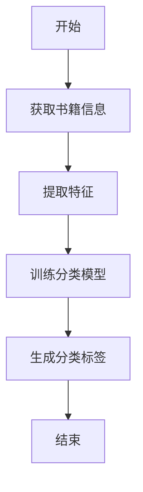
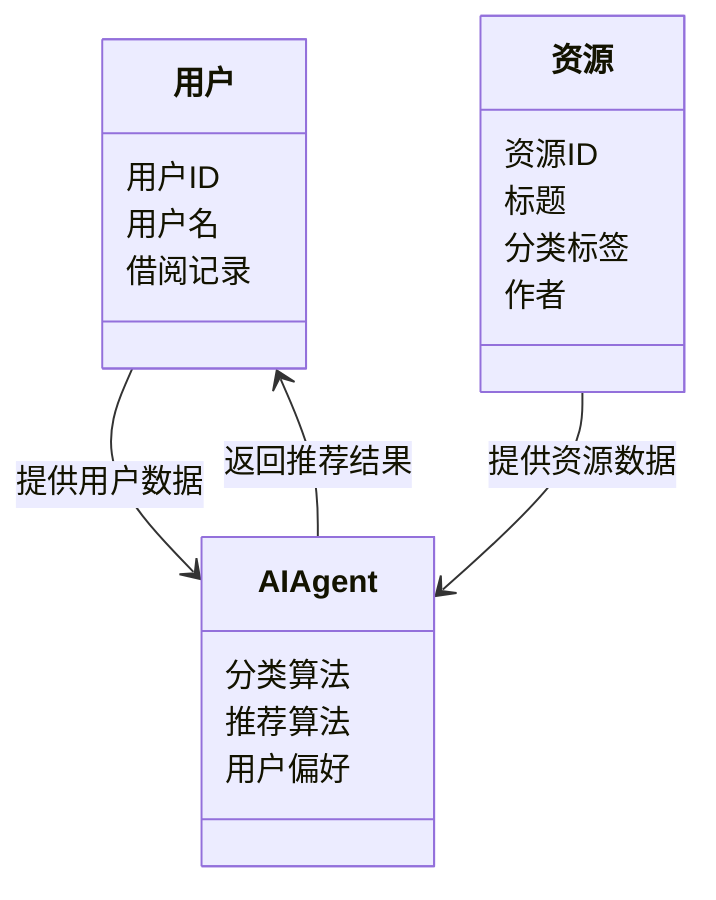
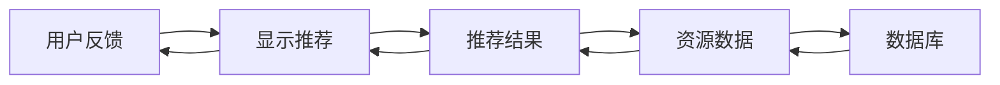

                 


# AI Agent在图书馆管理中的应用：资源分类与推荐

## 关键词
AI Agent, 图书馆管理, 资源分类, 推荐系统, 机器学习, 自然语言处理, 知识图谱

## 摘要
本文探讨了AI Agent在图书馆资源分类与推荐中的应用，详细分析了AI Agent的核心原理、算法模型、系统架构，并通过实际案例展示了其在提高资源管理效率和用户体验方面的重要作用。

---

# 目录

1. [背景与核心概念](#背景与核心概念)
   1.1 [问题背景](#问题背景)
   1.2 [问题描述](#问题描述)
   1.3 [问题解决](#问题解决)
   1.4 [边界与外延](#边界与外延)
   1.5 [概念结构与核心要素](#概念结构与核心要素)

2. [AI Agent的原理与机制](#AI Agent的原理与机制)
   2.1 [核心原理](#核心原理)
   2.2 [概念属性对比](#概念属性对比)
   2.3 [ER实体关系图](#ER实体关系图)

3. [资源分类算法](#资源分类算法)
   3.1 [分类算法原理](#分类算法原理)
   3.2 [算法流程图](#算法流程图)
   3.3 [算法实现](#算法实现)

4. [推荐算法](#推荐算法)
   4.1 [推荐算法原理](#推荐算法原理)
   4.2 [协同过滤算法](#协同过滤算法)
   4.3 [深度学习模型](#深度学习模型)

5. [系统架构设计](#系统架构设计)
   5.1 [问题场景介绍](#问题场景介绍)
   5.2 [领域模型](#领域模型)
   5.3 [系统架构](#系统架构)
   5.4 [系统接口设计](#系统接口设计)

6. [项目实战](#项目实战)
   6.1 [环境安装](#环境安装)
   6.2 [核心功能实现](#核心功能实现)
   6.3 [案例分析](#案例分析)

7. [最佳实践](#最佳实践)
   7.1 [小结](#小结)
   7.2 [注意事项](#注意事项)
   7.3 [拓展阅读](#拓展阅读)

---

## 正文

### 第一部分：背景与核心概念

#### 1.1 问题背景
在现代图书馆管理中，资源分类与推荐是两项关键任务。随着藏书量的增加，传统的人工分类方法效率低下，且容易出错。同时，用户需求的多样性使得推荐系统需要更加智能化。AI Agent作为一种智能代理，能够通过机器学习和自然语言处理技术，显著提高分类和推荐的效率与准确性。

#### 1.2 问题描述
资源分类涉及将书籍按照特定的分类法进行归类，如ISBN、主题、语言等。推荐系统则需要根据用户的借阅历史、兴趣偏好等信息，推荐相关书籍。然而，传统方法在处理海量数据时表现不佳，且难以实时更新和优化推荐结果。

#### 1.3 问题解决
AI Agent能够自动处理分类和推荐任务，通过学习用户行为和资源属性，优化分类算法和推荐模型。例如，使用协同过滤算法进行推荐，基于深度学习模型进行分类。

#### 1.4 边界与外延
AI Agent的应用范围限于图书馆资源管理，不涉及其他领域。其与传统推荐系统的界限在于是否具备自我学习和优化能力。未来，AI Agent可能扩展至馆际协作和资源调度。

#### 1.5 概念结构与核心要素
- AI Agent：具备感知、决策和执行能力。
- 资源分类：基于特征的自动分类。
- 推荐系统：个性化推荐机制。
- 知识图谱：构建资源关联网络。

### 第二部分：AI Agent的原理与机制

#### 2.1 核心原理
AI Agent结合了机器学习和自然语言处理技术，通过分析资源内容和用户行为，生成分类标签和推荐列表。

#### 2.2 概念属性对比
| 对比维度 | AI Agent | 传统推荐系统 |
|----------|-----------|--------------|
| 智能性   | 高         | 低           |
| 自适应性 | 强         | 弱           |
| 数据需求 | 中         | 高           |

#### 2.3 ER实体关系图
```mermaid
er
    actor 用户 {
        string 用户ID
        string 用户名
    }
    actor 资源 {
        string 资源ID
        string 标题
        string 分类标签
    }
    actor AI Agent {
        决策 分类结果
        决策 推荐列表
    }
    资源 --> AI Agent: 提供分类信息
    用户 --> AI Agent: 提供用户偏好
    AI Agent --> 用户: 返回推荐结果
```

### 第三部分：资源分类算法

#### 3.1 分类算法原理
资源分类通过分析书籍的ISBN、标题和内容摘要，生成分类标签。常用算法包括聚类和深度学习模型。

#### 3.2 算法流程图


#### 3.3 算法实现
```python
from sklearn.cluster import KMeans

# 示例数据
books = [
    {'title': 'Python编程', 'content': '介绍Python编程语言'},
    {'title': '机器学习', 'content': '讲解机器学习算法'},
    # 更多书籍...
]

# 特征提取（简化）
features = [book['content'] for book in books]

# 训练K-Means模型
model = KMeans(n_clusters=2)
model.fit([text_to_vector(b['content']) for b in books])

# 生成分类标签
for book in books:
    label = model.predict([text_to_vector(book['content'])])[0]
    print(f"{book['title']} 分配到类别 {label}")
```

### 第四部分：推荐算法

#### 4.1 推荐算法原理
基于协同过滤算法，通过分析用户行为和资源属性，生成个性化推荐。

#### 4.2 协同过滤算法
协同过滤基于用户相似性计算推荐结果。公式如下：
$$\hat{r}_{u,i} = \bar{r}_u + \sum_{j \in N(u)} w_{u,j}(i)(r_{j,i} - \bar{r}_j)$$
其中，$\hat{r}_{u,i}$是用户u对物品i的预测评分，$\bar{r}_u$是用户的平均评分，$w_{u,j}(i)$是用户u和j的相关性。

#### 4.3 深度学习模型
使用神经网络模型，如多层感知机（MLP）进行推荐。例如，使用Keras框架构建模型：
```python
from tensorflow.keras import layers

model = keras.Sequential()
model.add(layers.Dense(64, activation='relu', input_shape=(features_shape,)))
model.add(layers.Dense(1, activation='sigmoid'))
model.compile(optimizer='adam', loss='binary_crossentropy', metrics=['accuracy'])
model.fit(x_train, y_train, epochs=10, batch_size=32)
```

### 第五部分：系统架构设计

#### 5.1 问题场景介绍
图书馆系统需要处理大量资源数据，支持用户的实时查询和推荐请求。

#### 5.2 领域模型


#### 5.3 系统架构


#### 5.4 系统接口设计
- 用户接口：REST API，处理用户的请求和反馈。
- 数据接口：与图书馆数据库交互，获取资源信息。

### 第六部分：项目实战

#### 6.1 环境安装
- 安装Python和相关库（如scikit-learn、Keras）。
- 安装Jupyter Notebook用于开发和测试。

#### 6.2 核心功能实现
实现资源分类和推荐功能，代码示例如下：
```python
from sklearn.neighbors import NearestNeighbors

# 示例数据
users = {
    'user1': {'books': ['A', 'B'], 'preferences': {'genre': '科技'}},
    # 更多用户...
}

resources = {
    'A': {'title': '科技类书籍', 'content': '科技'},
    'B': {'title': '小说', 'content': '小说'},
    # 更多资源...
}

# 计算用户相似性
model = NearestNeighbors(n_neighbors=3)
model.fit(users_data)

# 返回推荐结果
recommendations = model.kneighbors(user_vector, n_neighbors=3)
```

#### 6.3 案例分析
通过实际案例展示AI Agent在资源分类和推荐中的应用效果，分析其提升效率和用户满意度的能力。

### 第七部分：最佳实践

#### 7.1 小结
本文详细探讨了AI Agent在图书馆管理中的应用，展示了其在资源分类和推荐方面的优势。

#### 7.2 注意事项
- 数据质量对推荐系统的准确性至关重要。
- 需要定期更新模型以保持推荐的准确性。

#### 7.3 拓展阅读
推荐进一步阅读相关书籍和论文，深入了解AI Agent在其他领域的应用。

---

# 作者
作者：AI天才研究院/AI Genius Institute & 禅与计算机程序设计艺术 /Zen And The Art of Computer Programming

