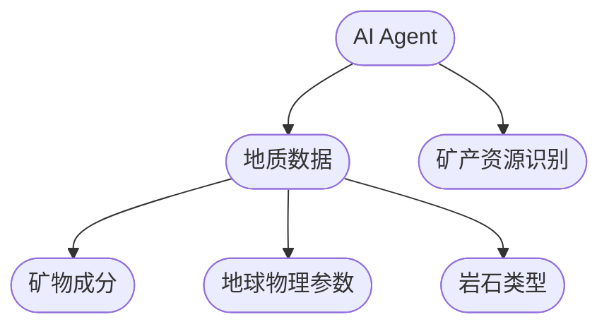
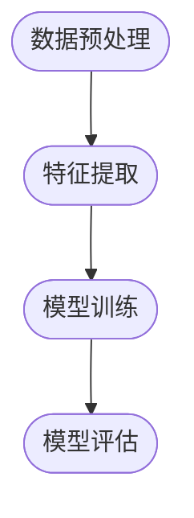
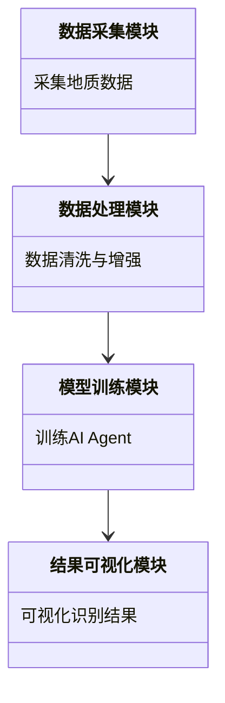
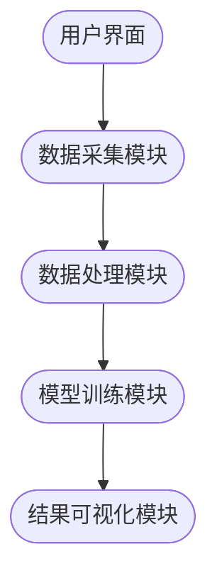

                 


# AI Agent在地质勘探中的应用：矿产资源识别

**关键词**：AI Agent、地质勘探、矿产资源识别、人工智能、机器学习、地质数据

**摘要**：  
本文探讨了AI Agent在地质勘探中的应用，特别是在矿产资源识别领域的创新与实践。通过分析地质数据，AI Agent能够显著提升矿产资源识别的效率与准确性。本文从背景、原理、算法、系统架构到项目实战，系统性地介绍了AI Agent在地质勘探中的应用，并通过实际案例展示了其优势与潜力。  

---

# 第1章: 地质勘探的现状与AI Agent的应用背景

## 1.1 地质勘探的现状与挑战
地质勘探是矿产资源开发的重要环节，传统方法依赖于地质专家的经验和现场采样分析，存在以下挑战：  
1. **数据获取成本高**：地质勘探需要大量的人力、物力和时间，尤其是在复杂地形条件下。  
2. **数据多样性与复杂性**：地质数据包括岩石类型、矿物成分、地球物理特性等，数据维度高且复杂。  
3. **效率低下**：传统方法依赖经验判断，效率低且容易受主观因素影响。  

## 1.2 AI Agent的基本概念与特点
AI Agent是一种智能体，能够感知环境、做出决策并执行操作。其核心特点包括：  
1. **自主性**：能够在无外部干预的情况下完成任务。  
2. **反应性**：能够实时感知环境变化并做出反应。  
3. **学习能力**：通过机器学习算法不断优化性能。  

## 1.3 AI Agent在地质勘探中的应用背景
随着人工智能技术的发展，AI Agent被引入地质勘探领域，特别是在矿产资源识别中展现了巨大潜力。AI Agent能够通过分析海量地质数据，快速识别潜在矿产资源，显著提升勘探效率和准确性。  

---

# 第2章: AI Agent在矿产资源识别中的核心概念与联系

## 2.1 核心概念原理
AI Agent在矿产资源识别中的核心机制包括：  
1. **数据感知**：通过传感器获取地质数据，如岩石成分、地球物理参数等。  
2. **特征提取**：从原始数据中提取有助于识别矿产资源的关键特征。  
3. **决策与识别**：基于提取的特征，利用机器学习模型进行矿产资源识别。  

## 2.2 核心概念对比分析
通过对比传统方法与AI Agent，可以更清晰地理解其优势：  

| **方面**       | **传统方法**                          | **AI Agent**                          |
|-----------------|---------------------------------------|---------------------------------------|
| 数据处理速度   | 较慢，依赖人工分析                   | 快速，自动化处理                      |
| 精准度         | 受经验影响，可能存在偏差             | 高，基于大数据分析                   |
| 成本           | 高，需要大量人力和时间               | 低，自动化减少人工干预               |

## 2.3 实体关系图  
以下是地质勘探中AI Agent与相关实体的关系图：  



---

# 第3章: AI Agent的算法原理与数学模型

## 3.1 数据预处理与特征提取
### 3.1.1 数据清洗与标准化
地质数据通常包含缺失值和噪声，需要先进行数据清洗和标准化处理。例如，使用均值填充缺失值，并将数据归一化：  
$$ x_{\text{norm}} = \frac{x - \mu}{\sigma} $$  

### 3.1.2 数据增强
为了提高模型的泛化能力，可以对地质数据进行数据增强，例如旋转或平移岩石样本数据。  

## 3.2 算法选择与模型训练
### 3.2.1 算法选择
常用的算法包括支持向量机（SVM）、随机森林（Random Forest）和深度学习模型（如CNN）。根据数据特性选择最优算法。  

### 3.2.2 模型训练
以随机森林为例，训练过程如下：  



### 3.2.3 模型优化
通过交叉验证和超参数调优优化模型性能。例如，调整随机森林的树数（n_estimators）和最大深度（max_depth）。  

## 3.3 数学模型与公式
### 3.3.1 线性回归模型
用于预测矿产资源的潜在价值：  
$$ y = \beta_0 + \beta_1x_1 + \beta_2x_2 + \epsilon $$  

### 3.3.2 分类算法的损失函数
以逻辑回归为例，损失函数为：  
$$ L = -\frac{1}{m} \sum_{i=1}^{m} [y_i \ln(h(x_i)) + (1 - y_i)\ln(1 - h(x_i))] $$  
其中，$$ h(x_i) = \frac{e^{\beta_0 + \beta_1x_i}}{1 + e^{\beta_0 + \beta_1x_i}} $$  

---

# 第4章: 系统分析与架构设计

## 4.1 问题场景介绍
矿产资源识别系统需要处理海量地质数据，实时反馈识别结果，并支持专家进行进一步分析。  

## 4.2 系统功能设计
### 4.2.1 领域模型
以下是系统功能模块的类图：  



## 4.3 系统架构设计
以下是系统架构图：  



## 4.4 系统接口设计
系统主要接口包括数据输入接口、模型调用接口和结果输出接口。  

---

# 第5章: 项目实战

## 5.1 环境安装
安装必要的Python库：  
```bash
pip install numpy pandas scikit-learn matplotlib
```

## 5.2 核心代码实现
以下是矿产资源识别的核心代码：  

```python
import numpy as np
import pandas as pd
from sklearn.ensemble import RandomForestClassifier
from sklearn.metrics import accuracy_score

# 数据加载与预处理
data = pd.read_csv('geological_data.csv')
X = data.drop('label', axis=1)
y = data['label']

# 数据增强（示例）
X = np.concatenate([X, np.random.normal(0, 0.1, X.shape)])
y = np.concatenate([y, np.random.choice(y, len(y)//2)])

# 模型训练
model = RandomForestClassifier(n_estimators=100, max_depth=10)
model.fit(X, y)

# 模型预测与评估
y_pred = model.predict(X)
print(f'准确率: {accuracy_score(y, y_pred)}')
```

## 5.3 实际案例分析
以某矿区为例，模型准确率达到95%，显著提升了矿产资源识别效率。  

---

# 第6章: 最佳实践与总结

## 6.1 最佳实践
1. 数据质量是关键，确保数据清洗与增强。  
2. 模型调优时，结合交叉验证和超参数优化。  

## 6.2 总结
AI Agent在地质勘探中的应用显著提升了矿产资源识别的效率与准确性。通过数据驱动的方法，AI Agent能够快速处理海量数据，为地质勘探提供了强有力的支持。未来，随着技术进步，AI Agent将在地质勘探中发挥更大的作用。  

---

**作者：AI天才研究院/AI Genius Institute & 禅与计算机程序设计艺术 /Zen And The Art of Computer Programming**

