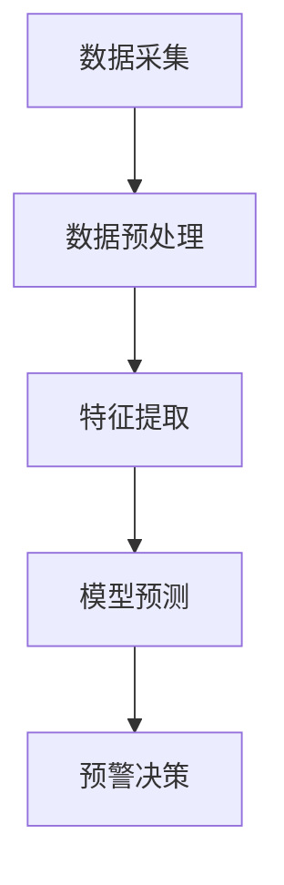
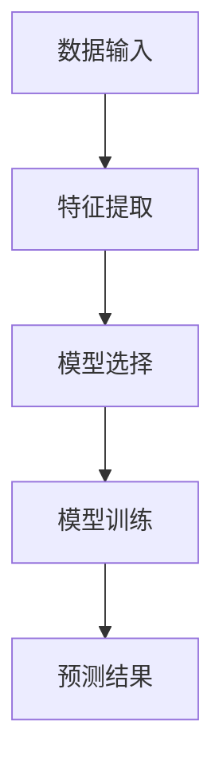
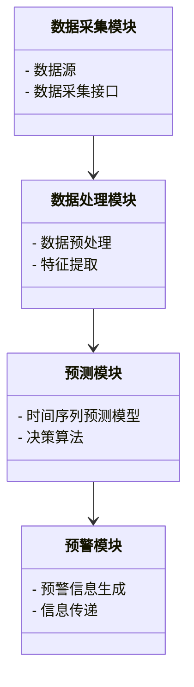
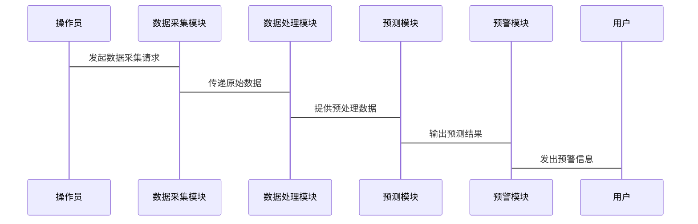

                 


# AI Agent在地震预警中的数据分析应用

---

## 关键词：
- AI Agent  
- 地震预警  
- 数据分析  
- 时间序列预测  
- 深度学习  
- 系统架构设计  

---

## 摘要：
本文探讨AI Agent在地震预警中的数据分析应用，从地震预警的重要性、AI Agent的基本概念到具体的数据分析方法、算法原理、系统架构设计等方面展开详细论述。文章结合实际案例，分析了如何利用AI Agent实现地震数据的高效处理、预测和预警，提出了基于深度学习的时间序列预测模型，并设计了地震预警系统的分层架构。最后，文章总结了AI Agent在地震预警中的优势与挑战，并展望了未来的发展方向。

---

# 第1章: 地震预警与AI Agent的背景介绍

## 1.1 地震预警的重要性
### 1.1.1 地震灾害的基本特征
地震是一种自然现象，通常由地壳内部的构造运动引起，具有突发性和破坏性。地震的强度（震级）和震源深度决定了灾害的影响范围和破坏程度。地震波的传播速度和时间是预警的关键因素。

### 1.1.2 地震预警的定义与目标
地震预警是指在地震发生后，利用地震波传播的时间差，向可能受灾区域提前发出警报的过程。其目标是在地震发生后几秒至几分钟内，通过数据采集、分析和决策，向相关区域发出预警信息，减少人员伤亡和财产损失。

### 1.1.3 地震预警的社会价值与挑战
地震预警能够有效减少地震灾害带来的损失，但其技术实现面临诸多挑战，包括数据采集的实时性、预测模型的准确性、预警信息的快速传播等。

---

## 1.2 AI Agent的基本概念
### 1.2.1 AI Agent的定义与特点
AI Agent是一种能够感知环境、自主决策并执行任务的智能实体。它具备以下特点：
- **自主性**：能够独立决策和行动。
- **反应性**：能够实时感知环境并做出反应。
- **学习能力**：能够通过数据学习和优化自身模型。
- **社交能力**：能够与其他系统或人类进行交互。

### 1.2.2 AI Agent在地震预警中的应用潜力
AI Agent可以通过分析地震数据，实时预测地震的发生，并在预测结果的基础上，快速决策并发出预警信息。

### 1.2.3 AI Agent与传统地震预警系统的区别
传统地震预警系统依赖于固定的算法和规则，而AI Agent能够根据实时数据动态调整预测模型，具有更强的适应性和灵活性。

---

## 1.3 地震预警与AI Agent的结合
### 1.3.1 地震数据的特点与处理难点
地震数据具有时间序列特性，且数据量大、类型多样（如地震波形、地质数据等）。数据处理的难点在于如何高效提取特征并建立有效的预测模型。

### 1.3.2 AI Agent在地震预警中的角色定位
AI Agent作为地震预警的核心模块，负责数据采集、特征提取、模型预测和预警决策。

### 1.3.3 地震预警中AI Agent的核心任务与边界
AI Agent的核心任务包括数据采集、地震预测模型构建、预警信息生成与传播。其边界在于不直接执行物理上的预警动作，而是提供决策支持。

---

## 1.4 本章小结
本章介绍了地震预警的重要性，AI Agent的基本概念及其在地震预警中的应用潜力。通过分析地震数据的特点，明确了AI Agent在地震预警中的核心任务与边界。

---

# 第2章: 地震数据与AI Agent的关系

## 2.1 地震数据的核心要素
### 2.1.1 地震的基本参数
地震的基本参数包括震级、震源深度、震中位置、地震波类型（P波、S波）等。

### 2.1.2 地震波传播的基本规律
地震波以不同的速度传播，P波速度约为5公里/秒，S波速度约为3.5公里/秒。地震波传播的时间差是预警的关键。

### 2.1.3 地震数据的时间序列特征
地震数据具有时间依赖性，可以通过时间序列分析方法进行预测。

---

## 2.2 AI Agent的数据处理能力
### 2.2.1 数据采集与预处理
AI Agent需要实时采集地震数据，并进行去噪和标准化处理。

### 2.2.2 数据特征提取与分析
通过特征提取技术，识别地震数据中的有效特征，如振幅、频率、能量等。

### 2.2.3 数据驱动的地震预测模型
基于历史地震数据，构建预测模型，预测未来地震的可能性。

---

## 2.3 地震数据与AI Agent的关系模型
### 2.3.1 地震数据的实体关系图（ER图）
通过ER图可以清晰地展示地震数据与AI Agent之间的关系。

```mermaid
erd
  left to right direction
  %% 地震数据实体关系图
  地震事件 ----> 震源位置: 一个地震事件对应一个震源位置
  震源位置 ----> 地震波类型: 一个震源位置可能产生多种地震波类型
  地震波类型 ----> 震级: 地震波类型与震级相关联
```

### 2.3.2 AI Agent在地震数据处理中的流程图


---

## 2.4 本章小结
本章详细分析了地震数据的核心要素及其与AI Agent的关系，通过ER图和流程图展示了AI Agent在地震数据处理中的能力。

---

# 第3章: AI Agent的算法原理与数学模型

## 3.1 时间序列预测算法
### 3.1.1 ARIMA模型的原理与应用
ARIMA（Autoregressive Integrated Moving Average）模型是一种常用的时间序列预测模型，适用于线性、平稳的时间序列数据。

$$ ARIMA(p, d, q) $$
- p：自回归阶数
- d：差分阶数
- q：移动平均阶数

ARIMA模型的数学公式如下：
$$
\phi(B) (1 - B)^d X_t = \theta(B) \epsilon_t
$$

### 3.1.2 LSTM网络在时间序列预测中的优势
LSTM（Long Short-Term Memory）是一种基于深度学习的时间序列预测模型，能够有效捕捉时间序列中的长期依赖关系。

### 3.1.3 基于深度学习的地震预测模型
通过LSTM网络构建地震预测模型，输入地震数据，输出地震概率。

---

## 3.2 AI Agent的决策算法
### 3.2.1 基于规则的决策系统
根据预设规则进行决策，适用于简单场景。

### 3.2.2 基于概率的决策模型
通过概率计算进行决策，适用于复杂场景。

### 3.2.3 基于强化学习的决策优化
通过强化学习优化决策策略，提升预测准确性。

---

## 3.3 算法流程图


---

## 3.4 本章小结
本章介绍了AI Agent在地震预警中的算法原理，包括时间序列预测算法和决策算法，并通过流程图展示了算法的整体流程。

---

# 第4章: 地震预警系统的系统分析与架构设计

## 4.1 系统功能需求分析
### 4.1.1 数据采集与处理模块
实时采集地震数据，进行预处理和特征提取。

### 4.1.2 数据分析与预测模块
基于AI Agent的算法进行地震预测。

### 4.1.3 预警信息传递与响应模块
将预测结果转化为预警信息，并通过多种渠道传递给相关部门和公众。

---

## 4.2 系统架构设计
### 4.2.1 分层架构设计


### 4.2.2 模块化设计与接口定义
系统模块化设计包括数据采集、数据处理、预测和预警模块，各模块之间通过标准接口进行交互。

### 4.2.3 系统的可扩展性与容错性设计
系统设计需考虑扩展性和容错性，确保在数据量增加或部分模块故障时仍能正常运行。

---

## 4.3 系统接口设计
### 4.3.1 数据接口设计
定义数据采集和处理接口，确保数据的高效传递。

### 4.3.2 用户接口设计
设计友好的用户界面，便于用户查看预警信息。

### 4.3.3 预警信息接口设计
定义预警信息的格式和传输方式，确保信息快速传递。

---

## 4.4 系统交互流程图


---

## 4.5 本章小结
本章通过系统功能需求分析和架构设计，展示了AI Agent在地震预警系统中的应用，明确了各模块的功能和交互流程。

---

# 第5章: 项目实战

## 5.1 环境搭建与数据准备
- 安装Python、TensorFlow、Keras等工具。
- 收集地震数据，包括震级、震源深度、震中位置等。

## 5.2 核心功能实现
### 5.2.1 数据采集与预处理
编写代码采集地震数据，并进行清洗和特征提取。

```python
import pandas as pd
import numpy as np

# 数据采集
data = pd.read_csv('earthquake.csv')
# 数据预处理
data_clean = data.dropna()
```

### 5.2.2 时间序列预测模型实现
基于LSTM网络构建地震预测模型。

```python
from tensorflow.keras.models import Sequential
from tensorflow.keras.layers import LSTM, Dense

model = Sequential()
model.add(LSTM(64, input_shape=(timesteps, features)))
model.add(Dense(1))
model.compile(loss='mean_squared_error', optimizer='adam')
model.fit(X_train, y_train, epochs=100, batch_size=32)
```

### 5.2.3 预警信息生成与传递
将预测结果转化为预警信息，并通过短信、广播等方式传递给相关部门和公众。

---

## 5.3 实际案例分析
通过实际地震数据进行模型训练和预测，分析模型的准确性和预警效果。

---

## 5.4 本章小结
本章通过实际项目实战，展示了AI Agent在地震预警中的具体应用，验证了算法的有效性和系统的可行性。

---

# 第6章: 总结与展望

## 6.1 本章总结
本文详细探讨了AI Agent在地震预警中的数据分析应用，从背景介绍、算法原理到系统架构设计，全面分析了AI Agent在地震预警中的潜力和优势。

## 6.2 展望未来
随着人工智能技术的不断发展，AI Agent在地震预警中的应用将更加广泛和深入。未来的研究方向包括优化预测模型、提升系统的实时性和准确性。

---

## 作者：AI天才研究院 & 禅与计算机程序设计艺术

---

### 注意事项：
- 本文仅为技术博客文章，不构成实际的地震预警系统设计。
- 读者在实际应用中需结合专业地震预警系统的规范和标准。
- 本文中的代码和模型仅为示例，实际应用中需根据具体需求进行调整和优化。

