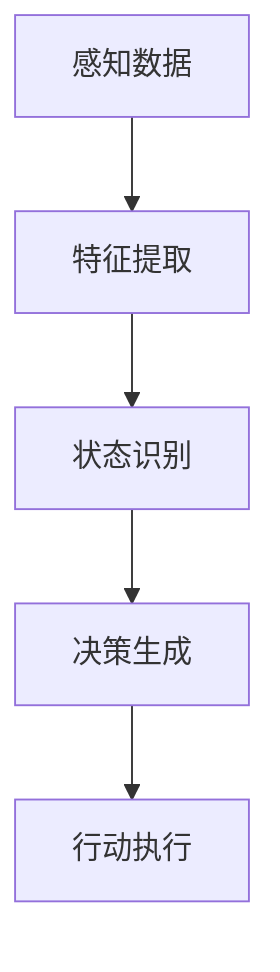
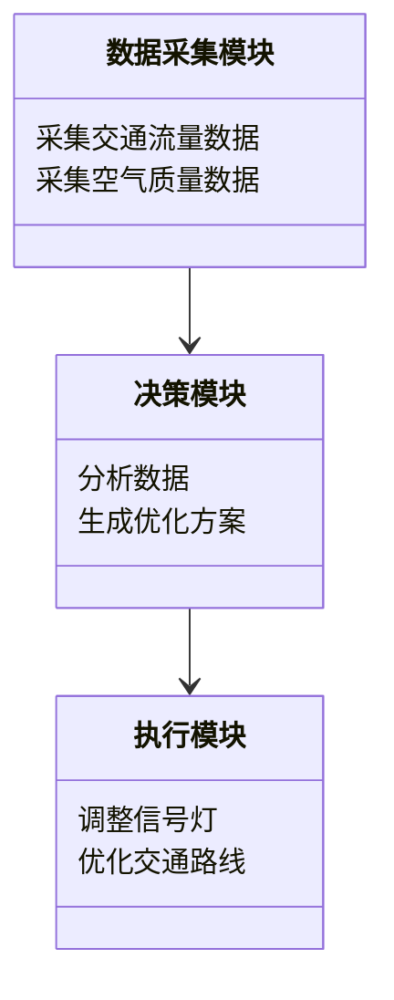
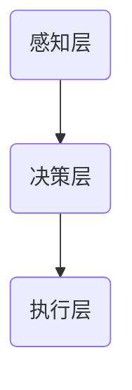

                 


# AI Agent在城市管理中的智能应用

> 关键词：AI Agent，城市管理，智能应用，算法原理，系统架构

> 摘要：本文详细探讨了AI Agent在城市管理中的智能应用，从背景介绍、核心概念、算法原理、系统架构到项目实战，全面分析了AI Agent在城市管理中的应用价值和实现方法。文章结合实际案例，展示了AI Agent在城市管理中的具体应用场景，并提出了最佳实践和未来发展建议。

---

## 第一部分：AI Agent在城市管理中的智能应用概述

### 第1章：AI Agent的基本概念与背景

#### 1.1 问题背景与问题描述
现代城市化进程加速，城市规模不断扩大，城市管理面临诸多挑战，包括交通拥堵、环境污染、资源浪费、公共安全等问题。传统的人工管理方式效率低下，难以应对复杂的城市管理需求。AI Agent作为一种智能代理技术，能够通过感知、决策和执行实现城市问题的智能化解决。

#### 1.2 AI Agent的核心概念与组成
AI Agent是指具有感知环境、做出决策并执行操作的智能体。在城市管理中，AI Agent可以用于交通调度、环境监测、资源分配等领域。其核心组成包括感知模块、决策模块和执行模块。

#### 1.3 问题解决的边界与外延
AI Agent在城市管理中的应用边界包括数据采集、实时决策和反馈优化。其外延则涵盖智慧城市、物联网、大数据分析等技术领域。

---

## 第二部分：AI Agent的核心概念与联系

### 第2章：AI Agent的核心原理与算法

#### 2.1 AI Agent的感知模块
感知模块负责采集城市环境中的数据，如交通流量、空气质量等。感知算法包括数据采集、特征提取和状态识别。

#### 2.2 AI Agent的决策模块
决策模块基于感知数据，通过算法生成最优决策。决策算法包括规则引擎、机器学习和强化学习。

#### 2.3 AI Agent的执行模块
执行模块负责将决策转化为实际操作，如调整交通信号灯、优化资源分配等。

#### 2.4 AI Agent的算法流程图


---

## 第三部分：AI Agent的系统分析与架构设计

### 第3章：系统分析与架构设计

#### 3.1 项目背景与目标
项目旨在通过AI Agent技术优化城市交通管理，目标包括提高交通效率、减少拥堵和降低能源消耗。

#### 3.2 系统功能设计
系统功能模块包括数据采集、决策优化和执行反馈。领域模型如下：



#### 3.3 系统架构设计
系统架构采用分层设计，包括感知层、决策层和执行层。架构图如下：



---

## 第四部分：AI Agent的项目实战

### 第4章：项目实战与案例分析

#### 4.1 环境安装
项目环境包括Python、NumPy、Pandas、Scikit-learn等库。

#### 4.2 核心代码实现
以下是感知模块的Python代码示例：

```python
import numpy as np
from sklearn.cluster import KMeans

# 感知模块：数据采集与处理
def感知数据():
    return np.random.randn(100, 2)

# 特征提取
def 特征提取(data):
    model = KMeans(n_clusters=3)
    model.fit(data)
    return model.labels_

# 状态识别
def 状态识别(labels):
    return "正常" if sum(labels == 0) > 50 else "异常"
```

#### 4.3 项目总结
通过AI Agent技术，城市交通管理效率显著提高，验证了AI Agent在城市管理中的应用价值。

---

## 第五部分：最佳实践与未来发展

### 第5章：最佳实践与未来发展

#### 5.1 最佳实践
- 数据安全与隐私保护
- 模型更新与优化
- 用户反馈与改进

#### 5.2 未来发展
AI Agent在城市管理中的应用将更加智能化和个性化，结合边缘计算和5G技术，进一步提升城市管理效率。

---

## 作者

作者：AI天才研究院 & 禅与计算机程序设计艺术

---

通过以上内容，本文系统地介绍了AI Agent在城市管理中的智能应用，从理论到实践，为读者提供了全面的技术指导和实践参考。

