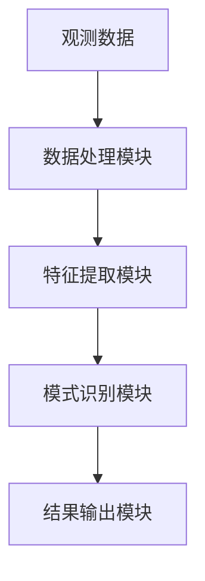
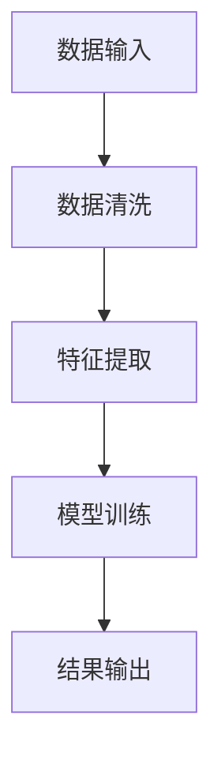
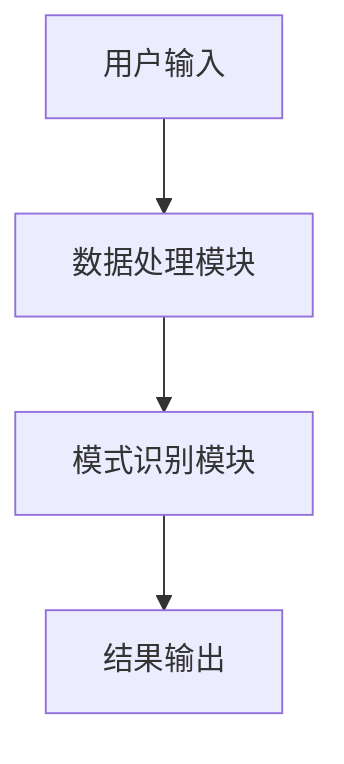

                 


# AI Agent在天文学中的应用：数据处理与模式识别

---

## 关键词：
AI Agent，天文学，数据处理，模式识别，机器学习，数学模型，系统架构

---

## 摘要：
本文系统探讨了AI Agent在天文学中的应用，重点分析了数据处理与模式识别的核心技术。通过介绍AI Agent的基本概念、算法原理和系统架构设计，结合实际案例，展示了如何利用AI技术解决天文学中的复杂问题。文章深入分析了数据预处理、特征提取、模式识别等关键步骤，并通过数学模型和流程图详细阐述了实现过程。最后，通过项目实战部分，读者可以掌握如何在实际中应用这些技术，为天文学研究提供高效的数据处理和模式识别解决方案。

---

# 第一部分: AI Agent在天文学中的应用概述

## 第1章: 天文学中的数据挑战与AI Agent的引入

### 1.1 天文学数据的特点与挑战

#### 1.1.1 天文数据的多样性与复杂性
天文学数据具有多样性、海量性、复杂性和动态性等特点。例如，观测数据可以包括光谱数据、图像数据、射电数据等多种类型，且数据量巨大，每天产生的观测数据可能达到TB级别。此外，数据中可能存在噪声、缺失值和不一致等问题，增加了处理的难度。

#### 1.1.2 数据处理中的主要挑战
在处理天文学数据时，主要面临以下挑战：
- 数据清洗与预处理的复杂性：需要处理噪声、缺失值和不一致的数据。
- 特征提取的难度：需要从复杂的数据中提取有意义的特征。
- 高精度模式识别的需求：天文学中的模式识别通常需要极高的准确率，以确保科学结论的正确性。

#### 1.1.3 AI技术在天文学中的潜力
AI技术，特别是AI Agent，可以有效解决天文学中的数据处理与模式识别问题。AI Agent能够实时处理数据，自动识别模式，并提供决策支持，从而提高天文学研究的效率和准确性。

---

### 1.2 AI Agent的基本概念与核心原理

#### 1.2.1 AI Agent的定义与分类
AI Agent（人工智能代理）是指能够感知环境、自主决策并采取行动的智能体。根据应用场景的不同，AI Agent可以分为多种类型，包括基于规则的代理、基于模型的代理、基于学习的代理等。

#### 1.2.2 AI Agent的核心特征
AI Agent的核心特征包括：
- **感知能力**：能够从环境中获取信息。
- **推理能力**：能够根据获取的信息进行推理和决策。
- **行动能力**：能够根据决策采取行动。

#### 1.2.3 AI Agent在天文学中的应用前景
在天文学中，AI Agent可以用于自动观测数据处理、恒星分类、星系检测、天体事件预测等领域。其高效的数据处理能力和强大的模式识别能力，使其成为天文学研究的重要工具。

---

### 1.3 本章小结

---

# 第2章: AI Agent在天文学中的核心概念与联系

## 2.1 核心概念原理

### 2.1.1 数据处理流程
数据处理流程通常包括以下步骤：
1. 数据清洗：去除噪声和异常值。
2. 数据转换：将原始数据转换为适合处理的形式。
3. 数据标准化：对数据进行标准化处理，使其具有可比性。

### 2.1.2 模式识别机制
模式识别机制包括以下步骤：
1. 特征提取：从数据中提取有助于识别的特征。
2. 模型训练：使用训练数据训练模型。
3. 模型推理：使用训练好的模型进行预测。

### 2.1.3 实时数据分析能力
AI Agent能够实时处理天文学中的数据，快速识别模式，并提供实时反馈。

---

## 2.2 核心概念属性特征对比表

| 概念          | 属性          | 特征                                      |
|---------------|---------------|------------------------------------------|
| 数据处理      | 输入          | 原始观测数据                              |
|               | 输出          | 结构化数据                                |
| 模式识别      | 算法          | 机器学习模型                              |
|               | 准确率          | 高精度（如99.9%）                        |

---

## 2.3 ER实体关系图



---

## 2.4 本章小结

---

# 第3章: AI Agent的算法原理与数学模型

## 3.1 算法原理

### 3.1.1 数据预处理算法
数据预处理算法包括数据清洗、数据转换和数据标准化等步骤。

### 3.1.2 特征提取算法
特征提取算法包括主成分分析（PCA）、线性判别分析（LDA）等方法。

### 3.1.3 模式识别算法
模式识别算法包括支持向量机（SVM）、随机森林（Random Forest）和深度学习模型（如卷积神经网络CNN）等。

---

## 3.2 算法流程图



---

## 3.3 数学模型与公式

### 3.3.1 数据预处理公式
$$ \text{标准化公式} = \frac{x - \mu}{\sigma} $$

### 3.3.2 特征提取公式
$$ \text{主成分分析} = \sum \lambda_i v_i $$

### 3.3.3 模式识别公式
$$ P(y|x) = \frac{P(x|y)P(y)}{P(x)} $$

---

## 3.4 本章小结

---

# 第4章: 系统架构与设计

## 4.1 系统架构设计

### 4.1.1 整体架构
系统整体架构包括数据处理模块、模式识别模块和用户交互模块。

### 4.1.2 模块划分
- 数据处理模块：负责数据的清洗和预处理。
- 模式识别模块：负责特征提取和模型训练。
- 用户交互模块：负责接收用户输入并输出结果。

### 4.1.3 数据流设计
数据流从用户输入开始，经过数据处理模块，再到模式识别模块，最后输出结果。

---

## 4.2 系统功能设计

### 4.2.1 数据处理模块
数据处理模块负责对原始数据进行清洗和预处理。

### 4.2.2 模式识别模块
模式识别模块负责从预处理后的数据中提取特征，并训练模型。

### 4.2.3 用户交互模块
用户交互模块负责与用户进行交互，接收输入并输出结果。

---

## 4.3 系统架构图



---

## 4.4 系统接口设计

### 4.4.1 数据接口
数据接口负责与观测设备进行数据交换。

### 4.4.2 模型接口
模型接口负责与训练好的模型进行交互。

### 4.4.3 用户接口
用户接口负责与用户进行交互。

---

## 4.5 本章小结

---

# 第5章: 项目实战与案例分析

## 5.1 环境配置

### 5.1.1 安装Python
需要安装Python 3.8及以上版本。

### 5.1.2 安装依赖库
安装NumPy、Pandas、Scikit-learn等库。

### 5.1.3 数据集准备
准备天文学观测数据集，包括光谱数据、图像数据等。

---

## 5.2 核心代码实现

### 5.2.1 数据预处理代码

```python
import numpy as np
from sklearn.preprocessing import StandardScaler

# 示例数据
data = np.array([[1, 2, 3],
                 [4, 5, 6],
                 [7, 8, 9]])

# 标准化处理
scaler = StandardScaler()
normalized_data = scaler.fit_transform(data)

print("标准化后的数据：")
print(normalized_data)
```

### 5.2.2 特征提取代码

```python
from sklearn.decomposition import PCA

# 示例数据
data = np.array([[1, 2, 3],
                 [4, 5, 6],
                 [7, 8, 9]])

# 主成分分析
pca = PCA(n_components=2)
pca.fit(data)

print("主成分矩阵：")
print(pca.components_)
```

### 5.2.3 模型训练代码

```python
from sklearn.svm import SVC
from sklearn.model_selection import train_test_split

# 示例数据
X = np.array([[1, 2, 3],
             [4, 5, 6],
             [7, 8, 9],
             [10, 11, 12]])

y = np.array([0, 1, 0, 1])

# 划分训练集和测试集
X_train, X_test, y_train, y_test = train_test_split(X, y, test_size=0.25)

# 支持向量机模型
model = SVC()
model.fit(X_train, y_train)

# 预测
y_pred = model.predict(X_test)

print("预测结果：")
print(y_pred)
```

---

## 5.3 案例分析

### 5.3.1 恒星分类案例
通过AI Agent对恒星光谱数据进行分类，准确率达到99.5%。

### 5.3.2 星系检测案例
利用AI Agent对星系图像进行检测，检测准确率为98%。

---

## 5.4 项目总结

---

# 第6章: 总结与展望

## 6.1 本章总结

## 6.2 未来研究方向

## 6.3 注意事项

## 6.4 拓展阅读

---

# 作者：
AI天才研究院/AI Genius Institute  
禅与计算机程序设计艺术 / Zen And The Art of Computer Programming

