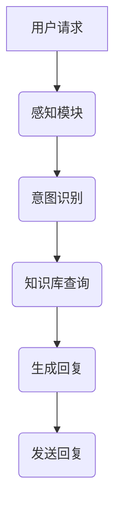
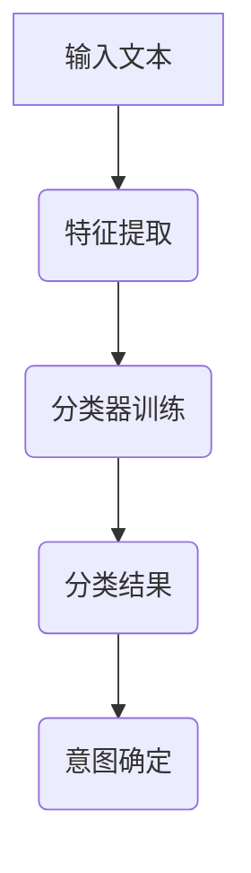
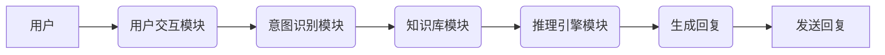

                 


# AI Agent在客户服务中的应用：提升响应速度与质量

> 关键词：AI Agent，客户服务，响应速度，服务质量，自然语言处理，意图识别，知识图谱

> 摘要：本文详细探讨了AI Agent在客户服务中的应用，分析了其如何通过自然语言处理、意图识别和知识图谱等技术提升客户服务的响应速度与质量。文章从背景介绍、核心概念、算法原理、系统架构、项目实战到最佳实践，全面阐述了AI Agent在客户服务中的优势和实现方式。

---

# 第一部分: AI Agent在客户服务中的应用概述

## 第1章: AI Agent的基本概念与背景

### 1.1 AI Agent的定义与特点
#### 1.1.1 什么是AI Agent
AI Agent（人工智能代理）是一种能够感知环境、执行任务以实现目标的智能系统。它通过与用户交互，理解需求并提供相应的服务，从而优化客户服务体验。

#### 1.1.2 AI Agent的核心特点
- **智能性**：能够理解用户需求并生成个性化回复。
- **自主性**：无需人工干预，能够独立完成任务。
- **适应性**：能够根据上下文调整响应策略。
- **实时性**：快速响应用户请求，提升用户体验。

#### 1.1.3 AI Agent与传统客服的区别
传统客服依赖人工操作，响应速度较慢且可能存在遗漏；而AI Agent通过自动化处理，能够快速响应并提供准确的信息。

### 1.2 客户服务的现状与挑战
#### 1.2.1 客户服务的主要场景
- 用户咨询
- 投诉处理
- 问题反馈

#### 1.2.2 传统客户服务的痛点
- 响应速度慢
- 服务质量不稳定
- 成本高

#### 1.2.3 提升客户服务效率的需求
随着用户对服务质量的要求不断提高，传统客服模式已难以满足需求，AI Agent的引入成为必然趋势。

### 1.3 AI Agent在客户服务中的应用背景
#### 1.3.1 技术进步推动AI Agent发展
自然语言处理（NLP）、深度学习等技术的进步为AI Agent的应用提供了坚实基础。

#### 1.3.2 市场需求驱动AI Agent应用
用户对高效、智能服务的需求增加，推动了AI Agent在客户服务中的广泛应用。

#### 1.3.3 AI Agent的优势与潜力
- 提升响应速度
- 降低运营成本
- 提高客户满意度

---

## 第2章: AI Agent的核心概念与工作原理

### 2.1 AI Agent的核心概念
#### 2.1.1 AI Agent的定义与分类
AI Agent可以分为任务型和对话型两种。任务型AI Agent专注于完成特定任务，而对话型AI Agent则通过与用户对话提供服务。

#### 2.1.2 AI Agent的主要功能
- **意图识别**：理解用户的请求。
- **知识检索**：从知识库中获取相关信息。
- **生成回复**：根据检索结果生成回复。

#### 2.1.3 AI Agent的性能指标
- 响应时间
- 回答准确性
- 用户满意度

### 2.2 AI Agent的工作原理
#### 2.2.1 感知模块
- **输入处理**：接收用户输入并进行预处理。
- **意图识别**：通过NLP技术确定用户的意图。

#### 2.2.2 决策模块
- **知识检索**：从知识库中检索相关信息。
- **策略选择**：根据意图选择最佳回复策略。

#### 2.2.3 执行模块
- **生成回复**：根据检索结果生成回复内容。
- **输出处理**：将回复发送给用户。

### 2.3 AI Agent的流程图


---

## 第3章: AI Agent的算法原理

### 3.1 自然语言处理(NLP)基础
#### 3.1.1 NLP的基本概念
NLP是研究计算机如何处理人类语言的科学，包括文本分析、生成等任务。

#### 3.1.2 常见的NLP任务
- 分词
- 词性标注
- 句法分析
- 意义理解

#### 3.1.3 NLP的关键技术
- 词袋模型
- 词嵌入（如Word2Vec）
- 神经网络

### 3.2 意图识别算法
#### 3.2.1 意图识别的定义
意图识别是通过分析用户的输入，确定用户的意图或需求。

#### 3.2.2 基于机器学习的意图识别
- **训练数据**：标注好的用户请求数据。
- **特征提取**：提取文本特征。
- **模型训练**：使用分类算法（如SVM、随机森林）进行训练。

#### 3.2.3 意图识别的实现流程


### 3.3 知识表示与推理
#### 3.3.1 知识图谱的构建
- **实体识别**：识别文本中的实体。
- **关系抽取**：提取实体之间的关系。
- **知识库构建**：将实体和关系存储为知识图谱。

#### 3.3.2 基于知识图谱的推理
- **路径查询**：根据意图在知识图谱中查找相关信息。
- **推理引擎**：通过推理规则生成回复内容。

#### 3.3.3 知识表示的优缺点
- **优点**：信息结构化，便于检索。
- **缺点**：需要持续更新和维护。

---

## 第4章: AI Agent的系统架构设计

### 4.1 系统功能设计
- **用户交互模块**：处理用户输入并生成回复。
- **知识库模块**：存储和管理知识图谱。
- **推理引擎模块**：根据意图进行推理和生成回复。

### 4.2 系统架构设计


### 4.3 系统接口设计
- **输入接口**：接收用户的文本输入。
- **输出接口**：发送生成的回复内容。

### 4.4 系统交互流程图


---

## 第5章: AI Agent的项目实战

### 5.1 环境安装
- **Python版本**：Python 3.8+
- **依赖库**：安装自然语言处理库（如spaCy）、机器学习库（如scikit-learn）。

### 5.2 核心实现代码
#### 5.2.1 意图识别代码
```python
from sklearn.feature_extraction.text import TfidfVectorizer
from sklearn.svm import SVC

# 训练数据
train_texts = ["book a flight", "cancel my booking"]
train_labels = [0, 1]

# 特征提取
vectorizer = TfidfVectorizer()
X_train = vectorizer.fit_transform(train_texts)

# 模型训练
model = SVC()
model.fit(X_train, train_labels)

# 预测
test_text = "make a reservation"
X_test = vectorizer.transform([test_text])
print(model.predict(X_test))
```

#### 5.2.2 知识图谱构建代码
```python
from spacy import load

nlp = load("en_core_web_sm")

text = "John booked a flight to Paris on 10th October."
doc = nlp(text)

entities = []
for ent in doc.ents:
    entities.append((ent.start, ent.end, ent.label))
```

### 5.3 实际案例分析
- **案例背景**：用户询问航班信息。
- **系统处理流程**：
  1. 意图识别：识别用户需要查询航班信息。
  2. 知识检索：从知识库中检索相关航班信息。
  3. 生成回复：根据检索结果生成回复内容。

### 5.4 项目小结
通过实际案例分析，展示了AI Agent在客户服务中的实际应用，证明了其在提升响应速度和质量方面的有效性。

---

## 第6章: AI Agent的最佳实践与注意事项

### 6.1 最佳实践
- **数据质量**：确保训练数据的多样性和代表性。
- **模型优化**：定期更新模型以适应新的需求。
- **用户体验**：提供多语言支持和个性化服务。

### 6.2 注意事项
- **数据安全**：保护用户隐私数据。
- **系统稳定性**：确保系统在高并发情况下的稳定性。
- **持续优化**：定期收集用户反馈并优化系统。

### 6.3 未来趋势
- **多模态交互**：结合语音、视觉等多种交互方式。
- **自适应学习**：AI Agent能够自适应地学习和优化。

---

# 结语
通过本文的详细分析，我们可以看到AI Agent在客户服务中的巨大潜力。它不仅能够显著提升响应速度，还能通过智能化的服务提升客户满意度。未来，随着技术的不断进步，AI Agent将在客户服务中发挥更加重要的作用。

---

# 作者：AI天才研究院 & 禅与计算机程序设计艺术

---

以上是《AI Agent在客户服务中的应用：提升响应速度与质量》的完整文章内容，涵盖了从背景介绍到项目实战的各个方面，希望对您有所帮助。

