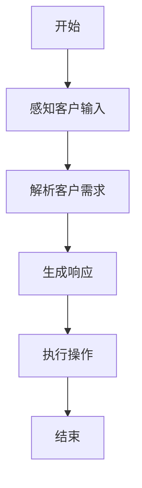
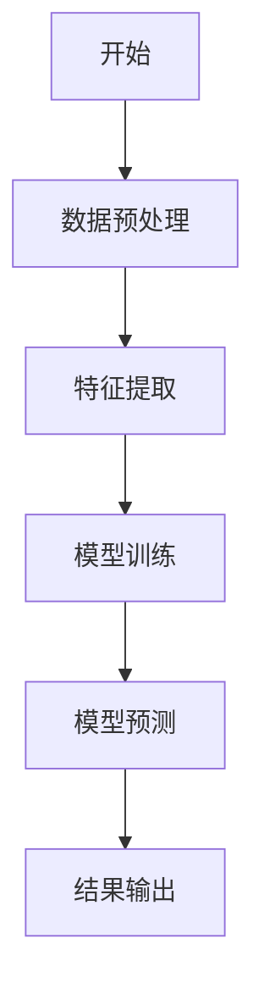
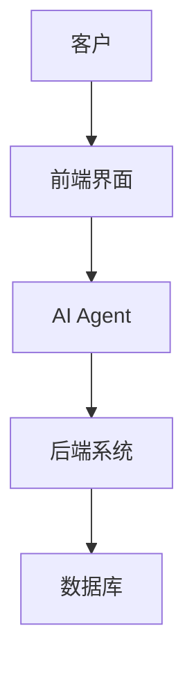
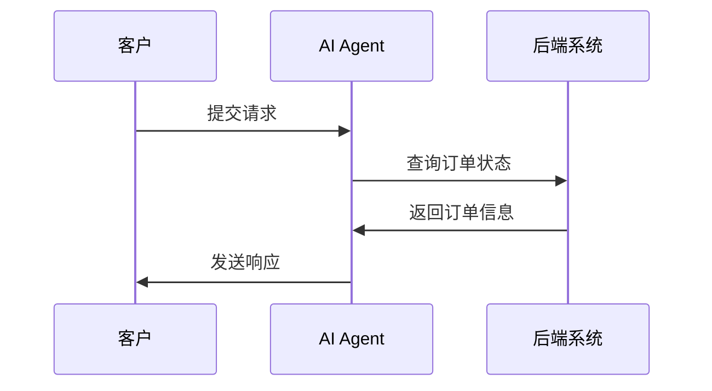

                 


# AI Agent在客户服务领域的应用实践

**关键词：** AI Agent, 客户服务, 自然语言处理, 机器学习, 系统架构, 项目实战

**摘要：** 本文深入探讨了AI Agent在客户服务领域的应用实践，从核心概念、技术原理到系统设计和项目实战，全面分析了AI Agent如何提升客户服务效率和用户体验。通过详细的技术讲解和实际案例，展示了AI Agent在客户服务中的巨大潜力和实际应用价值。

---

## 第一部分: AI Agent在客户服务领域的背景介绍

### 第1章: AI Agent的基本概念

#### 1.1 问题背景
- **1.1.1 客户服务的现状与挑战**
  - 传统客户服务的痛点：响应慢、效率低、成本高。
  - AI Agent的出现：自动化、智能化、实时响应的优势。

- **1.1.2 AI Agent的定义与特点**
  - AI Agent的定义：具备感知、决策和执行能力的智能体。
  - 特点：智能性、自主性、适应性、学习能力。

- **1.1.3 问题解决的核心思路**
  - 利用AI技术解决客户服务中的复杂问题。
  - 通过AI Agent实现24/7的高效服务。

#### 1.2 问题描述
- **1.2.1 客户服务中的常见问题**
  - 客户咨询、投诉处理、服务推荐等场景。

- **1.2.2 AI Agent的应用场景**
  - 智能客服、销售支持、客户维系等。

- **1.2.3 问题解决的具体方法**
  - 利用自然语言处理技术理解客户需求。
  - 通过机器学习模型预测客户需求。

#### 1.3 问题解决
- **1.3.1 AI Agent的核心功能**
  - 感知客户需求、决策最优方案、执行行动计划。

- **1.3.2 AI Agent在客户服务中的应用**
  - 自动响应客户咨询、智能分配任务、监控服务流程。

- **1.3.3 问题解决的具体步骤**
  - 数据采集与处理、模型训练、系统集成与部署。

#### 1.4 边界与外延
- **1.4.1 AI Agent的边界**
  - 仅限于客户服务领域，不涉及其他业务。

- **1.4.2 相关领域的外延**
  - 与自然语言处理、机器学习等技术的结合。

- **1.4.3 与其它技术的区分**
  - 区分AI Agent与其他智能系统的核心特征。

#### 1.5 概念结构与核心要素
- **1.5.1 AI Agent的概念结构**
  - 感知层、决策层、执行层的结构图。

- **1.5.2 核心要素的组成**
  - 数据源、算法模型、执行模块。

- **1.5.3 要素之间的关系**
  - 数据驱动算法，算法指导执行。

---

### 第2章: AI Agent的技术基础

#### 2.1 AI Agent的核心技术
- **2.1.1 自然语言处理**
  - 用于理解客户需求的文本分析技术。

- **2.1.2 机器学习**
  - 用于训练模型预测客户意图。

- **2.1.3 深度学习**
  - 用于复杂场景下的模式识别。

#### 2.2 技术原理
- **2.2.1 感知模块**
  - 使用NLP技术解析客户输入。

- **2.2.2 决策模块**
  - 基于机器学习模型生成响应。

- **2.2.3 执行模块**
  - 调用后端系统完成操作。

#### 2.3 技术特点
- **2.3.1 智能性**
  - 能够理解并生成自然语言。

- **2.3.2 自适应性**
  - 根据反馈优化服务策略。

- **2.3.3 可扩展性**
  - 支持多种客户服务场景。

---

### 第3章: AI Agent在客户服务中的应用现状

#### 3.1 应用场景
- **3.1.1 客户咨询**
  - 智能问答系统实时解答客户问题。

- **3.1.2 投诉处理**
  - 自动分类和优先级排序。

- **3.1.3 服务推荐**
  - 基于客户行为推荐产品或服务。

#### 3.2 应用案例
- **3.2.1 智能客服系统**
  - 具体案例：某电商平台的智能客服。

- **3.2.2 服务优化**
  - 通过数据驱动优化客户满意度。

- **3.2.3 技术挑战**
  - 数据质量、模型泛化能力、用户体验。

---

## 第二部分: 核心概念与联系

### 第4章: 核心概念与联系

#### 4.1 核心概念
- **4.1.1 AI Agent的原理**
  - 使用Mermaid流程图展示AI Agent的工作流程。



- **4.1.2 核心算法**
  - 使用Python代码实现意图识别。

```python
# 示例代码：自然语言处理模型训练
import numpy as np
from sklearn.feature_extraction.text import TfidfVectorizer
from sklearn.naive_bayes import MultinomialNB

# 数据准备
texts = ["我需要帮助取消订单", "如何修改地址", "我想咨询运费"]
labels = [0, 1, 2]

# 特征提取
vectorizer = TfidfVectorizer()
X = vectorizer.fit_transform(texts)

# 模型训练
clf = MultinomialNB()
clf.fit(X, labels)

# 预测
test_text = "请帮我查询订单状态"
test_X = vectorizer.transform([test_text])
predicted_label = clf.predict(test_X)[0]
```

- **4.1.3 实体关系图**
  - 使用Mermaid绘制ER图展示系统组成部分。

```mermaid
erDiagram
    Customer ||--|{ has } Interaction
    Interaction ||--|{ processed by } Agent
    Agent ||--|{ uses } NLP
```

---

## 第三部分: 算法原理讲解

### 第5章: 算法原理讲解

#### 5.1 算法原理
- **5.1.1 算法流程**
  - 使用Mermaid流程图展示算法步骤。



- **5.1.2 代码实现**
  - 使用Python代码实现关键算法。

```python
# 示例代码：机器学习模型训练
from sklearn.svm import SVC
from sklearn.pipeline import Pipeline
from sklearn.preprocessing import StandardScaler

# 数据准备
X = [[x1, x2], ...]
y = [0, 1, 2, ...]

# 模型训练
pipeline = Pipeline([
    ('scaler', StandardScaler()),
    ('svc', SVC())
])
pipeline.fit(X, y)

# 模型预测
new_X = [[a, b]]
predicted_y = pipeline.predict(new_X)
```

- **5.1.3 数学模型**
  - 详细讲解模型的数学公式。

$$
\text{损失函数} = \sum_{i=1}^{n} (y_i - \hat{y}_i)^2
$$

---

## 第四部分: 系统分析与架构设计方案

### 第6章: 系统分析与架构设计方案

#### 6.1 问题场景
- **6.1.1 问题场景描述**
  - 某电商平台的客户服务系统需要升级。

- **6.1.2 问题分析**
  - 系统响应慢、准确率低。

- **6.1.3 解决方案**
  - 引入AI Agent提升服务质量。

#### 6.2 系统设计
- **6.2.1 功能设计**
  - 客户咨询、投诉处理、服务推荐。

- **6.2.2 系统架构**
  - 使用Mermaid绘制系统架构图。



- **6.2.3 接口设计**
  - API接口定义。

```json
{
  "intent": "cancel_order",
  "context": {
    "order_id": "12345"
  }
}
```

- **6.2.4 交互流程**
  - 使用Mermaid序列图展示流程。



---

## 第五部分: 项目实战

### 第7章: 项目实战

#### 7.1 环境安装
- **7.1.1 安装Python**
  - 安装Python 3.8及以上版本。

- **7.1.2 安装依赖**
  - 使用pip安装所需库：`pip install numpy scikit-learn`

#### 7.2 系统核心实现
- **7.2.1 核心代码实现**
  - 使用Python代码实现AI Agent的核心功能。

```python
# 示例代码：AI Agent实现
class AI-Agent:
    def __init__(self):
        self.nlp = NLP_processor()
        self.model = Decision_Model()

    def process_request(self, request):
        intent = self.nlp.parse(request)
        response = self.model.generate_response(intent)
        return response
```

- **7.2.2 代码解读与分析**
  - 解释代码结构和功能模块。

- **7.2.3 代码优化**
  - 提供性能优化建议。

#### 7.3 案例分析与详细讲解
- **7.3.1 案例分析**
  - 以某电商平台为例，分析AI Agent的应用效果。

- **7.3.2 详细讲解**
  - 从数据采集到系统部署的全过程。

- **7.3.3 案例总结**
  - 成功经验与不足之处。

---

## 第六部分: 最佳实践

### 第8章: 最佳实践

#### 8.1 小结
- **8.1.1 核心内容回顾**
  - AI Agent在客户服务中的应用价值。

- **8.1.2 项目经验总结**
  - 成功案例的关键因素。

#### 8.2 注意事项
- **8.2.1 项目实施中的注意事项**
  - 数据隐私保护、系统稳定性。

- **8.2.2 未来发展趋势**
  - 多模态交互、情感计算。

#### 8.3 拓展阅读
- **8.3.1 推荐书籍**
  - 《自然语言处理实战》、《机器学习实战》。

- **8.3.2 技术博客**
  - 推荐相关技术博客和资源。

---

**作者：AI天才研究院 & 禅与计算机程序设计艺术**

---

**注：** 以上目录和文章内容为示例，实际撰写时需要根据具体需求进一步细化和扩展。

