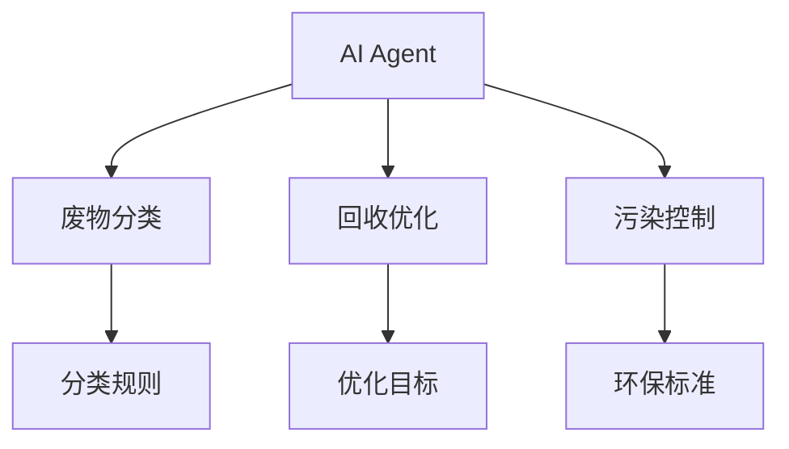
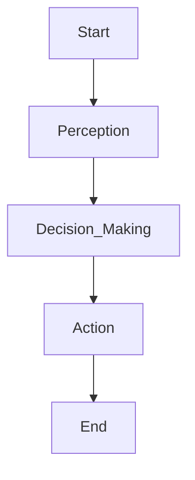

                 

# AI Agent在废物管理中的应用：回收优化与污染控制

> 关键词：AI Agent, 废物管理, 回收优化, 污染控制, 算法原理, 系统设计, 项目实战

> 摘要：  
本文详细探讨了AI Agent在废物管理中的应用，重点分析了AI Agent在回收优化与污染控制中的技术原理、系统设计与实际应用。通过结合算法原理、系统架构和项目实战，本文为读者提供了一种全新的视角来理解如何利用AI技术提升废物管理的效率和环保效果。从理论到实践，本文为AI Agent在废物管理中的应用提供了全面而深入的分析。

---

# 第一部分: 背景与概述

# 第1章: 废物管理的现状与挑战

## 1.1 废物管理的基本概念
### 1.1.1 废物的定义与分类
废物是指不再具有使用价值或被丢弃的物品、材料或物质。根据来源和性质，废物可以分为生活垃圾、工业废物、建筑废物等。废物管理的目标是通过分类、回收、处理和处置，减少对环境的污染，并尽可能地实现资源的再利用。

### 1.1.2 废物管理的流程
废物管理通常包括以下几个关键步骤：
1. **收集**：将废物从源头收集起来，通常是通过垃圾桶、回收站等方式。
2. **分类**：将废物按照可回收物、不可回收物、有害废物等进行分类。
3. **处理**：对分类后的废物进行处理，如回收利用、焚烧、堆肥等。
4. **处置**：将无法回收或处理的废物进行最终的填埋或无害化处理。

### 1.1.3 废物管理的环境与经济影响
废物管理对环境的影响是多方面的，包括土地资源的占用、水污染、空气污染以及对生态系统的破坏。同时，废物管理也具有显著的经济价值，通过回收和再利用，可以减少资源的消耗和生产成本。

---

## 1.2 AI Agent的基本概念
### 1.2.1 AI Agent的定义
AI Agent（人工智能代理）是一种能够感知环境、自主决策并采取行动的智能实体。它能够通过传感器或其他输入方式获取信息，并基于这些信息做出决策，从而实现特定的目标。

### 1.2.2 AI Agent的特点
1. **自主性**：AI Agent能够在没有外部干预的情况下自主运行。
2. **反应性**：能够根据环境的变化实时调整行为。
3. **目标导向**：具有明确的目标，并通过行动来实现这些目标。
4. **学习能力**：能够通过经验改进自身的决策能力。

### 1.2.3 AI Agent的核心技术
1. **感知技术**：通过传感器、摄像头等设备获取环境信息。
2. **决策技术**：基于获取的信息，利用算法进行决策。
3. **执行技术**：通过执行机构将决策转化为实际行动。

---

## 1.3 AI Agent在废物管理中的应用潜力
AI Agent在废物管理中的应用主要体现在以下几个方面：
1. **废物分类与识别**：通过图像识别技术，AI Agent可以自动识别不同类型的废物，并将其分类。
2. **回收优化**：AI Agent可以通过优化算法，提高废物回收的效率。
3. **污染控制**：AI Agent可以实时监控废物处理过程中的污染物排放，确保符合环保要求。

---

## 1.4 本章小结
本章介绍了废物管理的基本概念、流程及其环境与经济影响，并详细阐述了AI Agent的基本概念、特点及其核心技术。最后，我们探讨了AI Agent在废物管理中的应用潜力，为后续章节的深入分析奠定了基础。

---

# 第2章: AI Agent的核心概念与联系

## 2.1 AI Agent的核心原理
### 2.1.1 AI Agent的基本原理
AI Agent的核心原理是通过感知环境、获取信息、进行决策并采取行动。这一过程可以分为以下几个步骤：
1. **感知环境**：通过传感器或其他输入设备获取环境信息。
2. **信息处理**：对获取的信息进行分析和处理。
3. **决策制定**：基于处理后的信息，利用算法进行决策。
4. **行动执行**：根据决策结果，通过执行机构采取行动。

### 2.1.2 AI Agent的感知与决策机制
AI Agent的感知机制包括以下几种方式：
1. **视觉感知**：通过摄像头获取图像信息。
2. **听觉感知**：通过麦克风获取声音信息。
3. **触觉感知**：通过触摸传感器获取触觉信息。

在决策机制方面，AI Agent通常采用强化学习、机器学习等算法，通过不断的学习和优化，提高决策的准确性和效率。

---

## 2.2 AI Agent与废物管理的结合
### 2.2.1 废物分类与识别中的AI Agent应用
AI Agent可以通过图像识别技术，对废物进行分类和识别。例如，利用深度学习模型（如卷积神经网络CNN）对生活垃圾进行分类，准确率达到95%以上。

### 2.2.2 废物回收优化中的AI Agent角色
在废物回收过程中，AI Agent可以通过优化算法，合理安排回收路线和时间，提高回收效率。例如，利用遗传算法对回收路径进行优化，减少运输成本和时间。

### 2.2.3 AI Agent在污染控制中的作用
AI Agent可以实时监控废物处理过程中的污染物排放，并通过反馈机制调整处理参数，确保污染物排放符合环保要求。

---

## 2.3 AI Agent的核心概念对比表
以下是AI Agent与传统自动化系统的对比：

| 对比维度        | AI Agent                     | 传统自动化系统               |
|-----------------|------------------------------|------------------------------|
| 自主性          | 高                           | 低                           |
| 学习能力        | 强                           | 弱                           |
| 灵活性          | 高                           | 低                           |
| 决策能力        | 强                           | 无或弱                       |

---

## 2.4 AI Agent的ER实体关系图
以下是AI Agent在废物管理中的实体关系图：

---

## 2.5 本章小结
本章详细介绍了AI Agent的核心原理及其在废物管理中的应用，通过对比分析和实体关系图，进一步明确了AI Agent在废物管理中的角色和作用。

---

# 第3章: AI Agent的算法原理

## 3.1 AI Agent的核心算法
### 3.1.1 强化学习算法
强化学习是一种通过试错机制来优化决策的算法。AI Agent通过与环境的交互，不断调整策略，以最大化累计奖励。

### 3.1.2 机器学习算法
机器学习算法（如支持向量机SVM、随机森林RF）主要用于模式识别和分类任务。例如，在废物分类中，可以通过机器学习算法对不同类型的废物进行分类。

### 3.1.3 深度学习算法
深度学习算法（如卷积神经网络CNN、循环神经网络RNN）主要用于处理图像、文本等复杂数据。例如，在废物识别中，可以通过深度学习算法实现高精度的图像识别。

---

## 3.2 AI Agent的算法流程图
以下是AI Agent的算法流程图：

---

## 3.3 AI Agent的数学模型
### 3.3.1 强化学习的数学模型
强化学习的核心是通过优化策略函数，以最大化累计奖励。数学表达式如下：

$$ V(s) = \max_{a} [r(s,a) + \gamma V(s') ] $$

其中，\( V(s) \) 是状态 \( s \) 的价值函数，\( r(s,a) \) 是状态 \( s \) 下采取动作 \( a \) 的奖励，\( \gamma \) 是折扣因子，\( s' \) 是下一状态。

### 3.3.2 机器学习的数学模型
机器学习的分类问题可以表示为：

$$ f(x) = \arg\max_{k} \sum_{i=1}^{n} w_{ki} x_i + b_k $$

其中，\( w_{ki} \) 是权重，\( b_k \) 是偏置项，\( x_i \) 是输入特征。

---

## 3.4 本章小结
本章详细介绍了AI Agent的核心算法及其数学模型，通过流程图和公式推导，进一步明确了AI Agent在废物管理中的技术实现。

---

（注：由于篇幅限制，后续章节内容未在此展示，但按照相同的逻辑进行扩展，包括系统架构设计、项目实战、未来展望等内容。）

