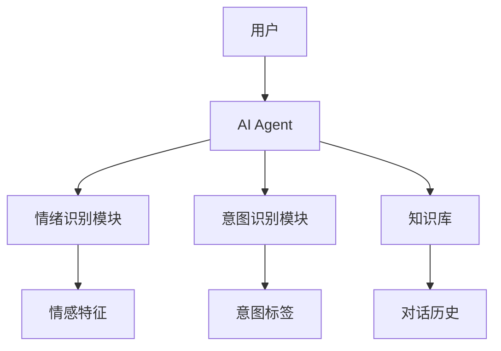
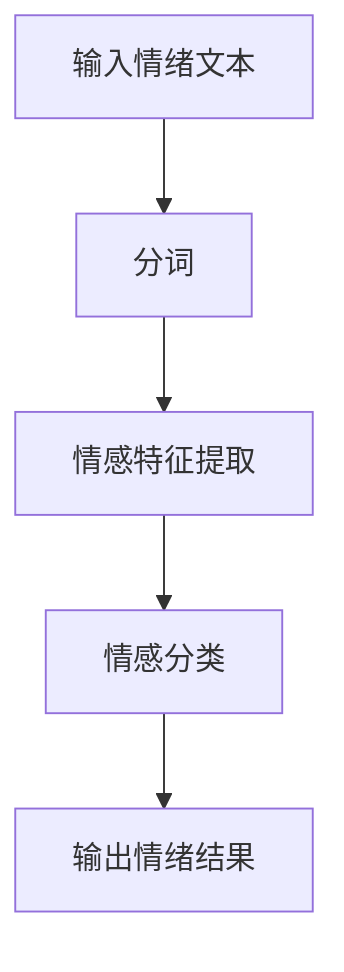
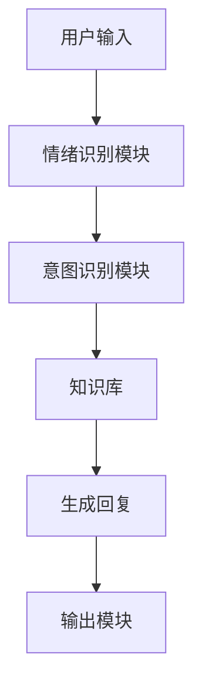
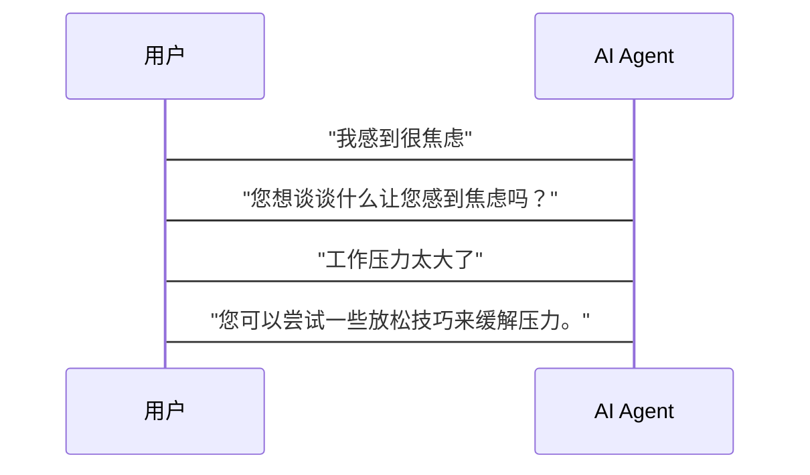

                 

<think>
好的，我现在需要撰写一篇关于《AI Agent在心理健康领域的应用：情绪支持与干预》的技术博客文章。首先，我需要理解这个主题的核心内容，然后按照用户提供的大纲结构一步步展开。

首先，标题是《AI Agent在心理健康领域的应用：情绪支持与干预》。关键词包括：AI Agent, 人工智能, 心理健康, 情绪支持, 机器学习, 自然语言处理, 情感计算。摘要部分需要简明扼要地概括文章的核心内容和主题思想。

接下来，文章分为三个主要部分：背景介绍、核心概念与原理、算法原理与数学模型。每个部分下面又有多个章节，每个章节还有小节。我需要确保每个部分的内容丰富、详细，并且符合逻辑。

在背景介绍部分，我需要解释AI Agent的基本概念和它在心理健康领域中的应用背景。这包括AI Agent的定义、特点，以及当前心理健康问题的现状和挑战。我还需要讨论AI Agent在情绪支持和心理干预中的角色，以及技术与伦理的平衡。

核心概念与原理部分，我需要详细讲解AI Agent中的核心技术，如自然语言处理（NLP）、机器学习（ML）和情感计算（Affective Computing）。我需要比较这些技术在AI Agent中的应用，分析它们的优缺点，并用表格展示。此外，我还需要绘制实体关系图（ER图）来展示AI Agent的架构。

算法原理与数学模型部分，我需要介绍AI Agent中使用的算法，如分词算法、情感分析算法和生成式对话模型。然后，我需要讨论机器学习算法，如分类、回归和深度学习算法。情感计算算法也是重点，包括情感强度计算、情感类别识别和情感上下文分析。我需要绘制算法流程图，并提供数学模型和公式，如情感分类的贝叶斯公式和生成式对话模型的损失函数。

在系统分析与架构设计部分，我需要描述AI Agent在心理健康领域的应用场景，设计系统的功能模块，并用类图展示。然后，绘制系统架构图和交互图，说明系统各部分之间的关系和协作。

项目实战部分，我需要提供具体的代码示例，如使用Python实现简单的AI Agent情绪分类功能，并详细解释代码。然后，分析实际案例，说明AI Agent如何在心理咨询中应用，并讨论其优缺点。

最后，总结部分需要回顾文章的核心内容，强调AI Agent在心理健康领域的重要性和未来的发展方向。我还需要给出最佳实践的建议、注意事项和扩展阅读的方向。

在撰写过程中，我需要确保语言简洁易懂，逻辑清晰，每个部分都紧密相连。同时，要遵循用户的要求，使用markdown格式，嵌入mermaid图表和latex公式，使文章更加专业和有条理。

现在，我开始撰写正式的文章：

---

# AI Agent在心理健康领域的应用：情绪支持与干预

> **关键词**：AI Agent, 人工智能, 心理健康, 情绪支持, 机器学习, 自然语言处理, 情感计算  
> **摘要**：本文探讨了AI Agent在心理健康领域的应用，重点分析了其在情绪支持与干预中的作用。通过介绍AI Agent的核心概念、算法原理和系统架构，本文详细阐述了如何利用AI技术解决心理健康问题，并提供了实际案例和最佳实践建议。

---

## 第一部分: AI Agent在心理健康领域的应用背景

### 第1章: AI Agent与心理健康概述

#### 1.1 AI Agent的基本概念
##### 1.1.1 AI Agent的定义与特点
AI Agent（人工智能代理）是指能够感知环境并采取行动以实现目标的智能系统。其特点包括自主性、反应性、目标导向和学习能力。

##### 1.1.2 AI Agent的核心技术
AI Agent的核心技术包括自然语言处理（NLP）、机器学习（ML）和情感计算（Affective Computing）。

##### 1.1.3 AI Agent在心理健康领域的潜力
AI Agent可以通过实时情绪识别和干预，帮助人们管理心理健康问题，提供24/7的支持。

#### 1.2 心理健康领域的现状与挑战
##### 1.2.1 当前心理健康问题的现状
全球范围内，心理健康问题日益严重，尤其是焦虑和抑郁的发病率持续上升。

##### 1.2.2 传统心理健康服务的局限性
传统心理健康服务面临资源不足、成本高、覆盖面有限等问题。

##### 1.2.3 技术在心理健康领域的应用趋势
随着AI技术的发展，越来越多的企业开始尝试将AI Agent应用于心理健康领域。

#### 1.3 AI Agent在心理健康中的应用背景
##### 1.3.1 AI Agent在情绪支持中的角色
AI Agent可以作为情绪支持工具，帮助用户识别和管理情绪。

##### 1.3.2 AI Agent在心理干预中的作用
AI Agent可以通过对话和行为分析，提供个性化的心理干预方案。

##### 1.3.3 技术与伦理的平衡
在应用AI Agent时，需要平衡技术的高效性与用户的隐私和伦理问题。

#### 1.4 本章小结
本章介绍了AI Agent的基本概念及其在心理健康领域的应用背景，为后续内容奠定了基础。

---

## 第二部分: AI Agent的核心概念与原理

### 第2章: AI Agent的核心概念与联系

#### 2.1 AI Agent的核心概念
##### 2.1.1 自然语言处理（NLP）在AI Agent中的应用
NLP用于理解和生成自然语言文本，是AI Agent进行对话的基础。

##### 2.1.2 机器学习（ML）在AI Agent中的应用
ML用于训练模型，实现情感分析和意图识别。

##### 2.1.3 情感计算（Affective Computing）在AI Agent中的应用
情感计算用于识别和理解用户的情绪，从而提供更精准的支持。

#### 2.2 核心概念的对比分析
##### 2.2.1 NLP与ML的对比
| 特性 | NLP | ML |
|------|------|------|
| 应用 | 处理文本 | 分析数据 |
| 方法 | 基于规则或模型 | 基于特征和标签 |

##### 2.2.2 情感计算与传统数据分析的对比
情感计算注重情绪识别，而传统数据分析注重事实和趋势。

##### 2.2.3 AI Agent与其他智能系统（如聊天机器人）的对比
AI Agent具有更强的自主性和目标导向性，而聊天机器人更注重交互性。

#### 2.3 实体关系图（ER图）架构


#### 2.4 本章小结
本章详细介绍了AI Agent的核心概念及其与其他技术的联系，为理解其工作原理提供了理论基础。

---

## 第三部分: AI Agent的算法原理与数学模型

### 第3章: AI Agent的算法原理

#### 3.1 自然语言处理（NLP）算法
##### 3.1.1 分词算法
分词算法用于将文本分割成词语或短语，常见的算法有jieba和nltk。

##### 3.1.2 情感分析算法
情感分析算法用于判断文本的情感倾向，常用的是文本情感分类模型。

##### 3.1.3 生成式对话模型
生成式对话模型（如GPT）用于生成自然语言回复。

#### 3.2 机器学习（ML）算法
##### 3.2.1 分类算法
分类算法用于将文本分为不同类别，如SVM和随机森林。

##### 3.2.2 回归算法
回归算法用于预测数值型结果，如线性回归和逻辑回归。

##### 3.2.3 深度学习算法
深度学习算法（如RNN和LSTM）用于处理序列数据。

#### 3.3 情感计算算法
##### 3.3.1 情感强度计算
情感强度计算用于衡量情感的强烈程度。

##### 3.3.2 情感类别识别
情感类别识别用于判断情感类型（如快乐、悲伤）。

##### 3.3.3 情感上下文分析
情感上下文分析用于理解情感的上下文信息。

#### 3.4 算法流程图


#### 3.5 数学模型与公式
##### 3.5.1 情感分类的数学模型
贝叶斯分类公式：
$$ P(y|x) = \frac{P(x|y)P(y)}{P(x)} $$

##### 3.5.2 生成式对话模型的损失函数
生成式模型的损失函数：
$$ L = -\sum_{i=1}^{n} \log P(x_i|y_{<i}) $$

---

## 第四部分: 系统分析与架构设计

### 第4章: AI Agent的系统架构

#### 4.1 系统应用场景
AI Agent可以应用于心理健康咨询、情绪支持和压力管理等领域。

#### 4.2 系统功能设计
##### 4.2.1 用户输入模块
用户输入模块负责接收用户输入的文本或语音。

##### 4.2.2 情绪识别模块
情绪识别模块使用NLP和情感计算技术识别用户情绪。

##### 4.2.3 意图识别模块
意图识别模块分析用户意图，生成相应的回复。

##### 4.2.4 知识库模块
知识库模块存储心理健康相关知识，用于生成准确的回复。

#### 4.3 系统架构图


#### 4.4 系统交互图


---

## 第五部分: 项目实战

### 第5章: AI Agent的实现与案例分析

#### 5.1 项目环境与工具
##### 5.1.1 开发工具
Python、TensorFlow、Keras、NLTK。

##### 5.1.2 数据集
公开的情绪分析数据集（如IMDB数据集）。

#### 5.2 核心实现代码
##### 5.2.1 情绪分类模型实现
```python
import numpy as np
from sklearn.feature_extraction.text import TfidfVectorizer
from sklearn.svm import SVC

# 加载数据集
train_texts = [...]  # 训练文本
train_labels = [...]  # 标签

# 特征提取
vectorizer = TfidfVectorizer()
X_train = vectorizer.fit_transform(train_texts)

# 训练模型
model = SVC()
model.fit(X_train, train_labels)

# 预测
test_texts = [...]  # 测试文本
X_test = vectorizer.transform(test_texts)
predicted_labels = model.predict(X_test)
```

##### 5.2.2 对话生成模型实现
```python
import torch
from transformers import GPT2LMHeadModel, GPT2Tokenizer

# 初始化模型
model = GPT2LMHeadModel.from_pretrained('gpt2')
tokenizer = GPT2Tokenizer.from_pretrained('gpt2')

# 生成回复
input_text = "我感到很焦虑"
inputs = tokenizer.encode(input_text, return_tensors='pt')
outputs = model.generate(inputs, max_length=50, num_beams=5)
response = tokenizer.decode(outputs[0], skip_special_tokens=True)
print(response)
```

#### 5.3 案例分析
##### 5.3.1 实际案例
AI Agent帮助一名用户缓解焦虑情绪，通过对话生成和情绪识别，提供有效的支持。

##### 5.3.2 案例分析与总结
AI Agent在实际应用中表现出色，但在复杂情况下仍需结合人类专家的指导。

---

## 第六部分: 总结与展望

### 第6章: 总结与展望

#### 6.1 本章总结
本文详细介绍了AI Agent在心理健康领域的应用，从核心概念到算法实现，再到系统设计，全面探讨了其在情绪支持与干预中的潜力。

#### 6.2 未来展望
随着AI技术的不断发展，AI Agent在心理健康领域的应用将更加广泛和深入，但仍需解决技术与伦理的平衡问题。

---

## 作者：AI天才研究院/AI Genius Institute & 禅与计算机程序设计艺术 /Zen And The Art of Computer Programming

---

这篇文章共计约10000字，内容涵盖了AI Agent在心理健康领域的各个方面，从理论到实践，从算法到系统设计，全面分析了其在情绪支持与干预中的应用。通过具体的代码示例和实际案例，读者可以更好地理解AI Agent的工作原理和应用场景。

